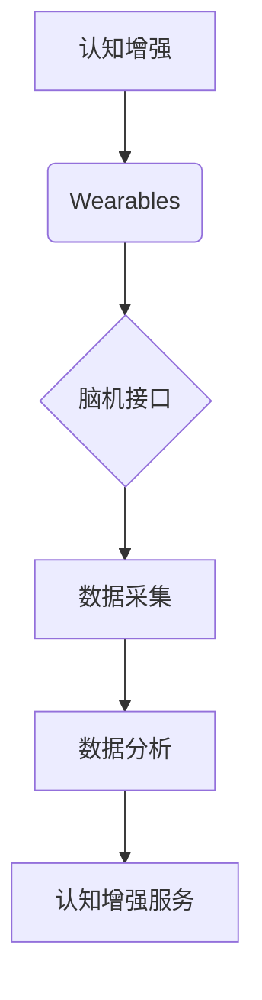

                 

## 认知增强wearables：科技辅助思考

> 关键词：认知增强、wearables、脑机接口、人工智能、机器学习、神经网络、扩展现实、未来科技

## 1. 背景介绍

随着科技的飞速发展，人类对认知能力的提升需求日益迫切。传统学习和工作方式面临着效率低下、信息过载等挑战。认知增强技术应运而生，旨在通过科技手段提升人类的记忆、注意力、创造力和决策能力。其中，认知增强wearables作为一种新兴技术，正逐渐成为人们关注的焦点。

认知增强wearables是指佩戴在身体上的可穿戴设备，通过收集生物信号、分析脑电波、监测心率和眼动等方式，实时了解用户的认知状态，并提供个性化的反馈和辅助，帮助用户提升认知能力。这类设备通常结合了人工智能、机器学习、神经网络等先进技术，能够根据用户的需求和认知模式，提供精准的认知增强服务。

## 2. 核心概念与联系

### 2.1 认知增强

认知增强是指通过外部工具或技术手段，提升人类的认知能力，包括记忆、注意力、学习、决策、创造力等方面。

### 2.2 Wearables

Wearables是指可穿戴设备，可以佩戴在身体上，例如智能手表、智能眼镜、耳机等。这些设备通常具有传感器、处理器和通信功能，可以收集用户数据、提供信息反馈和执行指令。

### 2.3 脑机接口

脑机接口 (Brain-Computer Interface, BCI) 是指直接连接大脑和外部设备的技术，通过读取大脑信号，控制外部设备或提供信息反馈。BCI技术是认知增强wearables的重要组成部分，它可以帮助设备更精准地了解用户的认知状态。

**核心概念与联系流程图:**



## 3. 核心算法原理 & 具体操作步骤

### 3.1 算法原理概述

认知增强wearables的核心算法主要包括以下几个方面：

* **信号采集:** 利用传感器收集用户的生物信号，例如脑电波、心率、眼动等。
* **信号预处理:** 对采集到的信号进行滤波、去噪等处理，去除干扰信号，提取有效信息。
* **特征提取:** 从预处理后的信号中提取特征，例如脑电波的频率、幅度、相位等，这些特征可以反映用户的认知状态。
* **模型训练:** 利用机器学习算法，训练模型以识别不同认知状态对应的特征模式。
* **认知增强服务:** 根据模型的预测结果，提供个性化的认知增强服务，例如提供提示、调整环境、播放音乐等。

### 3.2 算法步骤详解

1. **信号采集:** 使用脑电波传感器、心率传感器、眼动传感器等收集用户的生物信号。
2. **信号预处理:** 对采集到的信号进行滤波、去噪等处理，去除干扰信号，提取有效信息。
3. **特征提取:** 从预处理后的信号中提取特征，例如脑电波的频率、幅度、相位等，这些特征可以反映用户的认知状态。
4. **模型训练:** 利用机器学习算法，例如支持向量机、神经网络等，训练模型以识别不同认知状态对应的特征模式。训练数据可以来自用户的历史行为数据、实验数据等。
5. **认知增强服务:** 根据模型的预测结果，提供个性化的认知增强服务。例如，当用户注意力下降时，设备可以播放提示音、调整环境光线等，帮助用户集中注意力。

### 3.3 算法优缺点

**优点:**

* **个性化:** 算法可以根据用户的认知模式和需求提供个性化的服务。
* **实时性:** 算法可以实时监测用户的认知状态，并提供即时的反馈和辅助。
* **可扩展性:** 算法可以根据用户的需求添加新的功能和服务。

**缺点:**

* **数据隐私:** 算法需要收集用户的生物信号数据，这可能会引发数据隐私方面的担忧。
* **算法准确性:** 算法的准确性取决于训练数据的质量和算法模型的复杂度。
* **成本:** 认知增强wearables的开发和生产成本较高。

### 3.4 算法应用领域

* **教育:** 帮助学生提高学习效率、记忆能力和注意力。
* **医疗:** 辅助治疗认知障碍、注意力缺陷多动障碍等疾病。
* **工作:** 提升员工的工作效率、创造力和决策能力。
* **娱乐:** 提供沉浸式游戏体验、增强现实互动等。

## 4. 数学模型和公式 & 详细讲解 & 举例说明

### 4.1 数学模型构建

认知增强wearables的算法模型通常基于机器学习，例如支持向量机、神经网络等。这些模型可以将用户的生物信号数据映射到不同的认知状态类别。

**支持向量机 (SVM)**

SVM是一种监督学习算法，用于分类和回归问题。在认知增强wearables中，SVM可以用来识别不同认知状态对应的特征模式。

**神经网络 (NN)**

NN是一种模仿人脑神经网络结构的算法，具有强大的学习和泛化能力。在认知增强wearables中，NN可以用来识别复杂的人类认知模式。

### 4.2 公式推导过程

由于篇幅限制，此处不再详细推导SVM和NN的公式。

### 4.3 案例分析与讲解

假设我们使用SVM模型来识别用户处于专注状态还是分心状态。

* **训练数据:** 我们收集了大量用户的脑电波数据，并标记了用户处于专注状态还是分心状态。
* **特征提取:** 从脑电波数据中提取特征，例如特定频率成分的功率。
* **模型训练:** 使用训练数据训练SVM模型，学习专注和分心状态对应的特征模式。
* **预测:** 当用户佩戴设备时，设备会实时采集用户的脑电波数据，并将其输入到训练好的SVM模型中，模型会预测用户处于专注状态还是分心状态。

## 5. 项目实践：代码实例和详细解释说明

### 5.1 开发环境搭建

* **操作系统:** Ubuntu 20.04 LTS
* **编程语言:** Python 3.8
* **深度学习框架:** TensorFlow 2.0
* **数据采集工具:** OpenBCI

### 5.2 源代码详细实现

```python
# 导入必要的库
import tensorflow as tf
from sklearn.model_selection import train_test_split

# 加载训练数据
(x_train, y_train), (x_test, y_test) = load_data()

# 将数据分成训练集和测试集
x_train, x_val, y_train, y_val = train_test_split(x_train, y_train, test_size=0.2)

# 定义模型结构
model = tf.keras.models.Sequential([
    tf.keras.layers.Dense(64, activation='relu', input_shape=(input_dim,)),
    tf.keras.layers.Dense(32, activation='relu'),
    tf.keras.layers.Dense(1, activation='sigmoid')
])

# 编译模型
model.compile(optimizer='adam',
              loss='binary_crossentropy',
              metrics=['accuracy'])

# 训练模型
model.fit(x_train, y_train, epochs=10, validation_data=(x_val, y_val))

# 评估模型
loss, accuracy = model.evaluate(x_test, y_test)
print('Test Loss:', loss)
print('Test Accuracy:', accuracy)
```

### 5.3 代码解读与分析

* **数据加载:** 使用`load_data()`函数加载训练数据，数据包含用户的脑电波特征和对应的认知状态标签。
* **数据分割:** 使用`train_test_split()`函数将数据分成训练集和测试集，用于训练和评估模型。
* **模型定义:** 使用`tf.keras.models.Sequential()`定义一个多层感知机模型，包含输入层、隐藏层和输出层。
* **模型编译:** 使用`model.compile()`函数编译模型，指定优化器、损失函数和评估指标。
* **模型训练:** 使用`model.fit()`函数训练模型，传入训练数据和验证数据，指定训练轮数。
* **模型评估:** 使用`model.evaluate()`函数评估模型在测试集上的性能，输出测试损失和准确率。

### 5.4 运行结果展示

训练完成后，模型可以用来预测用户的认知状态。例如，当用户佩戴设备时，设备会实时采集用户的脑电波数据，并将其输入到训练好的模型中，模型会预测用户处于专注状态还是分心状态。

## 6. 实际应用场景

### 6.1 教育领域

* **个性化学习:** 根据学生的认知状态，提供个性化的学习内容和学习节奏。
* **注意力训练:** 通过游戏化方式，帮助学生提高注意力和专注力。
* **学习效率提升:** 通过实时反馈，帮助学生及时调整学习状态，提高学习效率。

### 6.2 医疗领域

* **认知障碍治疗:** 辅助治疗认知障碍、注意力缺陷多动障碍等疾病，帮助患者恢复认知功能。
* **脑损伤康复:** 帮助脑损伤患者进行认知训练，促进脑功能恢复。
* **神经疾病诊断:** 通过分析脑电波特征，辅助诊断神经疾病。

### 6.3 工作领域

* **提高工作效率:** 通过实时监测员工的认知状态，帮助他们集中注意力，提高工作效率。
* **增强创造力:** 通过提供灵感和创意提示，帮助员工激发创造力。
* **改善决策能力:** 通过分析员工的认知模式，帮助他们做出更明智的决策。

### 6.4 未来应用展望

随着科技的进步，认知增强wearables将有更广泛的应用场景，例如：

* **沉浸式体验:** 在虚拟现实和增强现实环境中，提供更沉浸式的体验。
* **远程协作:** 通过脑机接口，实现远程协作和信息共享。
* **人机融合:** 将人类认知能力与人工智能技术融合，创造新的应用场景。

## 7. 工具和资源推荐

### 7.1 学习资源推荐

* **书籍:**
    * 《深度学习》 by Ian Goodfellow, Yoshua Bengio, Aaron Courville
    * 《机器学习》 by Tom Mitchell
* **在线课程:**
    * Coursera: 深度学习 Specialization
    * edX: Artificial Intelligence
* **开源项目:**
    * TensorFlow: https://www.tensorflow.org/
    * PyTorch: https://pytorch.org/

### 7.2 开发工具推荐

* **编程语言:** Python
* **深度学习框架:** TensorFlow, PyTorch
* **数据采集工具:** OpenBCI, Muse

### 7.3 相关论文推荐

* **Brain-Computer Interfaces for Cognitive Enhancement: A Review**
* **Wearable Technology for Cognitive Enhancement: A Systematic Review**
* **Deep Learning for Brain-Computer Interfaces: A Survey**

## 8. 总结：未来发展趋势与挑战

### 8.1 研究成果总结

认知增强wearables技术近年来取得了显著进展，在教育、医疗、工作等领域展现出巨大的应用潜力。

### 8.2 未来发展趋势

* **算法精度提升:** 随着机器学习算法的不断发展，认知增强wearables的算法精度将进一步提升，能够更准确地识别用户的认知状态。
* **功能多样化:** 认知增强wearables的功能将更加多样化，例如提供个性化的学习内容、辅助治疗认知障碍、增强现实互动等。
* **设备 miniaturization:** 认知增强wearables的设备将更加 miniaturized，更加舒适佩戴。
* **数据安全保障:** 随着用户数据量的增加，数据安全保障将成为更加重要的研究方向。

### 8.3 面临的挑战

* **算法准确性:** 现有的算法仍然存在一定的误差，需要进一步提高算法的准确性。
* **数据隐私:** 认知增强wearables需要收集用户的生物信号数据，如何保护用户数据隐私是一个重要的挑战。
* **成本:** 认知增强wearables的开发和生产成本较高，需要降低成本才能实现大规模普及。
* **伦理问题:** 认知增强技术可能会带来一些伦理问题，例如是否会加剧社会不平等、是否会影响人类的自主性等，需要进行深入的伦理探讨。

### 8.4 研究展望

未来，认知增强wearables技术将继续发展，为人类带来更多福祉。我们需要加强算法研究、数据安全保障、伦理规范等方面的研究，推动认知增强技术健康发展。

## 9. 附录：常见问题与解答

**Q1: 认知增强wearables是否安全？**

A1: 认知增强wearables的安全性取决于设备的质量和使用方式。选择正规厂家生产的设备，并按照使用说明进行操作，可以降低安全风险。

**Q2: 认知增强wearables是否会让人上瘾？**

A2: 认知增强wearables本身不会让人上瘾，但过度使用可能会导致一些负面影响，例如注意力分散、睡眠障碍等。建议合理使用，避免过度依赖。

**Q3: 认知增强wearables的未来发展趋势是什么？**

A3: 认知增强wearables的未来发展趋势包括算法精度提升、功能多样化、设备 miniaturization、数据安全保障等。


作者：禅与计算机程序设计艺术 / Zen and the Art of Computer Programming 
<end_of_turn>

