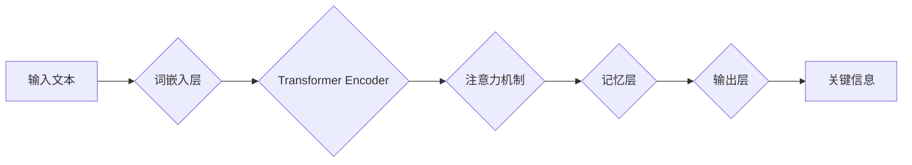

                 

## 记忆机制：关键信息提取

> 关键词：记忆机制、信息提取、知识图谱、深度学习、自然语言处理、Transformer、BERT、知识蒸馏

## 1. 背景介绍

在海量信息时代，高效地提取关键信息变得至关重要。无论是搜索引擎、聊天机器人，还是人工智能辅助决策系统，都需要能够快速准确地理解和提取文本中的核心信息。传统的文本处理方法往往依赖于人工规则和特征工程，难以应对复杂、多样的文本结构和语义关系。近年来，深度学习技术的发展为信息提取带来了新的突破。

深度学习模型，特别是基于 Transformer 架构的模型，展现出强大的文本理解能力，能够学习到文本中的语义和结构信息，并进行高效的信息提取。BERT、XLNet 等预训练语言模型的出现，进一步推动了信息提取技术的进步。这些模型通过在海量文本数据上进行预训练，获得了丰富的语言知识，可以用于各种下游任务，包括关键信息提取。

## 2. 核心概念与联系

### 2.1 信息提取概述

信息提取是指从文本中自动识别和提取特定类型的信息，例如实体、关系、事件等。它是一个重要的自然语言处理 (NLP) 任务，广泛应用于信息检索、问答系统、文本摘要、知识图谱构建等领域。

### 2.2 关键信息定义

关键信息是指文本中最重要的、对理解文本核心内容至关重要的信息。它通常包含了文本的主要主题、关键人物、重要事件等。

### 2.3 记忆机制

记忆机制是指人工智能系统能够存储和检索先前信息的能力。在信息提取任务中，记忆机制可以帮助模型更好地理解上下文信息，并准确地提取关键信息。

**Mermaid 流程图**



## 3. 核心算法原理 & 具体操作步骤

### 3.1 算法原理概述

基于深度学习的信息提取算法通常采用端到端训练的方式，将输入文本映射到输出的关键信息。常用的模型架构包括：

* **循环神经网络 (RNN)**：RNN 可以处理序列数据，并学习文本中的上下文信息。然而，RNN 存在梯度消失和梯度爆炸的问题，难以处理长文本。
* **Transformer**：Transformer 是一种基于注意力机制的网络架构，能够有效地处理长文本，并学习到更丰富的语义信息。BERT、XLNet 等预训练语言模型都是基于 Transformer 架构的。

### 3.2 算法步骤详解

1. **词嵌入**: 将输入文本中的每个词转换为稠密的向量表示，捕捉词语的语义信息。
2. **编码**: 使用 Transformer Encoder 将词向量序列编码成上下文相关的表示。
3. **注意力机制**: 利用注意力机制，模型学习到文本中哪些词语对关键信息提取最为重要。
4. **记忆层**: 将注意力机制的结果存储在记忆层中，以便后续步骤使用。
5. **解码**: 使用解码器将编码后的文本表示解码成关键信息。

### 3.3 算法优缺点

**优点**:

* **高准确率**: 深度学习模型能够学习到复杂的语义关系，并实现高准确率的信息提取。
* **自动化**: 算法可以自动学习，无需人工规则和特征工程。
* **可扩展性**: 深度学习模型可以处理海量文本数据。

**缺点**:

* **训练成本**: 深度学习模型的训练需要大量的计算资源和时间。
* **数据依赖**: 深度学习模型的性能依赖于训练数据的质量和数量。
* **可解释性**: 深度学习模型的决策过程难以解释。

### 3.4 算法应用领域

* **信息检索**: 从海量文档中快速提取相关信息。
* **问答系统**: 回答用户的问题，并提供相关信息。
* **文本摘要**: 自动生成文本的简要摘要。
* **知识图谱构建**: 从文本中提取实体和关系，构建知识图谱。
* **机器翻译**: 从源语言文本中提取关键信息，并将其翻译成目标语言。

## 4. 数学模型和公式 & 详细讲解 & 举例说明

### 4.1 数学模型构建

信息提取任务可以建模为一个序列标注问题。给定一个输入文本序列 $x = (x_1, x_2, ..., x_n)$，其中 $x_i$ 表示文本中的第 $i$ 个词，目标是预测每个词的标签 $y_i$，例如实体、关系、事件等。

### 4.2 公式推导过程

Transformer 模型的注意力机制可以表示为以下公式：

$$
Attention(Q, K, V) = softmax(\frac{QK^T}{\sqrt{d_k}})V
$$

其中：

* $Q$：查询矩阵
* $K$：键矩阵
* $V$：值矩阵
* $d_k$：键向量的维度
* $softmax$：softmax 函数

注意力机制可以学习到文本中哪些词语对当前词语最为相关，并赋予它们更高的权重。

### 4.3 案例分析与讲解

例如，在提取实体信息的任务中，Transformer 模型可以学习到“苹果公司”这个词语是“乔布斯”这个词语的关键信息。

## 5. 项目实践：代码实例和详细解释说明

### 5.1 开发环境搭建

* Python 3.6+
* TensorFlow/PyTorch
* NLTK/SpaCy

### 5.2 源代码详细实现

```python
import tensorflow as tf

# 定义 Transformer 模型
class Transformer(tf.keras.Model):
    def __init__(self, vocab_size, embedding_dim, num_heads, num_layers):
        super(Transformer, self).__init__()
        self.embedding = tf.keras.layers.Embedding(vocab_size, embedding_dim)
        self.encoder = tf.keras.layers.StackedRNNLayers(num_layers, embedding_dim)
        self.attention = tf.keras.layers.MultiHeadAttention(num_heads, embedding_dim)
        self.decoder = tf.keras.layers.Dense(vocab_size)

    def call(self, inputs):
        # 词嵌入
        embedded = self.embedding(inputs)
        # 编码
        encoded = self.encoder(embedded)
        # 注意力机制
        attended = self.attention(encoded, encoded, encoded)
        # 解码
        outputs = self.decoder(attended)
        return outputs

# 实例化模型
model = Transformer(vocab_size=10000, embedding_dim=128, num_heads=8, num_layers=6)

# 训练模型
model.compile(optimizer='adam', loss='sparse_categorical_crossentropy', metrics=['accuracy'])
model.fit(x_train, y_train, epochs=10)

```

### 5.3 代码解读与分析

* **词嵌入**: 使用 Embedding 层将词语转换为稠密的向量表示。
* **编码**: 使用 StackedRNNLayers 层对词向量序列进行编码，学习文本的上下文信息。
* **注意力机制**: 使用 MultiHeadAttention 层学习到文本中哪些词语对当前词语最为相关。
* **解码**: 使用 Dense 层将编码后的文本表示解码成关键信息。

### 5.4 运行结果展示

训练完成后，模型可以用于预测新的文本中的关键信息。

## 6. 实际应用场景

### 6.1 新闻摘要

自动生成新闻文章的简要摘要，帮助用户快速了解新闻内容。

### 6.2 会议记录

从会议录音或文本中提取关键信息，生成会议记录。

### 6.3 医疗诊断

从患者病历中提取关键信息，辅助医生进行诊断。

### 6.4 法律文件分析

从法律文件文本中提取关键信息，例如当事人、诉讼内容、判决结果等。

### 6.5 未来应用展望

随着深度学习技术的不断发展，记忆机制在信息提取领域的应用将更加广泛。例如：

* **个性化信息提取**: 根据用户的需求和偏好，定制化地提取关键信息。
* **跨语言信息提取**: 实现跨语言的文本信息提取，打破语言障碍。
* **多模态信息提取**: 将文本信息与图像、音频等其他模态信息结合，进行更全面的信息提取。

## 7. 工具和资源推荐

### 7.1 学习资源推荐

* **书籍**:
    * 《深度学习》 by Ian Goodfellow, Yoshua Bengio, Aaron Courville
    * 《自然语言处理入门》 by Jacob Eisenstein
* **在线课程**:
    * Coursera: Natural Language Processing Specialization
    * Stanford CS224N: Natural Language Processing with Deep Learning

### 7.2 开发工具推荐

* **TensorFlow**: 开源深度学习框架
* **PyTorch**: 开源深度学习框架
* **Hugging Face**: 提供预训练语言模型和工具

### 7.3 相关论文推荐

* **BERT**: Devlin et al., 2018
* **XLNet**: Yang et al., 2019
* **T5**: Raffel et al., 2019

## 8. 总结：未来发展趋势与挑战

### 8.1 研究成果总结

近年来，基于深度学习的信息提取技术取得了显著进展，能够实现高准确率的信息提取。预训练语言模型的出现，进一步推动了该领域的进步。

### 8.2 未来发展趋势

* **更强大的模型**: 研究更强大的 Transformer 模型，例如更大规模的模型、更复杂的架构。
* **更有效的训练方法**: 研究更有效的训练方法，例如知识蒸馏、迁移学习。
* **更广泛的应用**: 将信息提取技术应用于更多领域，例如医疗、法律、金融等。

### 8.3 面临的挑战

* **数据稀缺**: 许多领域的数据稀缺，难以训练高质量的模型。
* **可解释性**: 深度学习模型的决策过程难以解释，难以获得用户的信任。
* **计算成本**: 训练大型深度学习模型需要大量的计算资源。

### 8.4 研究展望

未来，信息提取技术将朝着更智能、更可解释、更高效的方向发展。


## 9. 附录：常见问题与解答

### 9.1 如何选择合适的模型架构？

选择合适的模型架构取决于具体的任务和数据特点。对于简单的任务，可以使用 RNN 模型；对于复杂的任务，可以使用 Transformer 模型。

### 9.2 如何处理数据稀缺问题？

可以使用数据增强、迁移学习等方法来处理数据稀缺问题。

### 9.3 如何提高模型的可解释性？

可以使用注意力机制、可视化等方法来提高模型的可解释性。


作者：禅与计算机程序设计艺术 / Zen and the Art of Computer Programming 
<end_of_turn>

