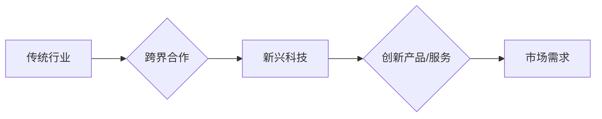

                 

## 跨界创业：打破行业界限的创新

> 关键词：跨界创新、行业融合、技术驱动、商业模式、人工智能、数据分析、创业生态

### 1. 背景介绍

当今世界，科技发展日新月异，行业界限日益模糊。传统行业面临着数字化转型和智能升级的压力，而新兴科技也催生出新的商业模式和市场需求。在这种背景下，跨界创业成为一种重要的创新模式，它打破了传统行业的壁垒，融合了不同领域的资源和技术，创造出新的价值和机遇。

跨界创业的本质是将不同领域的知识、技能和资源进行整合，创造出具有独特价值的创新产品、服务或商业模式。它可以是科技公司与传统行业合作，也可以是传统行业内部进行跨部门的创新，甚至可以是来自不同领域的创业者共同创立新公司。

### 2. 核心概念与联系

跨界创业的核心概念是打破行业界限，实现资源和技术的融合。它需要跨越学科、行业和文化的壁垒，建立新的合作模式和创新机制。

**Mermaid 流程图：**

**核心概念原理和架构：**

* **打破行业壁垒：** 跨界创业需要打破传统行业的思维模式和组织结构，鼓励不同领域的专家和团队进行合作。
* **资源整合：** 不同行业拥有不同的资源和优势，跨界创业可以整合这些资源，形成合力。
* **技术驱动：** 科技创新是跨界创业的引擎，新兴技术可以为传统行业带来新的发展机遇。
* **商业模式创新：** 跨界创业需要探索新的商业模式，以满足新的市场需求。

### 3. 核心算法原理 & 具体操作步骤

跨界创业的核心算法原理是**组合创新**，即将不同领域的知识、技能和资源进行组合，创造出新的价值。具体操作步骤如下：

**3.1 算法原理概述**

组合创新算法的核心是**识别和整合不同领域的知识和资源**，并将其组合成新的解决方案。这需要对不同领域的知识进行深入理解，并找到它们之间的联系和融合点。

**3.2 算法步骤详解**

1. **识别跨界机会：** 分析市场趋势和行业发展，寻找跨界融合的潜在机会。
2. **构建跨界团队：** 汇集来自不同领域的专家和团队，形成跨界创新团队。
3. **整合资源和知识：** 梳理不同领域的资源和知识，并进行整合和融合。
4. **设计创新解决方案：** 基于整合的资源和知识，设计出具有独特价值的创新解决方案。
5. **验证和迭代：** 通过市场测试和用户反馈，不断验证和迭代创新解决方案。

**3.3 算法优缺点**

* **优点：**
    * 可以创造出具有独特价值的创新产品、服务或商业模式。
    * 可以打破行业壁垒，促进资源和技术的共享。
    * 可以加速科技创新和产业升级。
* **缺点：**
    * 需要跨越学科、行业和文化的壁垒，难度较大。
    * 需要整合和融合不同领域的知识和资源，需要时间和精力。
    * 需要建立新的合作模式和创新机制，需要克服组织和管理上的挑战。

**3.4 算法应用领域**

组合创新算法广泛应用于各个领域，例如：

* **金融科技：** 将金融和科技领域的知识和资源进行整合，创造出新的金融产品和服务。
* **医疗健康：** 将医疗和科技领域的知识和资源进行整合，提高医疗诊断和治疗效率。
* **教育科技：** 将教育和科技领域的知识和资源进行整合，打造个性化和智能化的教育模式。
* **制造业：** 将制造业和科技领域的知识和资源进行整合，实现智能制造和工业互联网。

### 4. 数学模型和公式 & 详细讲解 & 举例说明

跨界创业可以利用数学模型和公式来分析和预测市场趋势、用户需求和商业模式的有效性。

**4.1 数学模型构建**

例如，我们可以构建一个**市场需求预测模型**，利用历史数据和市场趋势分析，预测特定产品的市场需求量。

**4.2 公式推导过程**

该模型可以基于**线性回归**或**时间序列分析**等方法进行构建，并使用相关公式进行推导。

**4.3 案例分析与讲解**

例如，我们可以利用该模型预测智能家居产品的市场需求量，并根据预测结果调整生产计划和营销策略。

### 5. 项目实践：代码实例和详细解释说明

**5.1 开发环境搭建**

跨界创业项目需要搭建合适的开发环境，包括硬件、软件和网络等资源。

**5.2 源代码详细实现**

具体代码实现需要根据项目的具体需求进行设计和开发，可以使用各种编程语言和开发框架。

**5.3 代码解读与分析**

需要对代码进行详细解读和分析，确保代码的正确性和可维护性。

**5.4 运行结果展示**

需要对代码进行测试和运行，并展示运行结果，验证项目的有效性和可行性。

### 6. 实际应用场景

跨界创业的应用场景非常广泛，例如：

* **金融科技：** 利用人工智能技术进行风险评估和投资决策。
* **医疗健康：** 利用大数据分析技术进行疾病诊断和治疗方案制定。
* **教育科技：** 利用虚拟现实技术打造沉浸式学习体验。
* **制造业：** 利用物联网技术实现智能制造和供应链管理。

**6.4 未来应用展望**

随着科技的不断发展，跨界创业的应用场景将更加广泛，例如：

* **个性化定制：** 利用人工智能技术进行个性化产品和服务的定制。
* **虚拟现实和增强现实：** 利用虚拟现实和增强现实技术打造新的交互体验。
* **区块链技术：** 利用区块链技术构建更加安全和透明的商业模式。

### 7. 工具和资源推荐

**7.1 学习资源推荐**

* **书籍：** 《跨界创新》、《商业模式创新》
* **在线课程：** Coursera、edX、Udemy等平台上的跨界创业课程
* **行业报告：** Gartner、IDC等机构发布的跨界创业行业报告

**7.2 开发工具推荐**

* **编程语言：** Python、Java、C++等
* **开发框架：** Django、Spring Boot、React等
* **云计算平台：** AWS、Azure、GCP等

**7.3 相关论文推荐**

* **跨界创新：理论与实践**
* **人工智能与跨界创业**
* **数据分析与跨界创业**

### 8. 总结：未来发展趋势与挑战

**8.1 研究成果总结**

跨界创业是一种重要的创新模式，它可以打破行业界限，融合不同领域的资源和技术，创造出新的价值和机遇。

**8.2 未来发展趋势**

未来，跨界创业将更加注重科技创新、数据驱动和用户体验，并更加深入地融合各个行业和领域。

**8.3 面临的挑战**

跨界创业面临着组织结构、文化差异、知识共享和风险控制等挑战。

**8.4 研究展望**

未来研究需要更加深入地探讨跨界创业的理论框架、实践方法和未来发展趋势，并针对其面临的挑战提出有效的解决方案。

### 9. 附录：常见问题与解答

**常见问题：**

* 如何识别跨界创业的机会？
* 如何构建跨界创新团队？
* 如何整合不同领域的知识和资源？
* 如何验证和迭代跨界创业项目？

**解答：**

* 通过分析市场趋势、用户需求和行业发展，寻找跨界融合的潜在机会。
* 汇集来自不同领域的专家和团队，形成跨界创新团队。
* 梳理不同领域的资源和知识，并进行整合和融合。
* 通过市场测试和用户反馈，不断验证和迭代跨界创业项目。

作者：禅与计算机程序设计艺术 / Zen and the Art of Computer Programming 
<end_of_turn>

