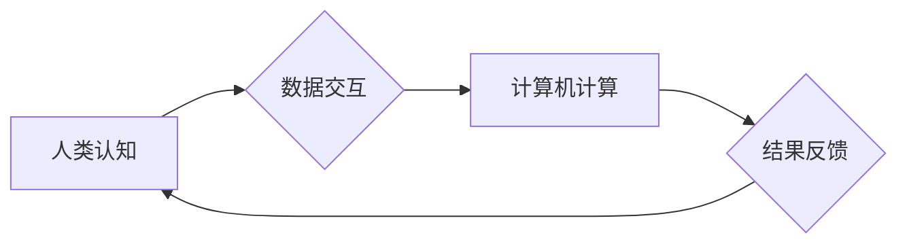

                 

## 跨越学科边界：人类计算的多元化应用

> 关键词：人类计算、跨学科融合、人工智能、计算模型、算法设计、应用场景、未来趋势

### 1. 背景介绍

人类计算，顾名思义，是指将人类的认知能力与计算能力相结合，以实现更智能、更灵活、更创新的计算方式。近年来，随着人工智能、大数据、云计算等技术的快速发展，人类计算的概念逐渐从理论探讨走向实际应用，并展现出巨大的潜力和广阔的应用前景。

传统计算模式主要依赖于计算机硬件和软件的执行能力，而人类计算则强调人类的智慧、经验和创造力。人类拥有强大的认知能力，能够进行抽象思维、逻辑推理、情感判断等复杂的操作，这些能力在解决某些特定问题时，往往比传统算法更有效率、更灵活。

### 2. 核心概念与联系

人类计算的核心概念是将人类的认知能力与计算机的计算能力相结合，形成一个协同工作、互补优势的计算体系。

**2.1 人类认知能力**

人类的认知能力包括感知、记忆、推理、决策等多个方面。

* **感知:** 人类可以通过视觉、听觉、触觉等感官接收信息，并对信息进行初步的理解和分类。
* **记忆:** 人类能够将接收到的信息存储在记忆中，并根据需要进行检索和利用。
* **推理:** 人类能够根据已有的知识和经验，对新的信息进行分析和判断，并得出新的结论。
* **决策:** 人类能够根据对信息的理解和分析，做出选择和行动。

**2.2 计算机计算能力**

计算机拥有强大的计算能力，能够进行高速、精确的计算，并处理海量数据。

* **高速计算:** 计算机能够以极快的速度进行计算，处理大量数据。
* **精确计算:** 计算机能够进行精确的计算，避免人为的误差。
* **数据处理:** 计算机能够存储、检索和处理海量数据。

**2.3 融合机制**

将人类认知能力与计算机计算能力相结合，需要建立有效的融合机制。

* **数据交互:** 人类和计算机之间需要进行数据交互，以便人类能够提供信息和指令，计算机能够反馈结果和建议。
* **算法设计:** 需要设计专门的算法，能够将人类的认知能力和计算机的计算能力有效地结合起来。
* **交互界面:** 需要设计友好的交互界面，方便人类与计算机进行交互。

**Mermaid 流程图**



### 3. 核心算法原理 & 具体操作步骤

**3.1 算法原理概述**

人类计算的核心算法原理是将人类的认知能力抽象成算法，并将其与计算机的计算能力相结合。

* **知识表示:** 将人类的知识和经验表示成计算机可以理解的形式，例如知识图谱、规则库等。
* **推理机制:** 设计算法，模拟人类的推理过程，例如逻辑推理、规则推导等。
* **决策模型:** 建立决策模型，模拟人类的决策过程，例如决策树、贝叶斯网络等。

**3.2 算法步骤详解**

1. **数据收集:** 收集人类的知识和经验，例如文本、图像、音频等数据。
2. **数据预处理:** 对收集到的数据进行预处理，例如清洗、转换、标注等。
3. **知识表示:** 将预处理后的数据表示成计算机可以理解的形式，例如知识图谱、规则库等。
4. **推理机制:** 设计算法，模拟人类的推理过程，对知识进行推理和分析。
5. **决策模型:** 建立决策模型，根据推理结果进行决策。
6. **结果反馈:** 将决策结果反馈给人类，并根据人类的反馈进行调整和优化。

**3.3 算法优缺点**

**优点:**

* 能够解决传统算法难以解决的复杂问题。
* 能够利用人类的智慧和经验，提高计算效率和准确性。
* 能够适应不断变化的环境，并进行灵活的决策。

**缺点:**

* 算法设计复杂，需要大量的知识和经验。
* 数据收集和预处理成本高。
* 算法的解释性和可解释性较差。

**3.4 算法应用领域**

* **医疗诊断:** 利用人类的医学知识和计算机的计算能力，辅助医生进行疾病诊断。
* **金融风险管理:** 利用人类的金融经验和计算机的计算能力，评估金融风险并进行风险控制。
* **法律决策:** 利用人类的法律知识和计算机的计算能力，辅助法官进行法律判决。
* **教育教学:** 利用人类的教育经验和计算机的计算能力，个性化定制教育方案。

### 4. 数学模型和公式 & 详细讲解 & 举例说明

**4.1 数学模型构建**

人类计算可以利用数学模型来描述和模拟人类的认知过程。例如，可以使用概率论和统计学来建模人类的决策过程，可以使用图论来建模人类的知识结构。

**4.2 公式推导过程**

例如，可以使用贝叶斯定理来描述人类对事件的概率判断。

$$P(A|B) = \frac{P(B|A)P(A)}{P(B)}$$

其中：

* $P(A|B)$ 是事件 A 在事件 B 发生条件下的概率。
* $P(B|A)$ 是事件 B 在事件 A 发生条件下的概率。
* $P(A)$ 是事件 A 的概率。
* $P(B)$ 是事件 B 的概率。

**4.3 案例分析与讲解**

例如，假设人类需要判断一个邮件是否为垃圾邮件。

* $A$ 表示邮件为垃圾邮件。
* $B$ 表示邮件包含某些关键词。

如果已知包含关键词的邮件为垃圾邮件的概率为 $P(B|A)$，以及邮件为垃圾邮件的概率为 $P(A)$，以及包含关键词的邮件的概率为 $P(B)$，则可以使用贝叶斯定理计算邮件为垃圾邮件的概率 $P(A|B)$。

### 5. 项目实践：代码实例和详细解释说明

**5.1 开发环境搭建**

* 操作系统: Ubuntu 20.04
* 编程语言: Python 3.8
* 库依赖: TensorFlow, NumPy, Pandas

**5.2 源代码详细实现**

```python
import tensorflow as tf
from tensorflow.keras.models import Sequential
from tensorflow.keras.layers import Dense

# 构建模型
model = Sequential()
model.add(Dense(128, activation='relu', input_shape=(10,)))
model.add(Dense(64, activation='relu'))
model.add(Dense(1, activation='sigmoid'))

# 编译模型
model.compile(optimizer='adam', loss='binary_crossentropy', metrics=['accuracy'])

# 训练模型
model.fit(X_train, y_train, epochs=10, batch_size=32)

# 评估模型
loss, accuracy = model.evaluate(X_test, y_test)
print('Loss:', loss)
print('Accuracy:', accuracy)
```

**5.3 代码解读与分析**

* 构建一个简单的多层感知机模型，用于分类任务。
* 使用 ReLU 激活函数，并设置一个 sigmoid 输出层，用于二分类任务。
* 使用 Adam 优化器，并使用二分类交叉熵损失函数。
* 训练模型 10 个 epochs，每个 batch size 为 32。
* 评估模型在测试集上的性能。

**5.4 运行结果展示**

训练完成后，可以查看模型的损失值和准确率。

### 6. 实际应用场景

**6.1 医疗诊断辅助系统**

利用人类的医学知识和计算机的计算能力，辅助医生进行疾病诊断。例如，可以利用机器学习算法分析患者的病历、影像数据等信息，并给出可能的诊断结果，帮助医生做出更准确的判断。

**6.2 金融风险管理系统**

利用人类的金融经验和计算机的计算能力，评估金融风险并进行风险控制。例如，可以利用机器学习算法分析市场数据、客户数据等信息，并预测潜在的风险，帮助金融机构进行风险管理。

**6.3 智能客服系统**

利用人类的语言理解能力和计算机的计算能力，提供智能化的客服服务。例如，可以利用自然语言处理技术，让聊天机器人能够理解用户的需求，并提供相应的帮助。

**6.4 个性化教育系统**

利用人类的教育经验和计算机的计算能力，个性化定制教育方案。例如，可以利用机器学习算法分析学生的学习情况，并推荐合适的学习资源和学习计划。

**6.5 未来应用展望**

随着人工智能、大数据、云计算等技术的不断发展，人类计算的应用场景将会更加广泛。例如，可以应用于科学研究、艺术创作、社会治理等领域。

### 7. 工具和资源推荐

**7.1 学习资源推荐**

* **书籍:**

    * 《人工智能：一种现代方法》
    * 《深度学习》
    * 《人类计算：跨学科融合的未来》

* **在线课程:**

    * Coursera: 人工智能课程
    * edX: 深度学习课程
    * Udacity: 人工智能工程师课程

**7.2 开发工具推荐**

* **编程语言:** Python, Java, C++
* **机器学习框架:** TensorFlow, PyTorch, scikit-learn
* **数据处理工具:** Pandas, NumPy

**7.3 相关论文推荐**

* 《人类计算：概念、方法和应用》
* 《跨学科融合的人类计算：未来展望》
* 《人工智能与人类计算的协同发展》

### 8. 总结：未来发展趋势与挑战

**8.1 研究成果总结**

人类计算的研究取得了显著的成果，例如在医疗诊断、金融风险管理、智能客服等领域取得了成功应用。

**8.2 未来发展趋势**

* **更智能的人工智能:** 人工智能技术的不断发展，将使人类计算更加智能化，能够更好地理解和模拟人类的认知过程。
* **更广泛的应用场景:** 人类计算的应用场景将会更加广泛，覆盖更多领域，例如科学研究、艺术创作、社会治理等。
* **更强的协同能力:** 人类和计算机将更加紧密地协同工作，形成一个更加高效、更加创新的计算体系。

**8.3 面临的挑战**

* **算法设计:** 设计能够有效地模拟人类认知能力的算法仍然是一个挑战。
* **数据安全:** 人类计算需要处理大量的人类数据，如何保证数据安全和隐私保护是一个重要的挑战。
* **伦理问题:** 人类计算的应用可能会带来一些伦理问题，例如算法偏见、人工智能的责任等，需要进行深入的探讨和研究。

**8.4 研究展望**

未来，人类计算的研究将继续深入，探索更智能、更广泛、更安全的应用场景，为人类社会带来更多福祉。

### 9. 附录：常见问题与解答

**9.1 如何理解人类计算？**

人类计算是指将人类的认知能力与计算机的计算能力相结合，形成一个协同工作、互补优势的计算体系。

**9.2 人类计算有哪些应用场景？**

人类计算的应用场景非常广泛，例如医疗诊断、金融风险管理、智能客服、个性化教育等。

**9.3 人类计算有哪些挑战？**

人类计算面临着算法设计、数据安全、伦理问题等挑战。

**9.4 人类计算的未来发展趋势是什么？**

未来，人类计算将更加智能化、更加广泛化、更加安全化。


作者：禅与计算机程序设计艺术 / Zen and the Art of Computer Programming 
<end_of_turn>

