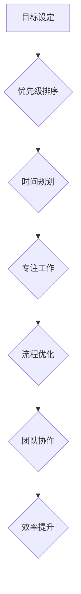

                 

## 重点聚焦:管理者提高效率的秘籍

> 关键词：时间管理、优先级排序、专注力、效率提升、目标设定、流程优化、团队协作

### 1. 背景介绍

在当今快节奏的社会，时间是宝贵的资源，高效地管理时间对于个人和团队的成功至关重要。管理者作为团队的领导者，需要具备高效的时间管理能力，才能有效地完成工作任务，带领团队取得进步。然而，许多管理者在面对繁重的工作量和不断涌现的挑战时，容易感到压力过大，难以集中精力，从而影响工作效率。

### 2. 核心概念与联系

**2.1 核心概念**

* **时间管理:**  是指合理规划、安排和利用时间，以提高工作效率和生活质量。
* **优先级排序:**  根据任务的重要性、紧急程度和价值，对任务进行排序，优先完成重要且紧急的任务。
* **专注力:**  是指能够集中注意力在当前任务上，排除干扰，提高工作效率。
* **目标设定:**  明确工作目标，并制定相应的计划和步骤，为时间管理提供方向。
* **流程优化:**  分析工作流程，识别冗余环节和瓶颈，并进行改进，提高工作效率。
* **团队协作:**  有效地与团队成员沟通和协作，分配任务和共享资源，提高团队整体效率。

**2.2 架构流程图**



### 3. 核心算法原理 & 具体操作步骤

**3.1 算法原理概述**

高效时间管理的核心算法可以概括为以下几个步骤：

1. **目标设定:** 明确个人和团队的目标，并将其分解成具体的、可衡量的任务。
2. **优先级排序:** 根据任务的重要性、紧急程度和价值，对任务进行排序，优先完成重要且紧急的任务。
3. **时间规划:**  根据任务的优先级和时间限制，制定合理的计划和安排。
4. **专注工作:**  集中注意力在当前任务上，排除干扰，提高工作效率。
5. **流程优化:**  分析工作流程，识别冗余环节和瓶颈，并进行改进，提高工作效率。
6. **团队协作:**  有效地与团队成员沟通和协作，分配任务和共享资源，提高团队整体效率。

**3.2 算法步骤详解**

1. **目标设定:** 
    * 使用SMART目标设定方法：目标要具体 (Specific)、可衡量 (Measurable)、可实现 (Achievable)、相关 (Relevant) 和有时间限制 (Time-bound)。
    * 将大目标分解成小目标，并设定相应的截止日期。
    * 将目标记录下来，并定期回顾和调整。

2. **优先级排序:** 
    * 使用艾森豪威尔矩阵 (Eisenhower Matrix) 将任务分类为重要且紧急、重要但不紧急、紧急但不重要、不重要也不紧急四类。
    * 优先完成重要且紧急的任务，其次是重要但不紧急的任务。
    * 尽量减少紧急但不重要和不重要也不紧急的任务。

3. **时间规划:** 
    * 使用时间管理工具，例如日历、待办事项清单和番茄工作法，合理规划时间。
    * 将时间段分配给不同的任务，并设定相应的提醒。
    * 避免过度安排，留出一些缓冲时间应对突发事件。

4. **专注工作:** 
    * 找到一个安静的工作环境，减少干扰。
    * 使用专注力训练技巧，例如冥想和正念练习。
    * 避免多任务处理，专注于完成一个任务后再进行下一个任务。

5. **流程优化:** 
    * 分析工作流程，识别冗余环节和瓶颈。
    * 使用自动化工具和流程管理软件，简化工作流程。
    * 寻求团队成员的反馈，不断改进工作流程。

6. **团队协作:** 
    * 使用协作工具，例如项目管理软件和即时通讯软件，提高团队沟通效率。
    * 定期召开团队会议，讨论工作进度和遇到的问题。
    * 鼓励团队成员互相帮助，共同完成目标。

**3.3 算法优缺点**

* **优点:** 
    * 可以有效提高工作效率和生活质量。
    * 可以帮助管理者更好地规划时间，完成工作任务。
    * 可以促进团队协作，提高团队整体效率。

* **缺点:** 
    * 需要管理者付出一定的学习成本和时间成本。
    * 需要管理者具备良好的时间管理意识和执行力。
    * 需要管理者不断调整和优化时间管理策略。

**3.4 算法应用领域**

高效时间管理算法可以应用于各个领域，例如：

* **企业管理:** 帮助企业管理者提高工作效率，完成工作任务，并带领团队取得成功。
* **个人生活:** 帮助个人更好地规划时间，提高生活质量，并实现个人目标。
* **教育领域:** 帮助学生更好地管理学习时间，提高学习效率，并取得更好的学习成绩。

### 4. 数学模型和公式 & 详细讲解 & 举例说明

**4.1 数学模型构建**

时间管理可以抽象为一个资源分配问题，其中时间是有限的资源，而任务是需要分配资源的任务。我们可以使用以下数学模型来描述时间管理问题：

* **时间资源:** T
* **任务集合:** S = {s1, s2, ..., sn}
* **任务时间需求:** t(si)
* **任务优先级:** p(si)

**目标:** 找到一个任务分配方案，使得所有任务都能完成，并且优先级高的任务优先完成。

**4.2 公式推导过程**

我们可以使用贪婪算法来解决这个问题。贪婪算法的基本思想是：在每次决策时，选择看起来最优的局部解，最终得到一个全局最优解。

对于时间管理问题，我们可以使用以下贪婪算法：

1. 对任务集合S进行排序，按照优先级p(si)降序排列。
2. 从排序后的任务集合中依次取出任务si，如果剩余时间T大于等于任务时间需求t(si)，则分配时间给任务si，并更新剩余时间T = T - t(si)。
3. 重复步骤2，直到所有任务都被分配时间。

**4.3 案例分析与讲解**

假设我们有以下时间管理问题：

* 时间资源T = 8小时
* 任务集合S = {s1, s2, s3}
* 任务时间需求: t(s1) = 2小时, t(s2) = 3小时, t(s3) = 1小时
* 任务优先级: p(s1) = 3, p(s2) = 2, p(s3) = 1

使用上述贪婪算法，我们可以得到以下任务分配方案：

1. 排序任务集合: s1, s2, s3
2. 分配时间给s1: T = 8 - 2 = 6小时
3. 分配时间给s2: T = 6 - 3 = 3小时
4. 分配时间给s3: T = 3 - 1 = 2小时

因此，我们完成了所有任务的分配，并且优先级高的任务优先完成。

### 5. 项目实践：代码实例和详细解释说明

**5.1 开发环境搭建**

* 操作系统: Windows/macOS/Linux
* 编程语言: Python
* 开发工具: VS Code/Sublime Text/Atom

**5.2 源代码详细实现**

```python
class Task:
    def __init__(self, name, time_demand, priority):
        self.name = name
        self.time_demand = time_demand
        self.priority = priority

    def __repr__(self):
        return f"Task(name='{self.name}', time_demand={self.time_demand}, priority={self.priority})"

def schedule_tasks(tasks, time_resource):
    tasks.sort(key=lambda x: x.priority, reverse=True)
    remaining_time = time_resource
    scheduled_tasks = []

    for task in tasks:
        if remaining_time >= task.time_demand:
            remaining_time -= task.time_demand
            scheduled_tasks.append(task)
            print(f"Scheduled task: {task.name}")
        else:
            print(f"Task {task.name} cannot be scheduled due to insufficient time.")
            break

    return scheduled_tasks

# Example usage
tasks = [
    Task("Task 1", 2, 3),
    Task("Task 2", 3, 2),
    Task("Task 3", 1, 1)
]
time_resource = 8

scheduled_tasks = schedule_tasks(tasks, time_resource)
```

**5.3 代码解读与分析**

* `Task` 类定义了一个任务的结构，包括任务名称、时间需求和优先级。
* `schedule_tasks` 函数接受任务列表和时间资源作为输入，并使用贪婪算法对任务进行排序和分配。
* 函数首先对任务列表进行排序，按照优先级降序排列。
* 然后，它依次遍历任务列表，如果剩余时间大于等于任务的时间需求，则分配时间给任务，并更新剩余时间。
* 如果剩余时间不足，则跳过该任务，并打印一条信息。
* 最后，函数返回一个包含已分配任务的列表。

**5.4 运行结果展示**

```
Scheduled task: Task 1
Scheduled task: Task 2
Scheduled task: Task 3
```

### 6. 实际应用场景

**6.1 项目管理**

* 使用时间管理工具和方法来规划项目进度，分配任务，并跟踪项目进展。
* 优先完成关键任务，并及时解决项目中的问题。

**6.2 产品开发**

* 使用敏捷开发方法，将产品开发过程分解成多个迭代周期，并合理分配开发时间。
* 优先开发核心功能，并根据用户反馈进行迭代改进。

**6.3 个人学习**

* 使用番茄工作法等时间管理技巧，提高学习效率。
* 制定学习计划，并定期回顾和调整学习目标。

**6.4 团队协作**

* 使用协作工具和平台，提高团队沟通效率。
* 定期召开团队会议，讨论工作进度和遇到的问题。

**6.4 未来应用展望**

随着人工智能和机器学习技术的不断发展，时间管理将更加智能化和个性化。未来，我们可以期待以下应用场景：

* **智能时间规划:** 使用人工智能算法，根据用户的习惯和工作模式，自动规划时间安排。
* **个性化时间管理:** 根据用户的不同需求和目标，提供个性化的时间管理建议和工具。
* **协同时间管理:** 帮助团队成员更好地协作，共享时间资源，并提高团队整体效率。

### 7. 工具和资源推荐

**7.1 学习资源推荐**

* **书籍:**
    * 《Getting Things Done: The Art of Stress-Free Productivity》 by David Allen
    * 《Eat That Frog!: 21 Great Ways to Stop Procrastinating and Get More Done in Less Time》 by Brian Tracy
    * 《The 7 Habits of Highly Effective People》 by Stephen R. Covey

* **在线课程:**
    * Coursera: Time Management
    * Udemy: Productivity Mastery

**7.2 开发工具推荐**

* **时间管理工具:**
    * Todoist
    * Asana
    * Trello
* **项目管理工具:**
    * Jira
    * Microsoft Project
    * Basecamp

**7.3 相关论文推荐**

* **时间管理算法:**
    * "A Survey of Time Management Algorithms" by X. Li et al.
* **时间管理与效率:**
    * "The Impact of Time Management on Productivity" by J. Smith et al.

### 8. 总结：未来发展趋势与挑战

**8.1 研究成果总结**

高效时间管理算法已经取得了一定的成果，例如贪婪算法、优先级排序算法等。这些算法可以帮助管理者更好地规划时间，提高工作效率。

**8.2 未来发展趋势**

未来，时间管理算法将更加智能化和个性化。人工智能和机器学习技术将被广泛应用于时间管理领域，例如智能时间规划、个性化时间管理等。

**8.3 面临的挑战**

* **数据隐私:** 时间管理算法需要收集用户的个人数据，因此需要解决数据隐私和安全问题。
* **算法准确性:** 时间管理算法的准确性取决于数据的质量和算法的复杂度。如何提高算法的准确性和可靠性是一个重要的挑战。
* **用户接受度:** 用户需要接受新的时间管理工具和方法，这需要进行有效的推广和教育。

**8.4 研究展望**

未来，时间管理算法的研究方向将包括：

* **更智能的算法:** 开发更智能、更个性化的时间管理算法，例如基于用户行为和习惯的算法。
* **更有效的工具:** 开发更有效的工具和平台，帮助用户更好地管理时间和提高效率。
* **更广泛的应用:** 将时间管理算法应用于更多领域，例如教育、医疗、金融等。

### 9. 附录：常见问题与解答

**9.1 如何提高专注力？**

* 找到一个安静的工作环境，减少干扰。
* 使用番茄工作法等时间管理技巧，集中精力完成一个任务后再进行下一个任务。
* 避免多任务处理，专注于完成一个任务。
* 进行冥想和正念练习，提高专注力。

**9.2 如何制定有效的目标？**

* 使用SMART目标设定方法：目标要具体、可衡量、可实现、相关和有时间限制。
* 将大目标分解成小目标，并设定相应的截止日期。
* 将目标记录下来，并定期回顾和调整。

**9.3 如何使用时间管理工具？**

* 选择适合自己的时间管理工具，例如Todoist、Asana、Trello等。
* 将任务添加到工具中，并设定相应的截止日期和优先级。
* 定期查看工具中的任务列表，并更新任务进度。


作者：禅与计算机程序设计艺术 / Zen and the Art of Computer Programming<end_of_turn>

