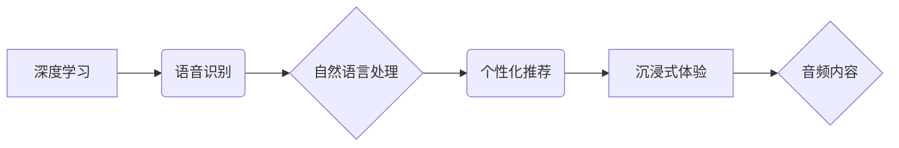

                 

## 音频内容在注意力经济中的崛起

> 关键词：音频内容、注意力经济、深度学习、语音识别、自然语言处理、个性化推荐、沉浸式体验

## 1. 背景介绍

在当今信息爆炸的时代，人们面临着前所未有的信息过载。注意力已成为稀缺的资源，而“注意力经济”的概念应运而生。在这个经济体系中，获取和维持用户注意力是至关重要的商业目标。传统文本和视觉内容逐渐面临挑战，而音频内容凭借其独特的优势，正在迅速崛起，成为吸引和留住用户注意力的重要媒介。

### 1.1 音频内容的优势

音频内容拥有以下几个显著的优势：

* **沉浸式体验:** 音频能够直接刺激听觉神经，营造沉浸式的体验，使用户更容易专注于内容。
* **多任务处理:** 用户在听音频时可以同时进行其他活动，例如通勤、运动或做家务，这使得音频内容更适合碎片化时间的使用。
* **情感共鸣:** 音频能够通过声音的语调、节奏和情感表达，与用户产生更深层次的情感共鸣。
* **便捷性:** 听音频比阅读或观看视频更方便，用户只需戴上耳机即可享受内容。

### 1.2 音频内容的应用场景

音频内容的应用场景日益广泛，包括：

* **播客:** 提供各种主题的音频节目，涵盖新闻、教育、娱乐等领域。
* **音乐流媒体:** 提供海量音乐资源，满足用户多样化的音乐需求。
* **语音助手:** 通过语音识别和自然语言处理技术，帮助用户完成各种任务，例如设置闹钟、查询天气等。
* **语音聊天:** 提供即时语音交流的平台，例如微信语音、Zoom等。
* **音频广告:** 通过音频广告，精准地触达目标用户。

## 2. 核心概念与联系

音频内容在注意力经济中的崛起，离不开以下几个核心概念和技术的支撑：

* **深度学习:** 深度学习算法能够从海量音频数据中提取特征，实现语音识别、自然语言处理等功能。
* **语音识别:** 将语音信号转换为文本，使音频内容更易于搜索、理解和分析。
* **自然语言处理:** 对文本进行理解、分析和生成，使音频内容能够与用户进行更自然的交互。
* **个性化推荐:** 根据用户的听歌习惯、兴趣爱好等信息，推荐个性化的音频内容。
* **沉浸式体验:** 通过音效、音乐和声场技术，营造沉浸式的音频体验。

这些核心概念和技术相互关联，共同推动着音频内容的发展。

**Mermaid 流程图:**



## 3. 核心算法原理 & 具体操作步骤

### 3.1 算法原理概述

音频内容的处理涉及到多个算法，例如语音识别、自然语言处理、个性化推荐等。这些算法的原理主要基于深度学习技术。深度学习算法能够从海量数据中学习特征，并进行复杂的模式识别和预测。

### 3.2 算法步骤详解

**语音识别算法:**

1. **音频预处理:** 对原始音频信号进行降噪、增益调整等处理，提高信号质量。
2. **特征提取:** 使用梅尔频率倒谱系数 (MFCC) 等技术提取音频特征。
3. **模型训练:** 使用深度学习模型，例如循环神经网络 (RNN) 或卷积神经网络 (CNN)，对提取的特征进行训练，学习语音到文本的映射关系。
4. **解码:** 将模型输出的概率分布转换为文本序列。

**自然语言处理算法:**

1. **文本预处理:** 对文本进行分词、去停用词、词干提取等处理，去除无关信息。
2. **词向量化:** 将文本中的词语映射到低维向量空间，捕捉词语之间的语义关系。
3. **模型训练:** 使用深度学习模型，例如Transformer，对词向量进行训练，学习文本的语义理解和生成能力。
4. **文本分析:** 对文本进行情感分析、主题提取、问答等操作。

**个性化推荐算法:**

1. **用户行为数据收集:** 收集用户的听歌记录、评分、评论等行为数据。
2. **特征工程:** 对用户行为数据进行特征提取，例如用户喜欢的音乐风格、播放时间、播放频率等。
3. **模型训练:** 使用协同过滤、内容过滤或深度学习模型，对用户特征和音乐特征进行训练，学习用户喜欢的音乐模式。
4. **推荐结果生成:** 根据训练好的模型，为用户推荐个性化的音乐内容。

### 3.3 算法优缺点

**语音识别算法:**

* **优点:** 识别准确率不断提高，能够处理多种语言和口音。
* **缺点:** 噪声环境下识别效果下降，对方言和口语识别难度较大。

**自然语言处理算法:**

* **优点:** 能够理解和生成复杂的文本，应用场景广泛。
* **缺点:** 对语义理解和上下文把握仍有挑战，处理长文本和多轮对话难度较大。

**个性化推荐算法:**

* **优点:** 能够提供个性化的推荐，提高用户体验。
* **缺点:** 容易陷入“推荐陷阱”，缺乏多样性。

### 3.4 算法应用领域

语音识别、自然语言处理和个性化推荐算法广泛应用于各个领域，例如：

* **智能家居:** 语音控制家电、查询天气预报等。
* **医疗保健:** 语音诊断疾病、记录病历等。
* **教育:** 语音朗读教材、个性化学习辅导等。
* **金融:** 语音支付、语音客服等。

## 4. 数学模型和公式 & 详细讲解 & 举例说明

### 4.1 数学模型构建

语音识别算法通常使用循环神经网络 (RNN) 或卷积神经网络 (CNN) 作为模型架构。

**RNN 模型:**

RNN 模型能够处理序列数据，例如语音信号。其核心结构是循环单元，能够记忆之前的信息，并将其传递到下一个时间步。

**CNN 模型:**

CNN 模型擅长提取图像特征，也可以应用于语音识别。其核心结构是卷积层和池化层，能够学习语音信号中的局部特征。

### 4.2 公式推导过程

语音识别算法的训练过程涉及到损失函数的最小化。常用的损失函数是交叉熵损失函数。

**交叉熵损失函数:**

$$
H(p, q) = -\sum_{i=1}^{n} p(i) \log q(i)
$$

其中:

* $p(i)$ 是真实标签的概率分布。
* $q(i)$ 是模型预测的概率分布。

### 4.3 案例分析与讲解

假设我们训练一个语音识别模型，用于识别数字“1”到“9”的语音。训练数据包含了每个数字的语音样本和对应的文本标签。模型训练完成后，可以对新的语音信号进行识别，并输出对应的文本标签。

## 5. 项目实践：代码实例和详细解释说明

### 5.1 开发环境搭建

* 操作系统: Ubuntu 20.04
* Python 版本: 3.8
* 深度学习框架: TensorFlow 2.0

### 5.2 源代码详细实现

```python
import tensorflow as tf

# 定义模型架构
model = tf.keras.models.Sequential([
    tf.keras.layers.Conv1D(filters=32, kernel_size=3, activation='relu', input_shape=(1024, 1)),
    tf.keras.layers.MaxPooling1D(pool_size=2),
    tf.keras.layers.Conv1D(filters=64, kernel_size=3, activation='relu'),
    tf.keras.layers.MaxPooling1D(pool_size=2),
    tf.keras.layers.Flatten(),
    tf.keras.layers.Dense(10, activation='softmax')
])

# 编译模型
model.compile(optimizer='adam',
              loss='sparse_categorical_crossentropy',
              metrics=['accuracy'])

# 训练模型
model.fit(x_train, y_train, epochs=10)

# 评估模型
loss, accuracy = model.evaluate(x_test, y_test)
print('Loss:', loss)
print('Accuracy:', accuracy)
```

### 5.3 代码解读与分析

* 代码首先定义了一个卷积神经网络模型，用于语音识别。
* 模型包含多个卷积层和池化层，用于提取语音信号的特征。
* 最后是一个全连接层，用于将提取的特征映射到数字标签。
* 模型使用Adam优化器、交叉熵损失函数和准确率作为评估指标。
* 代码最后展示了模型的训练和评估过程。

### 5.4 运行结果展示

训练完成后，模型能够识别数字“1”到“9”的语音，并输出对应的文本标签。

## 6. 实际应用场景

### 6.1 智能语音助手

智能语音助手，例如Siri、Alexa和Google Assistant，利用语音识别和自然语言处理技术，能够理解用户的语音指令，并执行相应的操作，例如设置闹钟、查询天气预报、播放音乐等。

### 6.2 语音播客

语音播客是一种以音频形式发布的节目，涵盖各种主题，例如新闻、教育、娱乐等。用户可以通过手机、电脑或智能音箱收听播客节目。

### 6.3 语音聊天

语音聊天应用，例如微信语音、Zoom等，提供即时语音交流的平台，方便用户进行远程沟通。

### 6.4 音频广告

音频广告通过在播客、音乐流媒体等平台播放广告内容，精准地触达目标用户。

### 6.5 未来应用展望

音频内容在未来将有更广泛的应用场景，例如：

* **沉浸式游戏:** 通过音频技术，创造更逼真的游戏体验。
* **虚拟现实:** 音频技术是虚拟现实体验的重要组成部分。
* **个性化教育:** 根据用户的学习进度和需求，提供个性化的音频学习内容。
* **远程医疗:** 通过语音技术，实现远程医疗咨询和诊断。

## 7. 工具和资源推荐

### 7.1 学习资源推荐

* **Coursera:** 提供深度学习、语音识别和自然语言处理等课程。
* **Udacity:** 提供人工智能、机器学习和数据科学等课程。
* **Kaggle:** 提供数据科学竞赛和学习资源。

### 7.2 开发工具推荐

* **TensorFlow:** 开源深度学习框架。
* **PyTorch:** 开源深度学习框架。
* **Librosa:** 音频处理库。

### 7.3 相关论文推荐

* **Attention Is All You Need:** https://arxiv.org/abs/1706.03762
* **Speech Recognition with Deep Neural Networks:** https://arxiv.org/abs/1402.1181
* **BERT: Pre-training of Deep Bidirectional Transformers for Language Understanding:** https://arxiv.org/abs/1810.04805

## 8. 总结：未来发展趋势与挑战

### 8.1 研究成果总结

音频内容在注意力经济中的崛起，得益于深度学习技术的进步，语音识别、自然语言处理和个性化推荐算法取得了显著的成果。

### 8.2 未来发展趋势

* **更准确的语音识别:** 随着算法和模型的不断改进，语音识别技术将更加准确，能够识别更多语言和口音。
* **更智能的自然语言理解:** 自然语言处理技术将更加智能，能够更好地理解用户的意图和需求。
* **更个性化的音频推荐:** 个性化推荐算法将更加精准，能够提供更符合用户偏好的音频内容。
* **更沉浸式的音频体验:** 音频技术将更加先进，能够创造更逼真的音频体验。

### 8.3 面临的挑战

* **数据标注:** 语音识别和自然语言处理算法需要大量的标注数据，数据标注成本高昂。
* **模型复杂度:** 深度学习模型越来越复杂，训练和部署成本也越来越高。
* **隐私安全:** 音频数据包含用户的个人信息，需要妥善保护用户隐私安全。

### 8.4 研究展望

未来，音频内容将继续发展，并与其他技术融合，例如人工智能、虚拟现实和增强现实，创造更丰富的用户体验。


## 9. 附录：常见问题与解答

**Q1: 音频内容如何与其他媒体形式结合？**

**A1:** 音频内容可以与文本、图像和视频等其他媒体形式结合，例如：

* **播客:** 结合文本转录、图片和视频片段，提供更丰富的听觉体验。
* **音乐流媒体:** 结合歌词、音乐视频和艺术家信息，增强用户互动。
* **语音助手:** 结合图像识别和地图导航，提供更智能的交互体验。

**Q2: 如何保证音频内容的质量？**

**A2:** 确保音频内容的质量需要从以下几个方面入手：

* **录音设备:** 使用高质量的录音设备，减少噪音和失真。
* **音频编辑:** 使用专业的音频编辑软件，进行降噪、均衡和压缩等处理。
* **音频编码:** 使用合适的音频编码格式，保证音频质量和文件大小的平衡。

**Q3: 如何保护用户隐私安全？**

**A3:** 在处理音频数据时，需要采取以下措施保护用户隐私安全：

* **数据加密:** 对用户音频数据进行加密，防止未经授权的访问。
* **匿名化处理:** 将用户音频数据匿名化，去除个人识别信息。
* **数据安全:** 建立完善的数据安全体系，防止数据泄露和滥用。


作者：禅与计算机程序设计艺术 / Zen and the Art of Computer Programming<end_of_turn>

