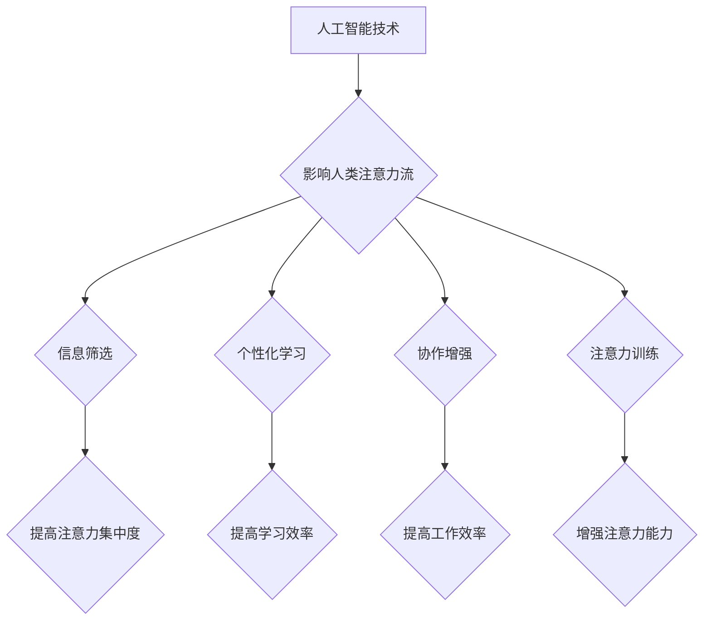

                 

## AI与人类注意力流：未来的工作、技能与注意力流管理技术的应用前景趋势预测

> 关键词：人工智能，注意力流，工作模式，技能发展，注意力管理技术，未来趋势

> 摘要：随着人工智能技术的飞速发展，对人类注意力流的理解和管理变得越来越重要。本文探讨了人工智能如何影响人类工作模式和技能需求，并分析了注意力流管理技术的应用前景趋势，旨在为读者提供对未来工作环境和个人发展方向的洞察。

## 1. 背景介绍

1.1 人工智能的崛起

人工智能（AI）正以惊人的速度发展，从语音识别到图像生成，AI已经渗透到我们生活的方方面面。AI技术的进步不仅改变了我们的生活方式，也深刻地影响着我们的工作模式和技能需求。

1.2 注意力流的本质

注意力流是指我们对信息进行筛选、处理和记忆的过程。在信息爆炸的时代，人类的注意力受到来自各种渠道的信息的冲击，注意力流变得更加稀缺和宝贵。

1.3 人工智能与注意力流的交汇

AI技术可以帮助我们更好地理解和管理注意力流。例如，AI驱动的个性化学习平台可以根据用户的学习习惯和注意力水平，定制个性化的学习内容和节奏。AI驱动的协作工具可以帮助团队成员更好地集中注意力，提高工作效率。

## 2. 核心概念与联系

2.1 人工智能与注意力流的交互关系

AI技术可以对人类注意力流产生多方面的影响：

* **信息筛选:** AI可以帮助我们过滤掉无关的信息，只保留重要的信息，从而提高我们的注意力集中度。
* **个性化学习:** AI可以根据用户的学习习惯和注意力水平，定制个性化的学习内容和节奏，提高学习效率。
* **协作增强:** AI可以帮助团队成员更好地集中注意力，提高工作效率。
* **注意力训练:** AI可以提供注意力训练游戏和工具，帮助我们增强注意力能力。

2.2 注意力流管理技术的应用场景

注意力流管理技术可以应用于以下场景：

* **教育:** 个性化学习、注意力训练、学习效率提升。
* **工作:** 提高工作效率、增强团队协作、减少工作压力。
* **生活:** 改善睡眠质量、提高生活质量、增强个人幸福感。



## 3. 核心算法原理 & 具体操作步骤

3.1 算法原理概述

注意力机制是深度学习领域的重要技术，它能够模拟人类的注意力机制，帮助模型更好地理解和处理信息。注意力机制的核心思想是，在处理信息时，模型应该关注那些与当前任务最相关的部分，而忽略那些无关的部分。

3.2 算法步骤详解

1. **输入数据:** 将输入数据（例如文本、图像）转换为模型可以理解的格式。
2. **编码:** 使用编码器将输入数据编码成一个表示向量。
3. **注意力计算:** 计算每个输入元素与输出元素之间的注意力权重。
4. **加权求和:** 根据注意力权重，对编码后的表示向量进行加权求和，得到最终的输出。

3.3 算法优缺点

**优点:**

* 可以提高模型的准确率和效率。
* 可以帮助模型更好地理解和处理长序列数据。
* 可以解释模型的决策过程。

**缺点:**

* 计算复杂度较高。
* 需要大量的训练数据。

3.4 算法应用领域

注意力机制在自然语言处理、计算机视觉、机器翻译等领域都有广泛的应用。

## 4. 数学模型和公式 & 详细讲解 & 举例说明

4.1 数学模型构建

注意力机制的数学模型可以表示为以下公式：

$$
\text{Attention}(Q, K, V) = \text{softmax}\left(\frac{Q K^T}{\sqrt{d_k}}\right) V
$$

其中：

* $Q$：查询矩阵
* $K$：键矩阵
* $V$：值矩阵
* $d_k$：键向量的维度
* $\text{softmax}$：softmax函数

4.2 公式推导过程

公式推导过程可以参考相关文献，例如：

* Vaswani, A., Shazeer, N., Parmar, N., Uszkoreit, J., Jones, L., Gomez, A. N., ... & Polosukhin, I. (2017). Attention is all you need. In Advances in neural information processing systems (pp. 5998-6008).

4.3 案例分析与讲解

例如，在机器翻译任务中，可以使用注意力机制来帮助模型更好地理解句子之间的关系。查询矩阵 $Q$ 可以表示源语言句子，键矩阵 $K$ 可以表示目标语言句子，值矩阵 $V$ 可以表示目标语言词典。通过计算注意力权重，模型可以将源语言句子与目标语言句子进行匹配，从而提高翻译的准确率。

## 5. 项目实践：代码实例和详细解释说明

5.1 开发环境搭建

可以使用 Python 和 TensorFlow 或 PyTorch 等深度学习框架来实现注意力机制。

5.2 源代码详细实现

```python
import tensorflow as tf

# 定义注意力层
class AttentionLayer(tf.keras.layers.Layer):
    def __init__(self, units):
        super(AttentionLayer, self).__init__()
        self.Wq = tf.keras.layers.Dense(units)
        self.Wk = tf.keras.layers.Dense(units)
        self.Wv = tf.keras.layers.Dense(units)
        self.dense = tf.keras.layers.Dense(units)

    def call(self, inputs):
        Q = self.Wq(inputs[0])
        K = self.Wk(inputs[1])
        V = self.Wv(inputs[2])
        attention_scores = tf.matmul(Q, K, transpose_b=True) / tf.math.sqrt(tf.cast(tf.shape(Q)[-1], tf.float32))
        attention_weights = tf.nn.softmax(attention_scores, axis=-1)
        output = tf.matmul(attention_weights, V)
        return self.dense(output)

# 使用注意力层
inputs = [tf.random.normal((1, 10, 64)), tf.random.normal((1, 10, 64)), tf.random.normal((1, 10, 64))]
attention_layer = AttentionLayer(units=64)
output = attention_layer(inputs)
print(output.shape)
```

5.3 代码解读与分析

代码实现了注意力层的结构和计算过程。

* `AttentionLayer` 类定义了注意力层的结构，包括三个稠密层 (`Wq`, `Wk`, `Wv`) 用于计算查询、键和值向量，以及一个稠密层 (`dense`) 用于最终输出。
* `call` 方法实现了注意力层的计算过程，包括计算注意力权重、加权求和和最终输出。

5.4 运行结果展示

运行代码后，输出的 `output` 的形状为 `(1, 10, 64)`，表示注意力层将输入的三个向量映射到一个新的向量空间。

## 6. 实际应用场景

6.1 教育领域

* **个性化学习:** AI驱动的学习平台可以根据学生的学习习惯和注意力水平，定制个性化的学习内容和节奏，提高学习效率。
* **注意力训练:** AI可以提供注意力训练游戏和工具，帮助学生增强注意力能力。

6.2 工作领域

* **提高工作效率:** AI驱动的协作工具可以帮助团队成员更好地集中注意力，提高工作效率。
* **减少工作压力:** AI可以帮助我们自动化一些重复性的工作，减轻工作压力。

6.3 生活领域

* **改善睡眠质量:** AI驱动的睡眠监测设备可以帮助我们了解睡眠质量，并提供个性化的睡眠建议。
* **提高生活质量:** AI可以帮助我们管理时间、安排日程、完成任务，提高生活质量。

6.4 未来应用展望

随着人工智能技术的不断发展，注意力流管理技术将有更广泛的应用场景，例如：

* **医疗保健:** AI可以帮助医生更好地理解患者的病情，并提供个性化的治疗方案。
* **金融服务:** AI可以帮助金融机构识别欺诈行为，并提供更精准的金融服务。
* **交通运输:** AI可以帮助驾驶员更好地集中注意力，提高交通安全。

## 7. 工具和资源推荐

7.1 学习资源推荐

* **书籍:**
    * Deep Learning by Ian Goodfellow, Yoshua Bengio, and Aaron Courville
    * Attention Is All You Need by Ashish Vaswani et al.
* **在线课程:**
    * TensorFlow Tutorials: https://www.tensorflow.org/tutorials
    * PyTorch Tutorials: https://pytorch.org/tutorials/

7.2 开发工具推荐

* **TensorFlow:** https://www.tensorflow.org/
* **PyTorch:** https://pytorch.org/
* **Keras:** https://keras.io/

7.3 相关论文推荐

* Attention Is All You Need (Vaswani et al., 2017)
* Transformer-XL: Attentive Language Modeling Beyond Millions of Tokens (Dai et al., 2019)
* BERT: Pre-training of Deep Bidirectional Transformers for Language Understanding (Devlin et al., 2018)

## 8. 总结：未来发展趋势与挑战

8.1 研究成果总结

近年来，注意力机制在深度学习领域取得了显著的进展，并在自然语言处理、计算机视觉等领域取得了优异的性能。

8.2 未来发展趋势

未来，注意力机制的研究将朝着以下方向发展：

* **更有效的注意力机制:** 研究更有效的注意力机制，提高模型的效率和准确率。
* **跨模态注意力机制:** 研究跨模态注意力机制，使模型能够处理不同模态的数据，例如文本、图像、音频等。
* **可解释性注意力机制:** 研究可解释性注意力机制，使模型的决策过程更加透明。

8.3 面临的挑战

注意力机制也面临一些挑战：

* **计算复杂度:** 传统的注意力机制计算复杂度较高，难以应用于大规模数据。
* **参数量:** 注意力机制的参数量较大，需要大量的训练数据才能达到最佳性能。
* **可解释性:** 注意力机制的决策过程难以解释，这限制了其在一些应用场景中的应用。

8.4 研究展望

未来，我们需要继续探索更有效的、更可解释的注意力机制，并将其应用于更多领域，推动人工智能技术的进步。

## 9. 附录：常见问题与解答

9.1 Q: 注意力机制和深度学习有什么关系？

9.2 A: 注意力机制是一种深度学习中的重要技术，它能够模拟人类的注意力机制，帮助模型更好地理解和处理信息。

9.3 Q: 注意力机制有哪些应用场景？

9.4 A: 注意力机制在自然语言处理、计算机视觉、机器翻译等领域都有广泛的应用。

9.5 Q: 如何学习注意力机制？

9.6 A: 可以阅读相关书籍和论文，并使用 TensorFlow 或 PyTorch 等深度学习框架进行实践。


作者：禅与计算机程序设计艺术 / Zen and the Art of Computer Programming 
<end_of_turn>

