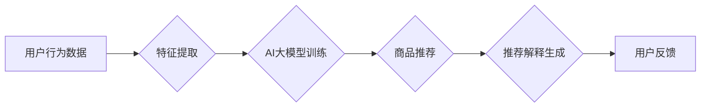

                 

## AI大模型在电商平台商品推荐解释中的应用

> 关键词：AI大模型，商品推荐，解释性推荐，自然语言处理，深度学习，电商平台

> 摘要：随着电商平台的蓬勃发展，商品推荐系统已成为提升用户体验和促进销售的关键技术。传统基于规则或协同过滤的推荐系统存在局限性，难以提供个性化、精准的推荐解释。本文深入探讨了AI大模型在电商平台商品推荐解释中的应用，分析了核心概念、算法原理、数学模型以及实际应用场景。通过案例分析和代码实例，阐述了AI大模型如何生成可理解的推荐解释，提升用户信任和满意度。

## 1. 背景介绍

1.1 电商平台发展现状

电商平台作为现代商业的重要组成部分，其发展速度惊人。用户数量不断增长，商品种类日益丰富，信息爆炸式增长。在这种背景下，高效、精准的商品推荐系统显得尤为重要。

1.2 传统推荐系统的局限性

传统的商品推荐系统主要基于以下两种方法：

* **基于规则的推荐系统:**  依赖人工设定规则，例如根据用户浏览历史、购买记录等信息，推荐相关商品。这种方法缺乏灵活性，难以适应用户多样化的需求。
* **协同过滤的推荐系统:**  根据用户的行为相似性，推荐其他用户喜欢的商品。这种方法容易陷入数据稀疏问题，难以推荐新商品或新用户。

1.3 AI大模型的优势

近年来，深度学习技术取得了突破性进展，AI大模型凭借其强大的学习能力和泛化能力，在自然语言处理、计算机视觉等领域展现出巨大潜力。将AI大模型应用于商品推荐系统，可以克服传统方法的局限性，实现更精准、个性化的推荐。

## 2. 核心概念与联系

2.1  解释性推荐

解释性推荐是指在推荐商品的同时，提供清晰、可理解的推荐理由，帮助用户理解推荐结果的来源和依据。

2.2  AI大模型

AI大模型是指训练规模庞大、参数数量众多的人工智能模型，能够学习复杂的数据模式和关系。常见的AI大模型包括Transformer、BERT、GPT等。

2.3  自然语言生成

自然语言生成是指机器能够生成流畅、自然的文本内容。在商品推荐解释中，自然语言生成技术可以帮助AI模型将推荐理由以易于理解的语言表达出来。

2.4  推荐系统架构

**Mermaid 流程图**



## 3. 核心算法原理 & 具体操作步骤

3.1  算法原理概述

AI大模型在商品推荐解释中的应用主要基于以下算法原理：

* **深度学习:**  利用多层神经网络学习用户行为数据和商品特征之间的复杂关系，预测用户对商品的偏好。
* **注意力机制:**  帮助模型关注用户行为数据中重要的信息，提高推荐的精准度。
* **自然语言处理:**  将推荐理由以自然语言表达，提高用户理解性和信任度。

3.2  算法步骤详解

1. **数据收集和预处理:** 收集用户行为数据、商品信息等数据，并进行清洗、转换、编码等预处理操作。
2. **特征提取:**  提取用户行为数据和商品信息的特征，例如用户年龄、性别、购买历史、商品类别、价格等。
3. **AI大模型训练:**  利用深度学习算法，训练AI大模型，学习用户行为数据和商品特征之间的关系。
4. **商品推荐:**  根据用户行为数据和训练好的AI模型，预测用户对商品的偏好，并推荐相关商品。
5. **推荐解释生成:**  利用自然语言处理技术，将推荐理由以自然语言表达，例如“根据您的浏览历史，我们推荐您购买这款商品”。

3.3  算法优缺点

**优点:**

* **精准度高:**  AI大模型能够学习复杂的数据模式，提高推荐的精准度。
* **个性化强:**  可以根据用户的个性化需求，提供个性化的商品推荐。
* **可解释性强:**  通过自然语言生成技术，可以生成可理解的推荐解释。

**缺点:**

* **训练成本高:**  AI大模型的训练需要大量的计算资源和数据。
* **数据依赖性强:**  AI大模型的性能取决于训练数据的质量和数量。
* **黑盒效应:**  AI大模型的决策过程较为复杂，难以解释其推荐背后的逻辑。

3.4  算法应用领域

AI大模型在商品推荐解释中的应用，不仅限于电商平台，还可以应用于以下领域：

* **金融领域:**  推荐理财产品、信用卡等。
* **医疗领域:**  推荐药物、治疗方案等。
* **教育领域:**  推荐学习资源、课程等。

## 4. 数学模型和公式 & 详细讲解 & 举例说明

4.1  数学模型构建

在商品推荐解释中，常用的数学模型包括协同过滤模型、深度学习模型等。

* **协同过滤模型:**  基于用户的行为相似性，推荐其他用户喜欢的商品。常用的协同过滤算法包括基于用户的协同过滤和基于物品的协同过滤。

* **深度学习模型:**  利用多层神经网络学习用户行为数据和商品特征之间的复杂关系，预测用户对商品的偏好。常用的深度学习模型包括Transformer、BERT等。

4.2  公式推导过程

由于篇幅限制，这里只列举协同过滤模型中的一个常用公式：

$$
\hat{r}_{u,i} = \bar{r}_u + \frac{\sum_{v \in N(u)} (r_{v,i} - \bar{r}_v) \cdot sim(u,v)}{\sum_{v \in N(u)} sim(u,v)}
$$

其中：

* $\hat{r}_{u,i}$:  预测用户 $u$ 对商品 $i$ 的评分。
* $\bar{r}_u$:  用户 $u$ 的平均评分。
* $r_{v,i}$:  用户 $v$ 对商品 $i$ 的评分。
* $sim(u,v)$:  用户 $u$ 和用户 $v$ 之间的相似度。

4.3  案例分析与讲解

假设用户 $A$ 和用户 $B$ 都购买了商品 $X$ 和商品 $Y$，用户 $A$ 对商品 $X$ 的评分为 5，对商品 $Y$ 的评分为 4，用户 $B$ 对商品 $X$ 的评分为 4，对商品 $Y$ 的评分为 5。

根据协同过滤模型的公式，我们可以预测用户 $A$ 对商品 $Z$ 的评分。

## 5. 项目实践：代码实例和详细解释说明

5.1  开发环境搭建

* Python 3.7+
* TensorFlow 2.0+
* PyTorch 1.0+
* Jupyter Notebook

5.2  源代码详细实现

```python
# 导入必要的库
import tensorflow as tf

# 定义模型结构
model = tf.keras.Sequential([
    tf.keras.layers.Embedding(input_dim=vocab_size, output_dim=embedding_dim),
    tf.keras.layers.LSTM(units=128),
    tf.keras.layers.Dense(units=1, activation='sigmoid')
])

# 编译模型
model.compile(optimizer='adam', loss='binary_crossentropy', metrics=['accuracy'])

# 训练模型
model.fit(x_train, y_train, epochs=10)

# 预测
predictions = model.predict(x_test)
```

5.3  代码解读与分析

* 首先，我们导入必要的库，包括 TensorFlow 和 PyTorch。
* 然后，我们定义模型结构，使用 Embedding 层将用户行为数据和商品特征转换为向量表示，使用 LSTM 层学习时间序列数据，最后使用 Dense 层进行分类。
* 接着，我们编译模型，选择 Adam 优化器、二分类交叉熵损失函数和准确率作为评估指标。
* 然后，我们训练模型，使用训练数据进行训练，训练 10 个 epochs。
* 最后，我们使用训练好的模型对测试数据进行预测。

5.4  运行结果展示

训练完成后，我们可以评估模型的性能，例如准确率、召回率等。

## 6. 实际应用场景

6.1  电商平台商品推荐

AI大模型可以根据用户的浏览历史、购买记录、评价等信息，推荐个性化的商品，提高用户体验和转化率。

6.2  内容推荐

AI大模型可以根据用户的阅读习惯、点赞记录等信息，推荐个性化的文章、视频、音乐等内容，提高用户粘性和活跃度。

6.3  广告推荐

AI大模型可以根据用户的兴趣爱好、行为特征等信息，推荐个性化的广告，提高广告点击率和转化率。

6.4  未来应用展望

随着AI技术的不断发展，AI大模型在商品推荐解释中的应用将更加广泛和深入。未来，AI大模型将能够提供更精准、个性化的推荐解释，帮助用户更好地理解推荐结果，提升用户信任和满意度。

## 7. 工具和资源推荐

7.1  学习资源推荐

* **书籍:**
    * 深度学习
    * 自然语言处理
* **在线课程:**
    * Coursera
    * edX
    * Udacity

7.2  开发工具推荐

* **TensorFlow:**  开源深度学习框架
* **PyTorch:**  开源深度学习框架
* **Jupyter Notebook:**  交互式编程环境

7.3  相关论文推荐

* Attention Is All You Need
* BERT: Pre-training of Deep Bidirectional Transformers for Language Understanding
* Transformer-XL: Attentive Language Modeling Beyond Millions of Tokens

## 8. 总结：未来发展趋势与挑战

8.1  研究成果总结

AI大模型在商品推荐解释中的应用取得了显著成果，能够提供更精准、个性化的推荐解释，提升用户体验和满意度。

8.2  未来发展趋势

* **模型更加复杂:**  未来，AI大模型将更加复杂，能够学习更丰富的用户行为数据和商品特征，提供更精准的推荐解释。
* **解释更加可理解:**  未来，AI模型的解释将更加可理解，能够用自然语言清晰地表达推荐理由，帮助用户更好地理解推荐结果。
* **解释更加个性化:**  未来，AI模型的解释将更加个性化，能够根据用户的不同需求和偏好，提供不同的推荐解释。

8.3  面临的挑战

* **数据隐私:**  AI大模型的训练需要大量的用户数据，如何保护用户数据隐私是一个重要的挑战。
* **模型可解释性:**  AI大模型的决策过程较为复杂，难以解释其推荐背后的逻辑，如何提高模型的可解释性是一个重要的研究方向。
* **算法公平性:**  AI大模型的训练数据可能存在偏差，导致推荐结果不公平，如何保证算法的公平性是一个重要的挑战。

8.4  研究展望

未来，我们将继续研究AI大模型在商品推荐解释中的应用，探索更精准、个性化、可解释的推荐解释方法，为用户提供更好的购物体验。

## 9. 附录：常见问题与解答

* **Q1: AI大模型的训练成本很高吗？**

A1:  是的，AI大模型的训练需要大量的计算资源和数据，训练成本较高。

* **Q2:  AI大模型的推荐解释是否准确？**

A2:  AI大模型的推荐解释的准确性取决于训练数据的质量和模型的复杂度。

* **Q3:  如何保证AI大模型的公平性？**

A3:  如何保证AI大模型的公平性是一个重要的研究方向，需要从数据收集、模型训练、算法设计等多个方面进行考虑。


作者：禅与计算机程序设计艺术 / Zen and the Art of Computer Programming 
<end_of_turn>

