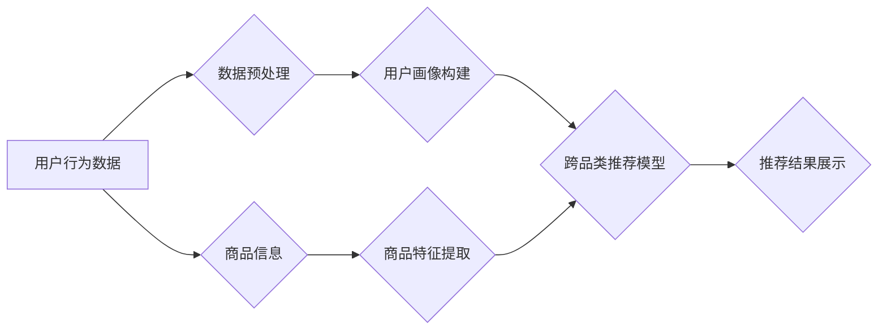

                 

## AI大模型在跨品类推荐中的表现

> 关键词：AI大模型、跨品类推荐、协同过滤、深度学习、Transformer、用户画像、商品特征、推荐系统、个性化推荐

## 1. 背景介绍

推荐系统作为电商、社交媒体等平台的核心功能之一，旨在根据用户的历史行为、偏好等信息，推荐用户可能感兴趣的商品或内容。传统的推荐系统主要依赖于协同过滤和基于内容的过滤算法，但这些方法在跨品类推荐方面表现有限。

跨品类推荐是指推荐不同类别商品的任务，例如推荐服装的同时也推荐相关的鞋子、包包等。由于不同品类商品之间缺乏显性语义关联，传统的推荐算法难以捕捉跨品类之间的潜在关系，导致推荐结果缺乏准确性和多样性。

近年来，随着深度学习技术的快速发展，基于深度学习的推荐系统逐渐成为研究热点。AI大模型，特别是Transformer模型，凭借其强大的语义理解和序列建模能力，在跨品类推荐领域展现出巨大的潜力。

## 2. 核心概念与联系

### 2.1 跨品类推荐的挑战

跨品类推荐面临的主要挑战包括：

* **数据稀疏性:** 用户对不同品类商品的交互数据往往稀疏，难以建立有效的用户-商品关联关系。
* **语义鸿沟:** 不同品类商品之间缺乏显性语义关联，难以捕捉跨品类之间的潜在关系。
* **冷启动问题:** 新用户和新商品缺乏历史交互数据，难以进行有效的推荐。

### 2.2 AI大模型的优势

AI大模型，特别是Transformer模型，具有以下优势，可以有效解决跨品类推荐的挑战：

* **强大的语义理解能力:** Transformer模型通过自注意力机制，可以捕捉文本序列中的长距离依赖关系，有效理解商品的语义特征。
* **序列建模能力:** Transformer模型可以对商品序列进行建模，例如用户浏览历史、购买记录等，从而更好地理解用户的偏好和行为模式。
* **泛化能力:** AI大模型在海量数据上进行训练，具有较强的泛化能力，可以应用于不同品类和场景的推荐任务。

### 2.3 跨品类推荐架构

AI大模型在跨品类推荐中的应用架构通常包括以下几个模块：

* **数据预处理:** 对用户行为数据、商品信息等进行清洗、转换和特征提取。
* **用户画像构建:** 利用AI大模型对用户历史行为进行分析，构建用户画像，刻画用户的兴趣、偏好和购买习惯。
* **商品特征提取:** 利用AI大模型对商品信息进行分析，提取商品的语义特征、属性特征等。
* **跨品类推荐模型:** 基于AI大模型，构建跨品类推荐模型，学习用户-商品之间的潜在关系，并进行推荐排序。
* **推荐结果展示:** 将推荐结果以用户友好的方式展示给用户。



## 3. 核心算法原理 & 具体操作步骤

### 3.1 算法原理概述

在跨品类推荐中，AI大模型通常采用以下几种算法原理：

* **协同过滤:** 尽管传统的协同过滤算法在跨品类推荐中表现有限，但结合AI大模型的语义理解能力，可以改进其效果。例如，可以利用Transformer模型学习用户对不同品类商品的隐含偏好，并进行跨品类推荐。
* **深度学习:** 深度学习模型，例如多层感知机 (MLP)、卷积神经网络 (CNN) 和循环神经网络 (RNN)，可以学习用户-商品之间的复杂关系，并进行跨品类推荐。
* **Transformer模型:** Transformer模型凭借其强大的语义理解和序列建模能力，在跨品类推荐中表现出色。例如，可以利用BERT模型对商品信息进行编码，学习商品之间的语义相似度，并进行跨品类推荐。

### 3.2 算法步骤详解

以Transformer模型为例，跨品类推荐的具体操作步骤如下：

1. **数据预处理:** 对用户行为数据、商品信息等进行清洗、转换和特征提取。例如，将用户行为数据转换为用户-商品交互矩阵，并将商品信息转换为商品特征向量。
2. **模型训练:** 利用Transformer模型对用户-商品交互矩阵和商品特征向量进行训练，学习用户-商品之间的潜在关系。
3. **推荐排序:** 将新用户的特征向量输入到训练好的Transformer模型中，预测用户对不同商品的兴趣分数，并根据分数进行推荐排序。

### 3.3 算法优缺点

**优点:**

* 能够捕捉跨品类之间的潜在关系，提高推荐准确性和多样性。
* 具有强大的泛化能力，可以应用于不同品类和场景的推荐任务。

**缺点:**

* 需要海量数据进行训练，训练成本较高。
* 模型复杂度高，推理速度相对较慢。

### 3.4 算法应用领域

AI大模型在跨品类推荐中的应用领域广泛，例如：

* **电商平台:** 推荐用户可能感兴趣的商品，提高转化率。
* **社交媒体平台:** 推荐用户可能感兴趣的内容，提高用户粘性。
* **内容平台:** 推荐用户可能感兴趣的文章、视频等，提高用户体验。

## 4. 数学模型和公式 & 详细讲解 & 举例说明

### 4.1 数学模型构建

在跨品类推荐中，AI大模型通常采用用户-商品交互矩阵作为输入，并利用Transformer模型学习用户-商品之间的潜在关系。用户-商品交互矩阵是一个稀疏矩阵，其中每个元素表示用户对商品的交互行为，例如点击、购买、收藏等。

### 4.2 公式推导过程

Transformer模型的核心是自注意力机制，其公式如下：

$$
Attention(Q, K, V) = \frac{exp(Q \cdot K^T / \sqrt{d_k})}{exp(Q \cdot K^T / \sqrt{d_k})} \cdot V
$$

其中：

* $Q$：查询矩阵
* $K$：键矩阵
* $V$：值矩阵
* $d_k$：键向量的维度

自注意力机制可以捕捉文本序列中的长距离依赖关系，从而学习用户-商品之间的潜在关系。

### 4.3 案例分析与讲解

假设有一个电商平台，用户购买了服装和鞋子，但没有购买包包。利用Transformer模型，可以学习到用户对服装和鞋子的交互行为，并预测用户可能对包包感兴趣。

## 5. 项目实践：代码实例和详细解释说明

### 5.1 开发环境搭建

* Python 3.6+
* TensorFlow 2.0+
* PyTorch 1.0+
* CUDA 10.0+

### 5.2 源代码详细实现

```python
# 导入必要的库
import tensorflow as tf

# 定义Transformer模型
class Transformer(tf.keras.Model):
    def __init__(self, vocab_size, embedding_dim, num_heads, num_layers):
        super(Transformer, self).__init__()
        self.embedding = tf.keras.layers.Embedding(vocab_size, embedding_dim)
        self.transformer_layers = tf.keras.layers.StackedRNNCells([tf.keras.layers.MultiHeadAttention(num_heads=num_heads, key_dim=embedding_dim) for _ in range(num_layers)])
        self.dense = tf.keras.layers.Dense(vocab_size)

    def call(self, inputs):
        embeddings = self.embedding(inputs)
        outputs = self.transformer_layers(embeddings)
        logits = self.dense(outputs)
        return logits

# 实例化Transformer模型
model = Transformer(vocab_size=10000, embedding_dim=128, num_heads=8, num_layers=6)

# 训练模型
model.compile(optimizer='adam', loss='sparse_categorical_crossentropy', metrics=['accuracy'])
model.fit(x_train, y_train, epochs=10)

# 预测结果
predictions = model.predict(x_test)
```

### 5.3 代码解读与分析

* 代码首先导入必要的库。
* 然后定义Transformer模型，包括嵌入层、Transformer层和全连接层。
* 实例化Transformer模型，并使用Adam优化器、交叉熵损失函数和准确率指标进行训练。
* 最后使用训练好的模型进行预测。

### 5.4 运行结果展示

训练完成后，可以评估模型的性能，例如准确率、召回率等。

## 6. 实际应用场景

### 6.1 电商平台

在电商平台，AI大模型可以用于跨品类推荐，例如推荐用户可能感兴趣的服装、鞋子、包包等。

### 6.2 社交媒体平台

在社交媒体平台，AI大模型可以用于推荐用户可能感兴趣的内容，例如文章、视频、图片等。

### 6.3 内容平台

在内容平台，AI大模型可以用于推荐用户可能感兴趣的文章、视频、音频等。

### 6.4 未来应用展望

随着AI技术的不断发展，AI大模型在跨品类推荐中的应用场景将更加广泛，例如：

* **个性化推荐:** 基于用户的个性化需求，进行更精准的跨品类推荐。
* **场景化推荐:** 根据用户的场景，例如购物、旅行、娱乐等，进行场景化的跨品类推荐。
* **多模态推荐:** 结合文本、图像、音频等多模态数据，进行更丰富的跨品类推荐。

## 7. 工具和资源推荐

### 7.1 学习资源推荐

* **书籍:**
    * Deep Learning by Ian Goodfellow, Yoshua Bengio, and Aaron Courville
    * Attention Is All You Need by Ashish Vaswani et al.
* **在线课程:**
    * Deep Learning Specialization by Andrew Ng (Coursera)
    * Transformer Networks by Jay Alammar (blog post)

### 7.2 开发工具推荐

* **TensorFlow:** https://www.tensorflow.org/
* **PyTorch:** https://pytorch.org/
* **Hugging Face Transformers:** https://huggingface.co/transformers/

### 7.3 相关论文推荐

* Attention Is All You Need (Vaswani et al., 2017)
* BERT: Pre-training of Deep Bidirectional Transformers for Language Understanding (Devlin et al., 2018)
* Transformer-XL: Attentive Language Models Beyond a Fixed-Length Context (Dai et al., 2019)

## 8. 总结：未来发展趋势与挑战

### 8.1 研究成果总结

AI大模型在跨品类推荐领域取得了显著的成果，能够有效捕捉跨品类之间的潜在关系，提高推荐准确性和多样性。

### 8.2 未来发展趋势

* **模型架构创新:** 研究更强大的Transformer模型架构，例如T5、GPT-3等，提升跨品类推荐的性能。
* **多模态融合:** 结合文本、图像、音频等多模态数据，进行更丰富的跨品类推荐。
* **个性化推荐:** 基于用户的个性化需求，进行更精准的跨品类推荐。

### 8.3 面临的挑战

* **数据稀疏性:** 跨品类商品之间的交互数据往往稀疏，难以训练有效的推荐模型。
* **冷启动问题:** 新用户和新商品缺乏历史交互数据，难以进行有效的推荐。
* **模型 interpretability:** AI大模型的决策过程往往难以解释，需要提高模型的 interpretability。

### 8.4 研究展望

未来，跨品类推荐研究将继续朝着更精准、更个性化、更智能的方向发展。


## 9. 附录：常见问题与解答

* **Q: AI大模型的训练成本很高吗？**

A: 确实，AI大模型的训练成本较高，需要大量的计算资源和数据。

* **Q: 如何解决跨品类推荐中的数据稀疏性问题？**

A: 可以采用以下方法解决数据稀疏性问题：

* 利用协同过滤算法，学习用户对不同品类商品的隐含偏好。
* 利用知识图谱，补充商品之间的语义关系。
* 利用迁移学习，将预训练模型应用于跨品类推荐任务。

* **Q: 如何评估跨品类推荐模型的性能？**

A: 可以使用以下指标评估跨品类推荐模型的性能：

* 准确率
* 召回率
* NDCG (Normalized Discounted Cumulative Gain)
* MAP (Mean Average Precision)


作者：禅与计算机程序设计艺术 / Zen and the Art of Computer Programming 
<end_of_turn>

