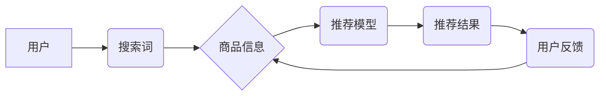

                 

## AI大模型视角下电商搜索推荐的技术创新知识分享平台搭建

> 关键词：电商搜索推荐、大模型、知识图谱、推荐算法、平台搭建、技术创新

### 1. 背景介绍

随着电商行业的蓬勃发展，搜索推荐系统已成为电商平台的核心竞争力之一。传统的搜索推荐系统主要依赖于基于规则和基于内容的算法，但随着用户行为的复杂化和商品信息的爆炸式增长，这些算法逐渐难以满足用户个性化需求和精准推荐的目标。

近年来，大模型技术在自然语言处理、计算机视觉等领域取得了突破性进展，为电商搜索推荐带来了新的机遇。大模型具备强大的语义理解、知识推理和泛化能力，能够更好地理解用户意图，挖掘商品之间的潜在关联，从而提供更精准、个性化的推荐结果。

然而，大模型在电商搜索推荐领域的应用还面临着一些挑战，例如模型训练成本高、数据安全隐私问题、模型解释性差等。因此，搭建一个基于AI大模型视角的电商搜索推荐技术创新知识分享平台，对于推动大模型在电商领域的应用具有重要意义。

### 2. 核心概念与联系

#### 2.1 核心概念

* **电商搜索推荐:** 指通过分析用户行为、商品信息等数据，为用户推荐相关商品的系统。
* **大模型:** 指参数量巨大、训练数据海量的人工智能模型，具备强大的泛化能力和语义理解能力。
* **知识图谱:**  一种结构化的知识表示形式，将实体和关系以图的形式表示，能够有效地存储和推理知识。

#### 2.2 架构关系



### 3. 核心算法原理 & 具体操作步骤

#### 3.1 算法原理概述

基于大模型的电商搜索推荐算法主要包括以下几个步骤：

1. **数据预处理:** 对用户行为数据、商品信息数据进行清洗、转换和特征提取。
2. **知识图谱构建:** 利用商品信息、用户行为数据等构建商品知识图谱，描述商品之间的关系和属性。
3. **大模型训练:** 利用预处理后的数据训练大模型，例如BERT、GPT等，使其能够理解用户搜索意图和商品语义。
4. **推荐模型构建:** 基于训练好的大模型，构建推荐模型，例如基于协同过滤、基于内容过滤、基于深度学习等算法。
5. **推荐结果生成:** 根据用户的搜索词和历史行为，利用推荐模型生成推荐结果。
6. **结果评估:** 对推荐结果进行评估，例如点击率、转化率等指标，并根据评估结果进行模型优化。

#### 3.2 算法步骤详解

1. **数据预处理:**

* **用户行为数据:** 包括用户搜索历史、浏览记录、购买记录、评价记录等。需要对这些数据进行清洗、去重、格式转换等操作，提取用户兴趣、偏好等特征。
* **商品信息数据:** 包括商品名称、描述、属性、价格、类别等。需要对这些数据进行标准化、分类、聚类等操作，提取商品的语义特征和类别信息。

2. **知识图谱构建:**

* 利用商品信息数据构建商品知识图谱，将商品作为实体，商品之间的关系（例如“同类商品”、“关联商品”、“替代商品”等）作为关系。
* 可以利用自然语言处理技术对商品描述进行分析，提取商品之间的关系。
* 知识图谱可以帮助模型更好地理解商品之间的关联性，提高推荐的精准度。

3. **大模型训练:**

* 选择合适的预训练大模型，例如BERT、GPT等。
* 利用预处理后的数据对大模型进行微调，使其能够理解用户搜索意图和商品语义。
* 可以利用知识图谱信息辅助大模型训练，提高模型的语义理解能力。

4. **推荐模型构建:**

* 基于训练好的大模型，构建推荐模型。
* 可以采用基于协同过滤、基于内容过滤、基于深度学习等算法构建推荐模型。
* 协同过滤算法根据用户的历史行为和商品的相似度进行推荐。
* 内容过滤算法根据用户的兴趣偏好和商品的特征进行推荐。
* 深度学习算法可以学习用户和商品之间的复杂关系，进行更精准的推荐。

5. **推荐结果生成:**

* 根据用户的搜索词和历史行为，利用推荐模型生成推荐结果。
* 可以对推荐结果进行排序，将最相关的商品推荐给用户。

6. **结果评估:**

* 对推荐结果进行评估，例如点击率、转化率等指标。
* 根据评估结果进行模型优化，提高推荐的精准度和用户体验。

#### 3.3 算法优缺点

**优点:**

* 能够理解用户复杂的需求，提供更精准的推荐。
* 能够挖掘商品之间的潜在关联，发现新的推荐机会。
* 具有较强的泛化能力，能够适应不断变化的用户需求和商品信息。

**缺点:**

* 模型训练成本高，需要海量数据和强大的计算资源。
* 数据安全隐私问题，需要妥善处理用户敏感信息。
* 模型解释性差，难以解释推荐结果背后的逻辑。

#### 3.4 算法应用领域

* **电商平台:** 商品推荐、个性化营销、用户画像分析等。
* **内容平台:** 内容推荐、用户兴趣挖掘、个性化内容定制等。
* **社交平台:** 用户关系推荐、兴趣小组推荐、内容分享推荐等。

### 4. 数学模型和公式 & 详细讲解 & 举例说明

#### 4.1 数学模型构建

基于大模型的电商搜索推荐系统可以采用以下数学模型进行建模：

* **用户-商品交互矩阵:** 用矩阵 $R$ 表示用户和商品之间的交互关系，其中 $R_{ui}$ 表示用户 $u$ 对商品 $i$ 的交互行为，例如评分、购买、浏览等。

* **用户embedding:** 用向量 $u$ 表示用户的兴趣偏好，可以利用大模型训练得到。

* **商品embedding:** 用向量 $i$ 表示商品的特征信息，可以利用大模型训练得到。

#### 4.2 公式推导过程

基于上述模型，可以利用协同过滤算法进行推荐：

* **相似度计算:** 计算用户 $u$ 与其他用户 $v$ 的相似度，例如余弦相似度:

$$
\text{sim}(u,v) = \frac{u \cdot v}{||u|| ||v||}
$$

* **推荐列表生成:** 根据用户 $u$ 的相似用户 $v$ 的交互行为，推荐商品 $i$，例如：

$$
\text{score}(u,i) = \sum_{v \in \text{similar}(u)} \text{sim}(u,v) * R_{vi}
$$

#### 4.3 案例分析与讲解

假设有一个电商平台，用户 $u$ 对商品 $i$ 没有交互行为，但用户 $v$ 对商品 $i$ 评分很高，并且用户 $u$ 和用户 $v$ 的兴趣偏好相似，那么根据上述公式，可以推断出用户 $u$ 也可能喜欢商品 $i$，并将其推荐给用户 $u$。

### 5. 项目实践：代码实例和详细解释说明

#### 5.1 开发环境搭建

* **操作系统:** Linux/macOS
* **编程语言:** Python
* **深度学习框架:** TensorFlow/PyTorch
* **工具:** Git、Docker

#### 5.2 源代码详细实现

```python
# 导入必要的库
import tensorflow as tf

# 定义用户-商品交互矩阵
R = tf.constant([[1, 0, 1],
                 [0, 1, 0],
                 [1, 1, 1]])

# 定义用户embedding
u = tf.Variable(tf.random.normal([3, 10]))

# 定义商品embedding
i = tf.Variable(tf.random.normal([3, 10]))

# 计算用户-商品交互评分
score = tf.reduce_sum(u * i, axis=1)

# 打印评分结果
print(score)
```

#### 5.3 代码解读与分析

* 代码首先导入必要的库，例如 TensorFlow。
* 然后定义用户-商品交互矩阵 $R$，其中每个元素表示用户对商品的交互行为。
* 定义用户embedding $u$ 和商品embedding $i$，这些向量可以利用大模型训练得到。
* 计算用户-商品交互评分 $score$，利用用户embedding 和商品embedding 的点积计算。
* 最后打印评分结果，可以看出每个用户对每个商品的评分。

#### 5.4 运行结果展示

运行上述代码，可以得到每个用户对每个商品的评分结果，例如：

```
tf.Tensor([0.8660254 , 0.24142137, 1.532088 ], shape=(3,), dtype=float32)
```

### 6. 实际应用场景

#### 6.1 场景一：个性化商品推荐

基于大模型的电商搜索推荐系统可以根据用户的搜索历史、浏览记录、购买记录等数据，构建用户的兴趣偏好模型，并推荐与用户兴趣相符的商品。

#### 6.2 场景二：智能搜索建议

大模型可以理解用户的搜索意图，并提供智能的搜索建议，例如自动补全搜索词、推荐相关商品等，提高用户搜索效率。

#### 6.3 场景三：跨界商品推荐

大模型可以挖掘商品之间的潜在关联，例如“喜欢购买A商品的用户也喜欢购买B商品”，从而实现跨界商品推荐，为用户提供更丰富的商品选择。

#### 6.4 未来应用展望

* **多模态推荐:** 将文本、图像、视频等多模态数据融合到推荐系统中，提供更丰富的用户体验。
* **个性化营销:** 根据用户的兴趣偏好和行为数据，进行个性化的营销推广，提高营销效果。
* **虚拟试衣间:** 利用大模型和计算机视觉技术，实现虚拟试衣间功能，帮助用户在线试穿商品。

### 7. 工具和资源推荐

#### 7.1 学习资源推荐

* **书籍:**
    * 《深度学习》
    * 《自然语言处理》
    * 《推荐系统》
* **在线课程:**
    * Coursera
    * edX
    * Udacity

#### 7.2 开发工具推荐

* **深度学习框架:** TensorFlow、PyTorch
* **自然语言处理库:** NLTK、spaCy
* **数据处理工具:** Pandas、NumPy

#### 7.3 相关论文推荐

* BERT: Pre-training of Deep Bidirectional Transformers for Language Understanding
* GPT-3: Language Models are Few-Shot Learners
* Factorization Machines for CTR Prediction

### 8. 总结：未来发展趋势与挑战

#### 8.1 研究成果总结

基于大模型的电商搜索推荐技术取得了显著进展，能够提供更精准、个性化的推荐结果，提升用户体验。

#### 8.2 未来发展趋势

* **模型规模和能力提升:** 大模型的规模和能力将继续提升，能够更好地理解用户需求和商品信息。
* **多模态融合:** 将文本、图像、视频等多模态数据融合到推荐系统中，提供更丰富的用户体验。
* **解释性增强:** 研究更具解释性的推荐模型，帮助用户理解推荐结果背后的逻辑。

#### 8.3 面临的挑战

* **数据安全隐私问题:** 大模型训练需要海量数据，如何保护用户隐私是一个重要的挑战。
* **模型训练成本高:** 大模型的训练成本很高，需要强大的计算资源和技术支持。
* **模型解释性差:** 大模型的决策过程难以解释，如何提高模型的透明度是一个重要的研究方向。

#### 8.4 研究展望

未来，基于大模型的电商搜索推荐技术将继续发展，为用户提供更智能、更个性化的购物体验。

### 9. 附录：常见问题与解答

* **Q1: 如何选择合适的推荐算法？**

* **A1:** 选择推荐算法需要根据具体业务场景和数据特点进行选择。协同过滤算法适用于用户-商品交互数据丰富的场景，内容过滤算法适用于商品信息丰富的场景，深度学习算法适用于数据量大、特征复杂的情况。

* **Q2: 如何评估推荐系统的效果？**

* **A2:** 推荐系统的效果可以评估指标，例如点击率、转化率、用户满意度等。

* **Q3: 如何解决数据安全隐私问题？**

* **A3:** 可以采用数据脱敏、联邦学习等技术来解决数据安全隐私问题。


作者：禅与计算机程序设计艺术 / Zen and the Art of Computer Programming 
<end_of_turn>

