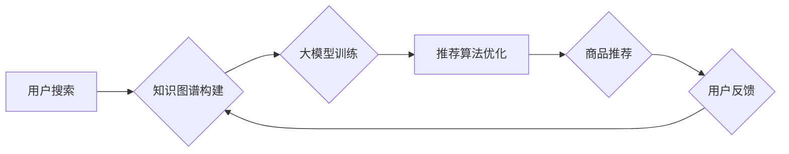

                 

## AI大模型视角下电商搜索推荐的技术创新知识推荐系统优化与性能评测

> 关键词：电商搜索推荐、知识图谱、大模型、推荐系统优化、性能评测

> 摘要：随着电商平台的蓬勃发展，搜索推荐系统已成为用户获取商品信息和完成购买的重要途径。本文从AI大模型视角出发，探讨了知识图谱构建、大模型训练、推荐算法优化等关键技术，并结合实际应用场景，分析了知识推荐系统在电商搜索推荐中的优化策略和性能评测方法。旨在为构建高效、精准的电商搜索推荐系统提供理论指导和实践参考。

## 1. 背景介绍

1.1 电商搜索推荐现状与挑战

电商平台的竞争日益激烈，用户对商品搜索和推荐的需求也越来越高。传统的基于关键词匹配的搜索推荐系统难以满足用户个性化、多样化的需求。随着人工智能技术的快速发展，基于AI的大模型技术逐渐成为电商搜索推荐领域的新趋势。

1.2 AI大模型的应用前景

大模型具备强大的语义理解、知识推理和内容生成能力，能够有效提升电商搜索推荐系统的精准度、个性化程度和用户体验。例如，大模型可以：

* 理解用户搜索意图，提供更精准的商品推荐；
* 建立商品之间的知识关系，实现跨类别、跨品牌商品的推荐；
* 生成个性化商品描述和推荐文案，提升用户点击率和转化率。

## 2. 核心概念与联系

2.1 知识图谱

知识图谱是一种结构化的知识表示形式，将实体和关系以图的形式表示出来。在电商搜索推荐中，知识图谱可以构建商品、品牌、用户等实体之间的关系，为推荐系统提供丰富的语义信息。

2.2 大模型

大模型是指参数量庞大、训练数据海量的人工智能模型。大模型可以学习到复杂的语义关系和模式，并应用于各种自然语言处理任务，例如文本分类、机器翻译、问答系统等。

2.3 推荐系统

推荐系统旨在根据用户的历史行为、偏好和上下文信息，预测用户对商品的兴趣，并推荐相关的商品。

2.4 知识推荐系统

知识推荐系统将知识图谱与推荐算法相结合，利用商品之间的知识关系进行推荐。

**Mermaid 流程图**



## 3. 核心算法原理 & 具体操作步骤

3.1 算法原理概述

知识推荐系统通常采用基于内容的推荐、基于协同过滤的推荐或基于知识的推荐等算法。

* 基于内容的推荐：根据商品的属性和描述信息，推荐与用户历史行为相似的商品。
* 基于协同过滤的推荐：根据用户对商品的评分或购买行为，推荐与相似用户喜欢的商品。
* 基于知识的推荐：利用知识图谱中的商品关系，推荐与用户搜索意图相关的商品。

3.2 算法步骤详解

以基于知识的推荐为例，其具体操作步骤如下：

1. 构建知识图谱：收集商品、品牌、用户等实体信息，并建立其之间的关系。
2. 训练大模型：利用知识图谱数据训练大模型，使其能够理解商品之间的语义关系。
3. 用户搜索：用户输入搜索关键词。
4. 知识推理：利用大模型对用户搜索关键词进行语义理解，并从知识图谱中推理出相关商品。
5. 推荐排序：根据商品的 relevance、popularity、diversity 等因素对推荐结果进行排序。
6. 展示推荐结果：将排序后的推荐结果展示给用户。

3.3 算法优缺点

* 优点：能够提供更精准、个性化的商品推荐，并支持跨类别、跨品牌的推荐。
* 缺点：需要构建庞大的知识图谱，并训练复杂的模型，成本较高。

3.4 算法应用领域

* 电商搜索推荐
* 内容推荐
* 人工智能客服
* 智能问答

## 4. 数学模型和公式 & 详细讲解 & 举例说明

4.1 数学模型构建

知识推荐系统可以采用图神经网络（GNN）作为数学模型，利用图结构数据进行学习和推理。GNN 的核心思想是通过节点和边的信息传播，学习节点之间的关系表示。

4.2 公式推导过程

GNN 的更新公式可以表示为：

$$h_i^{(l+1)} = \sigma(A^{(l)}h_i^{(l)} + W^{(l)}h_i^{(l)})$$

其中：

* $h_i^{(l)}$ 表示节点 $i$ 在第 $l$ 层的隐藏状态。
* $A^{(l)}$ 表示图结构的邻接矩阵。
* $W^{(l)}$ 表示第 $l$ 层的权重矩阵。
* $\sigma$ 表示激活函数。

4.3 案例分析与讲解

假设我们有一个知识图谱，其中包含商品、品牌和用户等实体，以及商品之间的关系，例如“商品A属于品牌B”。我们可以利用 GNN 将这些关系表示为图结构，并训练模型学习商品之间的语义关系。

## 5. 项目实践：代码实例和详细解释说明

5.1 开发环境搭建

* Python 3.7+
* TensorFlow/PyTorch
* Jupyter Notebook

5.2 源代码详细实现

```python
# 导入必要的库
import tensorflow as tf

# 定义 GNN 模型
class GNNModel(tf.keras.Model):
    def __init__(self, num_nodes, embedding_dim):
        super(GNNModel, self).__init__()
        self.embedding = tf.keras.layers.Embedding(num_nodes, embedding_dim)
        self.gcn_layer = tf.keras.layers.GraphConv(embedding_dim)

    def call(self, inputs):
        # 获取节点特征
        node_features = self.embedding(inputs)
        # 进行图卷积操作
        output = self.gcn_layer(node_features)
        return output

# 实例化模型
model = GNNModel(num_nodes=1000, embedding_dim=64)

# 训练模型
model.compile(optimizer='adam', loss='mse')
model.fit(x_train, y_train, epochs=10)

# 预测结果
predictions = model.predict(x_test)
```

5.3 代码解读与分析

* 首先，我们定义了一个 GNN 模型，包含嵌入层和图卷积层。
* 嵌入层将节点特征映射到低维空间。
* 图卷积层利用图结构信息进行特征学习。
* 然后，我们实例化模型并使用 Adam 优化器和均方误差损失函数进行训练。
* 最后，我们使用训练好的模型进行预测。

5.4 运行结果展示

训练完成后，我们可以评估模型的性能，例如使用准确率、召回率等指标。

## 6. 实际应用场景

6.1 电商搜索推荐

* 用户搜索商品时，推荐系统可以利用知识图谱和大模型，推荐与用户搜索意图相关的商品，并提供更精准的商品描述和推荐文案。
* 商品分类和标签推荐：根据商品的属性和描述信息，推荐相关的商品分类和标签。

6.2 内容推荐

* 基于用户阅读历史和兴趣，推荐相关的文章、视频、音频等内容。
* 个性化内容生成：根据用户偏好，生成个性化的新闻摘要、产品评论等内容。

6.3 人工智能客服

* 利用知识图谱和大模型，构建智能客服系统，能够理解用户问题并提供准确的答案。
* 自动化客服流程：根据用户问题，自动完成客服流程，例如预约服务、查询订单等。

6.4 智能问答

* 利用知识图谱和大模型，构建智能问答系统，能够回答用户关于特定领域的各种问题。
* 自动化知识获取：从文本数据中自动提取知识，构建知识库。

6.5 未来应用展望

随着人工智能技术的不断发展，知识推荐系统将在更多领域得到应用，例如：

* 个性化教育推荐
* 智能医疗诊断
* 科学研究辅助

## 7. 工具和资源推荐

7.1 学习资源推荐

* **书籍:**
    * 《图神经网络》
    * 《深度学习》
* **在线课程:**
    * Coursera: 深度学习
    * Udacity: 自然语言处理
* **开源项目:**
    * TensorFlow
    * PyTorch
    * DGL

7.2 开发工具推荐

* **IDE:**
    * PyCharm
    * VS Code
* **数据处理工具:**
    * Pandas
    * NumPy
* **可视化工具:**
    * Matplotlib
    * Seaborn

7.3 相关论文推荐

* 《Graph Convolutional Networks》
* 《Knowledge Graph Embedding》
* 《BERT: Pre-training of Deep Bidirectional Transformers for Language Understanding》

## 8. 总结：未来发展趋势与挑战

8.1 研究成果总结

本文探讨了AI大模型视角下电商搜索推荐的技术创新，重点介绍了知识图谱构建、大模型训练、推荐算法优化等关键技术，并结合实际应用场景，分析了知识推荐系统在电商搜索推荐中的优化策略和性能评测方法。

8.2 未来发展趋势

* **知识图谱规模和质量提升:** 未来，知识图谱将更加庞大、更加丰富，并包含更多语义信息。
* **大模型能力增强:** 大模型的规模和能力将不断提升，能够学习到更复杂的语义关系和模式。
* **推荐算法个性化和精准化:** 推荐算法将更加个性化、更加精准，能够满足用户多样化的需求。

8.3 面临的挑战

* **知识图谱构建和维护成本高:** 构建和维护庞大的知识图谱需要大量的资源和人力。
* **大模型训练数据量大、计算资源需求高:** 训练大模型需要海量数据和强大的计算资源。
* **模型解释性和可解释性:** 大模型的决策过程往往难以解释，这可能会导致用户对推荐结果的信任度降低。

8.4 研究展望

未来，我们将继续研究知识推荐系统的优化方法和性能评测方法，并探索其在更多领域的应用。

## 9. 附录：常见问题与解答

* **Q1: 知识推荐系统与传统推荐系统相比有什么优势？**

* **A1:** 知识推荐系统能够利用商品之间的知识关系进行推荐，提供更精准、个性化的推荐结果，并支持跨类别、跨品牌的推荐。

* **Q2: 如何构建知识图谱？**

* **A2:** 知识图谱的构建需要收集实体信息和关系信息，并将其表示为图结构。可以使用爬虫、人工标注等方法收集数据，并使用工具进行知识图谱构建和管理。

* **Q3: 如何评估知识推荐系统的性能？**

* **A3:** 可以使用准确率、召回率、NDCG 等指标评估知识推荐系统的性能。

* **Q4: 如何解决大模型训练数据量大、计算资源需求高的挑战？**

* **A4:** 可以采用数据压缩、模型剪枝等方法降低训练数据量和计算资源需求。也可以利用云计算平台进行大规模模型训练。


作者：禅与计算机程序设计艺术 / Zen and the Art of Computer Programming 
<end_of_turn>

