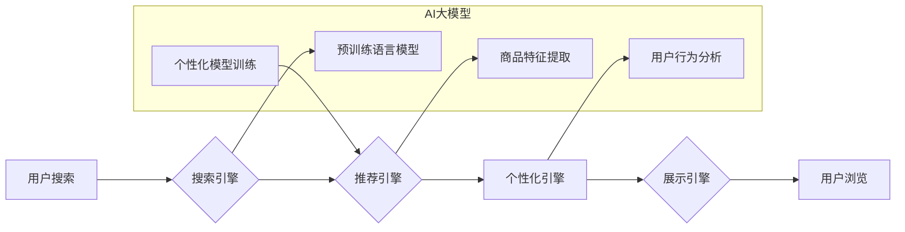

                 

## AI大模型赋能电商搜索推荐的业务创新思维培训体系

> 关键词：AI大模型、电商搜索、推荐系统、自然语言处理、深度学习、Transformer、业务创新

### 1. 背景介绍

电子商务行业竞争日益激烈，用户需求日益多元化，如何精准匹配用户需求，提升用户体验，成为电商平台的核心竞争力。传统的电商搜索推荐系统主要依赖于基于规则的算法和基于协同过滤的算法，存在着数据稀疏、冷启动问题等局限性。近年来，随着深度学习技术的快速发展，特别是Transformer模型的出现，AI大模型在电商搜索推荐领域展现出巨大的潜力。

AI大模型，是指参数规模庞大、训练数据海量的人工智能模型，具备强大的泛化能力和学习能力。它能够从海量数据中学习用户行为、商品特征、文本语义等复杂关系，为电商搜索推荐提供更精准、更个性化的服务。

### 2. 核心概念与联系

#### 2.1  电商搜索推荐系统

电商搜索推荐系统是帮助用户快速找到所需商品的系统，它通常由以下几个模块组成：

* **搜索引擎:** 处理用户搜索词，并返回相关商品列表。
* **推荐引擎:** 基于用户行为、商品特征等信息，推荐用户可能感兴趣的商品。
* **个性化引擎:** 根据用户的历史行为、偏好等信息，对搜索结果和推荐结果进行个性化定制。
* **展示引擎:** 将搜索结果和推荐结果以用户友好的方式展示给用户。

#### 2.2  AI大模型

AI大模型是指参数规模庞大、训练数据海量的人工智能模型，它能够通过深度学习从海量数据中学习复杂的模式和关系。常见的AI大模型包括：

* **BERT:** 基于Transformer架构的预训练语言模型，擅长理解文本语义。
* **GPT:** 基于Transformer架构的文本生成模型，擅长生成自然语言文本。
* **DALL-E:** 基于Transformer架构的图像生成模型，能够根据文本描述生成图像。

#### 2.3  AI大模型赋能电商搜索推荐

AI大模型能够通过以下方式赋能电商搜索推荐系统：

* **提升搜索结果的准确性:** AI大模型能够理解用户搜索词的语义，并返回更相关的商品结果。
* **个性化推荐:** AI大模型能够根据用户的历史行为、偏好等信息，推荐更符合用户需求的商品。
* **智能问答:** AI大模型能够理解用户的自然语言问题，并提供准确的商品信息。
* **内容生成:** AI大模型能够生成商品描述、促销文案等内容，提升用户体验。

**Mermaid 流程图**



### 3. 核心算法原理 & 具体操作步骤

#### 3.1  算法原理概述

AI大模型赋能电商搜索推荐的核心算法主要包括：

* **预训练语言模型:** BERT等模型能够学习文本语义，提升搜索结果的准确性。
* **商品特征提取:** 利用深度学习模型提取商品的文本特征、图像特征等，构建商品的语义向量。
* **用户行为分析:** 分析用户的浏览历史、购买记录、评分等行为数据，构建用户的兴趣模型。
* **个性化推荐算法:** 基于用户兴趣模型和商品特征，推荐个性化的商品列表。

#### 3.2  算法步骤详解

1. **数据预处理:** 收集电商平台的海量数据，包括商品信息、用户行为数据、文本评论等，并进行清洗、格式化等预处理工作。
2. **预训练语言模型训练:** 利用预训练语言模型BERT等，对商品描述、用户评论等文本数据进行训练，学习文本语义和关系。
3. **商品特征提取:** 利用深度学习模型，提取商品的文本特征、图像特征等，构建商品的语义向量。
4. **用户行为分析:** 分析用户的浏览历史、购买记录、评分等行为数据，构建用户的兴趣模型。
5. **个性化推荐算法训练:** 基于用户兴趣模型和商品特征，训练个性化推荐算法，例如基于协同过滤的算法、基于内容的算法、深度学习推荐算法等。
6. **推荐结果展示:** 将推荐结果以用户友好的方式展示给用户，并根据用户反馈进行模型优化。

#### 3.3  算法优缺点

**优点:**

* 能够从海量数据中学习复杂的模式和关系，提升推荐精准度。
* 具备强大的泛化能力，能够适应不同的电商场景。
* 可以个性化推荐商品，提升用户体验。

**缺点:**

* 训练成本高，需要大量的计算资源和数据。
* 模型解释性差，难以理解模型的决策过程。
* 存在数据偏差和公平性问题。

#### 3.4  算法应用领域

AI大模型赋能电商搜索推荐的算法应用领域广泛，包括：

* **商品搜索:** 提升搜索结果的准确性和相关性。
* **商品推荐:** 个性化推荐商品，提升用户转化率。
* **用户画像:** 分析用户行为，构建用户画像。
* **内容生成:** 生成商品描述、促销文案等内容。

### 4. 数学模型和公式 & 详细讲解 & 举例说明

#### 4.1  数学模型构建

电商搜索推荐系统通常采用基于概率的数学模型，例如：

* **贝叶斯网络:** 用于表示商品和用户之间的关系，并计算商品推荐的概率。
* **隐语义模型:** 用于学习用户和商品之间的隐含语义关系，并预测用户对商品的评分或购买意愿。
* **深度神经网络:** 用于学习更复杂的特征和关系，并进行个性化推荐。

#### 4.2  公式推导过程

例如，基于协同过滤的推荐算法，可以使用以下公式计算用户对商品的评分预测:

$$
\hat{r}_{u,i} = \bar{r}_u + \frac{\sum_{j \in N(u)} (r_{u,j} - \bar{r}_u) \cdot s_{i,j}}{\sum_{j \in N(u)} s_{i,j}^2}
$$

其中：

* $\hat{r}_{u,i}$: 用户 $u$ 对商品 $i$ 的评分预测
* $\bar{r}_u$: 用户 $u$ 的平均评分
* $r_{u,j}$: 用户 $u$ 对商品 $j$ 的真实评分
* $N(u)$: 用户 $u$ 评分过的商品集合
* $s_{i,j}$: 商品 $i$ 和商品 $j$ 之间的相似度

#### 4.3  案例分析与讲解

假设用户 $A$ 评分过商品 $B$ 和 $C$，评分分别为 4 和 5，商品 $B$ 和 $D$ 的相似度为 0.8，商品 $C$ 和 $D$ 的相似度为 0.6。则可以使用上述公式计算用户 $A$ 对商品 $D$ 的评分预测。

### 5. 项目实践：代码实例和详细解释说明

#### 5.1  开发环境搭建

* **操作系统:** Linux 或 macOS
* **编程语言:** Python
* **深度学习框架:** TensorFlow 或 PyTorch
* **其他工具:** Git、Jupyter Notebook

#### 5.2  源代码详细实现

以下是一个使用 TensorFlow 实现基于协同过滤的推荐算法的代码示例：

```python
import tensorflow as tf

# 定义用户-商品评分矩阵
ratings = tf.constant([
    [0, 5, 0, 4],
    [0, 0, 3, 0],
    [4, 0, 0, 0],
    [0, 0, 0, 0]
])

# 定义用户和商品的嵌入层
user_embeddings = tf.keras.layers.Embedding(input_dim=4, output_dim=16)
item_embeddings = tf.keras.layers.Embedding(input_dim=4, output_dim=16)

# 定义预测层
prediction_layer = tf.keras.layers.Dense(1)

# 定义模型
model = tf.keras.Sequential([
    user_embeddings,
    item_embeddings,
    tf.keras.layers.Multiply(),
    prediction_layer
])

# 编译模型
model.compile(optimizer='adam', loss='mse')

# 训练模型
model.fit(ratings, ratings, epochs=10)

# 预测用户对商品的评分
predictions = model.predict(ratings)
```

#### 5.3  代码解读与分析

* 代码首先定义了用户-商品评分矩阵。
* 然后定义了用户和商品的嵌入层，将用户和商品的ID映射到低维向量空间。
* 接着定义了预测层，将用户和商品的嵌入向量相乘，得到预测评分。
* 最后定义了模型，并使用 Adam 优化器和均方误差损失函数进行训练。

#### 5.4  运行结果展示

训练完成后，模型能够预测用户对商品的评分。

### 6. 实际应用场景

AI大模型赋能电商搜索推荐的应用场景广泛，例如：

* **个性化商品推荐:** 根据用户的浏览历史、购买记录等信息，推荐个性化的商品列表。
* **智能搜索:** 理解用户的搜索词语义，返回更相关的商品结果。
* **商品分类:** 利用AI大模型学习商品特征，自动进行商品分类。
* **内容生成:** 生成商品描述、促销文案等内容，提升用户体验。

#### 6.4  未来应用展望

未来，AI大模型在电商搜索推荐领域将有更广泛的应用，例如：

* **多模态推荐:** 结合文本、图像、视频等多模态数据进行推荐。
* **实时推荐:** 基于用户的实时行为，进行动态的商品推荐。
* **跨平台推荐:** 将用户行为数据整合，实现跨平台的个性化推荐。

### 7. 工具和资源推荐

#### 7.1  学习资源推荐

* **书籍:**
    * 《深度学习》
    * 《自然语言处理》
    * 《推荐系统》
* **在线课程:**
    * Coursera: 深度学习
    * Udacity: 自然语言处理
    * edX: 推荐系统

#### 7.2  开发工具推荐

* **深度学习框架:** TensorFlow, PyTorch
* **数据处理工具:** Pandas, NumPy
* **云计算平台:** AWS, Azure, GCP

#### 7.3  相关论文推荐

* BERT: Pre-training of Deep Bidirectional Transformers for Language Understanding
* GPT: Attention Is All You Need
* DALL-E: Zero-Shot Text-to-Image Generation

### 8. 总结：未来发展趋势与挑战

#### 8.1  研究成果总结

AI大模型赋能电商搜索推荐取得了显著成果，提升了推荐精准度和用户体验。

#### 8.2  未来发展趋势

未来，AI大模型在电商搜索推荐领域将朝着以下方向发展:

* **模型规模更大、能力更强:** 训练更大规模的AI大模型，提升模型的泛化能力和学习能力。
* **多模态融合:** 结合文本、图像、视频等多模态数据进行推荐，提升推荐的丰富性和准确性。
* **个性化定制:** 基于用户的个性化需求，提供更精准的商品推荐和服务。

#### 8.3  面临的挑战

AI大模型在电商搜索推荐领域也面临着一些挑战:

* **数据安全和隐私:** 如何保护用户数据安全和隐私，是需要认真考虑的问题。
* **模型解释性:** AI大模型的决策过程难以理解，需要研究如何提升模型的解释性。
* **公平性:** AI大模型可能存在数据偏差和公平性问题，需要进行公平性评估和调优。

#### 8.4  研究展望

未来，需要继续研究AI大模型在电商搜索推荐领域的应用，探索更有效的算法和模型架构，并解决数据安全、模型解释性和公平性等挑战。

### 9. 附录：常见问题与解答

* **Q1: AI大模型训练成本高，如何降低成本?**

A1: 可以采用模型压缩、知识蒸馏等技术，降低模型参数规模和训练成本。

* **Q2: 如何评估AI大模型的推荐效果?**

A2: 可以使用点击率、转化率、用户满意度等指标来评估AI大模型的推荐效果。

* **Q3: 如何解决AI大模型的公平性问题?**

A3: 可以采用数据预处理、模型调优等方法，减少数据偏差和公平性问题。


作者：禅与计算机程序设计艺术 / Zen and the Art of Computer Programming 
<end_of_turn>

