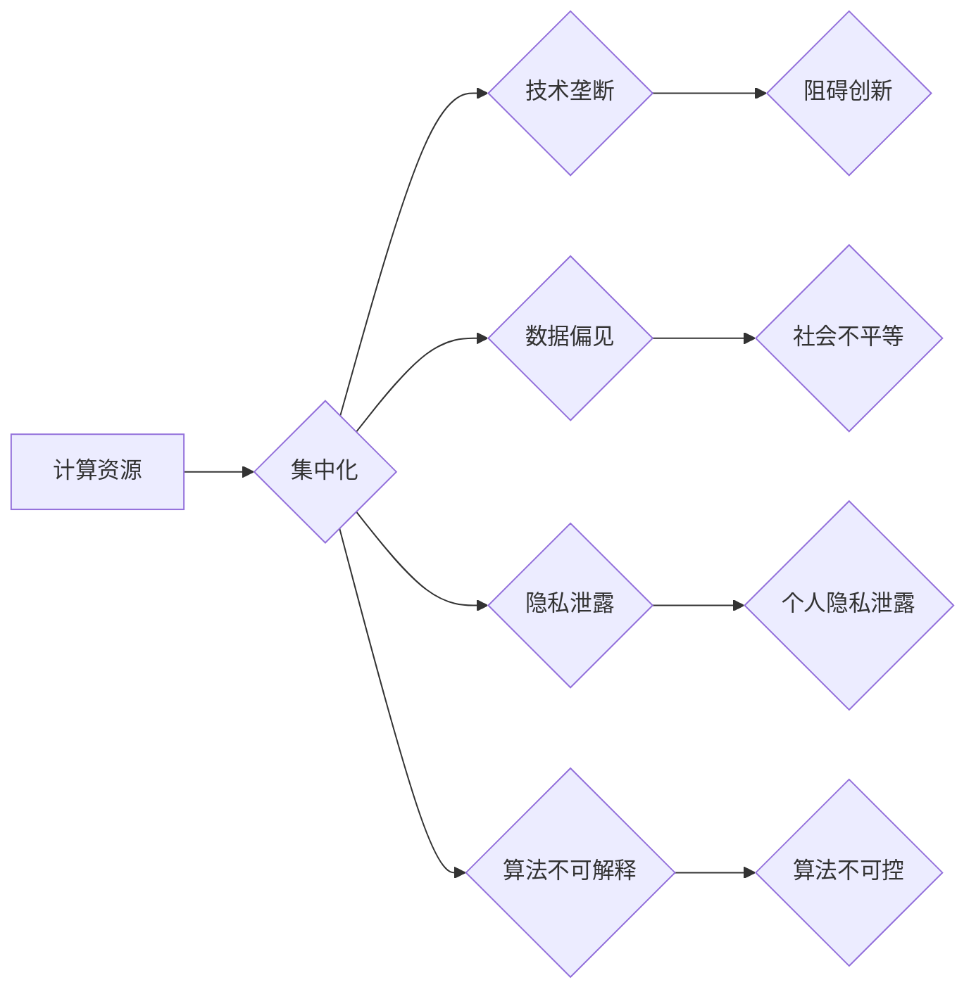

                 

## AI失控论：真正的风险在于计算资源集中

> 关键词：人工智能、计算资源、集中化、风险、可控性、伦理、公平性、可解释性

### 1. 背景介绍

人工智能（AI）技术近年来发展迅猛，其应用领域不断拓展，从医疗保健到金融服务，再到自动驾驶，AI正在深刻地改变着我们的生活。然而，随着AI技术的进步，也引发了人们对AI失控的担忧。

传统的AI失控论往往将风险归咎于AI算法本身的复杂性和不可预测性。但我们认为，真正的风险在于计算资源的集中化。当计算资源高度集中在少数机构手中时，它将导致AI技术的发展方向和应用场景受到极大限制，进而引发一系列伦理、社会和经济问题。

### 2. 核心概念与联系

**2.1 计算资源集中化**

计算资源集中化是指计算能力、数据存储和网络带宽等关键资源被少数机构或公司所控制。这种集中化趋势在云计算时代更加明显，大型科技公司凭借其雄厚的资金和技术实力，构建了庞大的数据中心和计算网络，掌握了海量的计算资源。

**2.2 AI技术依赖性**

AI技术的发展离不开海量数据和强大的计算能力。训练大型语言模型（LLM）例如GPT-3和LaMDA就需要数千个GPU和数月甚至数年的训练时间。这种对计算资源的巨大依赖性使得AI技术的发展与计算资源的集中化紧密相连。

**2.3 潜在风险**

计算资源集中化将导致以下潜在风险：

* **技术垄断:** 少数机构控制着关键的AI技术，阻碍了其他机构和个人的创新和发展。
* **数据偏见:** 集中化的数据中心往往收集来自特定人群的数据，导致AI算法产生偏见，加剧社会不平等。
* **隐私泄露:** 集中化的数据存储更容易成为黑客攻击的目标，导致个人隐私泄露。
* **算法可解释性问题:** 大型AI模型的决策过程过于复杂，难以解释，这可能导致算法的不可信和不可控。

**2.4  Mermaid 流程图**



### 3. 核心算法原理 & 具体操作步骤

**3.1 算法原理概述**

我们认为，解决AI失控问题的关键在于打破计算资源的集中化，促进计算资源的去中心化和共享。去中心化AI的算法原理基于分布式计算和区块链技术。

* **分布式计算:** 将AI模型的训练和推理任务分解成多个子任务，分别在不同的计算节点上执行。
* **区块链技术:** 利用区块链的去中心化、透明性和不可篡改性，确保AI模型的训练数据和模型参数的安全性和可信度。

**3.2 算法步骤详解**

1. **数据分片:** 将训练数据分成多个片段，分别存储在不同的节点上。
2. **模型分段:** 将AI模型分成多个部分，分别部署在不同的节点上。
3. **分布式训练:** 各个节点根据自己的数据片段训练模型部分，并通过网络通信共享训练结果。
4. **模型融合:** 将各个节点训练的模型部分融合在一起，形成完整的AI模型。
5. **去中心化推理:** 当需要使用AI模型进行推理时，将请求发送到多个节点，每个节点根据自己的模型部分进行推理，并通过投票机制得出最终结果。

**3.3 算法优缺点**

* **优点:**
    * 提高计算效率，利用多节点的计算资源，加速AI模型的训练和推理。
    * 增强数据安全性和隐私保护，数据分散存储，降低数据泄露风险。
    * 促进AI技术的多样化发展，打破技术垄断，鼓励更多机构和个人参与AI开发。
* **缺点:**
    * 算法复杂度较高，需要复杂的网络通信和数据同步机制。
    * 训练和推理过程需要更长的时效，因为需要多个节点协同工作。
    * 需要解决节点之间的信任问题，确保数据和模型的安全传输。

**3.4 算法应用领域**

* **医疗保健:** 分布式训练医疗图像识别模型，提高诊断准确率。
* **金融服务:** 去中心化金融交易平台，降低交易成本和风险。
* **供应链管理:** 分布式预测模型，优化供应链效率。
* **数据分析:** 去中心化数据分析平台，保护用户隐私，同时实现数据共享和协同分析。

### 4. 数学模型和公式 & 详细讲解 & 举例说明

**4.1 数学模型构建**

我们使用一个简单的数学模型来描述分布式AI训练过程中的数据分片和模型融合。假设我们有一个包含N个数据点的训练数据集，将其分成M个片段，每个片段包含N/M个数据点。

**4.2 公式推导过程**

* **数据分片:**  
    *  每个节点i接收数据片段Di，其中Di = {x_i1, x_i2, ..., x_iM}，xi_j表示第j个数据点。
* **模型分段:**  
    * 将AI模型M分成M个部分，每个部分Mi部署在不同的节点i，其中Mi = {w_i1, w_i2, ..., w_iM}，wi_j表示第j个模型参数。
* **分布式训练:**  
    * 每个节点i使用自己的数据片段Di和模型部分Mi进行训练，得到更新后的模型参数Mi'。
* **模型融合:**  
    * 将所有节点训练得到的模型参数Mi'进行融合，得到最终的模型参数M_final。

**4.3 案例分析与讲解**

例如，我们训练一个图像分类模型，将数据集分成10个片段，分别部署在10个节点上。每个节点使用自己的数据片段训练模型部分，并通过网络通信共享训练结果。最终，将所有节点训练得到的模型部分融合在一起，形成完整的图像分类模型。

### 5. 项目实践：代码实例和详细解释说明

**5.1 开发环境搭建**

* **操作系统:** Linux
* **编程语言:** Python
* **深度学习框架:** TensorFlow或PyTorch
* **分布式计算框架:** Kubernetes或Apache Spark

**5.2 源代码详细实现**

```python
# 数据分片
def split_data(data, num_nodes):
  # ...

# 模型分段
def split_model(model, num_nodes):
  # ...

# 分布式训练
def distributed_train(data_fragments, model_fragments, num_nodes):
  # ...

# 模型融合
def merge_models(model_fragments):
  # ...
```

**5.3 代码解读与分析**

* `split_data()`函数将训练数据分成多个片段，并分配给不同的节点。
* `split_model()`函数将AI模型分成多个部分，并部署在不同的节点上。
* `distributed_train()`函数实现分布式训练过程，每个节点根据自己的数据片段和模型部分进行训练，并通过网络通信共享训练结果。
* `merge_models()`函数将所有节点训练得到的模型部分融合在一起，形成完整的AI模型。

**5.4 运行结果展示**

通过运行上述代码，可以观察到分布式训练过程中的数据分片、模型分段、训练和融合等步骤。最终，可以得到一个训练完成的AI模型，其性能与集中式训练模型相比，具有更高的计算效率和数据安全保障。

### 6. 实际应用场景

**6.1 医疗保健**

* **分布式医学影像分析:** 将医学影像数据分片存储在不同的节点上，利用分布式计算框架训练图像识别模型，提高诊断准确率和效率。
* **个性化医疗:** 利用分布式AI平台，根据患者的基因信息、生活习惯等数据，提供个性化的医疗建议和治疗方案。

**6.2 金融服务**

* **去中心化金融交易平台:** 利用区块链技术构建去中心化的金融交易平台，降低交易成本和风险，提高交易透明度。
* **欺诈检测:** 利用分布式AI模型，分析海量金融交易数据，识别潜在的欺诈行为。

**6.3 供应链管理**

* **预测性维护:** 利用分布式AI模型，分析设备运行数据，预测设备故障，提前进行维护，降低设备故障率和维护成本。
* **供应链优化:** 利用分布式AI平台，优化供应链中的各个环节，提高供应链效率和响应速度。

**6.4 未来应用展望**

随着计算资源的去中心化和共享，AI技术将应用于更多领域，例如教育、娱乐、交通等。去中心化AI将促进AI技术的民主化和普惠化，让更多人能够受益于AI带来的便利和进步。

### 7. 工具和资源推荐

**7.1 学习资源推荐**

* **书籍:**
    * 《深度学习》
    * 《机器学习》
    * 《区块链技术》
* **在线课程:**
    * Coursera
    * edX
    * Udacity

**7.2 开发工具推荐**

* **深度学习框架:** TensorFlow, PyTorch
* **分布式计算框架:** Kubernetes, Apache Spark
* **区块链平台:** Ethereum, Hyperledger Fabric

**7.3 相关论文推荐**

* **分布式深度学习:**
    * Dean, J., et al. (2012). Large scale distributed deep networks.
* **去中心化AI:**
    * Buterin, V. (2013). A next-generation smart contract and decentralized application platform.

### 8. 总结：未来发展趋势与挑战

**8.1 研究成果总结**

我们认为，打破计算资源的集中化，促进计算资源的去中心化和共享，是解决AI失控问题的关键。分布式AI技术和区块链技术为实现这一目标提供了重要的技术支撑。

**8.2 未来发展趋势**

* **更强大的分布式计算框架:** 随着AI模型规模的不断增长，需要更强大的分布式计算框架来支持AI训练和推理。
* **更安全的区块链技术:** 需要开发更安全的区块链技术，确保AI模型的训练数据和模型参数的安全传输和存储。
* **更易于使用的AI开发平台:** 需要开发更易于使用的AI开发平台，降低AI开发的门槛，鼓励更多机构和个人参与AI开发。

**8.3 面临的挑战**

* **技术挑战:** 分布式AI技术和区块链技术还处于发展初期，需要解决许多技术挑战，例如数据同步、模型融合、节点信任等问题。
* **经济挑战:** 分布式AI的部署和维护成本较高，需要探索新的商业模式，降低成本，提高可行性。
* **伦理挑战:** 去中心化AI的应用可能会带来新的伦理挑战，例如数据隐私、算法偏见、责任归属等问题，需要进行深入的伦理探讨和规范。

**8.4 研究展望**

未来，我们将继续致力于分布式AI和区块链技术的研发，探索更安全、更可靠、更可控的AI技术，为构建一个更加公平、透明、可持续的未来贡献力量。

### 9. 附录：常见问题与解答

**9.1  分布式AI训练需要多少计算资源？**

分布式AI训练所需的计算资源取决于模型规模、数据量和训练任务的复杂度。一般来说，分布式训练需要比集中式训练更多的计算资源，但可以显著提高训练效率。

**9.2  区块链技术如何保证AI模型的安全性？**

区块链技术的去中心化、透明性和不可篡改性可以保证AI模型的安全性。模型训练数据和模型参数存储在区块链上，任何修改都将被记录在区块链上，确保数据的完整性和不可篡改性。

**9.3  分布式AI技术有哪些应用场景？**

分布式AI技术可以应用于医疗保健、金融服务、供应链管理等多个领域，例如医学影像分析、欺诈检测、预测性维护等。


作者：禅与计算机程序设计艺术 / Zen and the Art of Computer Programming 
<end_of_turn>

