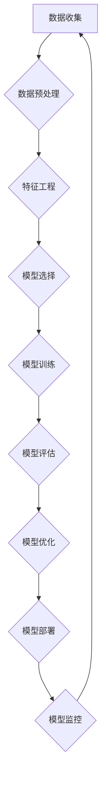

                 

## AI开发的标准化流程：Lepton AI的最佳实践

> 关键词：AI开发流程，Lepton AI，标准化，最佳实践，机器学习，深度学习，模型部署

> 摘要：本文介绍了Lepton AI在AI开发领域推崇的标准化流程，旨在帮助开发者更高效、更可靠地构建和部署AI解决方案。该流程涵盖了从数据收集到模型部署的全生命周期，并强调了每个阶段的关键步骤和最佳实践，包括数据预处理、模型选择、模型训练、模型评估、模型优化和模型部署。通过遵循Lepton AI的标准化流程，开发者可以提高开发效率，降低开发成本，并确保AI解决方案的质量和可维护性。

## 1. 背景介绍

在当今数据爆炸的时代，人工智能（AI）技术正在各个领域迅速发展，并为我们带来了前所未有的机遇。然而，AI开发是一个复杂且充满挑战的过程，需要涉及多个学科的知识和技能。缺乏标准化的开发流程会导致开发效率低下、模型质量参差不齐，甚至难以维护和部署。

Lepton AI作为一家领先的AI解决方案提供商，深知标准化流程的重要性。我们积累了丰富的AI开发经验，并总结出一套成熟的标准化流程，旨在帮助开发者更高效、更可靠地构建和部署AI解决方案。

## 2. 核心概念与联系

Lepton AI的AI开发标准化流程基于“敏捷开发”和“持续集成持续交付”（CI/CD）的理念，强调迭代开发、快速反馈和持续改进。

**流程图：**

**核心概念：**

* **数据驱动:** AI模型的性能直接取决于训练数据的质量和数量。Lepton AI强调数据收集、清洗、预处理和特征工程的重要性。
* **模型选择:** 选择合适的模型架构是关键，Lepton AI提供多种模型选择工具和建议，帮助开发者选择最适合其任务的模型。
* **迭代开发:** Lepton AI采用迭代开发模式，不断测试和改进模型，以提高模型性能和可靠性。
* **持续集成持续交付:** Lepton AI采用CI/CD流程，自动化构建、测试和部署模型，提高开发效率和部署速度。

## 3. 核心算法原理 & 具体操作步骤

### 3.1  算法原理概述

Lepton AI支持多种主流机器学习和深度学习算法，包括：

* **线性回归:** 用于预测连续值，假设数据服从线性关系。
* **逻辑回归:** 用于分类问题，预测样本属于某个类别或不属于该类别的概率。
* **决策树:** 用于分类和回归问题，通过一系列规则将数据分类或预测值。
* **支持向量机 (SVM):** 用于分类和回归问题，寻找最佳的分隔超平面将数据分类。
* **神经网络:** 用于复杂模式识别，由多个层的神经元组成，通过学习权重和偏差进行预测。

### 3.2  算法步骤详解

Lepton AI提供了一套标准化的算法开发流程，包括以下步骤：

1. **数据收集和预处理:** 收集相关数据，并进行清洗、转换和特征工程，以确保数据质量和模型训练效果。
2. **模型选择:** 根据任务需求和数据特点，选择合适的模型架构。
3. **模型训练:** 使用训练数据训练模型，并调整模型参数以优化模型性能。
4. **模型评估:** 使用测试数据评估模型性能，并选择最佳模型。
5. **模型优化:** 通过调整模型参数、增加训练数据或改进模型架构等方式，进一步优化模型性能。
6. **模型部署:** 将训练好的模型部署到生产环境，并进行监控和维护。

### 3.3  算法优缺点

每个算法都有其独特的优缺点，Lepton AI提供了一系列工具和资源，帮助开发者选择最适合其任务的算法。

### 3.4  算法应用领域

Lepton AI的算法应用于各个领域，包括：

* **图像识别:** 人脸识别、物体检测、图像分类等。
* **自然语言处理:** 文本分类、情感分析、机器翻译等。
* **语音识别:** 语音转文本、语音助手等。
* **推荐系统:** 商品推荐、内容推荐等。
* **预测分析:** 销售预测、风险评估等。

## 4. 数学模型和公式 & 详细讲解 & 举例说明

### 4.1  数学模型构建

Lepton AI的AI开发流程基于数学模型，例如线性回归模型、逻辑回归模型、神经网络模型等。这些模型通过数学公式来描述数据之间的关系，并通过训练过程来学习模型参数。

### 4.2  公式推导过程

Lepton AI提供了一系列工具和资源，帮助开发者理解和推导数学模型的公式。例如，我们可以使用线性代数、微积分等数学工具来推导线性回归模型的损失函数和梯度下降算法。

### 4.3  案例分析与讲解

Lepton AI提供了一些案例分析和讲解，帮助开发者理解如何构建和应用数学模型。例如，我们可以通过案例分析来了解如何使用线性回归模型预测房价，或者如何使用神经网络模型进行图像分类。

## 5. 项目实践：代码实例和详细解释说明

### 5.1  开发环境搭建

Lepton AI提供了一套标准化的开发环境，包括必要的软件库和工具。开发者可以根据自己的需求选择不同的开发环境，例如使用Python、TensorFlow、PyTorch等工具。

### 5.2  源代码详细实现

Lepton AI提供了一些开源代码示例，帮助开发者了解如何使用Lepton AI平台开发AI解决方案。这些代码示例涵盖了不同的AI任务和算法，并附带了详细的代码注释和解释。

### 5.3  代码解读与分析

Lepton AI提供了一些代码解读和分析，帮助开发者理解开源代码的实现原理和设计思路。

### 5.4  运行结果展示

Lepton AI提供了一些运行结果展示，帮助开发者了解模型的性能和效果。

## 6. 实际应用场景

Lepton AI的AI开发标准化流程已成功应用于多个实际场景，例如：

* **医疗诊断:** 使用AI模型辅助医生诊断疾病，提高诊断准确率。
* **金融风险控制:** 使用AI模型识别金融风险，降低金融机构的损失。
* **智能客服:** 使用AI模型构建智能客服系统，提高客户服务效率。

### 6.4  未来应用展望

Lepton AI将继续推动AI开发标准化流程的创新和发展，并将其应用于更多领域，例如：

* **自动驾驶:** 使用AI模型实现自动驾驶功能，提高交通安全和效率。
* **个性化教育:** 使用AI模型提供个性化的教育方案，提高学习效率。
* **智能制造:** 使用AI模型优化生产流程，提高生产效率和产品质量。

## 7. 工具和资源推荐

### 7.1  学习资源推荐

* **Lepton AI官方文档:** https://www.lepton.ai/docs
* **机器学习在线课程:** Coursera、edX、Udacity等平台提供丰富的机器学习在线课程。
* **深度学习书籍:** 《深度学习》、《动手学深度学习》等书籍是深度学习入门的好选择。

### 7.2  开发工具推荐

* **Python:** 广泛用于AI开发，拥有丰富的机器学习和深度学习库。
* **TensorFlow:** Google开发的开源深度学习框架。
* **PyTorch:** Facebook开发的开源深度学习框架。
* **Jupyter Notebook:** 用于交互式编程和数据可视化的工具。

### 7.3  相关论文推荐

* **《ImageNet Classification with Deep Convolutional Neural Networks》:** AlexNet模型的论文。
* **《Attention Is All You Need》:** Transformer模型的论文。
* **《BERT: Pre-training of Deep Bidirectional Transformers for Language Understanding》:** BERT模型的论文。

## 8. 总结：未来发展趋势与挑战

### 8.1  研究成果总结

Lepton AI的AI开发标准化流程取得了显著的成果，帮助开发者更高效、更可靠地构建和部署AI解决方案。

### 8.2  未来发展趋势

Lepton AI将继续推动AI开发标准化流程的创新和发展，重点关注以下趋势：

* **自动化:** 进一步自动化AI开发流程，降低开发门槛。
* **可解释性:** 提高AI模型的可解释性，帮助开发者理解模型的决策过程。
* **联邦学习:** 推广联邦学习技术，保护数据隐私的同时实现模型训练。

### 8.3  面临的挑战

Lepton AI的AI开发标准化流程也面临一些挑战，例如：

* **数据质量:** AI模型的性能直接取决于训练数据的质量，如何保证数据质量是一个持续的挑战。
* **模型复杂度:** 随着AI模型的复杂度不断提高，模型训练和部署的难度也随之增加。
* **伦理问题:** AI技术的发展也带来了伦理问题，例如模型偏见、数据隐私等，需要引起重视和解决。

### 8.4  研究展望

Lepton AI将继续致力于解决这些挑战，并推动AI技术向更安全、更可靠、更可解释的方向发展。

## 9. 附录：常见问题与解答

**常见问题:**

* 如何选择合适的AI模型？
* 如何进行数据预处理？
* 如何评估模型性能？
* 如何部署AI模型？

**解答:**

Lepton AI提供了一系列文档和资源，帮助开发者解答这些常见问题。

作者：禅与计算机程序设计艺术 / Zen and the Art of Computer Programming 
<end_of_turn>

