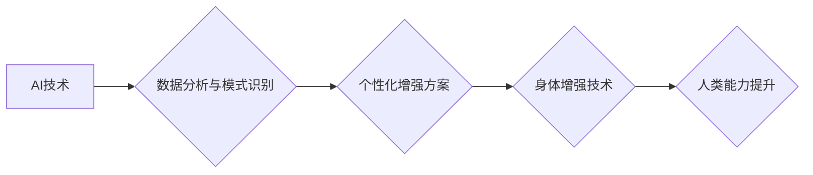

                 

## AI时代的人类增强：道德考虑与身体增强技术的未来发展方向

> 关键词：人工智能、人类增强、身体增强、道德伦理、未来技术、生物技术、神经接口、可穿戴设备

## 1. 背景介绍

人类文明自诞生以来，就一直在探索如何超越自身的局限性。从使用工具到发明火，从农业文明到工业革命，每一次进步都标志着人类对自身能力的提升。如今，人工智能（AI）和生物技术的飞速发展，为我们开启了新的篇章——人类增强。

人类增强是指利用科技手段提升人类的认知能力、物理能力、感官体验等方面的技术。它涵盖了多个领域，包括脑机接口、基因编辑、纳米技术、可穿戴设备等。其中，身体增强技术作为人类增强的重要组成部分，旨在通过外部设备或内部改造来增强人类的生理功能。

## 2. 核心概念与联系

### 2.1 人类增强与AI的融合

AI技术为人类增强提供了强大的工具和平台。AI算法可以分析海量数据，识别模式，并根据这些模式提供个性化的增强方案。例如，AI驱动的脑机接口可以帮助残疾人恢复肢体功能，AI辅助的医疗诊断可以提高疾病治疗的准确性。

### 2.2 身体增强技术的种类

身体增强技术可以分为以下几类：

* **增强现实（AR）和虚拟现实（VR）:** 通过AR/VR技术，可以创造虚拟环境，并将其叠加到现实世界中，从而增强用户的感知和交互体验。
* **可穿戴设备:** 包括智能手表、智能眼镜、运动追踪器等，可以监测用户的生理数据，并提供个性化的健康建议和运动指导。
* **生物增强:** 通过基因编辑、细胞治疗等技术，可以改造人体细胞，增强人体自身的免疫力、耐药性、再生能力等。
* **机械增强:** 通过义肢、增强型骨骼、肌肉辅助装置等，可以增强用户的物理力量、速度、耐力等。

**Mermaid 流程图:**



## 3. 核心算法原理 & 具体操作步骤

### 3.1 算法原理概述

身体增强技术的核心算法原理主要包括：

* **机器学习:** 用于分析用户数据，识别模式，并根据这些模式提供个性化的增强方案。
* **深度学习:** 用于处理复杂的数据，例如图像、语音、生物信号等，可以实现更精准的识别和预测。
* **强化学习:** 用于训练智能体，使其能够在特定环境中学习和优化行为，例如控制机械臂、辅助运动等。

### 3.2 算法步骤详解

以AI驱动的脑机接口为例，其算法步骤可以概括为以下几个阶段：

1. **数据采集:** 使用脑电图（EEG）等设备采集用户的脑电信号。
2. **信号预处理:** 对采集到的脑电信号进行滤波、去噪等处理，去除无关信息，提取有用的特征。
3. **特征提取:** 使用机器学习算法，从预处理后的脑电信号中提取特征，例如脑波频率、脑波幅度等。
4. **模型训练:** 使用深度学习算法，训练一个脑机接口模型，将提取的特征与用户的意图进行映射。
5. **意图识别:** 将用户的脑电信号输入到训练好的模型中，识别用户的意图，例如控制机械臂、发送文字等。
6. **输出控制:** 根据识别的意图，控制相应的设备或软件，实现用户的指令。

### 3.3 算法优缺点

**优点:**

* **精准度高:** 深度学习算法可以学习到复杂的数据模式，实现更精准的意图识别。
* **实时性强:** 脑机接口算法可以实时处理脑电信号，实现即时控制。
* **应用广泛:** 脑机接口技术可以应用于医疗、娱乐、教育等多个领域。

**缺点:**

* **数据依赖:** 脑机接口算法需要大量的脑电信号数据进行训练，数据采集和标注成本较高。
* **安全性问题:** 脑机接口技术涉及到用户的脑部信息，需要确保数据的安全性和隐私性。
* **伦理争议:** 脑机接口技术可能会引发伦理争议，例如意识上传、人机融合等。

### 3.4 算法应用领域

* **医疗保健:** 帮助残疾人恢复肢体功能，辅助医疗诊断和治疗。
* **娱乐:** 增强游戏体验，实现脑控游戏。
* **教育:** 辅助学习，提高学习效率。
* **军事:** 增强士兵的作战能力，实现远程操控。

## 4. 数学模型和公式 & 详细讲解 & 举例说明

### 4.1 数学模型构建

脑机接口算法通常使用神经网络模型进行构建。神经网络模型由多个层组成，每层包含多个神经元。神经元之间通过连接进行信息传递，每个连接都有一个权重。通过训练神经网络模型，可以调整这些权重，使模型能够准确地识别用户的意图。

**举例说明:**

一个简单的多层感知机（MLP）模型可以表示为：

$$
y = f(W_3 * a_2 + b_3)
$$

$$
a_2 = f(W_2 * a_1 + b_2)
$$

$$
a_1 = W_1 * x + b_1
$$

其中：

* $x$ 是输入数据
* $a_1$, $a_2$ 是隐藏层神经元的激活值
* $W_1$, $W_2$, $W_3$ 是权重矩阵
* $b_1$, $b_2$, $b_3$ 是偏置项
* $f$ 是激活函数

### 4.2 公式推导过程

神经网络模型的训练过程是一个优化问题，目标是找到最优的权重，使得模型的输出与实际目标值之间的误差最小。常用的优化算法包括梯度下降法、动量法、Adam算法等。

**梯度下降法:**

$$
W = W - \alpha \frac{\partial Loss}{\partial W}
$$

其中：

* $W$ 是权重
* $\alpha$ 是学习率
* $\frac{\partial Loss}{\partial W}$ 是损失函数对权重的梯度

### 4.3 案例分析与讲解

通过训练一个脑机接口模型，可以实现控制机械臂的意图识别。例如，用户可以通过意念控制机械臂的运动方向和速度。

**案例分析:**

* 训练数据：收集用户脑电信号和机械臂运动轨迹的数据。
* 模型训练：使用深度学习算法训练一个脑机接口模型，将脑电信号与机械臂运动指令进行映射。
* 模型评估：使用测试数据评估模型的准确率和实时性。
* 应用场景：可以应用于医疗领域，帮助残疾人恢复肢体功能。

## 5. 项目实践：代码实例和详细解释说明

### 5.1 开发环境搭建

* 操作系统：Windows/Linux/macOS
* Python版本：3.6+
* 必要的库：TensorFlow/PyTorch、NumPy、Matplotlib等

### 5.2 源代码详细实现

```python
# 导入必要的库
import tensorflow as tf

# 定义神经网络模型
model = tf.keras.models.Sequential([
    tf.keras.layers.Dense(128, activation='relu', input_shape=(100,)),
    tf.keras.layers.Dense(64, activation='relu'),
    tf.keras.layers.Dense(3, activation='softmax')
])

# 编译模型
model.compile(optimizer='adam',
              loss='categorical_crossentropy',
              metrics=['accuracy'])

# 训练模型
model.fit(x_train, y_train, epochs=10)

# 评估模型
loss, accuracy = model.evaluate(x_test, y_test)
print('Loss:', loss)
print('Accuracy:', accuracy)
```

### 5.3 代码解读与分析

* 代码首先导入必要的库。
* 然后定义一个简单的多层感知机模型，包含三个全连接层。
* 接着编译模型，选择优化器、损失函数和评估指标。
* 训练模型，使用训练数据进行训练。
* 最后评估模型，使用测试数据计算模型的损失和准确率。

### 5.4 运行结果展示

训练完成后，可以将模型应用于实际场景，例如控制机械臂。

## 6. 实际应用场景

### 6.1 医疗保健

* **神经修复:** 帮助脑卒中患者恢复肢体功能，通过脑机接口控制义肢。
* **疾病诊断:** 利用脑电信号识别疾病，例如癫痫、阿尔茨海默病等。
* **疼痛管理:** 通过脑机接口调节疼痛信号，减轻患者疼痛。

### 6.2 娱乐

* **脑控游戏:** 通过意念控制游戏角色，实现沉浸式的游戏体验。
* **虚拟现实:** 增强虚拟现实体验，实现更逼真的交互。

### 6.3 教育

* **辅助学习:** 通过脑机接口辅助学生学习，提高学习效率。
* **个性化教育:** 根据学生的脑电信号，提供个性化的学习方案。

### 6.4 未来应用展望

* **人机融合:** 将人类意识上传到计算机，实现人机融合。
* **增强现实:** 将虚拟信息叠加到现实世界中，增强用户的感知和交互体验。
* **远程操控:** 通过脑机接口远程控制机器人或其他设备。

## 7. 工具和资源推荐

### 7.1 学习资源推荐

* **书籍:**
    * 《深度学习》
    * 《神经网络与深度学习》
* **在线课程:**
    * Coursera: 深度学习
    * edX: 人工智能
* **开源项目:**
    * TensorFlow
    * PyTorch

### 7.2 开发工具推荐

* **IDE:** PyCharm, VS Code
* **机器学习库:** TensorFlow, PyTorch
* **数据可视化工具:** Matplotlib, Seaborn

### 7.3 相关论文推荐

* **《Brain-Computer Interfaces: A Review》**
* **《Deep Learning for Brain-Computer Interfaces》**
* **《A Survey of Brain-Computer Interfaces》**

## 8. 总结：未来发展趋势与挑战

### 8.1 研究成果总结

近年来，身体增强技术取得了显著进展，例如脑机接口、可穿戴设备等。这些技术为人类能力的提升提供了新的可能性，并将在医疗、娱乐、教育等多个领域发挥重要作用。

### 8.2 未来发展趋势

* **技术融合:** 人工智能、生物技术、纳米技术等多个领域将更加融合，推动身体增强技术的快速发展。
* **个性化定制:** 身体增强技术将更加个性化，根据用户的需求和生理特征提供定制化的解决方案。
* **伦理规范:** 随着身体增强技术的进步，伦理规范和法律法规的制定将更加重要，以确保技术的安全和可持续发展。

### 8.3 面临的挑战

* **技术瓶颈:** 身体增强技术的某些方面仍然存在技术瓶颈，例如脑电信号的准确识别、生物材料的安全性等。
* **成本问题:** 身体增强技术目前成本较高，需要进一步降低成本才能普及应用。
* **伦理争议:** 身体增强技术可能会引发伦理争议，例如人机融合、意识上传等，需要进行深入的讨论和研究。

### 8.4 研究展望

未来，身体增强技术将继续朝着更加安全、高效、个性化的方向发展。研究人员将致力于解决技术瓶颈，降低成本，并制定相应的伦理规范，确保身体增强技术能够真正造福人类。

## 9. 附录：常见问题与解答

**Q1: 身体增强技术对人类有什么影响？**

**A1:** 身体增强技术可以提升人类的认知能力、物理能力、感官体验等，但也可能引发伦理争议，例如人机融合、意识上传等。

**Q2: 身体增强技术有哪些应用场景？**

**A2:** 身体增强技术可以应用于医疗保健、娱乐、教育、军事等多个领域。

**Q3: 身体增强技术有哪些风险？**

**A3:** 身体增强技术可能存在技术风险、安全风险、伦理风险等。

**Q4: 身体增强技术的发展趋势是什么？**

**A4:** 身体增强技术将朝着更加安全、高效、个性化的方向发展。


作者：禅与计算机程序设计艺术 / Zen and the Art of Computer Programming 
<end_of_turn>

