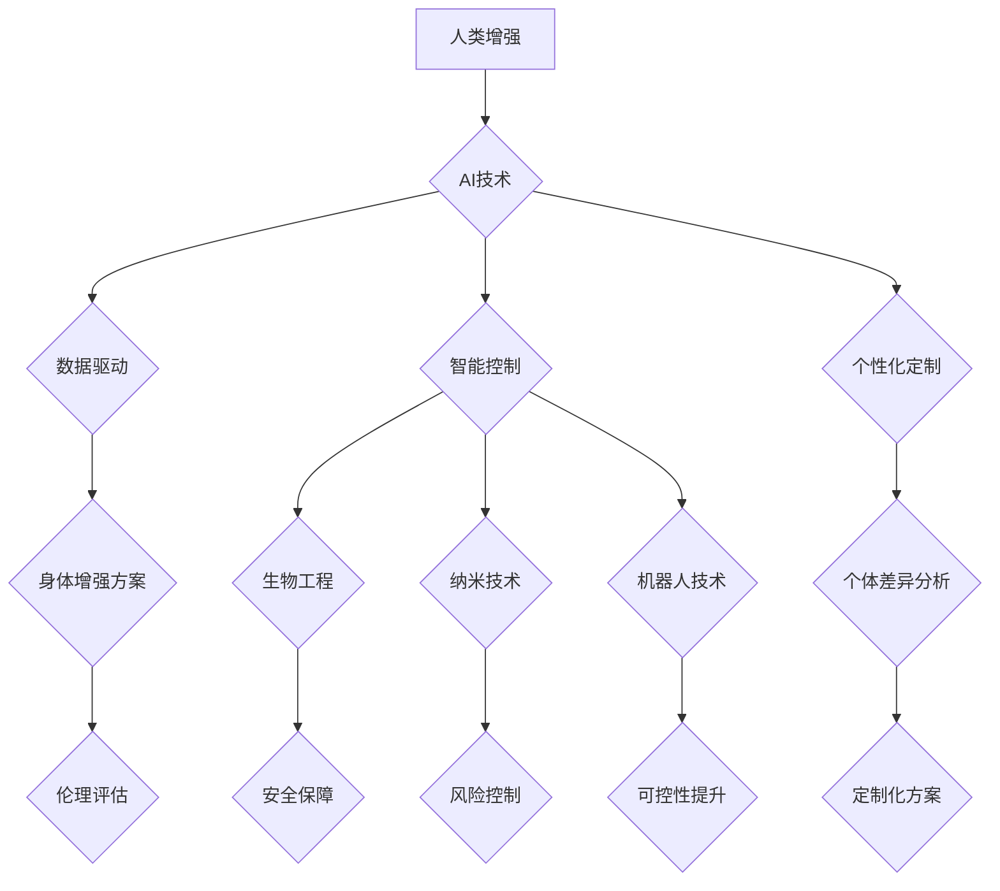

                 

## AI时代的人类增强：道德考虑与身体增强的未来发展策略分析

> 关键词：人工智能、人类增强、身体增强、伦理学、未来趋势、道德风险、技术发展策略

## 1. 背景介绍

人工智能（AI）技术的飞速发展正在深刻地改变着人类社会，其影响范围从日常生活到未来发展都不可忽视。其中，AI驱动的“人类增强”概念引起了广泛的关注和讨论。人类增强是指利用技术手段提升人类的认知能力、生理能力和生活质量，使其超越自然界限制，实现更广阔的发展潜能。

身体增强作为人类增强的重要组成部分，旨在通过生物技术、纳米技术、机器人技术等手段，改造和提升人类的身体机能。例如，可植入式芯片可以增强记忆力和计算能力，基因编辑技术可以纠正遗传缺陷，增强免疫力和寿命，脑机接口技术可以实现人脑与机器的直接交互，拓展人类感知和控制能力。

## 2. 核心概念与联系

### 2.1 人类增强与AI

人类增强与AI有着密不可分的联系。AI技术为人类增强提供了强大的工具和支撑。

* **数据驱动:** AI算法依赖海量数据进行训练和学习，而人类增强需要大量生理、行为、基因等数据进行分析和建模。AI可以帮助我们更有效地收集、分析和利用这些数据，为身体增强提供科学依据。
* **智能控制:** AI算法可以实现对复杂系统的智能控制，例如控制生物工程材料的生长、调节基因表达、优化神经网络连接等。AI可以帮助我们更精准地控制和调节身体增强过程，提高其安全性、有效性和可控性。
* **个性化定制:** AI算法可以根据个体差异进行个性化定制，例如根据用户的基因信息、生活习惯、健康状况等，设计个性化的身体增强方案。AI可以帮助我们实现更加精准、高效、安全的个性化身体增强。

### 2.2 身体增强与伦理

身体增强技术的发展也引发了广泛的伦理争议。

* **公平与正义:** 身体增强技术可能导致社会分化，富人可以通过技术手段获得更强的身体能力，而贫困者则无法负担这些技术，加剧社会不平等。
* **身份与人本:** 身体增强技术可能会改变人类的本质，例如通过基因编辑改变人类的种族、性别、外貌等，引发对人类身份和人本价值的质疑。
* **安全与风险:** 身体增强技术可能带来不可预知的风险，例如植入式芯片可能被黑客攻击，基因编辑可能导致不可逆转的突变，脑机接口可能导致意识分离等。

### 2.3 流程图



## 3. 核心算法原理 & 具体操作步骤

### 3.1 算法原理概述

身体增强算法通常基于以下核心原理：

* **生物信息学:** 利用生物学、遗传学、神经科学等领域的知识，理解人体机能的运作机制，并设计相应的增强方案。
* **机器学习:** 利用机器学习算法，从海量生物数据中学习人体功能的规律，并预测增强效果。
* **控制理论:** 利用控制理论，设计精确的控制算法，实现对身体增强过程的精准调节。

### 3.2 算法步骤详解

1. **数据采集:** 收集人体生理、行为、基因等数据，例如心率、血压、运动轨迹、基因序列等。
2. **数据分析:** 利用机器学习算法对数据进行分析，识别人体功能的规律和潜在增强潜力。
3. **模型构建:** 基于分析结果，构建数学模型，模拟人体增强过程，预测增强效果和潜在风险。
4. **方案设计:** 根据模型预测结果，设计个性化的身体增强方案，例如选择合适的增强技术、设定增强目标、制定增强计划等。
5. **技术实施:** 利用生物工程、纳米技术、机器人技术等手段，实施身体增强方案。
6. **效果评估:** 持续监测增强效果，并根据实际情况进行调整和优化。

### 3.3 算法优缺点

**优点:**

* **精准度高:** 基于数据驱动和机器学习，可以实现对身体增强过程的精准控制和调节。
* **个性化定制:** 可以根据个体差异设计个性化的增强方案，提高增强效果和安全性。
* **效率提升:** 可以加速身体增强过程，缩短增强时间。

**缺点:**

* **数据依赖:** 需要海量数据进行训练和学习，数据质量和数量直接影响算法效果。
* **伦理风险:** 可能导致社会不平等、身份危机、安全风险等伦理问题。
* **技术限制:** 目前技术水平还无法实现所有身体增强目标，存在技术瓶颈。

### 3.4 算法应用领域

* **医疗保健:** 治疗疾病、修复损伤、增强免疫力、延长寿命等。
* **体育竞技:** 提升运动能力、增强耐力、提高反应速度等。
* **军事应用:** 增强士兵的作战能力、提高生存率、增强情报收集能力等。
* **工业生产:** 增强工人体力、提高工作效率、降低工作风险等。

## 4. 数学模型和公式 & 详细讲解 & 举例说明

### 4.1 数学模型构建

身体增强算法通常基于以下数学模型：

* **生物系统模型:** 描述人体生理功能的数学模型，例如心血管系统模型、神经系统模型、肌肉骨骼系统模型等。
* **增强效果模型:** 描述身体增强技术对人体功能的影响的数学模型，例如基因编辑对免疫力的增强效果模型、脑机接口对认知能力的提升效果模型等。
* **风险评估模型:** 描述身体增强技术带来的潜在风险的数学模型，例如植入式芯片的安全风险模型、基因编辑的突变风险模型等。

### 4.2 公式推导过程

例如，假设我们想要构建一个描述基因编辑对免疫力的增强效果的数学模型。我们可以使用以下公式：

$$
\text{免疫力增强率} = f(\text{基因编辑效率}, \text{目标基因表达量}, \text{个体免疫系统状态})
$$

其中：

* **免疫力增强率:** 指基因编辑后免疫力相对于未编辑前的提升比例。
* **基因编辑效率:** 指基因编辑技术成功修改目标基因的比例。
* **目标基因表达量:** 指基因编辑后目标基因的表达量。
* **个体免疫系统状态:** 指个体自身的免疫系统功能水平。

我们可以通过实验数据和生物学知识，推导公式中的函数 $f$，并确定各个参数的影响因素。

### 4.3 案例分析与讲解

例如，我们可以通过分析基因编辑技术对特定免疫缺陷疾病患者的治疗效果，来验证该数学模型的准确性。

## 5. 项目实践：代码实例和详细解释说明

### 5.1 开发环境搭建

* 操作系统: Ubuntu 20.04
* 编程语言: Python 3.8
* 软件包: TensorFlow, NumPy, Pandas, Matplotlib

### 5.2 源代码详细实现

```python
import tensorflow as tf
from tensorflow.keras.models import Sequential
from tensorflow.keras.layers import Dense

# 构建神经网络模型
model = Sequential()
model.add(Dense(64, activation='relu', input_shape=(5,)))
model.add(Dense(32, activation='relu'))
model.add(Dense(1))

# 编译模型
model.compile(optimizer='adam', loss='mse')

# 训练模型
model.fit(X_train, y_train, epochs=100)

# 预测结果
predictions = model.predict(X_test)
```

### 5.3 代码解读与分析

* 该代码示例展示了如何使用TensorFlow构建一个简单的深度学习模型，用于预测身体增强效果。
* 模型输入为5个特征，例如基因编辑效率、目标基因表达量、个体免疫系统状态等。
* 模型输出为免疫力增强率。
* 模型使用Adam优化器和均方误差损失函数进行训练。

### 5.4 运行结果展示

* 训练完成后，我们可以使用测试数据来评估模型的性能。
* 模型的性能指标可以包括准确率、召回率、F1-score等。

## 6. 实际应用场景

### 6.1 医疗保健

* **基因治疗:** 利用基因编辑技术治疗遗传性疾病，例如囊性纤维化、血友病等。
* **器官移植:** 利用生物工程技术构建人工器官，解决器官短缺问题。
* **个性化医疗:** 根据个体基因信息和生活习惯，设计个性化的医疗方案，提高治疗效果。

### 6.2 体育竞技

* **运动能力提升:** 利用基因编辑、纳米技术等手段，增强运动员的肌肉力量、耐力、反应速度等。
* **运动损伤修复:** 利用生物工程技术修复运动损伤，缩短恢复时间。
* **运动训练优化:** 利用人工智能算法分析运动员数据，优化训练计划，提高训练效率。

### 6.3 未来应用展望

* **人类寿命延长:** 利用基因编辑、再生医学等技术，延长人类寿命，提高健康水平。
* **人类认知能力提升:** 利用脑机接口、人工智能等技术，增强人类的记忆力、学习能力、创造力等。
* **人类与机器融合:** 利用生物工程、纳米技术等技术，实现人类与机器的融合，创造新的生命形态。

## 7. 工具和资源推荐

### 7.1 学习资源推荐

* **书籍:**
    * 《生命3.0：人工智能与人类的未来》
    * 《超级智能：路径、风险与策略》
    * 《人机融合：未来科技的挑战与机遇》
* **在线课程:**
    * Coursera: 人工智能、生物信息学、纳米技术等
    * edX: 人工智能、生物工程、机器人技术等
    * Udacity: 人工智能、数据科学、机器学习等

### 7.2 开发工具推荐

* **编程语言:** Python, C++, Java
* **机器学习框架:** TensorFlow, PyTorch, scikit-learn
* **生物信息学工具:** Biopython, BLAST, ClustalW
* **纳米技术仿真软件:** LAMMPS, NAMD

### 7.3 相关论文推荐

* **Nature:** 人工智能与生物学的交叉研究
* **Science:** 人类增强技术与伦理问题
* **Cell:** 基因编辑技术与疾病治疗

## 8. 总结：未来发展趋势与挑战

### 8.1 研究成果总结

* 人工智能技术在身体增强领域取得了显著进展，例如基因编辑、脑机接口、生物打印等技术取得了突破性进展。
* 身体增强算法的开发和应用也取得了重要成果，例如预测增强效果、评估风险、设计个性化方案等。

### 8.2 未来发展趋势

* **技术融合:** 人工智能、生物技术、纳米技术等领域的融合将推动身体增强技术的快速发展。
* **个性化定制:** 基于个体差异，设计个性化的身体增强方案将成为未来发展趋势。
* **伦理规范:** 随着身体增强技术的进步，制定完善的伦理规范和法律法规将变得更加重要。

### 8.3 面临的挑战

* **技术瓶颈:** 目前技术水平还无法实现所有身体增强目标，例如实现完全的意识上传、延长人类寿命等。
* **伦理风险:** 身体增强技术可能导致社会不平等、身份危机、安全风险等伦理问题。
* **监管挑战:** 如何监管和管理身体增强技术，确保其安全、有效和可持续发展是一个重大挑战。

### 8.4 研究展望

* 深入研究身体增强技术的原理和机制，突破技术瓶颈。
* 加强伦理研究，制定完善的伦理规范和法律法规，引导身体增强技术健康发展。
* 促进跨学科合作，整合人工智能、生物技术、纳米技术等领域的优势，推动身体增强技术的创新发展。

## 9. 附录：常见问题与解答

### 9.1  身体增强技术是否安全？

身体增强技术还处于发展初期，存在一定的风险。例如，基因编辑可能导致不可逆转的突变，脑机接口可能导致意识分离等。因此，在应用身体增强技术之前，需要进行充分的风险评估和安全测试。

### 9.2  身体增强技术会改变人类的本质吗？

身体增强技术可能会改变人类的外貌、生理机能、认知能力等方面，引发对人类本质的思考。但是，人类的本质是多方面的，包括意识、情感、社会性等，这些方面可能不会被技术轻易改变。

### 9.3  身体增强技术会加剧社会不平等吗？

身体增强技术可能导致富人可以通过技术手段获得更强的身体能力，而贫困者则无法负担这些技术，加剧社会不平等。因此，需要制定相应的政策措施，确保身体增强技术惠及所有人群。


作者：禅与计算机程序设计艺术 / Zen and the Art of Computer Programming 
<end_of_turn>

