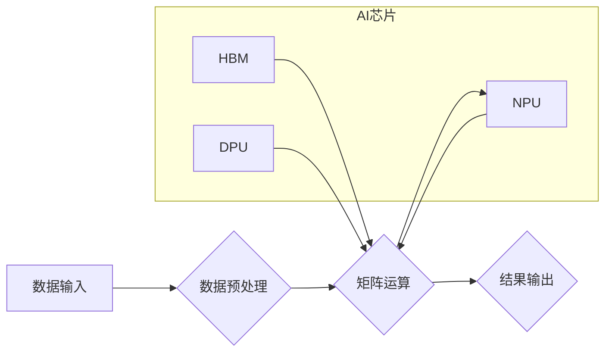

                 

## AI芯片革命：为LLM量身打造的硬件

> 关键词：AI芯片, LLM, 算力, 效率, 定制化, 神经网络, 硬件加速, 训练, 推理

> 摘要：随着大语言模型（LLM）的快速发展，对算力和效率的需求不断攀升。传统的CPU和GPU架构已难以满足LLM训练和推理的挑战。本文将探讨AI芯片的革命性发展，分析其核心概念、算法原理、数学模型、项目实践以及实际应用场景，并展望未来发展趋势和挑战。

## 1. 背景介绍

近年来，人工智能（AI）技术取得了飞速发展，其中大语言模型（LLM）作为AI领域的重要分支，展现出强大的文本生成、理解和翻译能力。代表性模型如GPT-3、LaMDA和BERT等，在自然语言处理任务中取得了突破性进展。然而，LLM的训练和推理都需要消耗大量的计算资源，对硬件提出了极高的要求。

传统的CPU和GPU架构，虽然在通用计算领域表现出色，但在处理LLM所需的密集矩阵运算方面存在效率瓶颈。CPU的并行能力有限，GPU的内存带宽和数据传输效率也难以满足LLM训练的巨大数据量需求。因此，专门为LLM量身打造的AI芯片应运而生。

## 2. 核心概念与联系

AI芯片是指专门用于加速人工智能算法执行的专用硬件。与通用处理器不同，AI芯片针对特定人工智能任务进行优化设计，拥有更高的算力、更低的功耗和更快的推理速度。

**AI芯片与LLM的关系：**

LLM的训练和推理过程本质上是大量的矩阵运算，而AI芯片正是通过高效的矩阵运算单元来加速这些运算，从而提高LLM的训练效率和推理速度。

**AI芯片架构：**

AI芯片通常采用以下核心架构：

* **神经网络加速器 (NPU)：**专门用于加速神经网络运算的硬件单元，例如卷积核、池化层和全连接层等。
* **高带宽内存 (HBM)：**提供高速数据传输通道，满足LLM训练和推理的大数据量需求。
* **数据处理单元 (DPU)：**负责数据预处理、传输和管理，提高数据处理效率。

**Mermaid 流程图：**



## 3. 核心算法原理 & 具体操作步骤

### 3.1  算法原理概述

LLM训练的核心算法是深度学习，其中最常用的算法是反向传播算法 (Backpropagation)。反向传播算法通过计算误差，并根据误差调整模型参数，从而不断优化模型性能。

### 3.2  算法步骤详解

1. **前向传播：**将输入数据通过神经网络层级传递，最终得到输出结果。
2. **损失函数计算：**比较输出结果与真实值之间的差异，计算损失值。
3. **反向传播：**根据损失值，反向计算每个神经元的梯度，即参数调整方向和幅度。
4. **参数更新：**利用梯度下降算法，更新神经网络参数，使模型性能不断提升。

### 3.3  算法优缺点

**优点：**

* 能够学习复杂非线性关系，实现高精度预测。
* 训练数据量越大，模型性能越优。

**缺点：**

* 训练时间长，计算资源消耗大。
* 对训练数据质量要求高，容易出现过拟合问题。

### 3.4  算法应用领域

* 自然语言处理：文本分类、情感分析、机器翻译、对话系统等。
* 图像识别：物体检测、图像分类、图像分割等。
* 语音识别：语音转文本、语音合成等。
* 医疗诊断：疾病预测、影像分析等。

## 4. 数学模型和公式 & 详细讲解 & 举例说明

### 4.1  数学模型构建

LLM的数学模型通常基于多层感知机 (MLP) 或卷积神经网络 (CNN) 架构。

**MLP模型：**

MLP模型由多个全连接层组成，每个层的神经元都与上一层的每个神经元连接。

**CNN模型：**

CNN模型利用卷积层和池化层来提取图像特征，并通过全连接层进行分类或识别。

### 4.2  公式推导过程

**激活函数：**

激活函数用于引入非线性，使模型能够学习复杂关系。常用的激活函数包括ReLU、Sigmoid和Tanh等。

**损失函数：**

损失函数用于衡量模型预测结果与真实值的差异。常用的损失函数包括交叉熵损失和均方误差损失等。

**梯度下降算法：**

梯度下降算法用于更新模型参数，使损失函数最小化。

### 4.3  案例分析与讲解

**举例说明：**

假设我们有一个简单的MLP模型，用于分类手写数字。模型输入是一个28x28的图像，经过多个全连接层后，输出一个包含10个神经元的向量，分别代表0-9的数字类别。

使用交叉熵损失函数和梯度下降算法，我们可以训练这个模型，使其能够准确识别手写数字。

## 5. 项目实践：代码实例和详细解释说明

### 5.1  开发环境搭建

* 操作系统：Linux
* 编程语言：Python
* 深度学习框架：TensorFlow或PyTorch
* AI芯片平台：例如英伟达DGX、谷歌TPU等

### 5.2  源代码详细实现

```python
# 使用TensorFlow框架实现一个简单的MLP模型

import tensorflow as tf

# 定义模型结构
model = tf.keras.models.Sequential([
    tf.keras.layers.Flatten(input_shape=(28, 28)),
    tf.keras.layers.Dense(128, activation='relu'),
    tf.keras.layers.Dense(10, activation='softmax')
])

# 定义损失函数和优化器
model.compile(loss='sparse_categorical_crossentropy',
              optimizer='adam',
              metrics=['accuracy'])

# 加载训练数据
(x_train, y_train), (x_test, y_test) = tf.keras.datasets.mnist.load_data()

# 训练模型
model.fit(x_train, y_train, epochs=5)

# 评估模型性能
loss, accuracy = model.evaluate(x_test, y_test)
print('Test loss:', loss)
print('Test accuracy:', accuracy)
```

### 5.3  代码解读与分析

* 代码首先定义了一个简单的MLP模型，包含一个扁平化层、一个全连接层和一个输出层。
* 然后定义了损失函数和优化器，用于训练模型。
* 接着加载MNIST手写数字数据集，并使用模型训练。
* 最后评估模型性能，打印测试损失和准确率。

### 5.4  运行结果展示

训练完成后，模型能够准确识别手写数字。

## 6. 实际应用场景

### 6.1  自然语言处理

* **聊天机器人：**AI芯片可以加速LLM的训练和推理，使聊天机器人更加智能和自然。
* **机器翻译：**AI芯片可以提高机器翻译的准确性和速度，帮助人们跨越语言障碍。
* **文本摘要：**AI芯片可以帮助快速生成文本摘要，提高工作效率。

### 6.2  图像识别

* **自动驾驶：**AI芯片可以帮助自动驾驶汽车识别道路、行人、车辆等物体，提高安全性。
* **医疗诊断：**AI芯片可以帮助医生识别病灶，提高诊断准确率。
* **安防监控：**AI芯片可以帮助识别异常行为，提高安防监控效率。

### 6.3  语音识别

* **语音助手：**AI芯片可以提高语音助手的响应速度和准确率，提供更便捷的用户体验。
* **语音转文本：**AI芯片可以帮助将语音转换为文本，方便记录和处理语音信息。
* **语音合成：**AI芯片可以帮助生成更加自然流畅的语音，用于语音合成系统。

### 6.4  未来应用展望

随着AI芯片技术的不断发展，其应用场景将更加广泛，例如：

* **个性化教育：**AI芯片可以帮助提供个性化的学习方案，提高教育效率。
* **精准医疗：**AI芯片可以帮助医生进行更精准的诊断和治疗，提高医疗水平。
* **科学研究：**AI芯片可以帮助科学家加速科学研究，推动科技进步。

## 7. 工具和资源推荐

### 7.1  学习资源推荐

* **书籍：**
    * 《深度学习》
    * 《人工智能：现代方法》
    * 《机器学习实战》
* **在线课程：**
    * Coursera深度学习课程
    * Udacity人工智能课程
    * edX机器学习课程

### 7.2  开发工具推荐

* **深度学习框架：**TensorFlow、PyTorch、Keras
* **AI芯片平台：**英伟达DGX、谷歌TPU、华为昇腾
* **编程语言：**Python、C++

### 7.3  相关论文推荐

* **《Attention Is All You Need》**
* **《BERT: Pre-training of Deep Bidirectional Transformers for Language Understanding》**
* **《Transformer-XL: Attentive Language Models Beyond a Fixed-Length Context》**

## 8. 总结：未来发展趋势与挑战

### 8.1  研究成果总结

AI芯片的革命性发展为LLM的训练和推理带来了巨大的进步，提高了模型性能和效率。

### 8.2  未来发展趋势

* **更强大的算力：**AI芯片将继续追求更高的算力，以支持更复杂的LLM模型训练。
* **更低的功耗：**AI芯片将更加注重功耗优化，以提高能源效率。
* **更灵活的架构：**AI芯片将更加灵活，能够适应不同类型的LLM模型和应用场景。
* **更广泛的应用：**AI芯片将应用于更多领域，推动人工智能技术的普及。

### 8.3  面临的挑战

* **芯片设计难度：**设计高效、低功耗的AI芯片是一个巨大的技术挑战。
* **软件生态系统：**AI芯片需要配套的软件生态系统，包括开发工具、库和框架。
* **成本问题：**AI芯片的成本较高，需要进一步降低才能普及应用。

### 8.4  研究展望

未来，AI芯片研究将继续朝着更强大、更智能、更可定制的方向发展，为人工智能技术的进步做出更大的贡献。

## 9. 附录：常见问题与解答

**常见问题：**

* AI芯片与GPU相比有什么优势？
* AI芯片的应用场景有哪些？
* 如何学习AI芯片相关知识？

**解答：**

* AI芯片针对特定人工智能任务进行优化设计，拥有更高的算力和更低的功耗，比GPU更适合加速LLM训练和推理。
* AI芯片的应用场景包括自然语言处理、图像识别、语音识别等。
* 可以通过阅读相关书籍、在线课程和论文学习AI芯片相关知识。


作者：禅与计算机程序设计艺术 / Zen and the Art of Computer Programming<end_of_turn>

