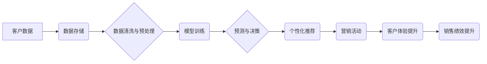

                 

## AI零售：利用客户数据分析提升购物体验和销售绩效

> 关键词：人工智能、零售、客户数据分析、购物体验、销售绩效、推荐系统、个性化营销、预测分析

> 摘要：本文深入探讨了人工智能在零售领域的应用，重点阐述了如何利用客户数据分析提升购物体验和销售绩效。从核心概念和算法原理到实际应用场景和未来发展趋势，本文全面分析了AI零售的现状和未来发展方向，并提供了一些工具和资源推荐，帮助读者更好地理解和应用AI技术在零售领域的潜力。

## 1. 背景介绍

零售业作为经济的重要组成部分，近年来面临着前所未有的挑战和机遇。消费者需求日益多元化，竞争日益激烈，传统零售模式难以满足不断变化的市场需求。而人工智能（AI）技术的快速发展为零售业带来了新的希望，为提升购物体验和销售绩效提供了强大的工具。

AI零售是指利用人工智能技术分析客户数据，预测客户需求，个性化推荐商品，优化运营流程，提升客户满意度和销售业绩的零售模式。AI技术可以帮助零售商更好地了解客户，提供更精准的商品推荐，提高营销效率，降低运营成本，最终实现商业价值的提升。

## 2. 核心概念与联系

**2.1 核心概念**

* **客户数据分析：** 收集、存储、分析客户的购物行为、偏好、反馈等数据，以洞察客户需求和行为模式。
* **机器学习：** 利用算法从数据中学习，识别模式和趋势，进行预测和决策。
* **深度学习：** 一种更高级的机器学习方法，利用多层神经网络模拟人类大脑的学习过程，能够处理更复杂的数据和任务。
* **自然语言处理：** 理解和处理人类语言，例如文本和语音，用于客户服务、搜索引擎优化等应用。
* **计算机视觉：** 赋予计算机“看”的能力，用于商品识别、图像分析、视频监控等应用。

**2.2 架构图**



**2.3 联系**

AI零售的核心是利用人工智能技术分析客户数据，并根据分析结果提供个性化服务和产品推荐，最终提升客户体验和销售绩效。

## 3. 核心算法原理 & 具体操作步骤

**3.1 算法原理概述**

AI零售中常用的算法包括：

* **协同过滤：** 基于用户或商品之间的相似性进行推荐。
* **内容过滤：** 基于商品的特征和用户偏好进行推荐。
* **基于规则的推荐：** 基于预先设定的规则进行推荐。
* **深度学习推荐：** 利用深度神经网络学习用户和商品之间的复杂关系进行推荐。

**3.2 算法步骤详解**

以协同过滤算法为例，其步骤如下：

1. **数据收集：** 收集用户对商品的评分或购买记录等数据。
2. **数据预处理：** 清洗数据，处理缺失值，将数据转换为适合算法处理的格式。
3. **相似性计算：** 计算用户之间的相似度或商品之间的相似度。
4. **推荐生成：** 根据用户或商品的相似性，推荐用户可能感兴趣的商品。

**3.3 算法优缺点**

* **协同过滤算法：**
    * **优点：** 可以发现用户之间的隐性关系，推荐个性化商品。
    * **缺点：** 数据稀疏性问题，新用户或新商品推荐效果较差。
* **内容过滤算法：**
    * **优点：** 可以根据商品特征进行精准推荐，不受数据稀疏性的影响。
    * **缺点：** 难以发现用户之间的隐性关系，推荐结果可能过于单一。
* **基于规则的推荐：**
    * **优点：** 易于理解和实现，可以根据特定规则进行推荐。
    * **缺点：** 规则难以覆盖所有场景，推荐结果可能不够个性化。
* **深度学习推荐：**
    * **优点：** 可以学习用户和商品之间的复杂关系，推荐效果更精准。
    * **缺点：** 需要大量数据进行训练，模型复杂度高。

**3.4 算法应用领域**

* **商品推荐：** 根据用户历史购买记录、浏览记录、评分等数据，推荐用户可能感兴趣的商品。
* **个性化营销：** 根据用户画像和行为数据，进行精准营销，提高营销转化率。
* **库存管理：** 利用预测分析，预测商品需求，优化库存管理，降低库存成本。
* **客户服务：** 利用自然语言处理技术，提供智能客服，提高客户服务效率。

## 4. 数学模型和公式 & 详细讲解 & 举例说明

**4.1 数学模型构建**

协同过滤算法中常用的数学模型是用户-商品评分矩阵。该矩阵的每一行代表一个用户，每一列代表一个商品，矩阵中的每个元素表示用户对商品的评分。

**4.2 公式推导过程**

用户相似度计算可以使用余弦相似度公式：

$$
\text{相似度} = \frac{\mathbf{u} \cdot \mathbf{v}}{\|\mathbf{u}\| \|\mathbf{v}\|}
$$

其中：

* $\mathbf{u}$ 和 $\mathbf{v}$ 是两个用户的评分向量。
* $\cdot$ 表示向量点积。
* $\|\mathbf{u}\|$ 和 $\|\mathbf{v}\|$ 表示向量的模长。

**4.3 案例分析与讲解**

假设有两个用户A和B，他们的评分向量分别为：

* $\mathbf{u} = [1, 2, 3, 4, 5]$
* $\mathbf{v} = [2, 3, 4, 5, 1]$

则它们的余弦相似度为：

$$
\text{相似度} = \frac{(1 \times 2) + (2 \times 3) + (3 \times 4) + (4 \times 5) + (5 \times 1)}{\sqrt{1^2 + 2^2 + 3^2 + 4^2 + 5^2} \sqrt{2^2 + 3^2 + 4^2 + 5^2 + 1^2}} = \frac{39}{\sqrt{55} \sqrt{55}} \approx 0.89
$$

该结果表明用户A和B的评分偏好有一定的相似性。

## 5. 项目实践：代码实例和详细解释说明

**5.1 开发环境搭建**

* Python 3.x
* TensorFlow 或 PyTorch
* Jupyter Notebook

**5.2 源代码详细实现**

```python
import pandas as pd
from sklearn.metrics.pairwise import cosine_similarity

# 加载用户-商品评分数据
data = pd.read_csv('ratings.csv')

# 计算用户之间的余弦相似度
user_similarity = cosine_similarity(data.pivot_table(index='user_id', columns='item_id', values='rating').fillna(0))

# 根据用户相似度推荐商品
def recommend_items(user_id, top_n=5):
    similar_users = user_similarity[user_id].argsort()[:-top_n-1:-1]
    recommended_items = data[data['user_id'].isin(similar_users)].groupby('item_id')['rating'].mean().sort_values(ascending=False).index
    return recommended_items.tolist()

# 获取用户1的推荐商品
recommendations = recommend_items(1)
print(recommendations)
```

**5.3 代码解读与分析**

* 首先，加载用户-商品评分数据。
* 然后，使用`cosine_similarity`函数计算用户之间的余弦相似度。
* `recommend_items`函数根据用户ID和推荐数量，获取与该用户相似用户的评分数据，并计算每个商品的平均评分，最后返回前N个推荐商品。

**5.4 运行结果展示**

运行代码后，将输出用户1的推荐商品列表。

## 6. 实际应用场景

**6.1 个性化推荐**

电商平台可以利用AI零售技术，根据用户的浏览记录、购买历史、评分等数据，个性化推荐商品，提高用户购物体验和转化率。

**6.2 精准营销**

零售商可以利用AI技术分析客户数据，构建客户画像，进行精准营销，例如推送个性化优惠券、促销活动等，提高营销效率。

**6.3 库存优化**

AI零售可以帮助零售商预测商品需求，优化库存管理，降低库存成本，提高商品周转率。

**6.4 客户服务**

AI聊天机器人可以提供智能客服，解答客户疑问，处理简单的售后问题，提高客户服务效率。

**6.5 未来应用展望**

* **增强现实（AR）和虚拟现实（VR）体验：** 利用AR/VR技术，为用户提供沉浸式的购物体验，例如虚拟试衣间、虚拟商品展示等。
* **无人零售：** 利用AI技术，构建无人商店，实现自动商品识别、支付和配送，降低运营成本。
* **个性化商品设计：** 利用AI技术，根据用户的需求和喜好，进行个性化商品设计，满足用户的独特需求。

## 7. 工具和资源推荐

**7.1 学习资源推荐**

* **书籍：**
    * 《深度学习》
    * 《机器学习实战》
    * 《Python机器学习》
* **在线课程：**
    * Coursera
    * edX
    * Udacity

**7.2 开发工具推荐**

* **Python：** 广泛应用于AI开发，拥有丰富的库和框架。
* **TensorFlow：** Google开发的开源深度学习框架。
* **PyTorch：** Facebook开发的开源深度学习框架。
* **Scikit-learn：** Python机器学习库。

**7.3 相关论文推荐**

* **协同过滤算法：**
    * “Collaborative Filtering: A User-Based Approach”
    * “Memory-Based Collaborative Filtering”
* **深度学习推荐：**
    * “Neural Collaborative Filtering”
    * “Deep Learning for Recommender Systems”

## 8. 总结：未来发展趋势与挑战

**8.1 研究成果总结**

AI零售技术取得了显著的进展，能够有效提升购物体验和销售绩效。

**8.2 未来发展趋势**

* **更精准的个性化推荐：** 利用更先进的算法和数据分析技术，提供更精准的个性化推荐。
* **更丰富的交互体验：** 利用AR/VR技术，为用户提供更丰富的交互体验。
* **更智能的运营管理：** 利用AI技术，优化运营流程，提高效率。

**8.3 面临的挑战**

* **数据隐私保护：** AI零售需要大量客户数据，如何保护客户隐私是一个重要的挑战。
* **算法解释性：** 许多AI算法是黑盒模型，难以解释其推荐结果，这可能会导致用户信任问题。
* **技术可持续性：** AI技术发展迅速，需要不断更新和迭代，才能保持竞争力。

**8.4 研究展望**

未来，AI零售将朝着更智能、更个性化、更可持续的方向发展，为零售业带来更多创新和机遇。

## 9. 附录：常见问题与解答

* **Q：AI零售会取代人类零售工作吗？**

A：AI零售技术可以提高零售效率，但不会完全取代人类零售工作。AI更像是人类零售的助手，可以帮助零售商完成一些重复性、繁琐的工作，释放人力资源，让零售人员能够专注于更具创造性和价值的工作。

* **Q：如何确保AI零售的公平性和公正性？**

A：AI算法的训练数据可能会存在偏差，导致推荐结果不公平。因此，需要采取措施确保AI算法的公平性和公正性，例如使用多样化的训练数据、定期评估算法的偏见等。


作者：禅与计算机程序设计艺术 / Zen and the Art of Computer Programming 
<end_of_turn>

