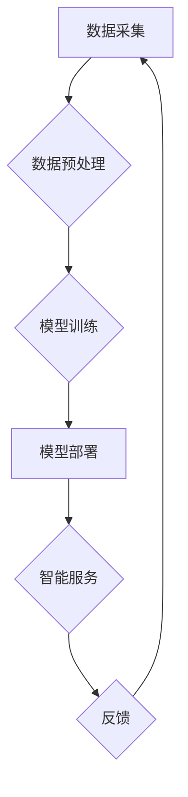

                 

## AI零售：道德和伦理问题探讨

> 关键词：人工智能，零售，伦理，道德，公平，隐私，透明度，可解释性

> 摘要：人工智能（AI）正在深刻地改变零售业，带来效率提升、个性化体验和新兴商业模式。然而，AI零售的快速发展也引发了诸多道德和伦理问题，例如算法偏见、数据隐私、工作岗位替代等。本文将深入探讨这些问题，分析其潜在影响，并提出应对策略，以促进AI零售的可持续发展，实现人机共赢。

## 1. 背景介绍

零售业一直是经济发展的重要支柱，近年来，人工智能（AI）技术在零售领域的应用日益广泛，从智能推荐系统、个性化营销到无人商店和物流自动化，AI正在改变着零售业的运作模式和消费者体验。

AI零售的优势显而易见：

* **提高效率:** AI可以自动化许多重复性任务，例如库存管理、订单处理和客户服务，从而提高效率和降低成本。
* **个性化体验:** AI可以分析消费者的购买历史、偏好和行为模式，提供个性化的产品推荐、促销活动和购物体验。
* **精准营销:** AI可以帮助零售商更精准地定位目标客户，制定更有针对性的营销策略，提高营销效果。
* **优化供应链:** AI可以预测需求、优化库存和物流，提高供应链的效率和弹性。

然而，AI零售的发展也带来了新的挑战和伦理问题，需要我们认真思考和应对。

## 2. 核心概念与联系

**2.1 AI零售的核心概念**

* **人工智能 (AI):** 指能够模拟人类智能行为的计算机系统，包括机器学习、深度学习、自然语言处理等技术。
* **零售业:** 指以销售商品或服务为主要业务的行业，涵盖线上线下各种销售模式。
* **数据驱动:** AI零售的核心是数据，通过收集、分析和利用海量数据，AI可以实现智能化决策和个性化服务。

**2.2 AI零售的架构**



**2.3 AI零售的核心联系**

AI技术与零售业的结合，通过数据驱动，实现智能化决策和个性化服务，最终提升零售效率和消费者体验。

## 3. 核心算法原理 & 具体操作步骤

**3.1 算法原理概述**

AI零售中常用的算法包括：

* **机器学习 (ML):** 通过训练模型，从数据中学习规律，实现预测、分类和聚类等功能。
* **深度学习 (DL):** 基于多层神经网络，能够处理更复杂的数据，实现更精准的预测和识别。
* **自然语言处理 (NLP):** 能够理解和处理人类语言，用于客户服务、搜索引擎优化和个性化营销等。

**3.2 算法步骤详解**

以推荐系统为例，其算法步骤如下：

1. **数据收集:** 收集用户购买历史、浏览记录、评分等数据。
2. **数据预处理:** 清洗、转换和格式化数据，使其适合模型训练。
3. **模型选择:** 根据业务需求选择合适的推荐算法，例如协同过滤、内容过滤或混合推荐。
4. **模型训练:** 使用训练数据训练模型，调整模型参数，使其能够准确预测用户喜好。
5. **模型评估:** 使用测试数据评估模型性能，例如准确率、召回率和覆盖率。
6. **模型部署:** 将训练好的模型部署到线上系统，为用户提供个性化推荐。

**3.3 算法优缺点**

* **优点:** 能够提供个性化推荐，提高用户体验和转化率。
* **缺点:** 容易出现算法偏见，可能导致歧视或不公平的结果。

**3.4 算法应用领域**

* **产品推荐:** 根据用户喜好推荐相关产品。
* **个性化营销:** 根据用户特征推送个性化广告和促销活动。
* **库存管理:** 预测商品需求，优化库存水平。
* **物流优化:** 规划最优配送路线，提高物流效率。

## 4. 数学模型和公式 & 详细讲解 & 举例说明

**4.1 数学模型构建**

推荐系统的核心是预测用户对商品的评分或购买意愿。可以使用协同过滤算法构建数学模型，例如基于用户的协同过滤模型：

```latex
R(u, i) = \frac{\sum_{v \in N(u)} \frac{R(v, i) * sim(u, v)}{\sum_{w \in N(u)} sim(u, w)}}{\sum_{j \in I} sim(u, j)}
```

其中：

* $R(u, i)$ 表示用户 $u$ 对商品 $i$ 的评分或购买意愿。
* $N(u)$ 表示与用户 $u$ 相似的用户集合。
* $sim(u, v)$ 表示用户 $u$ 和用户 $v$ 之间的相似度。
* $I$ 表示所有商品的集合。

**4.2 公式推导过程**

该公式基于用户的评分历史和相似度计算，预测用户对特定商品的评分或购买意愿。

**4.3 案例分析与讲解**

假设用户 $A$ 和用户 $B$ 都喜欢电影 $X$ 和 $Y$，而用户 $B$ 还喜欢电影 $Z$。根据协同过滤算法，我们可以推断用户 $A$ 也可能喜欢电影 $Z$。

## 5. 项目实践：代码实例和详细解释说明

**5.1 开发环境搭建**

* Python 3.x
* TensorFlow 或 PyTorch
* Jupyter Notebook

**5.2 源代码详细实现**

```python
# 协同过滤推荐系统示例代码

import numpy as np
from sklearn.metrics.pairwise import cosine_similarity

# 模拟用户评分数据
ratings = np.array([
    [5, 4, 3, 2, 1],  # 用户 1 的评分
    [4, 5, 2, 1, 3],  # 用户 2 的评分
    [3, 2, 5, 4, 1],  # 用户 3 的评分
    [2, 1, 4, 5, 3],  # 用户 4 的评分
    [1, 3, 1, 3, 5]   # 用户 5 的评分
])

# 计算用户之间的相似度
user_similarity = cosine_similarity(ratings)

# 获取用户 1 的相似用户
similar_users = np.argsort(user_similarity[0])[::-1][1:6]  # 排序后取前 5 个相似用户

# 预测用户 1 对电影 4 的评分
predicted_rating = np.average(ratings[similar_users, 3], weights=user_similarity[0][similar_users])

print(f"用户 1 对电影 4 的预测评分: {predicted_rating}")
```

**5.3 代码解读与分析**

该代码示例实现了基于用户的协同过滤推荐算法。首先，模拟用户评分数据，然后计算用户之间的相似度。接着，根据用户相似度，预测用户对特定商品的评分。

**5.4 运行结果展示**

运行该代码后，会输出用户 1 对电影 4 的预测评分。

## 6. 实际应用场景

**6.1 个性化推荐系统**

电商平台、流媒体服务和社交媒体平台都广泛应用个性化推荐系统，根据用户的兴趣和行为，推荐相关产品、内容或服务。

**6.2 智能客服系统**

AI驱动的智能客服系统可以自动处理客户咨询、订单查询和售后服务，提高客户服务效率和体验。

**6.3 自动化仓储和物流**

AI可以优化仓储布局、自动拣货和配送，提高物流效率和降低成本。

**6.4 预测分析和库存管理**

AI可以分析销售数据、市场趋势和用户行为，预测商品需求和库存水平，帮助零售商优化库存管理和降低库存成本。

**6.5 未来应用展望**

* **虚拟试衣间:** 利用AR/VR技术，让用户在家就能虚拟试穿衣服，提升购物体验。
* **个性化营销:** 通过AI分析用户数据，精准推送个性化广告和促销活动，提高营销效果。
* **智能门店:** 利用传感器和AI技术，打造智能门店，提供个性化服务和购物体验。

## 7. 工具和资源推荐

**7.1 学习资源推荐**

* **在线课程:** Coursera、edX、Udacity 等平台提供人工智能和机器学习相关的在线课程。
* **书籍:** 《深度学习》、《机器学习实战》等书籍可以帮助你深入了解AI技术。
* **开源项目:** TensorFlow、PyTorch 等开源项目可以让你实践AI算法。

**7.2 开发工具推荐**

* **Python:** 作为AI开发的主要语言，Python拥有丰富的库和框架，例如TensorFlow、PyTorch、Scikit-learn等。
* **Jupyter Notebook:** 用于编写和运行Python代码，并可视化数据和结果。
* **云计算平台:** AWS、Azure、GCP 等云计算平台提供AI开发和部署的资源和服务。

**7.3 相关论文推荐**

* **AlphaGo论文:** 《Mastering the Game of Go with Deep Neural Networks and Tree Search》
* **BERT论文:** 《BERT: Pre-training of Deep Bidirectional Transformers for Language Understanding》
* **GPT-3论文:** 《Language Models are Few-Shot Learners》

## 8. 总结：未来发展趋势与挑战

**8.1 研究成果总结**

AI零售技术取得了显著进展，例如推荐系统、智能客服和自动化物流等应用取得了成功。

**8.2 未来发展趋势**

* **更精准的个性化推荐:** 利用更先进的AI算法和数据分析技术，提供更精准的个性化推荐。
* **更智能的客户服务:** AI驱动的智能客服系统将更加智能化，能够理解更复杂的客户需求，提供更人性化的服务。
* **更安全的购物体验:** 利用AI技术，加强数据安全和隐私保护，提升购物体验的安全性。

**8.3 面临的挑战**

* **算法偏见:** AI算法可能存在偏见，导致歧视或不公平的结果。
* **数据隐私:** AI零售需要收集大量用户数据，如何保护用户隐私是一个重要挑战。
* **工作岗位替代:** AI自动化可能会导致部分工作岗位被替代，需要考虑社会影响和应对措施。

**8.4 研究展望**

未来研究方向包括：

* **开发更公平、更透明的AI算法。**
* **加强数据安全和隐私保护机制。**
* **探索AI与人类合作的模式，实现人机共赢。**

## 9. 附录：常见问题与解答

**9.1 如何解决算法偏见问题？**

* 使用更公平的数据集进行训练。
* 开发更公平的算法模型。
* 定期评估算法的公平性，并进行调整。

**9.2 如何保护用户隐私？**

* 采用数据加密和匿名化技术。
* 明确用户数据的使用目的和范围。
* 获得用户同意后才收集和使用数据。

**9.3 AI零售对工作岗位的影响？**

* AI自动化可能会导致部分工作岗位被替代，但也将创造新的工作机会。
* 需要加强职业培训和教育，帮助员工适应未来工作环境。


作者：禅与计算机程序设计艺术 / Zen and the Art of Computer Programming 
<end_of_turn>

