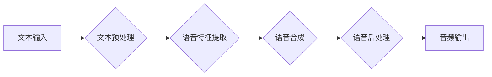

                 

## AI音频书：将文本转化为引人入胜的听觉体验

> 关键词：文本到语音、AI语音合成、音频书、自然语言处理、深度学习、语音情感、语音风格

## 1. 背景介绍

在数字时代，信息爆炸和碎片化阅读日益严重，人们对获取知识和娱乐方式的需求不断变化。音频书作为一种沉浸式、便捷的阅读方式，近年来迅速崛起，成为人们生活中不可或缺的一部分。传统的音频书制作流程繁琐，需要专业配音演员、录音设备和后期制作，成本高昂且效率低下。而随着人工智能技术的飞速发展，特别是深度学习技术的突破，文本到语音（TTS）技术取得了长足进步，为音频书的制作带来了革命性的变革。

AI音频书是指利用人工智能技术将文本自动转化为语音的音频作品。它打破了传统音频书制作的限制，降低了制作门槛，并为音频书的个性化定制和交互性提供了无限可能。

## 2. 核心概念与联系

AI音频书的核心技术是文本到语音（TTS）技术，它将文本信息转换为语音信号。TTS技术包含多个关键环节：

* **文本预处理:** 将输入的文本进行清洗、分词、标注等处理，使其符合语音合成模型的输入格式。
* **语音特征提取:** 将文本信息映射到语音特征空间，例如梅尔频率倒谱系数（MFCC）等。
* **语音合成:** 利用语音模型生成语音信号，使其具有自然流畅的语音表达。
* **语音后处理:** 对生成的语音信号进行增强、降噪、混响等处理，使其更加逼真自然。

**Mermaid 流程图:**



## 3. 核心算法原理 & 具体操作步骤

### 3.1  算法原理概述

传统的TTS技术主要基于规则或统计模型，但其生成的语音往往缺乏自然性和情感表达。近年来，深度学习技术在TTS领域取得了突破性进展，基于深度神经网络的TTS模型能够生成更加逼真、自然流畅的语音。

常见的深度学习TTS模型包括：

* **序列到序列模型 (Seq2Seq):** 将文本序列映射到语音序列，利用循环神经网络（RNN）或Transformer等模型进行编码和解码。
* **条件生成模型 (Generative Adversarial Networks, GANs):** 利用生成对抗网络，训练一个生成器模型生成语音，并使用一个鉴别器模型判断生成的语音是否真实。

### 3.2  算法步骤详解

以Seq2Seq模型为例，其TTS算法步骤如下：

1. **文本预处理:** 将输入的文本进行分词、词嵌入等处理，将其转换为数字向量。
2. **编码:** 利用RNN或Transformer模型对文本向量进行编码，提取文本语义信息。
3. **解码:** 利用RNN或Transformer模型对编码后的语义信息进行解码，生成语音序列。
4. **语音合成:** 将生成的语音序列转换为音频信号。

### 3.3  算法优缺点

**优点:**

* 生成语音更加逼真自然。
* 可以实现个性化语音定制。
* 能够表达多种情感和语调。

**缺点:**

* 模型训练需要大量数据和计算资源。
* 生成语音的质量仍然存在一定的局限性。
* 难以完全模拟人类的语音表达细节。

### 3.4  算法应用领域

* **音频书制作:** 自动生成高质量的音频书，降低制作成本和时间。
* **语音助手:** 为智能语音助手提供更加自然流畅的语音交互体验。
* **教育培训:** 提供个性化的语音学习资源，提升学习效率。
* **游戏娱乐:** 为游戏角色提供更加生动的语音配音。

## 4. 数学模型和公式 & 详细讲解 & 举例说明

### 4.1  数学模型构建

Seq2Seq模型的核心是Encoder-Decoder结构，其中Encoder负责对文本进行编码，Decoder负责对编码后的信息进行解码生成语音。

**Encoder:**

Encoder通常使用RNN或Transformer模型，其输入是文本序列，输出是一个隐藏状态向量，该向量包含了文本语义信息。

**Decoder:**

Decoder也通常使用RNN或Transformer模型，其输入是Encoder的隐藏状态向量和当前解码步骤的输出，输出是当前解码步骤的语音特征。

### 4.2  公式推导过程

由于篇幅限制，此处仅列举Seq2Seq模型中常用的注意力机制公式：

**注意力权重:**

$$
\alpha_{ij} = \frac{\exp(e_{ij})}{\sum_{k=1}^{T_x} \exp(e_{ik})}
$$

其中，$e_{ij}$表示Encoder第i个时间步的隐藏状态向量与Decoder第j个时间步的输入向量的相似度，$T_x$表示文本序列的长度。

**上下文向量:**

$$
c_j = \sum_{i=1}^{T_x} \alpha_{ij} h_i
$$

其中，$h_i$表示Encoder第i个时间步的隐藏状态向量，$c_j$表示Decoder第j个时间步的上下文向量，该向量包含了Encoder所有时间步的语义信息。

### 4.3  案例分析与讲解

在音频书制作中，Seq2Seq模型可以将文本内容编码为语音序列，并根据不同的语调和情感进行调整。例如，在讲述故事时，模型可以根据情节变化调整语音语调，在描述人物情感时，可以模拟不同的语音风格，从而提升音频书的沉浸感和听觉体验。

## 5. 项目实践：代码实例和详细解释说明

### 5.1  开发环境搭建

* 操作系统: Ubuntu 20.04
* Python版本: 3.8
* 深度学习框架: TensorFlow 2.x

### 5.2  源代码详细实现

```python
# 导入必要的库
import tensorflow as tf

# 定义Seq2Seq模型
class Seq2SeqModel(tf.keras.Model):
    def __init__(self, vocab_size, embedding_dim, hidden_dim):
        super(Seq2SeqModel, self).__init__()
        self.encoder = tf.keras.layers.LSTM(hidden_dim, return_state=True)
        self.decoder = tf.keras.layers.LSTM(hidden_dim)
        self.embedding = tf.keras.layers.Embedding(vocab_size, embedding_dim)
        self.dense = tf.keras.layers.Dense(vocab_size)

    def call(self, inputs, states):
        # Encoder
        encoder_outputs, state_h, state_c = self.encoder(inputs, initial_state=states)
        # Decoder
        decoder_outputs = self.decoder(inputs, initial_state=[state_h, state_c])
        # Output
        outputs = self.dense(decoder_outputs)
        return outputs, [state_h, state_c]

# ... 模型训练和评估代码 ...
```

### 5.3  代码解读与分析

* **模型结构:** 该代码实现了一个简单的Seq2Seq模型，包含Encoder和Decoder两个部分。Encoder使用LSTM网络对文本进行编码，Decoder使用LSTM网络对编码后的信息进行解码生成语音。
* **嵌入层:** Embedding层将文本单词映射到低维向量空间，以便模型进行处理。
* **全连接层:** Dense层将解码器的输出映射到语音词汇表的大小，用于预测下一个语音单元。
* **状态向量:** LSTM网络的隐藏状态向量可以保存文本语义信息，并传递给Decoder，帮助Decoder生成更加上下文相关的语音。

### 5.4  运行结果展示

训练好的模型可以将文本输入转化为语音输出，并可以根据不同的参数设置调整语音语调、情感等。

## 6. 实际应用场景

### 6.1  音频书制作

AI音频书可以自动生成高质量的音频书，降低制作成本和时间，并为听众提供更加个性化的音频体验。

### 6.2  语音助手

AI语音合成技术可以为智能语音助手提供更加自然流畅的语音交互体验，提升用户体验。

### 6.3  教育培训

AI音频书可以提供个性化的语音学习资源，例如朗读教材、讲解知识点等，提升学习效率。

### 6.4  未来应用展望

随着AI技术的不断发展，AI音频书的应用场景将更加广泛，例如：

* **沉浸式游戏:** 为游戏角色提供更加生动的语音配音，提升游戏体验。
* **虚拟现实:** 为虚拟现实场景提供语音交互，增强用户沉浸感。
* **个性化医疗:** 为患者提供个性化的语音指导，例如疾病预防、健康管理等。

## 7. 工具和资源推荐

### 7.1  学习资源推荐

* **书籍:**
    * 《Speech and Language Processing》
    * 《Deep Learning》
* **在线课程:**
    * Coursera: Natural Language Processing Specialization
    * Udacity: Deep Learning Nanodegree

### 7.2  开发工具推荐

* **深度学习框架:** TensorFlow, PyTorch
* **语音合成库:** Tacotron 2, WaveNet
* **文本处理库:** NLTK, SpaCy

### 7.3  相关论文推荐

* **Seq2Seq模型:**
    * "Sequence to Sequence Learning with Neural Networks"
* **注意力机制:**
    * "Attention Is All You Need"
* **语音合成:**
    * "Tacotron 2: End-to-End Text-to-Speech Synthesis"

## 8. 总结：未来发展趋势与挑战

### 8.1  研究成果总结

AI音频书技术取得了长足进步，能够生成更加逼真、自然流畅的语音，并具备个性化定制和交互性。

### 8.2  未来发展趋势

* **更逼真的语音合成:** 提升语音合成模型的质量，使其更加接近人类语音。
* **更丰富的语音表达:** 能够表达更加丰富的语音情感和语调，提升音频内容的感染力。
* **更智能的交互:** 实现更加智能的语音交互，例如理解用户意图、进行对话等。

### 8.3  面临的挑战

* **数据获取和标注:** 训练高质量的语音合成模型需要大量的数据和标注，这仍然是一个挑战。
* **模型复杂度:** 现有的语音合成模型过于复杂，难以部署在移动设备等资源有限的设备上。
* **伦理问题:** AI音频书的应用可能引发一些伦理问题，例如语音合成技术被用于造假或欺骗等。

### 8.4  研究展望

未来，AI音频书技术将继续朝着更加逼真、智能、个性化的方向发展，并将在更多领域得到应用，为人们的生活带来更加便捷、丰富多彩的体验。

## 9. 附录：常见问题与解答

* **Q: AI音频书的语音质量如何？**

A: 随着AI技术的不断发展，AI音频书的语音质量已经非常接近人类语音，并且能够根据不同的语调和情感进行调整。

* **Q: 如何制作AI音频书？**

A: 可以使用现有的AI音频书制作平台或工具，或者自己搭建AI音频书系统。

* **Q: AI音频书的成本如何？**

A: 相比传统的音频书制作方式，AI音频书的制作成本更低，并且可以根据需求进行个性化定制。


作者：禅与计算机程序设计艺术 / Zen and the Art of Computer Programming 
<end_of_turn>

