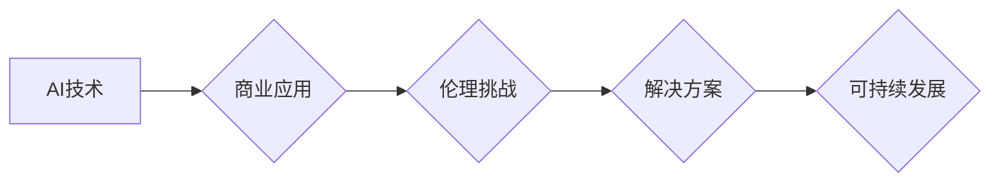

                 

## AI驱动的创新：人类计算在商业中的道德考虑因素展望挑战

> 关键词：人工智能、商业伦理、人类计算、算法偏见、数据隐私、透明度、可解释性、责任

### 1. 背景介绍

人工智能（AI）正以惊人的速度发展，深刻地改变着我们生活的方方面面，商业领域也不例外。AI驱动的创新正在为企业带来前所未有的机遇，例如自动化流程、个性化服务、数据驱动的决策等。然而，随着AI技术的日益普及，其带来的伦理挑战也日益凸显。

人类计算，即人类与计算机协同工作，在AI驱动的商业环境中扮演着至关重要的角色。人类的创造力、批判性思维和情感智能与AI的计算能力和数据处理能力相辅相成，共同推动着商业创新。然而，在AI与人类计算的融合过程中，我们需要认真思考并应对一系列道德挑战，以确保AI技术的发展造福人类，而不是带来负面影响。

### 2. 核心概念与联系

**2.1 人工智能（AI）**

人工智能是指模拟人类智能行为的计算机系统。AI技术涵盖了广泛的领域，包括机器学习、深度学习、自然语言处理、计算机视觉等。

**2.2 商业伦理**

商业伦理是指企业在经营活动中遵循的道德准则和价值观。它涉及到诚信、公平、责任、透明度等方面。

**2.3 人类计算**

人类计算是指人类与计算机协同工作，利用各自的优势来完成复杂的任务。在AI驱动的商业环境中，人类计算强调人类的创造力、批判性思维和情感智能与AI的计算能力和数据处理能力的融合。

**2.4 伦理挑战**

AI技术的发展带来了许多伦理挑战，例如算法偏见、数据隐私、透明度、可解释性、责任等。

**2.5 解决方案**

为了应对AI带来的伦理挑战，我们需要从多个方面着手，例如制定伦理规范、加强监管、提高公众意识、促进技术创新等。

**Mermaid 流程图**



### 3. 核心算法原理 & 具体操作步骤

**3.1 算法原理概述**

在AI驱动的商业环境中，许多核心算法被广泛应用，例如机器学习、深度学习、自然语言处理等。这些算法通过学习数据模式和规律，实现自动化的决策和预测。

**3.2 算法步骤详解**

以机器学习为例，其基本步骤包括：

1. 数据收集和预处理：收集相关数据并进行清洗、转换、特征提取等预处理工作。
2. 模型选择：根据具体任务选择合适的机器学习模型，例如线性回归、逻辑回归、决策树、支持向量机等。
3. 模型训练：使用训练数据训练模型，调整模型参数以最小化预测误差。
4. 模型评估：使用测试数据评估模型的性能，例如准确率、召回率、F1-score等。
5. 模型部署：将训练好的模型部署到实际应用场景中，用于预测和决策。

**3.3 算法优缺点**

**优点：**

* 自动化决策：可以自动学习数据模式，实现自动化决策，提高效率。
* 数据驱动：基于数据进行决策，更加客观和科学。
* 持续优化：可以通过不断学习新的数据，不断优化模型性能。

**缺点：**

* 算法偏见：如果训练数据存在偏见，模型也会学习到这些偏见，导致不公平的结果。
* 数据隐私：机器学习模型需要大量数据进行训练，可能会泄露用户隐私信息。
* 可解释性差：一些复杂的机器学习模型难以解释其决策过程，缺乏透明度。

**3.4 算法应用领域**

机器学习算法广泛应用于商业领域，例如：

* 客户关系管理（CRM）：预测客户行为，个性化营销。
* 金融风险管理：识别欺诈行为，评估信用风险。
* 供应链管理：优化物流配送，预测需求变化。
* 人力资源管理：招聘筛选、绩效评估。

### 4. 数学模型和公式 & 详细讲解 & 举例说明

**4.1 数学模型构建**

在机器学习中，常用的数学模型包括线性回归、逻辑回归、支持向量机等。这些模型通过数学公式来描述数据之间的关系，并进行预测。

**4.2 公式推导过程**

例如，线性回归模型的目标是找到一条直线，使得这条直线与数据点之间的误差最小。其数学公式如下：

$$y = mx + c$$

其中，y是预测值，x是输入特征，m是斜率，c是截距。

通过最小二乘法，可以求解出m和c的值，使得误差最小。

**4.3 案例分析与讲解**

假设我们想要预测房价，输入特征包括房屋面积、房间数量、地理位置等。我们可以使用线性回归模型来建立房价预测模型。

通过训练数据，我们可以得到模型参数m和c，例如：

$$y = 0.5x + 100$$

其中，y是预测房价，x是房屋面积。

当我们输入一个面积为150平方米的房屋时，我们可以使用公式预测其房价：

$$y = 0.5 * 150 + 100 = 225$$

因此，我们预测该房屋的房价为225万元。

### 5. 项目实践：代码实例和详细解释说明

**5.1 开发环境搭建**

可以使用Python语言和相关的机器学习库，例如scikit-learn，TensorFlow等，来开发AI驱动的商业项目。

**5.2 源代码详细实现**

```python
from sklearn.linear_model import LinearRegression
import pandas as pd

# 加载数据
data = pd.read_csv('house_data.csv')

# 划分训练集和测试集
X = data[['area', 'rooms']]
y = data['price']
from sklearn.model_selection import train_test_split
X_train, X_test, y_train, y_test = train_test_split(X, y, test_size=0.2)

# 创建线性回归模型
model = LinearRegression()

# 训练模型
model.fit(X_train, y_train)

# 预测测试集数据
y_pred = model.predict(X_test)

# 评估模型性能
from sklearn.metrics import mean_squared_error
mse = mean_squared_error(y_test, y_pred)
print('Mean Squared Error:', mse)
```

**5.3 代码解读与分析**

这段代码实现了房价预测的简单示例。首先，加载房价数据，然后划分训练集和测试集。接着，创建线性回归模型，并使用训练数据进行模型训练。最后，使用测试数据进行预测，并评估模型性能。

**5.4 运行结果展示**

运行代码后，会输出模型的平均平方误差（MSE）值，该值可以用来评估模型的预测精度。

### 6. 实际应用场景

**6.1 客户关系管理（CRM）**

AI驱动的CRM系统可以分析客户数据，预测客户行为，提供个性化营销服务，提高客户满意度和忠诚度。

**6.2 金融风险管理**

AI算法可以识别欺诈行为，评估信用风险，帮助金融机构降低风险，提高运营效率。

**6.3 供应链管理**

AI可以优化物流配送，预测需求变化，帮助企业提高供应链效率，降低成本。

**6.4 人力资源管理**

AI可以用于招聘筛选、绩效评估、员工培训等方面，帮助企业提高人力资源管理效率。

**6.5 未来应用展望**

随着AI技术的不断发展，其在商业领域的应用场景将更加广泛，例如：

* 个性化产品设计：AI可以根据用户的需求和喜好，设计个性化的产品。
* 自动化决策：AI可以自动完成一些决策任务，例如定价、库存管理等。
* 智能客服：AI驱动的聊天机器人可以提供24小时在线客服服务，提高客户体验。

### 7. 工具和资源推荐

**7.1 学习资源推荐**

* **在线课程:** Coursera, edX, Udacity 等平台提供丰富的AI课程。
* **书籍:** 《深度学习》、《机器学习实战》等书籍是学习AI的基础教材。
* **开源项目:** TensorFlow, PyTorch 等开源项目可以帮助你实践AI算法。

**7.2 开发工具推荐**

* **Python:** Python 是AI开发最常用的编程语言。
* **scikit-learn:** scikit-learn 是Python机器学习库，提供各种算法和工具。
* **TensorFlow:** TensorFlow 是Google开发的深度学习框架。
* **PyTorch:** PyTorch 是Facebook开发的深度学习框架。

**7.3 相关论文推荐**

* **《ImageNet Classification with Deep Convolutional Neural Networks》**
* **《Attention Is All You Need》**
* **《BERT: Pre-training of Deep Bidirectional Transformers for Language Understanding》**

### 8. 总结：未来发展趋势与挑战

**8.1 研究成果总结**

近年来，AI技术取得了长足的进步，在商业领域应用越来越广泛。

**8.2 未来发展趋势**

未来，AI技术将朝着更加智能、自动化、个性化的方向发展。

* **更强大的计算能力:** 随着硬件技术的进步，AI模型将更加强大，能够处理更复杂的任务。
* **更丰富的算法:** 新的AI算法将不断涌现，例如强化学习、迁移学习等，为商业应用带来更多可能性。
* **更广泛的应用场景:** AI将应用于更多领域，例如医疗、教育、交通等，带来更深远的影响。

**8.3 面临的挑战**

AI技术的发展也面临着一些挑战，例如：

* **算法偏见:** AI算法可能会学习到数据中的偏见，导致不公平的结果。
* **数据隐私:** AI模型需要大量数据进行训练，可能会泄露用户隐私信息。
* **可解释性:** 一些复杂的AI模型难以解释其决策过程，缺乏透明度。

**8.4 研究展望**

为了应对这些挑战，我们需要加强AI伦理研究，制定相应的规范和政策，确保AI技术的发展造福人类。

### 9. 附录：常见问题与解答

**9.1 如何解决算法偏见问题？**

* 使用更加公平的数据集进行训练。
* 开发算法去偏见的方法。
* 定期评估模型的公平性，并进行调整。

**9.2 如何保护数据隐私？**

* 使用匿名化技术处理数据。
* 加强数据安全防护措施。
* 明确数据使用规则，获得用户同意。

**9.3 如何提高AI模型的可解释性？**

* 使用可解释的AI算法。
* 开发可视化工具，帮助理解模型决策过程。
* 结合专家知识，解释模型的预测结果。


作者：禅与计算机程序设计艺术 / Zen and the Art of Computer Programming 
<end_of_turn>

