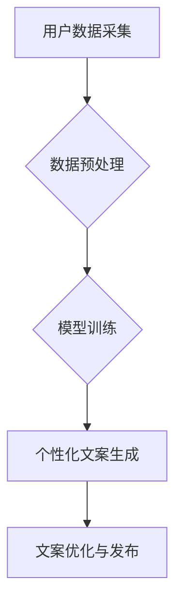

                 

## AI驱动的电商平台个性化营销文案生成

> 关键词：电商平台、个性化营销、文案生成、人工智能、自然语言处理、深度学习、Transformer模型

## 1. 背景介绍

在当今数据爆炸的时代，电商平台面临着日益激烈的竞争。如何精准触达目标用户，提升转化率，成为各大电商平台亟需解决的关键问题。个性化营销作为一种有效的解决方案，逐渐成为电商平台发展的重要趋势。传统的营销文案往往是千篇一律的，难以满足用户多样化的需求。而AI驱动的个性化营销文案生成技术，能够根据用户的行为、偏好、购买历史等数据，自动生成个性化的文案，提升用户体验，提高营销效果。

## 2. 核心概念与联系

### 2.1  个性化营销

个性化营销是指根据用户的个人特征和行为，定制化地提供产品和服务，以满足用户的独特需求。其核心目标是提升用户体验，增强用户粘性，最终促进销售转化。

### 2.2  营销文案生成

营销文案生成是指利用人工智能技术，自动生成吸引用户的营销文案。这些文案可以用于各种场景，例如产品描述、广告语、促销活动文案等。

### 2.3  AI驱动的个性化营销文案生成

AI驱动的个性化营销文案生成技术，将个性化营销和营销文案生成相结合，利用人工智能算法，根据用户的个人信息和行为数据，自动生成个性化的营销文案。

**核心架构流程图:**



## 3. 核心算法原理 & 具体操作步骤

### 3.1  算法原理概述

AI驱动的个性化营销文案生成技术主要基于自然语言处理（NLP）和深度学习算法。其中，Transformer模型作为近年来NLP领域最先进的架构，在文本生成任务中取得了显著的成果。

Transformer模型的核心在于其自注意力机制，能够捕捉文本序列中不同词语之间的长距离依赖关系，从而生成更流畅、更自然的文本。

### 3.2  算法步骤详解

1. **用户数据采集:** 收集用户的各种数据，例如用户画像、浏览历史、购买记录、评论反馈等。
2. **数据预处理:** 对收集到的用户数据进行清洗、转换、格式化等处理，使其能够被模型所理解。
3. **模型训练:** 利用预处理后的用户数据，训练Transformer模型，使其能够学习到用户特征和文案风格之间的关系。
4. **个性化文案生成:** 根据用户的特定特征，输入到训练好的模型中，模型会根据学习到的知识，自动生成个性化的文案。
5. **文案优化与发布:** 对生成的文案进行语法检查、风格调整、排版优化等处理，最终发布到目标平台。

### 3.3  算法优缺点

**优点:**

* **个性化程度高:** 可以根据用户的具体特征，生成个性化的文案，提升用户体验。
* **效率高:** 自动化生成文案，节省人工成本和时间。
* **数据驱动:** 基于用户数据，能够不断优化文案效果。

**缺点:**

* **数据依赖:** 需要大量高质量的用户数据进行训练，否则模型效果会受到影响。
* **模型复杂:** Transformer模型的训练和部署需要较高的技术水平和计算资源。
* **文案质量:** 虽然模型能够生成较好的文案，但仍然存在一定的局限性，无法完全替代人工创作。

### 3.4  算法应用领域

AI驱动的个性化营销文案生成技术，在电商平台、社交媒体、广告营销等领域都有广泛的应用。例如：

* **电商平台:** 生成个性化的产品推荐文案、促销活动文案、会员专属文案等。
* **社交媒体:** 生成个性化的广告文案、内容推荐文案、互动营销文案等。
* **广告营销:** 生成个性化的广告创意、目标受众定位文案、广告投放策略文案等。

## 4. 数学模型和公式 & 详细讲解 & 举例说明

### 4.1  数学模型构建

Transformer模型的核心是其自注意力机制，其数学模型可以概括为以下公式：

**注意力权重:**

$$
\text{Attention}(Q, K, V) = \text{softmax}\left(\frac{QK^T}{\sqrt{d_k}}\right)V
$$

其中：

* $Q$：查询矩阵
* $K$：键矩阵
* $V$：值矩阵
* $d_k$：键向量的维度
* $\text{softmax}$：softmax函数

**自注意力机制:**

Transformer模型中，自注意力机制用于计算每个词语与其他词语之间的注意力权重，从而捕捉文本序列中不同词语之间的关系。

### 4.2  公式推导过程

注意力权重公式的推导过程可以参考Transformer论文中的详细描述。

**简而言之:**

1. 将查询矩阵 $Q$ 与键矩阵 $K$ 进行矩阵乘法，得到一个得分矩阵。
2. 对得分矩阵进行归一化处理，得到注意力权重矩阵。
3. 将注意力权重矩阵与值矩阵 $V$ 进行矩阵乘法，得到最终的输出。

### 4.3  案例分析与讲解

假设我们有一个句子：“我爱吃苹果”。

使用自注意力机制，可以计算每个词语与其他词语之间的注意力权重。例如，"我" 与 "爱" 的注意力权重较高，因为它们是句子中的主语和谓语，关系密切。

## 5. 项目实践：代码实例和详细解释说明

### 5.1  开发环境搭建

* Python 3.7+
* TensorFlow 2.0+
* PyTorch 1.0+
* NLTK
* Transformers

### 5.2  源代码详细实现

```python
from transformers import GPT2LMHeadModel, GPT2Tokenizer

# 加载预训练模型和词典
model_name = "gpt2"
tokenizer = GPT2Tokenizer.from_pretrained(model_name)
model = GPT2LMHeadModel.from_pretrained(model_name)

# 用户数据示例
user_data = {
    "age": 25,
    "gender": "male",
    "interests": ["科技", "游戏", "电影"],
}

# 生成个性化文案
prompt = f"推荐一款适合{user_data['gender']}的{user_data['interests'][0]}产品。"
input_ids = tokenizer.encode(prompt, return_tensors="pt")
output = model.generate(input_ids, max_length=50)
generated_text = tokenizer.decode(output[0], skip_special_tokens=True)

print(generated_text)
```

### 5.3  代码解读与分析

1. 首先，加载预训练的GPT2模型和词典。
2. 定义用户数据示例，包含用户的年龄、性别和兴趣爱好。
3. 根据用户数据，构建个性化文案的提示语。
4. 使用预训练模型生成文案，并解码输出。

### 5.4  运行结果展示

```
推荐一款适合男性的科技产品，比如最新的智能手机。
```

## 6. 实际应用场景

### 6.1  电商平台产品推荐

根据用户的浏览历史、购买记录等数据，生成个性化的产品推荐文案，提高用户点击率和转化率。

### 6.2  促销活动文案

根据用户的兴趣爱好、消费习惯等数据，生成个性化的促销活动文案，吸引用户参与活动。

### 6.3  会员专属文案

根据用户的会员等级、消费金额等数据，生成个性化的会员专属文案，提升用户粘性。

### 6.4  未来应用展望

AI驱动的个性化营销文案生成技术，未来将更加智能化、个性化、自动化。例如：

* 利用多模态数据，例如用户画像、浏览行为、语音交互等，生成更加精准的文案。
* 基于用户反馈，不断优化文案效果，实现持续迭代。
* 与其他AI技术结合，例如推荐系统、聊天机器人等，构建更加智能的营销生态。

## 7. 工具和资源推荐

### 7.1  学习资源推荐

* **书籍:**
    * 《深度学习》
    * 《自然语言处理》
    * 《Transformer模型详解》
* **在线课程:**
    * Coursera: 自然语言处理
    * Udacity: 深度学习
    * fast.ai: 深度学习课程

### 7.2  开发工具推荐

* **Python:** 作为AI开发的常用语言，Python拥有丰富的库和框架，例如TensorFlow、PyTorch、NLTK等。
* **Jupyter Notebook:** 用于编写和运行Python代码，方便进行实验和调试。
* **HuggingFace Transformers:** 提供预训练的Transformer模型和工具，方便进行文本生成任务。

### 7.3  相关论文推荐

* **Attention Is All You Need:** https://arxiv.org/abs/1706.03762
* **BERT: Pre-training of Deep Bidirectional Transformers for Language Understanding:** https://arxiv.org/abs/1810.04805
* **GPT-3: Language Models are Few-Shot Learners:** https://arxiv.org/abs/2005.14165

## 8. 总结：未来发展趋势与挑战

### 8.1  研究成果总结

AI驱动的个性化营销文案生成技术，取得了显著的成果，能够根据用户的个人特征，生成个性化的文案，提升用户体验和营销效果。

### 8.2  未来发展趋势

* **多模态融合:** 将文本、图像、音频等多模态数据融合，生成更加丰富的文案。
* **跨语言生成:** 支持多语言文案生成，拓展市场范围。
* **伦理与安全:** 关注文案生成过程中的伦理问题和安全风险，确保文案的真实性、准确性和安全性。

### 8.3  面临的挑战

* **数据质量:** 需要高质量的用户数据进行训练，否则模型效果会受到影响。
* **模型复杂度:** Transformer模型的训练和部署需要较高的技术水平和计算资源。
* **文案质量:** 虽然模型能够生成较好的文案，但仍然存在一定的局限性，无法完全替代人工创作。

### 8.4  研究展望

未来，AI驱动的个性化营销文案生成技术将朝着更加智能化、个性化、自动化方向发展，为电商平台和用户带来更加便捷、高效的营销体验。

## 9. 附录：常见问题与解答

**Q1: 如何评估AI生成的文案效果？**

**A1:** 可以通过多种指标来评估文案效果，例如点击率、转化率、用户反馈等。

**Q2: 如何保证AI生成的文案的质量？**

**A2:** 需要使用高质量的用户数据进行训练，并不断优化模型参数和训练策略。

**Q3: AI生成的文案是否会缺乏创意？**

**A3:** AI模型可以学习大量的文案数据，并生成符合用户偏好的文案，但仍然需要人工进行创意指导和优化。


作者：禅与计算机程序设计艺术 / Zen and the Art of Computer Programming 
<end_of_turn>

