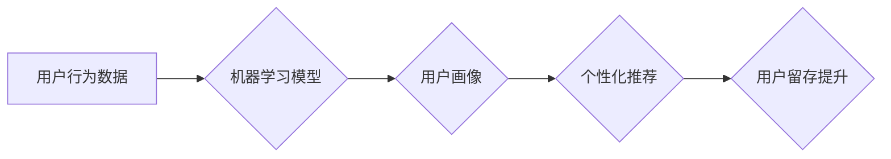

                 

## AI驱动的电商平台用户留存策略

> 关键词：电商平台、用户留存、人工智能、机器学习、深度学习、推荐系统、个性化

## 1. 背景介绍

在当今激烈的电商市场竞争中，用户留存率已成为衡量平台成功与否的关键指标。用户留存率越高，意味着平台的用户粘性更强，复购率更高，最终也能够带来更高的商业价值。传统电商平台通常依靠一些简单的策略，如优惠券、积分奖励等来提高用户留存率，但这些策略往往效果有限，难以满足用户日益增长的个性化需求。

随着人工智能技术的快速发展，AI驱动的用户留存策略逐渐成为电商平台提升用户留存率的新方向。AI算法能够通过对海量用户数据进行分析和挖掘，识别用户行为模式和偏好，从而精准地推送个性化推荐，提供更贴心的服务，最终提高用户留存率。

## 2. 核心概念与联系

### 2.1 用户留存

用户留存是指用户在一段时间内持续使用平台的比例。通常用留存率来衡量，留存率 = (特定时间段内活跃用户数 / 前一个时间段内活跃用户数) * 100%。

### 2.2 人工智能 (AI)

人工智能是指模拟人类智能的计算机系统。AI技术涵盖了多个领域，如机器学习、深度学习、自然语言处理等。

### 2.3 机器学习 (ML)

机器学习是人工智能的一个子领域，它通过算法训练模型，使模型能够从数据中学习，并根据学习到的知识进行预测或决策。

### 2.4 深度学习 (DL)

深度学习是机器学习的一个子领域，它使用多层神经网络来模拟人类大脑的学习过程，能够处理更复杂的数据，并获得更精准的预测结果。

**核心概念与联系流程图**



## 3. 核心算法原理 & 具体操作步骤

### 3.1 算法原理概述

AI驱动的电商平台用户留存策略通常基于机器学习算法，例如：

* **协同过滤算法:** 通过分析用户历史行为数据，预测用户可能感兴趣的商品，并推荐给用户。
* **内容基准算法:** 根据用户浏览历史、购买记录等数据，分析用户偏好，推荐与用户兴趣相符的内容。
* **深度学习算法:** 使用深度神经网络，从海量用户数据中学习更复杂的特征，实现更精准的个性化推荐。

### 3.2 算法步骤详解

1. **数据收集:** 收集用户行为数据，包括浏览记录、购买记录、评价信息、购物车信息等。
2. **数据预处理:** 对收集到的数据进行清洗、转换、特征提取等预处理操作，以便于算法训练。
3. **模型选择:** 根据业务需求和数据特点，选择合适的机器学习算法。
4. **模型训练:** 使用训练数据对模型进行训练，调整模型参数，使其能够准确预测用户行为。
5. **模型评估:** 使用测试数据对模型进行评估，评估模型的准确率、召回率等指标。
6. **模型部署:** 将训练好的模型部署到线上环境，实时进行用户行为预测和个性化推荐。
7. **效果监控:** 持续监控模型的运行效果，并根据实际情况进行模型调整和优化。

### 3.3 算法优缺点

**优点:**

* **精准度高:** AI算法能够从海量数据中挖掘用户行为模式，实现更精准的个性化推荐。
* **自动化程度高:** AI算法能够自动完成用户画像、推荐生成等任务，降低人工成本。
* **可持续优化:** AI算法能够根据用户反馈和数据变化进行持续优化，不断提升推荐效果。

**缺点:**

* **数据依赖性强:** AI算法需要大量高质量的数据进行训练，否则效果难以保证。
* **算法复杂度高:** 训练和部署AI模型需要一定的技术门槛和资源投入。
* **解释性差:** 一些深度学习算法的决策过程难以解释，难以理解模型是如何做出推荐的。

### 3.4 算法应用领域

AI驱动的用户留存策略广泛应用于电商平台、社交媒体、内容平台等领域，例如：

* **商品推荐:** 根据用户兴趣和购买历史，推荐相关商品。
* **内容推荐:** 根据用户阅读习惯和偏好，推荐相关内容。
* **用户画像:** 分析用户行为数据，构建用户画像，了解用户需求和兴趣。
* **个性化营销:** 根据用户画像，进行个性化营销，提高营销效果。

## 4. 数学模型和公式 & 详细讲解 & 举例说明

### 4.1 数学模型构建

用户留存率可以看作是一个时间序列问题，可以使用以下数学模型来描述：

$$
L(t) = \frac{N(t)}{N(0)}
$$

其中：

* $L(t)$ 表示在时间 $t$ 时刻的用户留存率。
* $N(t)$ 表示在时间 $t$ 时刻的用户数量。
* $N(0)$ 表示初始用户数量。

### 4.2 公式推导过程

用户留存率的计算公式是基于用户数量的变化趋势来推导的。假设用户在时间 $t$ 时刻的活跃度为 $A(t)$，则用户数量的变化可以表示为：

$$
N(t) = N(0) * \prod_{i=1}^{t} (1 - A(i))
$$

其中：

* $A(i)$ 表示在时间 $i$ 时刻的用户流失率。

将用户数量的变化公式代入留存率公式，得到：

$$
L(t) = \frac{N(0) * \prod_{i=1}^{t} (1 - A(i))}{N(0)} = \prod_{i=1}^{t} (1 - A(i))
$$

### 4.3 案例分析与讲解

假设电商平台在第一天上线时有 1000 个用户，第一天用户流失率为 10%，第二天用户流失率为 5%，那么在第二天结束时，平台的用户留存率为：

$$
L(2) = (1 - 0.1) * (1 - 0.05) = 0.85 * 0.95 = 0.8075
$$

即平台在第二天结束时，用户留存率为 80.75%。

## 5. 项目实践：代码实例和详细解释说明

### 5.1 开发环境搭建

* 操作系统: Ubuntu 20.04
* Python 版本: 3.8
* 必要的库: pandas, numpy, scikit-learn, tensorflow

### 5.2 源代码详细实现

```python
# 导入必要的库
import pandas as pd
from sklearn.model_selection import train_test_split
from sklearn.linear_model import LogisticRegression

# 加载用户行为数据
data = pd.read_csv('user_behavior.csv')

# 数据预处理
# ...

# 将数据分为训练集和测试集
X_train, X_test, y_train, y_test = train_test_split(data[['feature1', 'feature2', ...]], data['label'], test_size=0.2)

# 创建逻辑回归模型
model = LogisticRegression()

# 训练模型
model.fit(X_train, y_train)

# 评估模型
# ...

# 使用模型进行预测
predictions = model.predict(X_test)

# 评估预测结果
# ...
```

### 5.3 代码解读与分析

* 代码首先导入必要的库，然后加载用户行为数据。
* 数据预处理步骤根据实际数据情况进行调整，例如缺失值处理、特征工程等。
* 使用 `train_test_split` 函数将数据分为训练集和测试集，用于模型训练和评估。
* 创建逻辑回归模型，并使用 `fit` 函数进行训练。
* 使用 `predict` 函数对测试集进行预测，并使用相应的评估指标评估预测结果。

### 5.4 运行结果展示

运行结果展示包括模型的评估指标、预测结果等。

## 6. 实际应用场景

AI驱动的用户留存策略在电商平台的实际应用场景非常广泛，例如：

* **个性化商品推荐:** 根据用户的浏览历史、购买记录等数据，推荐用户可能感兴趣的商品，提高用户购物体验和复购率。
* **用户画像分析:** 通过分析用户的行为数据，构建用户画像，了解用户的兴趣爱好、消费习惯等，为用户提供更精准的个性化服务。
* **精准营销:** 根据用户的画像信息，进行精准营销，例如推送优惠券、促销信息等，提高营销效果。
* **用户行为预警:** 通过分析用户的行为数据，预测用户可能流失的风险，并采取措施挽留用户。

### 6.4 未来应用展望

未来，AI驱动的用户留存策略将会更加智能化、个性化。例如：

* **多模态数据融合:** 将文本、图像、视频等多模态数据融合，构建更全面的用户画像，实现更精准的个性化推荐。
* **实时个性化推荐:** 利用实时数据流，实现对用户行为的实时分析和个性化推荐，提升用户体验。
* **用户行为预测:** 利用深度学习算法，预测用户的未来行为，例如购买意愿、流失风险等，为平台制定更有效的留存策略。

## 7. 工具和资源推荐

### 7.1 学习资源推荐

* **书籍:**
    * 《深度学习》 by Ian Goodfellow, Yoshua Bengio, Aaron Courville
    * 《机器学习实战》 by Sebastian Raschka, Vahid Mirjalili
* **在线课程:**
    * Coursera: Machine Learning by Andrew Ng
    * Udacity: Deep Learning Nanodegree
* **博客和网站:**
    * Towards Data Science
    * Machine Learning Mastery

### 7.2 开发工具推荐

* **Python:** 广泛应用于机器学习和深度学习开发。
* **TensorFlow:** 开源深度学习框架，提供丰富的工具和资源。
* **PyTorch:** 开源深度学习框架，以其灵活性和易用性而闻名。
* **Scikit-learn:** Python机器学习库，提供各种经典机器学习算法。

### 7.3 相关论文推荐

* **Attention Is All You Need:** https://arxiv.org/abs/1706.03762
* **BERT: Pre-training of Deep Bidirectional Transformers for Language Understanding:** https://arxiv.org/abs/1810.04805
* **Recurrent Neural Networks for Sequence Learning:** https://www.cs.toronto.edu/~graves/preprint.pdf

## 8. 总结：未来发展趋势与挑战

### 8.1 研究成果总结

AI驱动的电商平台用户留存策略取得了显著的成果，能够有效提高用户留存率，提升平台商业价值。

### 8.2 未来发展趋势

未来，AI驱动的用户留存策略将会更加智能化、个性化，并朝着以下方向发展：

* **多模态数据融合:** 将文本、图像、视频等多模态数据融合，构建更全面的用户画像。
* **实时个性化推荐:** 利用实时数据流，实现对用户行为的实时分析和个性化推荐。
* **用户行为预测:** 利用深度学习算法，预测用户的未来行为，例如购买意愿、流失风险等。

### 8.3 面临的挑战

AI驱动的用户留存策略也面临一些挑战，例如：

* **数据质量:** AI算法对数据质量要求很高，需要高质量、丰富的数据进行训练。
* **算法解释性:** 一些深度学习算法的决策过程难以解释，难以理解模型是如何做出推荐的。
* **隐私保护:** AI算法的训练和应用需要处理大量用户数据，需要确保用户隐私安全。

### 8.4 研究展望

未来，需要进一步研究以下问题：

* 如何提高AI算法对低质量数据的鲁棒性。
* 如何提高深度学习算法的解释性。
* 如何在保证用户隐私安全的前提下，有效利用用户数据进行AI算法训练和应用。

## 9. 附录：常见问题与解答

**Q1: AI驱动的用户留存策略需要哪些数据？**

**A1:** AI驱动的用户留存策略需要收集用户行为数据，包括浏览记录、购买记录、评价信息、购物车信息等。

**Q2: 如何评估AI驱动的用户留存策略的效果？**

**A2:** 可以使用留存率、用户活跃度、复购率等指标来评估AI驱动的用户留存策略的效果。

**Q3: AI驱动的用户留存策略会侵犯用户隐私吗？**

**A3:** AI驱动的用户留存策略需要谨慎处理用户数据，确保用户隐私安全。可以使用数据匿名化、加密等技术来保护用户隐私。


作者：禅与计算机程序设计艺术 / Zen and the Art of Computer Programming 
<end_of_turn>

