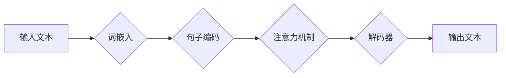

                 

## LLM的跨语言能力：打破全球沟通障碍

> 关键词：大型语言模型（LLM）、跨语言理解、机器翻译、多语言处理、自然语言处理（NLP）、全球沟通、人工智能

## 1. 背景介绍

在全球化时代，跨语言沟通已成为一个至关重要的议题。语言障碍阻碍了信息交流、文化理解和国际合作。传统机器翻译技术虽然取得了一定的进展，但仍然存在着准确性、流畅度和文化理解方面的局限性。近年来，大型语言模型（LLM）的出现为跨语言沟通带来了新的希望。

LLM 是一种基于深度学习的强大人工智能模型，能够理解和生成人类语言。它们通过训练海量文本数据，学习语言的语法、语义和上下文关系。由于其强大的学习能力和泛化能力，LLM 在跨语言理解、机器翻译、文本摘要、对话系统等多个领域展现出令人瞩目的潜力。

## 2. 核心概念与联系

**2.1 跨语言理解**

跨语言理解是指机器能够理解不同语言的文本并提取其含义的能力。这包括：

* **词语翻译:** 将一个语言的词语转换为另一个语言的等价词。
* **句子翻译:** 将一个语言的句子转换为另一个语言的等价句子。
* **文本蕴含:** 判断一个文本是否蕴含另一个文本的信息。
* **文本相似度:** 计算两个文本之间的相似度。

**2.2 机器翻译**

机器翻译是指使用计算机程序将一种语言的文本自动翻译成另一种语言的文本。LLM 在机器翻译领域取得了显著的进展，能够生成更准确、更流畅的翻译结果。

**2.3 多语言处理**

多语言处理 (Multilingual Processing) 是指处理多种语言的文本任务。LLM 可以通过训练多语言文本数据，学习多种语言的共同特征和差异，从而实现跨语言理解和生成。

**2.4 自然语言处理**

自然语言处理 (NLP) 是人工智能的一个分支，致力于使计算机能够理解、处理和生成人类语言。LLM 是 NLP 领域的重要发展方向，其强大的能力为 NLP 领域带来了新的机遇。

**Mermaid 流程图**



## 3. 核心算法原理 & 具体操作步骤

**3.1 算法原理概述**

LLM 的核心算法原理是基于 Transformer 架构，它利用注意力机制来捕捉文本中的长距离依赖关系。Transformer 架构由编码器和解码器两部分组成。编码器将输入文本转换为隐藏表示，解码器则根据隐藏表示生成输出文本。

**3.2 算法步骤详解**

1. **词嵌入:** 将输入文本中的每个词转换为一个低维向量表示，称为词嵌入。
2. **句子编码:** 将词嵌入序列转换为句子表示，捕捉句子级别的语义信息。
3. **注意力机制:** 利用注意力机制计算每个词与其他词之间的相关性，从而捕捉文本中的长距离依赖关系。
4. **解码器:** 根据编码器输出的隐藏表示和注意力机制的输出，生成输出文本。

**3.3 算法优缺点**

**优点:**

* 能够捕捉长距离依赖关系，提高翻译质量。
* 训练效率高，能够处理海量文本数据。
* 泛化能力强，能够应用于多种语言和任务。

**缺点:**

* 计算复杂度高，需要大量的计算资源。
* 训练数据量大，需要大量标注数据。
* 容易受到训练数据偏差的影响。

**3.4 算法应用领域**

* 机器翻译
* 文本摘要
* 问答系统
* 对话系统
* 代码生成
* 文本分类

## 4. 数学模型和公式 & 详细讲解 & 举例说明

**4.1 数学模型构建**

LLM 的数学模型主要基于 Transformer 架构，其核心是注意力机制和多头注意力机制。

**4.2 公式推导过程**

* **注意力机制:**

$$
\text{Attention}(Q, K, V) = \text{softmax}\left(\frac{Q K^T}{\sqrt{d_k}}\right) V
$$

其中：

* $Q$：查询矩阵
* $K$：键矩阵
* $V$：值矩阵
* $d_k$：键向量的维度
* $\text{softmax}$：softmax 函数

* **多头注意力机制:**

$$
\text{MultiHeadAttention}(Q, K, V) = \text{Concat}(head_1, head_2, ..., head_h) W^O
$$

其中：

* $head_i$：第 $i$ 个注意力头的输出
* $h$：注意力头的数量
* $W^O$：最终输出层的权重矩阵

**4.3 案例分析与讲解**

假设我们有两个句子：

* 句子 1：The cat sat on the mat.
* 句子 2：Le chat était sur le tapis.

使用多头注意力机制，我们可以计算这两个句子之间的注意力权重，从而了解它们之间的关系。例如，"cat" 和 "chat" 之间的注意力权重会比较高，因为它们是同义词。

## 5. 项目实践：代码实例和详细解释说明

**5.1 开发环境搭建**

* Python 3.7+
* PyTorch 或 TensorFlow
* CUDA 和 cuDNN

**5.2 源代码详细实现**

```python
import torch
import torch.nn as nn

class Transformer(nn.Module):
    def __init__(self, vocab_size, embedding_dim, num_heads, num_layers):
        super(Transformer, self).__init__()
        self.embedding = nn.Embedding(vocab_size, embedding_dim)
        self.encoder = nn.TransformerEncoder(nn.TransformerEncoderLayer(embedding_dim, num_heads), num_layers)
        self.decoder = nn.TransformerDecoder(nn.TransformerDecoderLayer(embedding_dim, num_heads), num_layers)
        self.fc = nn.Linear(embedding_dim, vocab_size)

    def forward(self, src, tgt, src_mask, tgt_mask):
        src = self.embedding(src)
        tgt = self.embedding(tgt)
        encoder_output = self.encoder(src, src_mask)
        decoder_output = self.decoder(tgt, encoder_output, tgt_mask)
        output = self.fc(decoder_output)
        return output
```

**5.3 代码解读与分析**

* `Transformer` 类定义了 Transformer 模型的结构。
* `embedding` 层将词索引转换为词向量。
* `encoder` 和 `decoder` 层分别负责编码和解码文本。
* `fc` 层将隐藏表示转换为输出词向量。
* `forward` 方法定义了模型的输入和输出。

**5.4 运行结果展示**

使用训练好的 Transformer 模型，可以对文本进行机器翻译、文本摘要等任务。

## 6. 实际应用场景

**6.1 机器翻译**

LLM 可以用于构建高精度、流畅的机器翻译系统，打破语言障碍，促进跨文化交流。

**6.2 文本摘要**

LLM 可以自动生成文本摘要，帮助用户快速了解文章内容，提高信息获取效率。

**6.3 对话系统**

LLM 可以用于构建更智能、更自然的对话系统，例如聊天机器人、虚拟助手等。

**6.4 未来应用展望**

* **个性化教育:** 根据学生的学习进度和需求，提供个性化的学习内容和辅导。
* **医疗诊断:** 辅助医生进行疾病诊断，提高诊断准确率。
* **法律服务:** 自动分析法律文件，提供法律建议。

## 7. 工具和资源推荐

**7.1 学习资源推荐**

* **书籍:**

    * 《深度学习》
    * 《自然语言处理》

* **在线课程:**

    * Coursera: 自然语言处理
    * edX: 深度学习

**7.2 开发工具推荐**

* **PyTorch:** 深度学习框架
* **TensorFlow:** 深度学习框架
* **Hugging Face Transformers:** 预训练 Transformer 模型库

**7.3 相关论文推荐**

* 《Attention Is All You Need》
* 《BERT: Pre-training of Deep Bidirectional Transformers for Language Understanding》

## 8. 总结：未来发展趋势与挑战

**8.1 研究成果总结**

LLM 在跨语言理解、机器翻译等领域取得了显著进展，为打破全球沟通障碍提供了新的可能性。

**8.2 未来发展趋势**

* **模型规模和能力的提升:** 训练更大规模的 LLM，提高其理解和生成能力。
* **跨模态理解:** 将文本理解与图像、音频等其他模态的理解结合起来。
* **可解释性增强:** 提高 LLM 的可解释性，帮助用户理解其决策过程。

**8.3 面临的挑战**

* **数据偏见:** 训练数据可能存在偏见，导致模型输出存在偏差。
* **计算资源:** 训练大型 LLM 需要大量的计算资源。
* **伦理问题:** LLM 的应用可能引发伦理问题，例如信息操纵、隐私泄露等。

**8.4 研究展望**

未来研究将继续探索 LLM 的潜力，解决其面临的挑战，推动其在跨语言沟通、人工智能等领域的应用。

## 9. 附录：常见问题与解答

**9.1 如何训练一个 LLM？**

训练一个 LLM 需要大量的计算资源和标注数据。可以使用预训练模型进行微调，降低训练成本。

**9.2 如何评估 LLM 的性能？**

可以使用 BLEU、ROUGE 等指标评估 LLM 的机器翻译性能。可以使用准确率、召回率等指标评估 LLM 的文本分类性能。

**9.3 LLM 的应用有哪些？**

LLM 的应用非常广泛，包括机器翻译、文本摘要、对话系统、代码生成等。


作者：禅与计算机程序设计艺术 / Zen and the Art of Computer Programming 
<end_of_turn>

