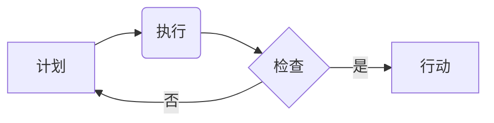

                 

## PDCA循环:从理论到实践的管理工具

> 关键词：PDCA循环, 管理工具, 持续改进, 软件开发, 项目管理, 流程优化, 质量管理

## 1. 背景介绍

在瞬息万变的科技时代，持续改进和优化已成为企业和个人发展的关键。PDCA循环，全称为Plan-Do-Check-Act（计划-执行-检查-行动），是一种被广泛应用于各个领域的管理工具，旨在通过循环迭代的方式不断提升效率和质量。

PDCA循环最初由美国质量管理专家Walter Shewhart提出，后来被W. Edwards Deming推广应用于管理领域。它提供了一种简单易懂、易于实施的框架，帮助组织和个人制定目标、执行计划、评估结果并进行调整，从而实现持续改进。

## 2. 核心概念与联系

PDCA循环的核心概念是通过四个阶段的循环迭代来实现持续改进：

* **Plan（计划）**: 明确目标，制定计划并分配资源。
* **Do（执行）**: 根据计划进行行动，并收集数据。
* **Check（检查）**: 分析数据，评估结果是否符合预期。
* **Act（行动）**: 根据检查结果，调整计划并执行改进措施。

**Mermaid 流程图**



PDCA循环是一个闭环的过程，每个阶段都与其他阶段紧密相连。计划阶段的成果直接影响执行阶段的行动，执行阶段的结果反馈到检查阶段，最终推动行动阶段的改进。

## 3. 核心算法原理 & 具体操作步骤

PDCA循环本身并非一个算法，而是一种管理方法。它没有固定的算法步骤，而是提供了一个框架，帮助组织和个人制定和执行改进计划。

### 3.1  算法原理概述

PDCA循环的原理基于持续改进和学习。通过不断循环迭代，可以不断发现问题、改进方案并最终实现目标。

### 3.2  算法步骤详解

1. **计划阶段**: 
    * 明确目标：首先要明确需要改进的目标是什么，并将其量化。
    * 分析现状：对当前状态进行分析，找出问题所在和改进的重点。
    * 制定计划：根据分析结果，制定具体的改进计划，包括行动步骤、资源分配和时间安排。
2. **执行阶段**: 
    * 按照计划执行行动：严格按照计划执行改进措施，并记录执行过程中的数据和信息。
3. **检查阶段**: 
    * 分析数据：对执行阶段收集的数据进行分析，评估改进措施的效果。
    * 比较结果：将实际结果与预期目标进行比较，找出差距和原因。
4. **行动阶段**: 
    * 调整计划：根据检查结果，对改进计划进行调整，并制定新的行动方案。
    * 持续改进：将改进措施纳入日常工作，并不断进行改进和优化。

### 3.3  算法优缺点

**优点**:

* 简单易懂：PDCA循环的原理和步骤非常简单易懂，易于理解和实施。
* 灵活可变：PDCA循环可以应用于各种不同的场景和领域，并且可以根据具体情况进行调整。
* 持续改进：通过循环迭代，可以不断发现问题、改进方案并最终实现目标。

**缺点**:

* 需要时间和资源：PDCA循环需要投入时间和资源来执行，并且需要持续的关注和维护。
* 难以量化结果：PDCA循环的成果往往难以量化，需要依靠经验和判断来评估。

### 3.4  算法应用领域

PDCA循环广泛应用于各个领域，例如：

* 软件开发：用于改进软件开发流程、提高软件质量和开发效率。
* 项目管理：用于管理项目进度、风险和成本，确保项目顺利完成。
* 质量管理：用于识别和解决质量问题，提高产品和服务的质量。
* 运营管理：用于优化运营流程、提高效率和降低成本。

## 4. 数学模型和公式 & 详细讲解 & 举例说明

PDCA循环本身并不依赖于复杂的数学模型和公式。它更侧重于流程和实践。然而，我们可以用一些数学概念来描述和分析PDCA循环的效率和效果。

### 4.1  数学模型构建

我们可以用一个简单的数学模型来描述PDCA循环的迭代过程：

* **目标函数**:  $f(t)$ 表示在时间 $t$ 时刻达到的目标完成度。
* **改进因子**: $k$ 表示每次迭代的改进幅度。
* **迭代次数**: $n$ 表示迭代的次数。

则目标函数的演化过程可以表示为：

$f(t) = f(0) + k \sum_{i=1}^{n} f(t_i)$

其中 $f(0)$ 是初始目标完成度，$t_i$ 是每次迭代的时间点。

### 4.2  公式推导过程

这个公式表明，目标完成度随着迭代次数的增加而不断提高。改进因子 $k$ 的大小决定了每次迭代的改进幅度，而迭代次数 $n$ 则决定了最终目标完成度的水平。

### 4.3  案例分析与讲解

假设我们想要提高软件开发效率，目标是将开发周期缩短 20%。我们可以将 PDCA循环应用于此目标，并使用上述数学模型来分析改进效果。

* **初始目标完成度**: $f(0) = 0$ (开发周期未缩短)
* **改进因子**: $k = 0.1$ (每次迭代缩短开发周期 10%)
* **迭代次数**: $n = 2$ (进行两次迭代)

根据公式，最终目标完成度为：

$f(t) = 0 + 0.1 \sum_{i=1}^{2} f(t_i) = 0.1 (f(t_1) + f(t_2))$

如果每次迭代都能缩短开发周期 10%，那么最终目标完成度将达到 20%。

## 5. 项目实践：代码实例和详细解释说明

由于 PDCA循环本身是一种管理方法，而不是具体的代码实现，因此无法提供直接的代码实例。

但是，我们可以通过代码示例来展示如何将 PDCA循环的思想应用于软件开发项目。

### 5.1  开发环境搭建

假设我们使用 Python 语言进行开发，需要搭建一个 Python 开发环境，包括 Python 解释器、代码编辑器和版本控制系统等。

### 5.2  源代码详细实现

```python
# 这是一个简单的示例，展示如何使用 PDCA 循环进行软件开发

def plan(goal):
  """
  计划阶段：制定改进计划
  """
  print(f"目标：{goal}")
  # 分析现状，制定改进方案
  # ...

def do(plan):
  """
  执行阶段：执行改进计划
  """
  print("执行计划...")
  # 按照计划执行改进措施
  # ...

def check(result):
  """
  检查阶段：分析结果
  """
  print("检查结果...")
  # 分析数据，评估改进效果
  # ...

def act(result, plan):
  """
  行动阶段：调整计划
  """
  print("调整计划...")
  # 根据检查结果，调整计划并执行改进措施
  # ...

# 示例使用
goal = "提高软件开发效率"
plan(goal)
do(plan)
result = check()
act(result, plan)
```

### 5.3  代码解读与分析

这个代码示例展示了 PDCA 循环的四个阶段：

* `plan()` 函数模拟计划阶段，制定改进计划。
* `do()` 函数模拟执行阶段，执行改进措施。
* `check()` 函数模拟检查阶段，分析结果。
* `act()` 函数模拟行动阶段，调整计划并执行改进措施。

### 5.4  运行结果展示

运行这个代码示例，会输出以下信息：

```
目标：提高软件开发效率
执行计划...
检查结果...
调整计划...
```

## 6. 实际应用场景

PDCA循环在软件开发领域有着广泛的应用场景，例如：

* **软件缺陷管理**: 使用 PDCA 循环来识别、分析和解决软件缺陷，提高软件质量。
* **软件流程优化**: 使用 PDCA 循环来优化软件开发流程，提高开发效率和降低成本。
* **新功能开发**: 使用 PDCA 循环来开发新功能，确保新功能符合用户需求并能够顺利上线。

### 6.4  未来应用展望

随着软件开发技术的不断发展，PDCA循环的应用场景将会更加广泛。例如，可以将其应用于人工智能、云计算、大数据等领域，帮助组织和个人更好地应对技术挑战。

## 7. 工具和资源推荐

### 7.1  学习资源推荐

* **书籍**:
    * 《管理的本质》 - 彼得·德鲁克
    * 《输出管理》 - 埃里克·沃尔特
* **在线课程**:
    * Coursera: Lean Six Sigma
    * Udemy: PDCA Cycle for Continuous Improvement

### 7.2  开发工具推荐

* **版本控制系统**: Git
* **项目管理工具**: Jira, Trello
* **代码编辑器**: Visual Studio Code, Sublime Text

### 7.3  相关论文推荐

* **The PDCA Cycle: A Framework for Continuous Improvement** - Walter Shewhart
* **Out of the Crisis** - W. Edwards Deming

## 8. 总结：未来发展趋势与挑战

PDCA循环是一种简单易懂、易于实施的管理工具，它可以帮助组织和个人实现持续改进。

### 8.1  研究成果总结

PDCA循环已被广泛应用于各个领域，并取得了显著的成果。它帮助组织和个人提高了效率、质量和竞争力。

### 8.2  未来发展趋势

未来，PDCA循环将会更加智能化和自动化。例如，可以利用人工智能技术自动分析数据、识别问题和制定改进方案。

### 8.3  面临的挑战

PDCA循环的实施需要组织和个人持续的投入和关注。如何克服人员抵抗、缺乏资源和数据分析能力等挑战，是未来发展的重要课题。

### 8.4  研究展望

未来研究可以集中在以下几个方面：

* 开发更加智能化的 PDCA 循环工具。
* 研究 PDCA 循环在不同领域和行业的应用。
* 探索 PDCA 循环与其他管理方法的结合。

## 9. 附录：常见问题与解答

**问题**: PDCA 循环需要多长时间才能看到效果？

**答案**: PDCA 循环的实施时间取决于具体情况，例如目标的复杂程度、组织的规模和资源投入等。一般来说，需要持续一段时间才能看到显著的效果。

**问题**: 如何评估 PDCA 循环的成功与否？

**答案**: PDCA 循环的成功与否可以通过目标完成度、效率提升、质量改进等指标来评估。


作者：禅与计算机程序设计艺术 / Zen and the Art of Computer Programming 
<end_of_turn>

