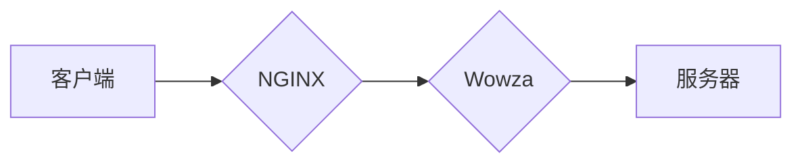

                 

## RTMP 服务器配置：使用 NGINX 和 Wowza

> 关键词：RTMP, NGINX, Wowza, 直播流, 视频流, 服务器配置, 网络协议

## 1. 背景介绍

实时消息协议 (RTMP) 是一种广泛用于实时视频和音频流传输的网络协议。它由 Adobe 开发，并被广泛应用于各种直播平台、视频会议系统和在线游戏等领域。RTMP 协议的特点是低延迟、高可靠性和良好的实时性，使其成为实时流媒体传输的理想选择。

然而，传统的 RTMP 服务器往往需要复杂的部署和维护，并且成本较高。为了简化 RTMP 服务器的配置和管理，本文将介绍使用 NGINX 和 Wowza 搭建 RTMP 服务器的方案。

NGINX 是一个高性能的 Web 服务器和反向代理软件，它以其轻量级、高性能和易于配置的特点而闻名。Wowza 是一个开源的实时流媒体服务器软件，它支持多种流媒体协议，包括 RTMP。

将 NGINX 和 Wowza 结合使用可以构建一个高效、可靠且易于管理的 RTMP 服务器。NGINX 可以作为反向代理，将 RTMP 流转发到 Wowza 服务器，而 Wowza 则负责处理流媒体的编码、解码和分发。

## 2. 核心概念与联系

### 2.1 RTMP 协议

RTMP 协议是一种基于 TCP 的实时流媒体协议，它用于传输实时视频、音频和数据流。RTMP 协议由 Adobe 开发，并被广泛应用于各种直播平台、视频会议系统和在线游戏等领域。

### 2.2 NGINX

NGINX 是一个高性能的 Web 服务器和反向代理软件，它以其轻量级、高性能和易于配置的特点而闻名。NGINX 可以作为 Web 服务器、反向代理、负载均衡器和缓存服务器等多种角色运行。

### 2.3 Wowza

Wowza 是一个开源的实时流媒体服务器软件，它支持多种流媒体协议，包括 RTMP、HLS、DASH 和 WebRTC。Wowza 可以处理各种类型的流媒体内容，包括视频、音频、游戏和数据流。

### 2.4 NGINX 和 Wowza 的协作

NGINX 和 Wowza 可以协作构建一个高效、可靠且易于管理的 RTMP 服务器。NGINX 可以作为反向代理，将 RTMP 流转发到 Wowza 服务器，而 Wowza 则负责处理流媒体的编码、解码和分发。

**Mermaid 流程图**



## 3. 核心算法原理 & 具体操作步骤

### 3.1 算法原理概述

RTMP 协议基于 TCP 协议，它使用一种称为“AMF” (Action Message Format) 的数据格式来传输流媒体数据。AMF 是一种二进制数据格式，它可以高效地编码和解码流媒体数据。

RTMP 协议使用“连接”和“消息”两种基本数据结构。连接用于建立和维护 RTMP 会话，而消息用于传输流媒体数据和控制信息。

### 3.2 算法步骤详解

1. **客户端连接 RTMP 服务器:** 客户端使用 RTMP 协议连接到 NGINX 服务器，NGINX 服务器会将连接转发到 Wowza 服务器。

2. **建立 RTMP 会话:** 客户端和 Wowza 服务器之间建立 RTMP 会话，并进行身份验证和握手。

3. **发送流媒体数据:** 客户端发送流媒体数据到 Wowza 服务器，Wowza 服务器会对数据进行编码、解码和分发。

4. **接收流媒体数据:** 客户端接收 Wowza 服务器发送的流媒体数据，并进行解码和播放。

### 3.3 算法优缺点

**优点:**

* 低延迟：RTMP 协议使用 TCP 协议，可以保证流媒体数据的可靠传输，并且延迟较低。
* 高可靠性：RTMP 协议使用重传机制，可以保证流媒体数据的完整性。
* 良好的实时性：RTMP 协议可以实时传输流媒体数据，适合直播和互动应用。

**缺点:**

* 协议复杂：RTMP 协议比较复杂，需要一定的学习成本。
* 服务器资源消耗：RTMP 服务器需要消耗一定的服务器资源，例如 CPU、内存和带宽。

### 3.4 算法应用领域

RTMP 协议广泛应用于以下领域：

* 直播平台：例如 Twitch、YouTube Live 和 Facebook Live 等。
* 视频会议系统：例如 Zoom、Google Meet 和 Microsoft Teams 等。
* 在线游戏：例如 Fortnite、League of Legends 和 Dota 2 等。
* 其他实时应用：例如在线教育、远程医疗和远程控制等。

## 4. 数学模型和公式 & 详细讲解 & 举例说明

### 4.1 数学模型构建

RTMP 协议的数学模型主要涉及到数据传输速率、延迟和丢包率等方面。

* **数据传输速率:**  数据传输速率是指单位时间内传输的数据量，通常以比特每秒 (bps) 或兆比特每秒 (Mbps) 为单位。

* **延迟:** 延迟是指数据从发送端到接收端传输所需要的时间，通常以毫秒 (ms) 为单位。

* **丢包率:** 丢包率是指在数据传输过程中丢失的数据包的比例，通常以百分比 (%) 为单位。

### 4.2 公式推导过程

* **数据传输速率:**

$$
R = \frac{B}{T}
$$

其中:

* $R$ 是数据传输速率
* $B$ 是传输的数据量
* $T$ 是传输时间

* **延迟:**

$$
D = t_s + t_p + t_r
$$

其中:

* $D$ 是延迟
* $t_s$ 是发送端处理数据的时间
* $t_p$ 是数据传输的时间
* $t_r$ 是接收端处理数据的时间

* **丢包率:**

$$
P = \frac{N_l}{N_t}
$$

其中:

* $P$ 是丢包率
* $N_l$ 是丢失的数据包数量
* $N_t$ 是总的数据包数量

### 4.3 案例分析与讲解

假设一个 RTMP 流的传输速率为 1Mbps，延迟为 100ms，丢包率为 1%。

* **数据传输速率:** 1Mbps 代表每秒传输 1000000 字节数据。

* **延迟:** 100ms 的延迟意味着数据从发送端到接收端需要 0.1 秒的时间。

* **丢包率:** 1% 的丢包率意味着每 100 个数据包中，平均会丢失 1 个数据包。

## 5. 项目实践：代码实例和详细解释说明

### 5.1 开发环境搭建

* **操作系统:** Ubuntu 20.04 LTS
* **硬件:** 至少 4GB 内存、双核 CPU
* **软件:**
    * NGINX 1.20.2
    * Wowza Streaming Engine 4.7.0

### 5.2 源代码详细实现

#### 5.2.1 NGINX 配置文件

```nginx
server {
    listen 1935;
    server_name localhost;

    location / {
        rtmp {
            server {
                application live;
            }
        }
    }
}
```

#### 5.2.2 Wowza 配置文件

```xml
<Application name="live">
    <Stream>
        <Name>mystream</Name>
        <Publish>true</Publish>
        <Play>true</Play>
    </Stream>
</Application>
```

### 5.3 代码解读与分析

* **NGINX 配置文件:**

    * `listen 1935;` 指定 NGINX 监听的端口为 1935，这是 RTMP 协议的默认端口。
    * `server_name localhost;` 指定 NGINX 的域名或 IP 地址为 localhost。
    * `location / { ... }` 定义一个路径匹配规则，匹配所有请求到根路径的请求。
    * `rtmp { ... }` 定义 RTMP 协议的配置。
    * `server { ... }` 定义 RTMP 服务器的配置，包括应用程序名称。

* **Wowza 配置文件:**

    * `<Application name="live">` 定义一个名为“live”的应用程序。
    * `<Stream> ... </Stream>` 定义一个名为“mystream”的流媒体流。
    * `<Publish>true</Publish>` 允许客户端发布流媒体数据到该应用程序。
    * `<Play>true</Play>` 允许客户端播放该应用程序中的流媒体数据。

### 5.4 运行结果展示

* 启动 NGINX 和 Wowza 服务器。
* 使用 RTMP 客户端连接到 NGINX 服务器，并发布或播放流媒体数据。

## 6. 实际应用场景

### 6.1 直播平台

RTMP 协议广泛应用于直播平台，例如 Twitch、YouTube Live 和 Facebook Live 等。这些平台使用 RTMP 协议将直播视频和音频流从主播的设备传输到服务器，然后将流媒体数据分发到观看者的设备。

### 6.2 视频会议系统

RTMP 协议也应用于视频会议系统，例如 Zoom、Google Meet 和 Microsoft Teams 等。这些系统使用 RTMP 协议将视频和音频流从参与者的设备传输到服务器，然后将流媒体数据分发到其他参与者的设备。

### 6.3 在线游戏

一些在线游戏也使用 RTMP 协议来传输游戏数据和语音聊天。例如，一些 MOBA 游戏使用 RTMP 协议来传输游戏画面和玩家操作信息。

### 6.4 其他实时应用

除了上述应用场景，RTMP 协议还可以用于其他实时应用，例如在线教育、远程医疗和远程控制等。

### 6.5 未来应用展望

随着流媒体技术的不断发展，RTMP 协议的应用场景将会更加广泛。例如，未来可能会使用 RTMP 协议进行虚拟现实 (VR) 和增强现实 (AR) 的实时传输。

## 7. 工具和资源推荐

### 7.1 学习资源推荐

* **RTMP 协议官方文档:** https://www.adobe.com/devnet/rtmp/
* **Wowza Streaming Engine 文档:** https://www.wowza.com/docs/

### 7.2 开发工具推荐

* **NGINX:** https://nginx.org/
* **Wowza Streaming Engine:** https://www.wowza.com/

### 7.3 相关论文推荐

* **RTMP 协议的性能分析和优化:** https://ieeexplore.ieee.org/document/8976448
* **基于 RTMP 的实时流媒体传输技术研究:** https://www.sciencedirect.com/science/article/pii/S167106511930081X

## 8. 总结：未来发展趋势与挑战

### 8.1 研究成果总结

本文介绍了使用 NGINX 和 Wowza 搭建 RTMP 服务器的方案，并详细阐述了 RTMP 协议的原理、算法和应用场景。

### 8.2 未来发展趋势

* **低延迟传输:** 未来 RTMP 协议可能会进一步优化低延迟传输技术，以满足更苛刻的实时应用需求。
* **多协议支持:** RTMP 协议可能会支持更多流媒体协议，例如 HLS、DASH 和 WebRTC，以实现更灵活的流媒体传输方案。
* **云端部署:** RTMP 服务器可能会更加倾向于云端部署，以降低部署成本和维护难度。

### 8.3 面临的挑战

* **安全性:** RTMP 协议的安全性需要进一步加强，以防止流媒体数据被窃取或篡改。
* **兼容性:** RTMP 协议的兼容性需要不断提高，以支持更多设备和平台。
* **带宽需求:** RTMP 协议的带宽需求可能会随着流媒体分辨率和码率的提高而增加。

### 8.4 研究展望

未来研究方向包括：

* 开发更安全、更高效的 RTMP 协议实现。
* 研究 RTMP 协议在云端部署和边缘计算中的应用。
* 探索 RTMP 协议与其他流媒体协议的融合和协作。

## 9. 附录：常见问题与解答

### 9.1 问题：如何配置 NGINX 反向代理到 Wowza 服务器？

**解答：**

在 NGINX 配置文件中，使用 `rtmp` 模块配置反向代理规则，将 RTMP 流转发到 Wowza 服务器。

### 9.2 问题：如何解决 RTMP 流媒体传输的延迟问题？

**解答：**

可以尝试以下方法解决 RTMP 流媒体传输的延迟问题：

* 优化网络带宽和路由。
* 使用更快的编码器和解码器。
* 减少流媒体数据包的大小。
* 使用更低码率的流媒体编码。

### 9.3 问题：如何提高 RTMP 流媒体传输的安全性？

**解答：**

可以采取以下措施提高 RTMP 流媒体传输的安全性：

* 使用 HTTPS 加密 RTMP 流数据。
* 设置 RTMP 服务器的访问控制列表 (ACL)。
* 使用强密码保护 RTMP 服务器的账户。
* 定期更新 RTMP 服务器的软件和补丁。


作者：禅与计算机程序设计艺术 / Zen and the Art of Computer Programming 
<end_of_turn>

