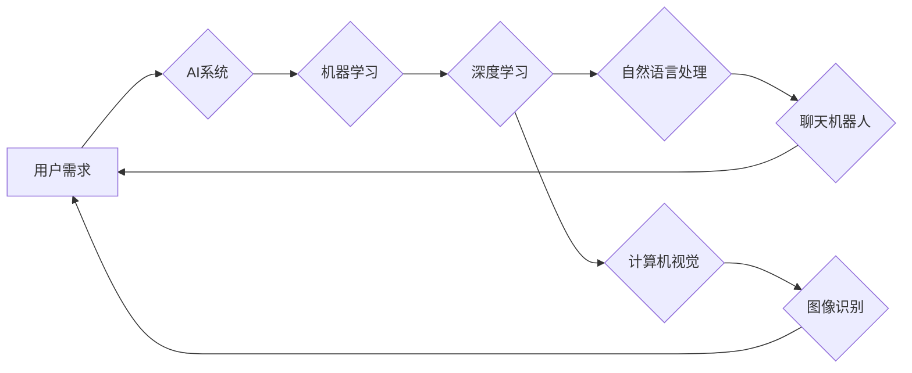

                 

## 人工智能的应用：满足用户需求的智能系统

> 关键词：人工智能、机器学习、深度学习、自然语言处理、计算机视觉、智能系统、用户需求

## 1. 背景介绍

人工智能（AI）正以惊人的速度发展，从简单的规则系统演变为能够学习、推理和解决复杂问题的智能系统。AI技术的进步为我们带来了前所未有的机遇，它正在改变着我们生活的方方面面，从医疗保健和金融服务到交通运输和娱乐。

随着AI技术的成熟，如何将AI应用于实际场景，满足用户需求，成为一个重要的研究方向。用户需求的多样性和复杂性，对AI系统的设计和开发提出了更高的要求。

## 2. 核心概念与联系

### 2.1 人工智能

人工智能是指模拟人类智能行为的计算机系统。这些行为包括学习、推理、决策、感知、语言理解和生成等。

### 2.2 机器学习

机器学习是人工智能的一个子领域，它使计算机能够从数据中学习，无需明确编程。通过训练模型，机器学习算法可以识别模式、做出预测和自动化决策。

### 2.3 深度学习

深度学习是机器学习的一个更高级的子领域，它使用多层神经网络来模拟人类大脑的结构和功能。深度学习算法能够处理海量数据，并从中提取更深层次的特征，从而实现更准确的预测和更复杂的智能行为。

### 2.4 自然语言处理

自然语言处理（NLP）是人工智能的一个重要分支，它致力于使计算机能够理解、处理和生成人类语言。NLP技术应用于各种场景，例如机器翻译、文本摘要、聊天机器人和语音识别等。

### 2.5 计算机视觉

计算机视觉是人工智能的一个领域，它使计算机能够“看”和理解图像和视频。计算机视觉技术应用于图像识别、物体检测、场景理解和视频分析等领域。

**核心概念与联系流程图**



## 3. 核心算法原理 & 具体操作步骤

### 3.1 算法原理概述

机器学习算法的核心原理是通过训练模型来学习数据中的模式。训练模型的过程通常包括以下步骤：

1. **数据收集和预处理:** 收集相关数据并进行清洗、转换和特征工程等预处理操作。
2. **模型选择:** 选择合适的机器学习算法，例如线性回归、逻辑回归、决策树、支持向量机等。
3. **模型训练:** 使用训练数据训练模型，调整模型参数以最小化预测误差。
4. **模型评估:** 使用测试数据评估模型的性能，例如准确率、召回率、F1-score等。
5. **模型部署:** 将训练好的模型部署到实际应用场景中，用于预测和决策。

### 3.2 算法步骤详解

以线性回归算法为例，详细说明其步骤：

1. **数据收集和预处理:** 收集包含输入特征和目标变量的数据集。对数据进行清洗、转换和特征工程，例如将类别变量转换为数值变量。
2. **模型选择:** 选择线性回归算法作为模型。
3. **模型训练:** 使用训练数据训练线性回归模型，通过最小二乘法求解模型参数，使得模型预测值与实际目标变量之间的误差最小。
4. **模型评估:** 使用测试数据评估模型的性能，例如计算模型的均方误差（MSE）或R-squared值。
5. **模型部署:** 将训练好的线性回归模型部署到实际应用场景中，例如用于预测房价、股票价格等。

### 3.3 算法优缺点

**优点:**

* 算法简单易懂，易于实现。
* 训练速度快，计算量较小。
* 可解释性强，模型参数具有直观意义。

**缺点:**

* 对数据线性关系依赖性强，对于非线性关系难以建模。
* 对异常值敏感，容易受到异常值的影响。
* 只能处理连续型目标变量。

### 3.4 算法应用领域

线性回归算法广泛应用于以下领域：

* 房价预测
* 股票价格预测
* 销售预测
* 医疗诊断
* 质量控制

## 4. 数学模型和公式 & 详细讲解 & 举例说明

### 4.1 数学模型构建

线性回归模型的数学模型如下：

$$
y = \beta_0 + \beta_1x_1 + \beta_2x_2 + ... + \beta_nx_n + \epsilon
$$

其中：

* $y$ 是目标变量
* $x_1, x_2, ..., x_n$ 是输入特征
* $\beta_0, \beta_1, \beta_2, ..., \beta_n$ 是模型参数
* $\epsilon$ 是误差项

### 4.2 公式推导过程

线性回归模型的目标是找到最佳的模型参数，使得模型预测值与实际目标变量之间的误差最小。常用的误差函数是均方误差（MSE）：

$$
MSE = \frac{1}{n}\sum_{i=1}^{n}(y_i - \hat{y}_i)^2
$$

其中：

* $n$ 是样本数量
* $y_i$ 是第 $i$ 个样本的实际目标变量
* $\hat{y}_i$ 是第 $i$ 个样本的预测目标变量

通过最小化MSE，可以求解出最佳的模型参数。

### 4.3 案例分析与讲解

假设我们想要预测房屋价格，输入特征包括房屋面积、房间数量、地理位置等。我们可以使用线性回归模型来建立房屋价格预测模型。

通过训练模型，我们可以得到模型参数，例如：

* $\beta_0 = 100000$
* $\beta_1 = 500$ (房屋面积每增加1平方米，价格增加500元)
* $\beta_2 = 10000$ (每增加一间房间，价格增加10000元)

根据这些参数，我们可以预测新房子的价格。例如，如果新房子的面积为100平方米，房间数量为3间，那么预测价格为：

$$
\hat{y} = 100000 + 500 \times 100 + 10000 \times 3 = 200000
$$

## 5. 项目实践：代码实例和详细解释说明

### 5.1 开发环境搭建

本项目使用Python语言进行开发，需要安装以下软件：

* Python 3.x
* scikit-learn

可以使用pip命令安装：

```bash
pip install scikit-learn
```

### 5.2 源代码详细实现

```python
import pandas as pd
from sklearn.linear_model import LinearRegression
from sklearn.model_selection import train_test_split

# 加载数据
data = pd.read_csv('house_price.csv')

# 选择特征和目标变量
X = data[['area', 'rooms']]
y = data['price']

# 将数据划分为训练集和测试集
X_train, X_test, y_train, y_test = train_test_split(X, y, test_size=0.2, random_state=42)

# 创建线性回归模型
model = LinearRegression()

# 训练模型
model.fit(X_train, y_train)

# 预测测试集数据
y_pred = model.predict(X_test)

# 评估模型性能
from sklearn.metrics import mean_squared_error
mse = mean_squared_error(y_test, y_pred)
print(f'均方误差: {mse}')
```

### 5.3 代码解读与分析

1. 首先，我们加载数据，选择特征和目标变量。
2. 然后，我们将数据划分为训练集和测试集，用于训练和评估模型。
3. 创建线性回归模型，并使用训练数据训练模型。
4. 使用训练好的模型预测测试集数据，并计算模型性能指标，例如均方误差。

### 5.4 运行结果展示

运行代码后，会输出模型的均方误差值。

## 6. 实际应用场景

### 6.1 医疗诊断

AI可以分析患者的医疗记录、影像数据和基因信息，辅助医生进行诊断，提高诊断准确率。

### 6.2 金融服务

AI可以用于欺诈检测、风险评估、客户服务等领域，提高金融服务的效率和安全性。

### 6.3 交通运输

AI可以用于自动驾驶、交通流量预测、路线规划等领域，提高交通运输效率和安全性。

### 6.4 娱乐

AI可以用于个性化推荐、游戏开发、虚拟助手等领域，提升用户娱乐体验。

### 6.5 未来应用展望

随着AI技术的不断发展，其应用场景将更加广泛，例如：

* **个性化教育:** AI可以根据学生的学习进度和特点，提供个性化的学习方案。
* **智能制造:** AI可以用于工业自动化、质量控制和生产优化。
* **精准农业:** AI可以用于农业监测、病虫害预测和产量预测。

## 7. 工具和资源推荐

### 7.1 学习资源推荐

* **在线课程:** Coursera、edX、Udacity等平台提供丰富的AI课程。
* **书籍:** 《深度学习》、《机器学习实战》等书籍是学习AI的经典教材。
* **博客和论坛:** Kaggle、Towards Data Science等网站提供大量的AI技术博客和论坛讨论。

### 7.2 开发工具推荐

* **Python:** Python是AI开发最常用的编程语言。
* **TensorFlow:** TensorFlow是Google开发的开源深度学习框架。
* **PyTorch:** PyTorch是Facebook开发的开源深度学习框架。
* **scikit-learn:** scikit-learn是Python机器学习库。

### 7.3 相关论文推荐

* **《ImageNet Classification with Deep Convolutional Neural Networks》**
* **《Attention Is All You Need》**
* **《BERT: Pre-training of Deep Bidirectional Transformers for Language Understanding》**

## 8. 总结：未来发展趋势与挑战

### 8.1 研究成果总结

近年来，AI技术取得了长足的进步，在各个领域都取得了显著的应用成果。深度学习算法的突破，使得AI能够处理更复杂的数据，并取得更高的准确率。

### 8.2 未来发展趋势

未来，AI技术将继续朝着以下方向发展：

* **更强大的计算能力:** 随着硬件技术的进步，AI模型将能够处理更大规模的数据，并实现更复杂的智能行为。
* **更通用的人工智能:** 目前，大多数AI系统都是针对特定任务设计的，未来将朝着更通用的人工智能发展，能够适应不同的场景和任务。
* **更安全的AI:** 随着AI技术的应用越来越广泛，安全性问题也越来越重要，未来将更加注重AI系统的安全性、可靠性和可解释性。

### 8.3 面临的挑战

AI技术的发展也面临着一些挑战：

* **数据获取和隐私问题:** AI模型的训练需要大量数据，如何获取高质量的数据，并保护用户隐私是一个重要的挑战。
* **算法偏见:** AI算法可能会受到训练数据中的偏见影响，导致算法输出结果存在偏差，需要采取措施解决算法偏见问题。
* **伦理问题:** AI技术的应用可能会引发一些伦理问题，例如人工智能的责任和义务、人工智能的就业影响等，需要进行深入的伦理探讨。

### 8.4 研究展望

未来，AI研究将继续探索更强大的算法、更安全的系统和更广泛的应用场景。AI技术将深刻地改变我们的生活，为人类社会带来更多福祉。

## 9. 附录：常见问题与解答

**Q1: 什么是机器学习？**

A1: 机器学习是人工智能的一个子领域，它使计算机能够从数据中学习，无需明确编程。

**Q2: 深度学习和机器学习有什么区别？**

A2: 深度学习是机器学习的一个更高级的子领域，它使用多层神经网络来模拟人类大脑的结构和功能。

**Q3: 如何选择合适的机器学习算法？**

A3: 选择合适的机器学习算法需要考虑数据的类型、任务目标和模型复杂度等因素。

**Q4: 如何评估机器学习模型的性能？**

A4: 可以使用准确率、召回率、F1-score等指标来评估机器学习模型的性能。

**Q5: AI技术有哪些伦理问题？**

A5: AI技术的应用可能会引发一些伦理问题，例如人工智能的责任和义务、人工智能的就业影响等。


作者：禅与计算机程序设计艺术 / Zen and the Art of Computer Programming 
<end_of_turn>

