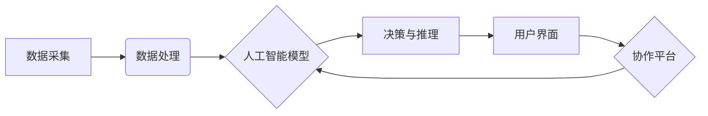

                 

## 人机协同：未来工作的核心

> 关键词： 人机协同、人工智能、自动化、未来工作、协作机器人、数据分析、决策支持

> 摘要： 人工智能技术的飞速发展正在深刻地改变着工作方式，人机协同成为未来工作的核心。本文将探讨人机协同的概念、原理、算法、应用场景以及未来发展趋势，并分析其对未来工作的影响和挑战。

## 1. 背景介绍

随着人工智能（AI）技术的快速发展，机器学习、深度学习等算法取得了突破性进展，赋予机器以学习、推理、决策等能力。这些技术正在改变着各个行业，包括制造业、金融业、医疗保健业等。

传统的工作模式往往依赖于人类的智慧和经验，但随着任务复杂度的增加和数据量的爆炸式增长，人类难以独自应对。而人工智能技术可以帮助人类自动化重复性任务、分析海量数据、提供决策支持，从而提高工作效率和质量。

人机协同是指人类和人工智能系统共同完成任务的一种工作模式。在这种模式下，人类发挥其创造力、批判性思维和情感智能等优势，而人工智能系统则负责执行重复性任务、处理大量数据和提供客观分析。

## 2. 核心概念与联系

### 2.1 人机协同的本质

人机协同的核心在于将人类和人工智能的优势有机结合，形成一个互补、协同的系统。

* **人类优势:** 创造力、批判性思维、情感智能、复杂问题解决能力、灵活适应能力。
* **人工智能优势:** 数据处理能力、计算速度、逻辑推理能力、自动化执行能力、精准度。

### 2.2 人机协同的架构

人机协同系统通常由以下几个关键部分组成：

* **数据采集与处理:** 收集来自各种来源的数据，并进行清洗、预处理等操作，为人工智能系统提供数据支持。
* **人工智能模型:** 利用机器学习、深度学习等算法构建人工智能模型，赋予机器学习、推理、决策等能力。
* **用户界面:** 提供用户与人工智能系统交互的界面，方便用户输入指令、查看结果和进行操作。
* **协作平台:** 提供一个平台，让人类和人工智能系统能够协同工作，共享数据和任务。



## 3. 核心算法原理 & 具体操作步骤

### 3.1 算法原理概述

人机协同的核心算法包括机器学习、深度学习、自然语言处理等。

* **机器学习:** 算法通过学习数据样本，建立模型，并根据模型预测未来结果。
* **深度学习:** 基于多层神经网络的机器学习算法，能够学习更复杂的模式和特征。
* **自然语言处理:** 算法能够理解和处理人类语言，例如文本分类、机器翻译、对话系统等。

### 3.2 算法步骤详解

以机器学习为例，其基本步骤如下：

1. **数据收集:** 收集与目标任务相关的训练数据。
2. **数据预处理:** 对数据进行清洗、转换、特征提取等操作，使其适合模型训练。
3. **模型选择:** 选择合适的机器学习算法模型，例如线性回归、决策树、支持向量机等。
4. **模型训练:** 利用训练数据训练模型，调整模型参数，使其能够准确预测目标结果。
5. **模型评估:** 利用测试数据评估模型的性能，例如准确率、召回率、F1-score等。
6. **模型部署:** 将训练好的模型部署到实际应用场景中，用于预测新的数据。

### 3.3 算法优缺点

**优点:**

* 自动化能力强，可以解放人类从重复性任务中。
* 数据处理能力强，可以分析海量数据，发现隐藏的模式和趋势。
* 决策支持能力强，可以提供客观分析和建议，帮助人类做出更明智的决策。

**缺点:**

* 算法依赖于数据质量，如果训练数据不充分或存在偏差，模型性能会受到影响。
* 算法解释性较差，难以理解模型的决策过程。
* 算法缺乏创造力和灵活性，难以应对复杂、非结构化的任务。

### 3.4 算法应用领域

人机协同算法广泛应用于各个领域，例如：

* **制造业:** 自动化生产线、机器人协作、质量检测。
* **金融业:** 风险评估、欺诈检测、投资决策。
* **医疗保健业:** 疾病诊断、药物研发、个性化治疗。
* **教育行业:** 智能辅导系统、个性化学习路径。

## 4. 数学模型和公式 & 详细讲解 & 举例说明

### 4.1 数学模型构建

人机协同系统可以利用数学模型来描述人类和人工智能之间的交互关系。例如，可以使用马尔可夫决策过程（MDP）来建模人类和人工智能在完成任务过程中相互决策的过程。

MDP 由以下几个要素组成：

* 状态空间：表示系统可能存在的各种状态。
* 动作空间：表示系统在每个状态下可以执行的各种动作。
* 转移概率：表示从一个状态到另一个状态的概率。
* 奖励函数：表示在每个状态执行某个动作获得的奖励。

### 4.2 公式推导过程

MDP 的目标是找到一个策略，使得在执行该策略时，系统获得最大的总奖励。可以使用动态规划算法或强化学习算法来求解 MDP。

动态规划算法通过递归的方式，从最终状态开始，逐步推导出每个状态下的最优策略。强化学习算法则通过让智能体在环境中交互学习，不断调整策略，以获得更高的奖励。

### 4.3 案例分析与讲解

例如，在自动驾驶系统中，可以使用 MDP 来建模车辆在道路上的行驶过程。

* 状态空间：车辆的位置、速度、周围环境等。
* 动作空间：加速、减速、转向等。
* 转移概率：取决于车辆的运动状态和周围环境。
* 奖励函数：奖励安全行驶、避免碰撞、到达目的地等行为。

通过训练 MDP 模型，可以学习到一个最优的驾驶策略，使得车辆能够安全、高效地行驶。

## 5. 项目实践：代码实例和详细解释说明

### 5.1 开发环境搭建

* **操作系统:** Ubuntu 20.04 LTS
* **编程语言:** Python 3.8
* **深度学习框架:** TensorFlow 2.0
* **其他工具:** Jupyter Notebook、Git

### 5.2 源代码详细实现

以下是一个简单的机器学习项目代码示例，用于预测房价：

```python
import pandas as pd
from sklearn.model_selection import train_test_split
from sklearn.linear_model import LinearRegression
from sklearn.metrics import mean_squared_error

# 加载房价数据
data = pd.read_csv('house_price.csv')

# 选择特征和目标变量
features = ['size', 'location', 'bedrooms']
target = 'price'

# 将数据分成训练集和测试集
X_train, X_test, y_train, y_test = train_test_split(data[features], data[target], test_size=0.2)

# 创建线性回归模型
model = LinearRegression()

# 训练模型
model.fit(X_train, y_train)

# 预测测试集数据
y_pred = model.predict(X_test)

# 计算模型性能
mse = mean_squared_error(y_test, y_pred)
print(f'Mean Squared Error: {mse}')
```

### 5.3 代码解读与分析

* **数据加载:** 使用 pandas 库加载房价数据。
* **特征选择:** 选择房屋面积、位置和卧室数量作为特征，房价作为目标变量。
* **数据分割:** 将数据分成训练集和测试集，用于训练和评估模型。
* **模型创建:** 使用 sklearn 库中的 LinearRegression 类创建线性回归模型。
* **模型训练:** 使用 fit() 方法训练模型，使其能够学习特征和目标变量之间的关系。
* **模型预测:** 使用 predict() 方法预测测试集数据的房价。
* **模型评估:** 使用 mean_squared_error() 函数计算模型的性能，即预测值与真实值的平均平方误差。

### 5.4 运行结果展示

运行代码后，会输出模型的 Mean Squared Error 值，该值越小，模型的预测性能越好。

## 6. 实际应用场景

### 6.1 人机协同在制造业的应用

* **协作机器人:** 机器人与人类协同工作，完成复杂、精细的生产任务。例如，机器人可以负责搬运重物，而人类可以负责操作精密仪器。
* **智能工厂:** 利用传感器、人工智能等技术，实现工厂自动化、智能化管理，提高生产效率和产品质量。

### 6.2 人机协同在金融业的应用

* **风险评估:** 利用机器学习算法分析客户数据，评估其信用风险，帮助金融机构做出更明智的贷款决策。
* **欺诈检测:** 利用人工智能系统分析交易数据，识别异常行为，防止金融欺诈。

### 6.3 人机协同在医疗保健业的应用

* **疾病诊断:** 利用深度学习算法分析医学图像，辅助医生诊断疾病。
* **个性化治疗:** 利用人工智能系统分析患者数据，制定个性化的治疗方案。

### 6.4 未来应用展望

人机协同技术将应用于更多领域，例如教育、交通、娱乐等，为人类生活带来更多便利和改变。

## 7. 工具和资源推荐

### 7.1 学习资源推荐

* **在线课程:** Coursera、edX、Udacity 等平台提供人工智能、机器学习等方面的在线课程。
* **书籍:** 《深度学习》、《机器学习实战》等书籍。
* **开源项目:** TensorFlow、PyTorch 等开源深度学习框架。

### 7.2 开发工具推荐

* **编程语言:** Python、Java、C++ 等。
* **深度学习框架:** TensorFlow、PyTorch、Keras 等。
* **数据分析工具:** pandas、NumPy、Scikit-learn 等。

### 7.3 相关论文推荐

* **《Attention Is All You Need》:** 介绍了 Transformer 模型，是一种强大的自然语言处理模型。
* **《Deep Residual Learning for Image Recognition》:** 介绍了 ResNet 模型，一种能够训练更深层神经网络的架构。

## 8. 总结：未来发展趋势与挑战

### 8.1 研究成果总结

人机协同技术取得了显著进展，人工智能算法不断发展，应用场景不断拓展。

### 8.2 未来发展趋势

* **更智能的人工智能:** 人工智能将更加智能，能够更好地理解人类语言、学习新的知识和技能。
* **更广泛的应用场景:** 人机协同将应用于更多领域，例如教育、交通、娱乐等。
* **更安全的协作环境:** 人机协同系统将更加安全可靠，能够更好地保护人类隐私和数据安全。

### 8.3 面临的挑战

* **算法解释性:** 许多人工智能算法难以解释其决策过程，这可能会导致信任问题。
* **数据隐私:** 人机协同系统需要处理大量数据，如何保护数据隐私是一个重要挑战。
* **伦理问题:** 人工智能的快速发展引发了一些伦理问题，例如算法偏见、工作岗位替代等。

### 8.4 研究展望

未来研究将重点关注以下几个方面：

* **开发更可解释的算法:** 使人工智能算法的决策过程更加透明，提高人类的信任度。
* **加强数据安全和隐私保护:** 开发更安全的协作环境，保护人类数据安全。
* **探讨人工智能与人类的关系:** 研究人工智能与人类的协作模式，确保人工智能技术能够更好地服务于人类。

## 9. 附录：常见问题与解答

### 9.1 人机协同会取代人类工作吗？

人机协同不会完全取代人类工作，而是会改变工作方式。人工智能可以帮助人类自动化重复性任务，解放人类精力去完成更创造性、更复杂的任务。

### 9.2 如何学习人机协同技术？

可以通过在线课程、书籍、开源项目等方式学习人机协同技术。

### 9.3 人机协同技术有哪些应用场景？

人机协同技术应用于各个领域，例如制造业、金融业、医疗保健业等。


作者：禅与计算机程序设计艺术 / Zen and the Art of Computer Programming<end_of_turn>

