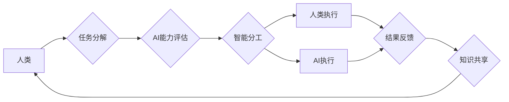

                 

## 人类-AI协作：增强人类智慧与AI能力的融合发展趋势预测分析总结

> 关键词：人工智能、人类-AI协作、智慧增强、AI能力、融合发展、未来趋势

> 摘要：本文探讨了人类-AI协作的最新发展趋势，分析了其核心概念、算法原理、数学模型以及实际应用场景。通过代码实例和案例分析，阐述了人类-AI协作的具体操作步骤和优势。展望未来，人类-AI协作将深刻改变人类生活和工作方式，并带来巨大的机遇和挑战。

## 1. 背景介绍

人工智能（AI）技术近年来取得了飞速发展，从语音识别、图像识别到自然语言处理等领域取得了突破性进展。AI技术的快速发展为人类-AI协作提供了强大的技术基础。人类-AI协作是指人类和人工智能系统共同完成任务，发挥各自优势，实现互补和协同。这种合作模式将人类的创造力、决策能力和情感智能与AI的计算能力、数据处理能力和学习能力相结合，从而实现超越单一智能的协同效应。

人类-AI协作的背景可以从以下几个方面来理解：

* **AI技术的成熟度提升:**  深度学习、强化学习等AI算法的不断发展，使得AI系统能够处理更复杂的任务，并具备更强的学习和适应能力。
* **数据量的爆炸式增长:**  互联网、物联网等技术的普及，产生了海量的数据，为AI系统的训练和学习提供了充足的素材。
* **人类需求的演变:**  随着社会发展和科技进步，人类对更高效、更智能的解决方案的需求日益增长。

## 2. 核心概念与联系

人类-AI协作的核心概念包括：

* **协同智能:**  指人类和AI系统共同完成任务，发挥各自优势，实现互补和协同。
* **智能分工:**  根据任务特点和各自能力，将任务分配给人类和AI系统，实现最佳的协作效率。
* **知识共享:**  人类和AI系统之间共享知识和信息，促进彼此的学习和进步。
* **反馈机制:**  建立有效的反馈机制，使人类和AI系统能够及时调整策略，优化协作效果。

**Mermaid 流程图**



## 3. 核心算法原理 & 具体操作步骤

### 3.1  算法原理概述

人类-AI协作的算法原理主要基于以下几个方面：

* **强化学习:**  AI系统通过与环境交互，学习最佳的策略，以获得最大奖励。
* **迁移学习:**  AI系统将已学习到的知识应用于新的任务，提高学习效率。
* **图神经网络:**  AI系统能够理解和处理复杂的关系网络，例如社交网络、知识图谱等。

### 3.2  算法步骤详解

1. **任务分解:** 将复杂任务分解成多个子任务，并根据子任务的特点分配给人类和AI系统。
2. **AI能力评估:**  评估AI系统在不同子任务上的能力，并根据评估结果进行智能分工。
3. **智能分工:**  根据任务特点和AI系统能力，将任务分配给人类和AI系统，实现最佳的协作效率。
4. **人类执行:**  人类根据任务要求执行相应的操作，并提供反馈信息。
5. **AI执行:**  AI系统根据任务要求执行相应的操作，并根据反馈信息进行学习和调整。
6. **结果反馈:**  人类和AI系统共同评估任务结果，并反馈给系统，用于后续优化。
7. **知识共享:**  人类和AI系统之间共享知识和信息，促进彼此的学习和进步。

### 3.3  算法优缺点

**优点:**

* **提高效率:**  人类和AI系统协同工作，可以比单一智能更高效地完成任务。
* **增强能力:**  人类和AI系统可以发挥各自优势，实现互补和协同，从而增强整体能力。
* **促进创新:**  人类-AI协作可以激发新的创意和想法，促进创新发展。

**缺点:**

* **技术难度:**  实现高效的人类-AI协作需要克服技术上的挑战，例如如何有效地进行智能分工、知识共享和反馈机制。
* **伦理问题:**  人类-AI协作可能会带来一些伦理问题，例如责任归属、数据隐私等。
* **社会影响:**  人类-AI协作可能会对就业市场和社会结构产生影响，需要进行相应的社会调适。

### 3.4  算法应用领域

人类-AI协作的应用领域非常广泛，包括：

* **医疗保健:**  AI辅助医生诊断疾病、制定治疗方案、进行手术辅助。
* **教育:**  AI个性化教学、智能辅导、自动批改作业。
* **金融:**  AI风险评估、欺诈检测、投资决策。
* **制造业:**  AI智能制造、质量控制、 predictive maintenance。
* **交通运输:**  AI自动驾驶、交通流量优化、物流管理。

## 4. 数学模型和公式 & 详细讲解 & 举例说明

### 4.1  数学模型构建

人类-AI协作可以抽象为一个多智能体系统，其中人类和AI系统分别代表不同的智能体。每个智能体都有自己的目标和策略，通过交互和合作来完成共同的目标。

我们可以用以下数学模型来描述人类-AI协作过程：

* **状态空间:**  描述系统当前的状态，包括人类和AI系统的知识、信念、目标等。
* **动作空间:**  描述每个智能体可以执行的动作，例如人类决策、AI执行任务等。
* **奖励函数:**  描述系统状态和动作对每个智能体的奖励，例如完成任务的奖励、错误的惩罚等。
* **策略函数:**  描述每个智能体根据当前状态选择动作的策略，例如基于强化学习的策略、基于规则的策略等。

### 4.2  公式推导过程

强化学习算法的核心是通过最大化累积奖励来学习最优策略。

假设一个人类-AI协作系统，其中人类和AI系统分别为 $A$ 和 $B$，状态空间为 $S$，动作空间为 $A$，奖励函数为 $R(s,a)$，策略函数为 $\pi(s)$。

则人类-AI协作系统的目标是最大化累积奖励：

$$
\max_{\pi_A, \pi_B} \sum_{t=0}^{\infty} \gamma^t R(s_t, a_t)
$$

其中：

* $\pi_A$ 和 $\pi_B$ 分别为人类和AI系统的策略函数。
* $s_t$ 为系统在时间步 $t$ 的状态。
* $a_t$ 为人类和AI系统在时间步 $t$ 执行的动作。
* $\gamma$ 为折扣因子，控制未来奖励的权重。

### 4.3  案例分析与讲解

例如，在自动驾驶领域，人类和AI系统可以协同完成驾驶任务。

* **人类:**  负责制定高层决策，例如目的地选择、路线规划等。
* **AI:**  负责执行低层控制，例如车辆加速、转向、制动等。

AI系统可以利用传感器数据和机器学习算法来感知周围环境，并根据人类指令执行相应的控制动作。

人类可以根据AI系统的反馈信息，及时调整高层决策，确保驾驶安全和效率。

## 5. 项目实践：代码实例和详细解释说明

### 5.1  开发环境搭建

* **操作系统:**  Ubuntu 20.04 LTS
* **编程语言:**  Python 3.8
* **深度学习框架:**  TensorFlow 2.0
* **其他工具:**  Git, Jupyter Notebook

### 5.2  源代码详细实现

```python
import tensorflow as tf

# 定义神经网络模型
model = tf.keras.models.Sequential([
    tf.keras.layers.Dense(128, activation='relu', input_shape=(10,)),
    tf.keras.layers.Dense(64, activation='relu'),
    tf.keras.layers.Dense(1, activation='sigmoid')
])

# 编译模型
model.compile(optimizer='adam', loss='binary_crossentropy', metrics=['accuracy'])

# 训练模型
model.fit(x_train, y_train, epochs=10)

# 评估模型
loss, accuracy = model.evaluate(x_test, y_test)
print('Loss:', loss)
print('Accuracy:', accuracy)
```

### 5.3  代码解读与分析

这段代码实现了简单的深度学习模型训练。

* **模型定义:**  使用 `tf.keras.models.Sequential` 创建一个顺序模型，包含两层全连接层和一层输出层。
* **模型编译:**  使用 `adam` 优化器、 `binary_crossentropy` 损失函数和 `accuracy` 评估指标编译模型。
* **模型训练:**  使用 `model.fit` 函数训练模型，输入训练数据 `x_train` 和标签数据 `y_train`，训练 10 个 epochs。
* **模型评估:**  使用 `model.evaluate` 函数评估模型，输入测试数据 `x_test` 和标签数据 `y_test`，输出损失值和准确率。

### 5.4  运行结果展示

训练完成后，可以查看模型的损失值和准确率，评估模型的性能。

## 6. 实际应用场景

### 6.1  医疗诊断辅助

AI系统可以辅助医生诊断疾病，例如通过分析医学影像数据识别肿瘤、分析患者病历数据预测疾病风险。

### 6.2  个性化教育

AI系统可以根据学生的学习进度和能力提供个性化的学习内容和辅导，提高学习效率。

### 6.3  金融风险管理

AI系统可以分析金融数据识别欺诈行为、评估投资风险、优化投资组合。

### 6.4  未来应用展望

未来，人类-AI协作将应用于更多领域，例如：

* **科学研究:**  AI可以辅助科学家进行数据分析、模型构建、实验设计等，加速科学发现。
* **艺术创作:**  AI可以与艺术家合作创作音乐、绘画、文学作品等，拓展艺术表现形式。
* **社会治理:**  AI可以辅助政府部门进行决策分析、资源分配、公共服务管理等，提高社会治理效率。

## 7. 工具和资源推荐

### 7.1  学习资源推荐

* **在线课程:**  Coursera, edX, Udacity
* **书籍:**  《深度学习》、《人工智能：一种现代方法》
* **开源项目:**  TensorFlow, PyTorch

### 7.2  开发工具推荐

* **编程语言:**  Python, Java, C++
* **深度学习框架:**  TensorFlow, PyTorch, Keras
* **云计算平台:**  AWS, Azure, Google Cloud

### 7.3  相关论文推荐

* **《Attention Is All You Need》:**  介绍了 Transformer 模型，为自然语言处理领域带来了革命性进展。
* **《Deep Reinforcement Learning》:**  介绍了强化学习算法的基本原理和应用。
* **《Human-in-the-Loop Machine Learning》:**  探讨了人类-AI协作的最新进展和应用场景。

## 8. 总结：未来发展趋势与挑战

### 8.1  研究成果总结

近年来，人类-AI协作取得了显著进展，在医疗诊断、个性化教育、金融风险管理等领域取得了成功应用。

### 8.2  未来发展趋势

未来，人类-AI协作将朝着以下几个方向发展：

* **更智能的AI系统:**  AI系统的学习能力、推理能力和决策能力将进一步提升，能够更好地理解人类需求和完成复杂任务。
* **更紧密的协作模式:**  人类和AI系统之间的交互将更加紧密，实现更有效的知识共享和决策融合。
* **更广泛的应用场景:**  人类-AI协作将应用于更多领域，例如科学研究、艺术创作、社会治理等。

### 8.3  面临的挑战

人类-AI协作也面临一些挑战：

* **技术挑战:**  实现高效的人类-AI协作需要克服技术上的挑战，例如如何有效地进行智能分工、知识共享和反馈机制。
* **伦理挑战:**  人类-AI协作可能会带来一些伦理问题，例如责任归属、数据隐私等。
* **社会挑战:**  人类-AI协作可能会对就业市场和社会结构产生影响，需要进行相应的社会调适。

### 8.4  研究展望

未来，我们需要加强对人类-AI协作的理论研究和实践探索，解决技术、伦理和社会挑战，推动人类-AI协作的健康发展，实现人类智慧和AI能力的融合发展。

## 9. 附录：常见问题与解答

**Q1: 人类-AI协作会取代人类的工作吗？**

A1: 人类-AI协作更像是人类和AI系统之间的合作，AI系统可以帮助人类完成重复性、繁琐性工作，释放人类的创造力和决策能力。

**Q2: 人类-AI协作的伦理问题有哪些？**

A2: 人类-AI协作可能会带来一些伦理问题，例如责任归属、数据隐私、算法偏见等，需要进行深入的伦理探讨和规范制定。

**Q3: 如何学习人类-AI协作相关知识？**

A3: 可以通过在线课程、书籍、开源项目等方式学习人类-AI协作相关知识，例如 Coursera, edX, Udacity 等平台提供相关课程，TensorFlow, PyTorch 等开源项目可以帮助你实践人类-AI协作技术。


作者：禅与计算机程序设计艺术 / Zen and the Art of Computer Programming<end_of_turn>

