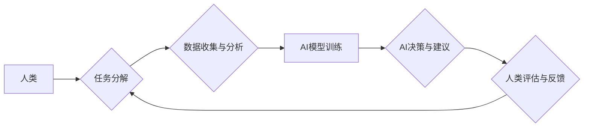

                 

## 人类-AI协作：增强人类智慧与AI能力的融合发展趋势预测分析总结挑战

> 关键词：人工智能、人类-AI协作、智慧增强、AI能力、融合发展、趋势预测、挑战分析

## 1. 背景介绍

人工智能（AI）技术近年来发展迅速，已渗透到各个领域，深刻地改变着人类的生活方式和工作模式。从自动驾驶、医疗诊断到金融分析、创意写作，AI正在展现出强大的应用潜力。然而，AI技术也面临着一些挑战，例如数据获取、算法解释、伦理道德等。

人类-AI协作，即人类与人工智能系统共同完成任务，已成为人工智能发展的重要方向。这种协作模式充分发挥了人类的创造力、批判性思维和情感智能，同时利用了AI的计算能力、数据处理能力和自动化能力。人类-AI协作不仅可以提高工作效率和准确性，还可以激发新的创新和创造力。

## 2. 核心概念与联系

**2.1 核心概念**

* **人工智能 (AI):** 指计算机系统模拟人类智能行为的能力，包括学习、推理、决策、感知和语言理解等。
* **人类-AI协作 (Human-AI Collaboration):** 指人类与人工智能系统共同完成任务，双方相互补充、协同工作，实现共同目标。

**2.2 联系**

人类-AI协作的核心在于将人类的智慧和AI的能力有机结合，形成一个互补、协同的系统。

* **人类提供:** 
    * 创造力和想象力
    * 复杂问题解决能力
    * 伦理判断和道德意识
    * 情感理解和沟通能力
* **AI提供:**
    * 海量数据处理和分析能力
    * 快速准确的计算能力
    * 自动化执行重复性任务的能力
    * 识别和预测模式的能力

**2.3 架构图**



## 3. 核心算法原理 & 具体操作步骤

**3.1 算法原理概述**

人类-AI协作的核心算法原理包括：

* **强化学习 (Reinforcement Learning):** AI系统通过与环境交互，学习最佳策略以获得最大奖励。
* **迁移学习 (Transfer Learning):** 利用已训练好的模型，在新的任务上进行微调，提高学习效率。
* **生成对抗网络 (Generative Adversarial Networks):** 两个神经网络相互对抗，生成逼真的数据样本。

**3.2 算法步骤详解**

1. **任务分解:** 将复杂任务分解成多个子任务，明确人类和AI的职责分工。
2. **数据收集与分析:** 收集相关数据，并进行预处理和分析，为AI模型训练提供数据支持。
3. **AI模型训练:** 利用强化学习、迁移学习等算法，训练AI模型，使其能够完成特定的子任务。
4. **AI决策与建议:** AI模型根据输入数据进行决策和提供建议，并将其反馈给人类。
5. **人类评估与反馈:** 人类评估AI的决策和建议，并提供反馈，用于改进AI模型的性能。

**3.3 算法优缺点**

* **优点:**
    * 提高工作效率和准确性
    * 促进创新和创造力
    * 扩展人类能力
* **缺点:**
    * 需要大量数据和计算资源
    * 算法解释性和透明度不足
    * 存在伦理道德风险

**3.4 算法应用领域**

* **医疗保健:** AI辅助诊断、个性化治疗方案
* **金融服务:** 风险评估、欺诈检测、投资决策
* **制造业:** 自动化生产、质量控制、 predictive maintenance
* **教育:** 个性化学习、智能辅导、自动批改

## 4. 数学模型和公式 & 详细讲解 & 举例说明

**4.1 数学模型构建**

人类-AI协作可以建模为一个博弈论框架，其中人类和AI是参与者，任务是游戏目标，决策和反馈是游戏策略。

**4.2 公式推导过程**

* **效用函数:**  定义人类和AI的效用函数，表示他们对不同决策结果的满意程度。
* **策略空间:**  定义人类和AI可选择的策略空间，即他们可以采取的行动范围。
* **博弈均衡:**  寻找一个策略组合，使得人类和AI在该策略组合下都不会改变自己的策略，即达到博弈均衡。

**4.3 案例分析与讲解**

例如，在自动驾驶场景中，人类驾驶员和AI系统可以视为博弈论中的参与者。人类驾驶员需要根据路况和交通规则做出决策，而AI系统需要根据传感器数据和预先训练的模型预测路况和潜在危险。

通过构建效用函数和策略空间，可以分析人类驾驶员和AI系统的决策行为，并寻找一个博弈均衡策略组合，以实现安全和高效的驾驶。

## 5. 项目实践：代码实例和详细解释说明

**5.1 开发环境搭建**

* 操作系统: Ubuntu 20.04
* Python 版本: 3.8
* 必要的库: TensorFlow, PyTorch, NumPy, Pandas

**5.2 源代码详细实现**

```python
# 人类-AI协作示例代码

import numpy as np

# 定义人类的决策函数
def human_decision(data):
  # 根据数据进行决策，并返回决策结果
  # ...

# 定义AI的决策函数
def ai_decision(data):
  # 根据数据进行决策，并返回决策结果
  # ...

# 数据输入
data = np.array([1, 2, 3])

# 人类决策
human_choice = human_decision(data)

# AI决策
ai_choice = ai_decision(data)

# 融合决策
final_decision = human_choice * ai_choice

# 输出最终决策
print(f"最终决策: {final_decision}")
```

**5.3 代码解读与分析**

* 该代码示例展示了人类和AI决策的融合过程。
* 人类决策函数和AI决策函数分别模拟人类和AI的决策逻辑。
* 数据输入后，人类和AI分别做出决策，并将其融合得到最终决策。

**5.4 运行结果展示**

运行该代码后，将输出最终决策的结果。

## 6. 实际应用场景

**6.1 医疗诊断辅助**

AI可以辅助医生进行疾病诊断，例如分析医学影像、预测患者风险等。

**6.2 创意写作辅助**

AI可以帮助作家生成故事创意、人物设定、情节发展等，提高写作效率和灵感。

**6.3 科学研究加速**

AI可以帮助科学家分析大数据、发现新规律、加速科研成果的产生。

**6.4 未来应用展望**

* 人类-AI协作将更加深入，AI将承担更多复杂的任务。
* 跨领域协作将更加普遍，AI将连接不同领域的知识和资源。
* 人类-AI协作将更加智能化，AI将能够更好地理解人类需求和意图。

## 7. 工具和资源推荐

**7.1 学习资源推荐**

* **书籍:**
    * 《人工智能：一种现代方法》
    * 《深度学习》
    * 《人类-AI协作》
* **在线课程:**
    * Coursera: 人工智能课程
    * edX: 深度学习课程
    * Udacity: AI开发课程

**7.2 开发工具推荐**

* **TensorFlow:** 开源深度学习框架
* **PyTorch:** 开源深度学习框架
* **OpenAI API:** 提供各种AI模型的API接口

**7.3 相关论文推荐**

* **《Attention Is All You Need》**
* **《Generative Pre-trained Transformer 3》**
* **《Human-in-the-Loop Machine Learning》**

## 8. 总结：未来发展趋势与挑战

**8.1 研究成果总结**

人类-AI协作取得了显著进展，在多个领域展现出巨大的应用潜力。

**8.2 未来发展趋势**

* **更智能的AI:** AI将更加智能化，能够更好地理解人类需求和意图。
* **更广泛的应用:** 人类-AI协作将应用于更多领域，例如教育、娱乐、艺术等。
* **更紧密的融合:** 人类和AI将更加紧密地融合，形成一个协同工作的新型智能系统。

**8.3 面临的挑战**

* **算法解释性和透明度:** AI算法的决策过程往往难以解释，这可能会导致信任问题。
* **伦理道德风险:** AI系统可能存在偏见和歧视，需要解决伦理道德问题。
* **数据安全和隐私:** 人类-AI协作需要处理大量数据，需要保障数据安全和隐私。

**8.4 研究展望**

未来研究需要关注以下几个方面:

* **开发更可解释的AI算法:** 提高AI算法的透明度和可解释性，增强人类对AI决策的理解和信任。
* **解决AI伦理道德问题:** 制定规范和标准，引导AI技术发展朝着安全、公平、可持续的方向发展。
* **加强数据安全和隐私保护:** 建立完善的数据安全和隐私保护机制，保障数据安全和个人隐私。


## 9. 附录：常见问题与解答

**9.1 如何评估人类-AI协作的效率？**

可以根据任务完成时间、准确率、成本等指标评估人类-AI协作的效率。

**9.2 如何解决AI算法的偏见问题？**

可以通过数据预处理、算法设计、模型评估等方式来解决AI算法的偏见问题。

**9.3 人类-AI协作会取代人类工作吗？**

人类-AI协作更倾向于增强人类能力，而不是取代人类工作。


作者：禅与计算机程序设计艺术 / Zen and the Art of Computer Programming 
<end_of_turn>

