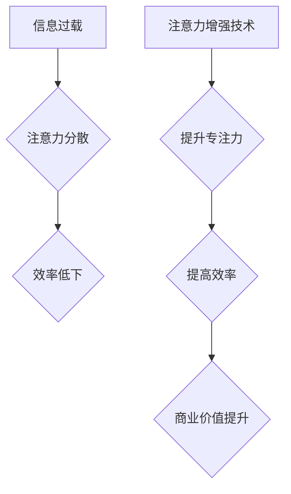

                 

## 人类注意力增强：提升专注力和注意力在商业中的未来发展机遇分析机遇挑战

> 关键词：注意力增强、专注力、深度学习、脑机接口、商业应用、未来趋势、机遇挑战

> 摘要：随着信息爆炸时代的到来，人类的注意力受到前所未有的挑战。本文将探讨注意力增强技术的发展现状，分析其核心概念、算法原理、数学模型以及实际应用场景。同时，深入分析注意力增强技术在商业领域的应用机遇和挑战，并展望其未来发展趋势。

## 1. 背景介绍

在当今信息爆炸的时代，人类面临着前所未有的信息过载。每天我们接触的海量信息、不断弹出的通知和社交媒体的干扰，使得专注力和注意力受到严重挑战。这不仅影响着人们的学习、工作和生活效率，也对社会整体的生产力和创新能力造成负面影响。

注意力增强技术应运而生，旨在通过科学的方法提升人类的专注力和注意力。这种技术涵盖了多个领域，包括心理学、神经科学、计算机科学和人工智能等。近年来，随着深度学习和脑机接口技术的快速发展，注意力增强技术取得了显著进展，并逐渐走向商业化应用。

## 2. 核心概念与联系

### 2.1 注意力机制

注意力机制是深度学习领域的重要组成部分，它能够帮助模型聚焦于输入数据中最重要的部分，从而提高学习效率和准确性。注意力机制的灵感来源于人类的视觉注意力，它能够自动识别和关注重要的视觉信息，忽略无关的信息。

### 2.2 人脑注意力

人类的注意力是一个复杂的心理过程，涉及到多个脑区协同工作。研究表明，前额叶皮层、顶叶皮层和后 parietal 皮层等脑区在注意力控制中起着重要作用。

### 2.3 注意力增强技术

注意力增强技术通过多种方式来提升人类的注意力，包括：

* **认知训练:** 通过专门设计的训练程序，锻炼大脑的注意力控制能力。
* **生物反馈:** 利用生物信号反馈，帮助用户了解自己的注意力状态，并通过调节自身生理活动来提升注意力。
* **脑机接口:** 通过脑电波或其他生物信号，直接与大脑进行交互，从而控制注意力。
* **数字工具:** 利用软件和硬件工具，过滤干扰信息，帮助用户集中注意力。

**Mermaid 流程图**



## 3. 核心算法原理 & 具体操作步骤

### 3.1 算法原理概述

注意力增强技术的核心算法原理主要基于深度学习和强化学习。深度学习算法能够自动学习数据中的复杂模式，而强化学习算法能够通过奖励机制来训练模型，使其能够在特定任务中取得最佳效果。

### 3.2 算法步骤详解

1. **数据收集:** 收集大量的人类注意力数据，例如眼动追踪数据、脑电波数据、行为数据等。
2. **数据预处理:** 对收集到的数据进行清洗、转换和特征提取。
3. **模型训练:** 利用深度学习和强化学习算法，训练注意力增强模型。
4. **模型评估:** 使用测试数据评估模型的性能，并进行调优。
5. **模型部署:** 将训练好的模型部署到实际应用场景中。

### 3.3 算法优缺点

**优点:**

* **自动化:** 注意力增强算法能够自动学习和调整，无需人工干预。
* **个性化:** 可以根据用户的不同需求和特点，定制个性化的注意力增强方案。
* **可扩展性:** 可以应用于多种不同的场景和设备。

**缺点:**

* **数据依赖:** 需要大量高质量的注意力数据进行训练。
* **计算资源:** 训练深度学习模型需要大量的计算资源。
* **伦理问题:** 注意力增强技术可能会被滥用，例如用于控制用户的行为或获取用户的隐私信息。

### 3.4 算法应用领域

注意力增强技术在多个领域都有广泛的应用前景，包括：

* **教育:** 帮助学生提高学习效率和专注力。
* **医疗:** 辅助治疗注意力缺陷多动障碍 (ADHD) 等注意力相关疾病。
* **游戏:** 提升游戏玩家的沉浸感和反应速度。
* **商业:** 帮助员工提高工作效率和决策能力。

## 4. 数学模型和公式 & 详细讲解 & 举例说明

### 4.1 数学模型构建

注意力机制通常使用一个加权求和函数来计算注意力分数，该函数将输入数据映射到一个注意力权重向量。

**注意力权重计算公式:**

$$
\alpha_i = \frac{exp(e_i)}{\sum_{j=1}^{N} exp(e_j)}
$$

其中：

* $\alpha_i$ 是第 i 个输入数据点的注意力权重。
* $e_i$ 是第 i 个输入数据点的注意力得分。
* $N$ 是输入数据点的总数。

### 4.2 公式推导过程

注意力权重计算公式的推导过程基于 softmax 函数，该函数将输入数据映射到一个概率分布。softmax 函数的目的是将多个输入值转换为一个总和为 1 的概率分布，从而表示每个输入数据点的相对重要性。

### 4.3 案例分析与讲解

假设我们有一个句子 "我爱学习编程"，我们想要计算每个单词的注意力权重。我们可以使用一个词嵌入模型将每个单词映射到一个向量空间，然后使用注意力机制计算每个单词的注意力得分。

例如，如果 "学习" 这个单词的注意力得分最高，那么模型会更加关注这个单词的信息，并将其作为句子理解的关键信息。

## 5. 项目实践：代码实例和详细解释说明

### 5.1 开发环境搭建

* Python 3.x
* TensorFlow 或 PyTorch 深度学习框架
* Jupyter Notebook 或 VS Code 代码编辑器

### 5.2 源代码详细实现

```python
import tensorflow as tf

# 定义注意力机制层
class AttentionLayer(tf.keras.layers.Layer):
    def __init__(self, units):
        super(AttentionLayer, self).__init__()
        self.W1 = tf.keras.layers.Dense(units)
        self.W2 = tf.keras.layers.Dense(units)
        self.V = tf.keras.layers.Dense(1)

    def call(self, inputs):
        # 计算注意力权重
        scores = self.V(tf.tanh(self.W1(inputs) + self.W2(inputs)))
        attention_weights = tf.nn.softmax(scores, axis=-1)
        # 计算加权求和
        context_vector = tf.matmul(attention_weights, inputs)
        return context_vector

# 定义注意力增强模型
model = tf.keras.Sequential([
    tf.keras.layers.Embedding(input_dim=10000, output_dim=128),
    AttentionLayer(units=64),
    tf.keras.layers.Dense(units=10, activation='softmax')
])

# 训练模型
model.compile(optimizer='adam', loss='sparse_categorical_crossentropy', metrics=['accuracy'])
model.fit(x_train, y_train, epochs=10)
```

### 5.3 代码解读与分析

* `AttentionLayer` 类定义了一个注意力机制层，它包含三个密集层：`W1`、`W2` 和 `V`。
* `call` 方法计算注意力权重和加权求和，最终输出一个上下文向量。
* `model` 是一个简单的注意力增强模型，它包含一个嵌入层、一个注意力层和一个全连接层。
* `compile` 方法配置模型的训练参数，包括优化器、损失函数和指标。
* `fit` 方法训练模型，使用训练数据 `x_train` 和标签 `y_train`。

### 5.4 运行结果展示

训练完成后，可以使用测试数据评估模型的性能，例如计算准确率。

## 6. 实际应用场景

### 6.1 教育领域

* **个性化学习:** 根据学生的注意力特点，定制个性化的学习方案，提高学习效率。
* **在线课程:** 利用注意力增强技术，帮助学生集中注意力，提高在线课程的学习效果。
* **考试辅助:** 通过注意力监测，帮助学生识别疲劳和分心状态，提高考试成绩。

### 6.2 医疗领域

* **ADHD 治疗:** 利用注意力增强技术，帮助 ADHD 患者提高注意力控制能力。
* **认知训练:** 设计注意力训练游戏，帮助老年人或脑损伤患者恢复认知功能。
* **远程医疗:** 利用脑机接口技术，远程监测患者的注意力状态，及时提供医疗干预。

### 6.3 商业领域

* **员工培训:** 利用注意力增强技术，提高员工培训的效率和效果。
* **决策支持:** 通过注意力分析，帮助企业决策者识别关键信息，做出更明智的决策。
* **用户体验优化:** 利用注意力分析，优化网站和应用程序的用户体验，提高用户粘性和转化率。

### 6.4 未来应用展望

随着注意力增强技术的不断发展，其应用场景将更加广泛，例如：

* **增强现实 (AR) 和虚拟现实 (VR):** 利用注意力增强技术，提升 AR 和 VR 的沉浸感和交互体验。
* **自动驾驶:** 利用注意力增强技术，帮助自动驾驶系统更好地感知周围环境，提高安全性。
* **人机交互:** 利用注意力增强技术，实现更加自然和流畅的人机交互。

## 7. 工具和资源推荐

### 7.1 学习资源推荐

* **书籍:**
    * "深度学习" by Ian Goodfellow, Yoshua Bengio, and Aaron Courville
    * "Attention Is All You Need" by Vaswani et al.
* **在线课程:**
    * Coursera: Deep Learning Specialization
    * Udacity: Deep Learning Nanodegree
* **博客和网站:**
    * Towards Data Science
    * Machine Learning Mastery

### 7.2 开发工具推荐

* **深度学习框架:** TensorFlow, PyTorch
* **数据可视化工具:** Matplotlib, Seaborn
* **代码编辑器:** Jupyter Notebook, VS Code

### 7.3 相关论文推荐

* "Attention Is All You Need"
* "BERT: Pre-training of Deep Bidirectional Transformers for Language Understanding"
* "Transformer-XL: Attentive Language Modeling Beyond Millions of Tokens"

## 8. 总结：未来发展趋势与挑战

### 8.1 研究成果总结

注意力增强技术取得了显著进展，在多个领域展现出巨大的应用潜力。深度学习和强化学习算法为注意力增强技术的发展提供了强大的工具，而脑机接口技术的进步也为注意力增强技术带来了新的可能性。

### 8.2 未来发展趋势

* **更精准的注意力控制:** 通过更深入的理解人类注意力机制，开发更精准的注意力控制技术。
* **个性化注意力增强:** 根据用户的不同需求和特点，定制个性化的注意力增强方案。
* **跨模态注意力增强:** 将注意力机制应用于多模态数据，例如文本、图像、音频等，实现更全面的注意力增强。
* **脑机接口融合:** 将注意力增强技术与脑机接口技术融合，实现更加直接和高效的注意力控制。

### 8.3 面临的挑战

* **数据隐私和安全:** 注意力增强技术需要收集大量的人类注意力数据，如何保护数据隐私和安全是一个重要的挑战。
* **伦理问题:** 注意力增强技术可能会被滥用，例如用于控制用户的行为或获取用户的隐私信息，需要制定相应的伦理规范和监管机制。
* **技术复杂性:** 注意力增强技术的开发和应用需要高水平的专业知识和技术能力，需要加强人才培养和技术普及。

### 8.4 研究展望

未来，注意力增强技术将继续朝着更精准、更个性化、更跨模态的方向发展。随着技术的进步和应用场景的拓展，注意力增强技术将为人类带来更多福祉，并推动社会进步。

## 9. 附录：常见问题与解答

* **注意力增强技术真的有效吗？**

  目前已有大量研究表明，注意力增强技术能够有效提升人类的注意力控制能力。

* **注意力增强技术有哪些风险？**

  注意力增强技术可能会被滥用，例如用于控制用户的行为或获取用户的隐私信息。

* **如何选择合适的注意力增强技术？**

  选择合适的注意力增强技术需要根据用户的需求和特点进行评估。

* **注意力增强技术的发展前景如何？**

  注意力增强技术的发展前景广阔，未来将应用于更多领域，为人类带来更多福祉。


作者：禅与计算机程序设计艺术 / Zen and the Art of Computer Programming<end_of_turn>

