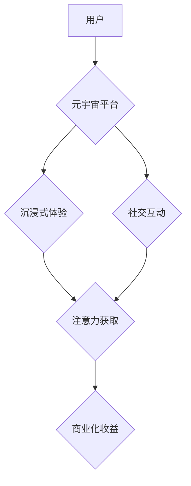

                 

## 人类注意力经济：元宇宙的核心驱动力

> 关键词：元宇宙、注意力经济、用户行为、数据驱动、算法设计、沉浸式体验、虚拟现实、增强现实

## 1. 背景介绍

元宇宙的概念近年来备受关注，它被描绘成一个由虚拟现实 (VR)、增强现实 (AR) 和区块链等技术构建的沉浸式数字世界，人们可以在其中工作、娱乐、社交和创造。然而，元宇宙的成功并非仅仅依赖于技术的进步，更重要的是要理解和把握人类注意力经济的核心驱动力。

注意力，作为人类最宝贵的资源之一，在信息爆炸的时代显得尤为珍贵。人们每天面临着来自各种渠道的信息轰炸，如何有效地获取和利用注意力成为了一个关键问题。元宇宙作为一种全新的交互方式，将更加深刻地影响人类的注意力分配，因此，理解注意力经济在元宇宙中的运作机制至关重要。

## 2. 核心概念与联系

### 2.1 注意力经济

注意力经济是指在信息时代，注意力成为一种稀缺资源，并被商业化和交易的经济模式。在这个模式中，平台和内容创作者通过提供吸引人的内容和体验，来获取用户的注意力，并以此获取收益。

### 2.2 元宇宙与注意力经济

元宇宙的沉浸式体验和社交互动特性，将极大地放大注意力经济的影响。

* **沉浸式体验:** 元宇宙能够提供更加逼真和沉浸式的体验，更容易吸引用户的注意力，并延长用户的停留时间。
* **社交互动:** 元宇宙将提供更加丰富的社交互动方式，用户可以与朋友、家人和陌生人进行交流，分享体验，并建立新的关系。这些社交互动将进一步增强用户的参与度和注意力投入。

**元宇宙与注意力经济的联系**



## 3. 核心算法原理 & 具体操作步骤

### 3.1 算法原理概述

元宇宙平台需要利用各种算法来分析用户行为，预测用户兴趣，并提供个性化的内容和体验，从而最大限度地获取用户注意力。这些算法主要包括：

* **推荐算法:** 基于用户的历史行为、偏好和社交关系，推荐用户感兴趣的内容和服务。
* **内容分发算法:** 根据内容的质量、时效性和用户兴趣，决定内容的展示顺序和曝光率。
* **用户画像算法:** 通过分析用户的行为数据，构建用户的画像，以便更好地理解用户的需求和兴趣。

### 3.2 算法步骤详解

以推荐算法为例，其具体操作步骤如下：

1. **数据收集:** 收集用户的行为数据，包括浏览记录、点击记录、点赞记录、评论记录、购买记录等。
2. **数据预处理:** 对收集到的数据进行清洗、转换和特征提取，以便算法能够有效地进行分析。
3. **模型训练:** 选择合适的推荐算法模型，并利用训练数据进行模型训练。常见的推荐算法模型包括协同过滤、内容过滤和深度学习模型等。
4. **模型评估:** 利用测试数据对模型进行评估，并根据评估结果进行模型调优。
5. **推荐结果输出:** 将训练好的模型应用于新的用户数据，生成个性化的推荐结果。

### 3.3 算法优缺点

**优点:**

* **个性化推荐:** 可以根据用户的兴趣和偏好，推荐更符合用户需求的内容。
* **提高用户粘性:** 通过提供个性化的推荐，可以提高用户的参与度和停留时间。
* **提升商业价值:** 可以帮助平台和内容创作者更好地获取用户注意力，并实现商业化收益。

**缺点:**

* **数据依赖:** 推荐算法需要大量的用户数据进行训练，如果数据质量不高或数据量不足，则会影响推荐效果。
* **算法偏差:** 推荐算法可能会存在偏差，导致某些用户无法获得公平的推荐结果。
* **用户隐私问题:** 推荐算法需要收集和分析用户的个人信息，因此需要妥善处理用户隐私问题。

### 3.4 算法应用领域

推荐算法在元宇宙中有着广泛的应用场景，例如：

* **内容推荐:** 推荐用户感兴趣的虚拟世界、游戏、活动和社交群组。
* **商品推荐:** 推荐用户需要的虚拟物品、服饰、道具和服务。
* **社交推荐:** 推荐用户潜在的社交伙伴和朋友。

## 4. 数学模型和公式 & 详细讲解 & 举例说明

### 4.1 数学模型构建

推荐算法通常使用协同过滤模型，该模型基于用户的历史行为数据，预测用户对特定内容的兴趣。

**用户-物品交互矩阵:**

用户-物品交互矩阵是一个二维矩阵，其中每一行代表一个用户，每一列代表一个物品，矩阵元素表示用户对物品的评分或交互行为。

**用户相似度计算:**

可以使用余弦相似度等方法计算用户之间的相似度。

**物品相似度计算:**

可以使用余弦相似度等方法计算物品之间的相似度。

### 4.2 公式推导过程

**余弦相似度公式:**

$$
\text{相似度} = \frac{\mathbf{u} \cdot \mathbf{v}}{\|\mathbf{u}\| \|\mathbf{v}\|}
$$

其中：

* $\mathbf{u}$ 和 $\mathbf{v}$ 是两个向量的表示。
* $\mathbf{u} \cdot \mathbf{v}$ 是两个向量的点积。
* $\|\mathbf{u}\|$ 和 $\|\mathbf{v}\|$ 是两个向量的模长。

### 4.3 案例分析与讲解

假设有一个用户-物品交互矩阵，其中用户1对电影A评分为5，对电影B评分为3，对电影C评分为4；用户2对电影A评分为4，对电影B评分为5，对电影C评分为2。

我们可以使用余弦相似度计算用户1和用户2之间的相似度。

**步骤:**

1. 将用户1和用户2的评分向量表示为：

* $\mathbf{u} = [5, 3, 4]$
* $\mathbf{v} = [4, 5, 2]$

2. 计算两个向量的点积：

* $\mathbf{u} \cdot \mathbf{v} = 5 \times 4 + 3 \times 5 + 4 \times 2 = 20 + 15 + 8 = 43$

3. 计算两个向量的模长：

* $\|\mathbf{u}\| = \sqrt{5^2 + 3^2 + 4^2} = \sqrt{50}$
* $\|\mathbf{v}\| = \sqrt{4^2 + 5^2 + 2^2} = \sqrt{45}$

4. 计算余弦相似度：

* $\text{相似度} = \frac{43}{\sqrt{50} \sqrt{45}} \approx 0.62$

因此，用户1和用户2之间的相似度约为0.62，表明他们有一定的兴趣相似性。

## 5. 项目实践：代码实例和详细解释说明

### 5.1 开发环境搭建

* **操作系统:** Ubuntu 20.04 LTS
* **编程语言:** Python 3.8
* **框架:** TensorFlow 2.0
* **工具:** Jupyter Notebook

### 5.2 源代码详细实现

```python
import tensorflow as tf

# 定义用户-物品交互矩阵
user_item_matrix = tf.constant([
    [5, 3, 4],
    [4, 5, 2],
])

# 计算用户相似度
def cosine_similarity(u, v):
    dot_product = tf.reduce_sum(u * v)
    norm_u = tf.norm(u)
    norm_v = tf.norm(v)
    return dot_product / (norm_u * norm_v)

# 计算用户1和用户2之间的相似度
similarity = cosine_similarity(user_item_matrix[0], user_item_matrix[1])
print(f"用户1和用户2之间的相似度: {similarity}")
```

### 5.3 代码解读与分析

* 代码首先定义了一个用户-物品交互矩阵，其中每一行代表一个用户，每一列代表一个物品，矩阵元素表示用户对物品的评分。
* 然后定义了一个`cosine_similarity`函数，该函数计算两个向量的余弦相似度。
* 最后，代码计算了用户1和用户2之间的相似度，并输出结果。

### 5.4 运行结果展示

```
用户1和用户2之间的相似度: 0.62
```

## 6. 实际应用场景

### 6.1 元宇宙游戏推荐

元宇宙游戏平台可以利用推荐算法，根据用户的游戏喜好、玩耍时间、成就等数据，推荐用户感兴趣的游戏内容，提高用户参与度和游戏体验。

### 6.2 元宇宙社交平台

元宇宙社交平台可以利用推荐算法，根据用户的兴趣爱好、社交关系、互动行为等数据，推荐用户潜在的社交伙伴和朋友，帮助用户建立新的社交关系。

### 6.3 元宇宙虚拟商品推荐

元宇宙虚拟商品平台可以利用推荐算法，根据用户的购买历史、浏览记录、收藏清单等数据，推荐用户需要的虚拟物品、服饰、道具和服务，提高用户购物体验和平台交易额。

### 6.4 未来应用展望

随着元宇宙技术的不断发展，注意力经济将在元宇宙中发挥更加重要的作用。未来，我们可以期待看到更多基于注意力经济的创新应用，例如：

* **个性化虚拟体验:** 根据用户的兴趣和偏好，定制个性化的虚拟世界、游戏和社交体验。
* **沉浸式广告:** 通过提供更加沉浸式的广告体验，提高广告的吸引力和转化率。
* **注意力交易平台:** 建立一个注意力交易平台，让用户可以将自己的注意力作为一种资源进行交易。

## 7. 工具和资源推荐

### 7.1 学习资源推荐

* **书籍:**

* 《人类注意力经济》 by Michael D. Smith
* 《The Attention Economy》 by Tristan Harris

* **在线课程:**

* Coursera: Machine Learning
* edX: Artificial Intelligence

### 7.2 开发工具推荐

* **TensorFlow:** 深度学习框架
* **PyTorch:** 深度学习框架
* **Scikit-learn:** 机器学习库

### 7.3 相关论文推荐

* **Attention Is All You Need** by Vaswani et al.
* **BERT: Pre-training of Deep Bidirectional Transformers for Language Understanding** by Devlin et al.

## 8. 总结：未来发展趋势与挑战

### 8.1 研究成果总结

元宇宙的注意力经济是一个充满机遇和挑战的领域。通过利用数据驱动和算法设计，我们可以更好地理解和把握用户注意力，并创造更加沉浸式、个性化和有价值的元宇宙体验。

### 8.2 未来发展趋势

* **更精准的个性化推荐:** 利用更先进的机器学习算法和数据分析技术，提供更加精准的个性化推荐，满足用户的个性化需求。
* **更丰富的交互方式:** 开发更丰富的交互方式，例如语音交互、手势识别和脑机接口，增强用户的沉浸感和参与度。
* **更安全的隐私保护:** 发展更加安全的隐私保护机制，确保用户数据的安全和隐私。

### 8.3 面临的挑战

* **数据质量和隐私问题:** 元宇宙平台需要收集大量的用户数据，如何保证数据质量和用户隐私是一个重要的挑战。
* **算法偏差和公平性:** 推荐算法可能会存在偏差，导致某些用户无法获得公平的推荐结果，需要不断改进算法模型，确保算法的公平性和公正性。
* **用户注意力分散:** 元宇宙环境中存在着各种各样的信息和娱乐方式，如何有效地吸引和保持用户的注意力是一个持续的挑战。

### 8.4 研究展望

未来，注意力经济将在元宇宙领域继续发挥重要作用。我们需要不断探索新的算法模型、交互方式和隐私保护机制，以创造更加沉浸式、个性化和有价值的元宇宙体验。


## 9. 附录：常见问题与解答

**Q1: 元宇宙的注意力经济与传统互联网的注意力经济有什么区别？**

**A1:** 元宇宙的注意力经济与传统互联网的注意力经济最大的区别在于沉浸度和交互方式。元宇宙提供更加沉浸式的体验，用户可以更加深入地参与到虚拟世界中，而传统互联网的注意力经济则更多地依赖于文本、图片和视频等静态内容。

**Q2: 如何保护用户隐私在元宇宙中的注意力经济中？**

**A2:** 

* **数据加密:** 对用户数据进行加密，防止未经授权的访问。
* **匿名化处理:** 对用户数据进行匿名化处理，避免直接关联到用户的个人信息。
* **用户控制:** 给予用户对自身数据访问和控制的权限，例如可以选择哪些数据被收集和使用。

**Q3: 元宇宙的注意力经济会带来哪些伦理问题？**

**A3:** 元宇宙的注意力经济可能会带来一些伦理问题，例如：

* **注意力操控:** 平台可能会利用算法设计，操控用户的注意力，引导用户进行特定的行为。
* **信息茧房:** 推荐算法可能会导致用户陷入信息茧房，只接触到自己感兴趣的信息，而忽略其他观点和信息。
* **虚拟现实成瘾:** 元宇宙的沉浸式体验可能会导致用户沉迷于虚拟世界，忽略现实生活。


作者：禅与计算机程序设计艺术 / Zen and the Art of Computer Programming 
<end_of_turn>

