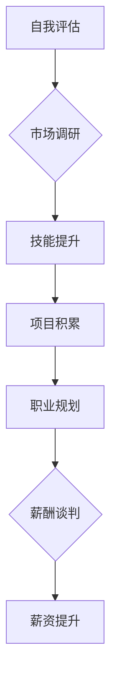

                 

## 从初级到高级：薪资提升攻略

> 关键词：薪资提升、职业发展、技术技能、学习方法、行业趋势

> 摘要：本文旨在为IT从业者提供从初级到高级的薪资提升攻略，涵盖技术技能提升、职业发展规划、学习方法优化以及行业趋势分析等方面，帮助读者明确职业目标，制定切实可行的提升计划，最终实现薪资增长和职业成功。

## 1. 背景介绍

在当今科技飞速发展的时代，IT行业人才需求量巨大，竞争也日益激烈。想要在激烈的市场竞争中脱颖而出，获得更高的薪资回报，就必须不断提升自身的技术技能和职业素养。然而，许多IT从业者往往感到迷茫，不知道如何才能有效提升薪资。

本文将从初级到高级，为IT从业者提供一份详细的薪资提升攻略，帮助他们明确职业目标，制定切实可行的提升计划，最终实现薪资增长和职业成功。

## 2. 核心概念与联系

**2.1  薪资提升的本质**

薪资提升的本质是提升自身价值。在IT行业，价值体现为：

* **技术能力:** 掌握更先进的技术技能，能够解决更复杂的问题，为公司创造更大的价值。
* **项目经验:** 参与和完成更多项目，积累丰富的项目经验，提升解决实际问题的能力。
* **职业素养:** 具备良好的沟通能力、团队合作精神、学习能力和解决问题的能力，成为团队中不可或缺的人才。

**2.2  薪资提升的要素**

薪资提升是一个多因素综合作用的结果，主要包括：

* **个人能力:** 技术技能、项目经验、职业素养等。
* **市场需求:** 行业发展趋势、技术热度、人才供需关系等。
* **公司规模和效益:** 公司规模、盈利能力、薪酬体系等。
* **个人谈判能力:** 能够清晰表达自身价值，与公司进行有效的薪酬谈判。

**2.3  薪资提升的流程**

薪资提升是一个循序渐进的过程，可以概括为以下流程：

* **自我评估:** 了解自身技术技能、项目经验、职业素养等方面的优势和劣势。
* **市场调研:** 了解行业发展趋势、技术热度、人才供需关系等，明确目标薪资水平。
* **技能提升:** 制定学习计划，不断提升技术技能，掌握新技术和新工具。
* **项目积累:** 积极参与项目，积累项目经验，提升解决实际问题的能力。
* **职业规划:** 制定职业发展规划，明确职业目标，为薪资提升打下坚实基础。
* **薪酬谈判:** 掌握薪酬谈判技巧，与公司进行有效的薪酬谈判，争取更高的薪资回报。

**2.4  Mermaid 流程图**

## 3. 核心算法原理 & 具体操作步骤

**3.1  算法原理概述**

算法是解决特定问题的一系列步骤，是计算机程序的核心。掌握算法设计和分析能力是IT从业者提升薪资的重要途径之一。

**3.2  算法步骤详解**

1. **问题分析:** 首先要明确问题的具体描述，包括输入、输出和约束条件。
2. **算法设计:** 根据问题分析结果，设计出解决问题的算法，并将其描述成清晰易懂的步骤。
3. **算法实现:** 将算法用编程语言实现，编写出相应的程序代码。
4. **算法测试:** 对程序代码进行测试，验证算法的正确性和效率。
5. **算法优化:** 根据测试结果，对算法进行优化，提高其效率和性能。

**3.3  算法优缺点**

不同的算法具有不同的优缺点，需要根据具体问题选择合适的算法。

* **时间复杂度:** 指算法执行所需的时间与输入数据大小的关系。时间复杂度越低，算法效率越高。
* **空间复杂度:** 指算法执行所需内存空间与输入数据大小的关系。空间复杂度越低，算法占用内存越少。
* **易读性:** 指算法描述的清晰度和易懂程度。易读性高的算法更容易理解和维护。

**3.4  算法应用领域**

算法广泛应用于各个领域，例如：

* **数据结构和算法:** 构建高效的数据结构和算法，解决数据存储、检索和处理问题。
* **机器学习:** 设计和训练机器学习模型，实现自动学习和预测。
* **人工智能:** 开发人工智能系统，赋予机器智能和认知能力。
* **网络安全:** 设计和实现网络安全算法，保障网络安全和数据隐私。

## 4. 数学模型和公式 & 详细讲解 & 举例说明

**4.1  数学模型构建**

数学模型是抽象描述客观现象的工具，在算法设计和分析中起着至关重要的作用。

**4.2  公式推导过程**

例如，在排序算法中，可以使用数学公式来描述算法的时间复杂度。

* **冒泡排序:** 时间复杂度为 O(n^2)，其中 n 为数据元素个数。
* **快速排序:** 时间复杂度为平均情况下 O(n log n)，最坏情况下 O(n^2)。

**4.3  案例分析与讲解**

通过分析算法的时间复杂度公式，可以比较不同算法的效率，选择最优的算法。

## 5. 项目实践：代码实例和详细解释说明

**5.1  开发环境搭建**

选择合适的开发环境，例如：

* **操作系统:** Windows、macOS、Linux 等。
* **编程语言:** Python、Java、C++ 等。
* **IDE:** Eclipse、IntelliJ IDEA、Visual Studio Code 等。

**5.2  源代码详细实现**

根据算法设计，编写相应的程序代码。

**5.3  代码解读与分析**

对代码进行详细解读，分析算法的执行流程和逻辑。

**5.4  运行结果展示**

运行程序代码，观察算法的执行结果，验证算法的正确性和效率。

## 6. 实际应用场景

**6.1  行业应用**

算法广泛应用于各个行业，例如：

* **金融:** 风险评估、欺诈检测、投资预测等。
* **医疗:** 疾病诊断、药物研发、医疗影像分析等。
* **电商:** 商品推荐、用户画像、物流优化等。

**6.2  具体案例分析**

例如，在电商领域，推荐算法可以根据用户的购买历史、浏览记录等数据，推荐用户可能感兴趣的商品，提高用户体验和转化率。

**6.3  未来应用展望**

随着人工智能技术的不断发展，算法将在更多领域得到应用，例如：

* **自动驾驶:** 算法可以帮助车辆感知周围环境、规划路径、控制行驶。
* **机器人:** 算法可以赋予机器人智能和认知能力，使其能够完成复杂的任务。
* **个性化教育:** 算法可以根据学生的学习情况，提供个性化的学习内容和辅导。

## 7. 工具和资源推荐

**7.1  学习资源推荐**

* **书籍:** 《算法导论》、《数据结构与算法分析》等。
* **在线课程:** Coursera、edX、Udemy 等平台提供丰富的算法课程。
* **编程网站:** LeetCode、HackerRank 等网站提供算法练习平台。

**7.2  开发工具推荐**

* **编程语言:** Python、Java、C++ 等。
* **IDE:** Eclipse、IntelliJ IDEA、Visual Studio Code 等。
* **版本控制系统:** Git、GitHub 等。

**7.3  相关论文推荐**

* **学术期刊:** ACM Transactions on Algorithms、Journal of the ACM 等。
* **会议论文:** SIGGRAPH、ICML 等。

## 8. 总结：未来发展趋势与挑战

**8.1  研究成果总结**

近年来，算法研究取得了显著进展，例如：

* **深度学习:** 深度学习算法在图像识别、自然语言处理等领域取得了突破性进展。
* **强化学习:** 强化学习算法能够使机器学习如何与环境交互，并通过奖励机制学习最佳策略。

**8.2  未来发展趋势**

未来算法研究将朝着以下方向发展：

* **更智能的算法:** 能够更好地理解和模拟人类智能的算法。
* **更普适的算法:** 能够应用于更广泛的领域和场景的算法。
* **更安全可靠的算法:** 能够保证算法的安全性、可靠性和可解释性的算法。

**8.3  面临的挑战**

算法研究也面临着一些挑战，例如：

* **算法复杂度:** 随着算法规模的扩大，算法的复杂度也随之增加，难以设计和分析。
* **数据隐私:** 算法的训练和应用需要大量数据，如何保护数据隐私是一个重要问题。
* **算法偏见:** 算法可能存在偏见，导致不公平的结果，需要进行公平性评估和改进。

**8.4  研究展望**

未来算法研究需要更加注重算法的安全性、可靠性和可解释性，并与其他学科交叉融合，推动算法技术向更智能、更普适、更安全的方向发展。

## 9. 附录：常见问题与解答

**9.1  常见问题**

* 如何选择合适的算法？
* 如何提高算法的效率？
* 如何解决算法的偏见问题？

**9.2  解答**

* 选择合适的算法需要根据具体问题分析算法的时间复杂度、空间复杂度、易读性等因素。
* 提高算法效率可以通过优化算法设计、选择合适的数据结构、使用并行计算等方法。
* 解决算法的偏见问题可以通过使用公平性评估指标、收集更全面和多样化的数据、设计更公平的算法模型等方法。

作者：禅与计算机程序设计艺术 / Zen and the Art of Computer Programming 
<end_of_turn>

