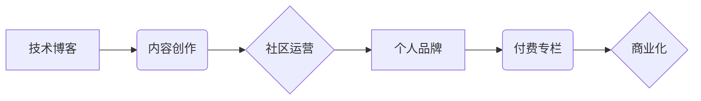

                 

## 从技术博客到付费专栏的进阶之路

> 关键词：技术博客、付费专栏、内容创作、社区运营、商业化、技术写作、个人品牌

### 1. 背景介绍

在当今数字时代，技术博客已成为技术人员展示专业知识、分享经验和建立个人品牌的平台。许多技术爱好者和专家通过博客分享他们的见解、代码示例和技术洞察，吸引了大量读者和关注。然而，仅仅依靠广告收入或赞助难以实现可持续的收益。付费专栏则为技术博主提供了一种更有效的方式，通过提供高质量、独家内容来获取稳定的收入。

### 2. 核心概念与联系

**2.1 技术博客与付费专栏的差异**

* **技术博客:** 通常是免费开放的平台，内容涵盖广泛的技术主题，依靠广告收入、赞助或捐赠来维持运营。
* **付费专栏:** 提供付费订阅服务，用户需支付一定的费用才能访问专栏内容。内容通常更深入、更专业，并提供独家资源、社区互动等额外价值。

**2.2  付费专栏的商业模式**

* **订阅制:** 用户每月或每年支付固定费用订阅专栏内容。
* **会员制:** 提供不同等级的会员服务，每个等级对应不同的内容访问权限和额外福利。
* **付费课程:** 提供付费技术课程或培训，针对特定技术领域或技能。

**2.3  核心概念关系图**



### 3. 核心算法原理 & 具体操作步骤

**3.1 算法原理概述**

付费专栏的成功取决于以下核心算法：

* **价值创造算法:** 提供高质量、独家、有价值的内容，满足用户需求。
* **社区运营算法:** 建立活跃的社区，促进用户互动和粘性。
* **商业化算法:** 探索多种商业模式，实现可持续盈利。

**3.2 算法步骤详解**

1. **价值创造:**
    * **确定目标受众:** 了解目标用户的技术背景、兴趣和需求。
    * **内容规划:** 制定内容策略，选择热门话题、技术趋势和原创内容。
    * **高质量写作:** 撰写清晰、简洁、易懂的文字，并配以代码示例、图表和案例分析。
    * **独家资源:** 提供独家教程、代码库、工具和资源，提升用户价值。

2. **社区运营:**
    * **建立平台:** 选择合适的平台，例如 Medium、Substack 或个人网站。
    * **互动交流:** 积极回复评论、参与讨论，建立与用户的连接。
    * **组织活动:** 举办线上线下活动，促进用户互动和社群建设。
    * **内容分享:** 鼓励用户分享内容，构建共同价值。

3. **商业化:**
    * **订阅模式:** 设置合理的订阅价格，提供不同等级的会员服务。
    * **付费课程:** 开发针对特定技术领域的付费课程或培训。
    * **赞助合作:** 与相关企业合作，获得赞助或广告收入。
    * **周边产品:** 推出相关书籍、电子书、T恤等周边产品。

**3.3 算法优缺点**

* **优点:** 
    * 能够实现可持续盈利。
    * 提升用户粘性，建立忠实读者群体。
    * 增强个人品牌影响力。
* **缺点:** 
    * 需要投入大量时间和精力进行内容创作和社区运营。
    * 需要不断学习和更新知识，保持内容的竞争力。
    * 需要掌握一定的商业运营技巧。

**3.4 算法应用领域**

* **软件开发:** 分享开发经验、技术技巧、代码示例等。
* **数据科学:** 讲解数据分析方法、机器学习算法、数据可视化等。
* **人工智能:** 探讨人工智能技术、应用案例、发展趋势等。
* **云计算:** 介绍云平台、服务、架构设计等。

### 4. 数学模型和公式 & 详细讲解 & 举例说明

**4.1 数学模型构建**

付费专栏的成功可以看作是一个动态平衡的过程，涉及用户价值、内容质量、社区活跃度和商业模式等多个因素。我们可以构建一个简单的数学模型来描述这个过程：

```latex
S = f(V, Q, A, M)
```

其中：

* **S:** 付费专栏的成功度
* **V:** 用户价值
* **Q:** 内容质量
* **A:** 社区活跃度
* **M:** 商业模式

**4.2 公式推导过程**

每个因素对成功度的影响可以通过权重系数来表示：

* **用户价值 (V):**  用户对内容的兴趣、需求和支付意愿。
* **内容质量 (Q):** 内容的原创性、深度、实用性和吸引力。
* **社区活跃度 (A):** 用户之间的互动频率、参与度和粘性。
* **商业模式 (M):** 订阅价格、会员服务、付费课程等商业模式的合理性和吸引力。

**4.3 案例分析与讲解**

例如，一个技术博客想要转型为付费专栏，需要考虑以下因素：

* **用户价值:** 确定目标用户的技术背景、兴趣和需求，提供有价值的内容。
* **内容质量:** 撰写高质量、原创、深入的技术文章，并配以代码示例、图表和案例分析。
* **社区活跃度:** 建立活跃的社区，鼓励用户互动、分享和讨论。
* **商业模式:** 选择合适的商业模式，例如订阅制、会员制或付费课程，并设置合理的收费标准。

通过优化以上因素，技术博客可以提高付费专栏的成功度。

### 5. 项目实践：代码实例和详细解释说明

**5.1 开发环境搭建**

* **选择平台:** Medium、Substack、Ghost 等平台提供付费专栏功能。
* **域名注册:** 注册一个专属域名，提升品牌形象和专业度。
* **服务器配置:** 选择合适的服务器配置，确保网站稳定运行。

**5.2 源代码详细实现**

* **博客主题:** 选择合适的博客主题，并进行个性化定制。
* **支付插件:** 集成支付插件，例如 Stripe、PayPal 等，方便用户付费订阅。
* **会员管理:** 开发会员管理系统，管理用户订阅信息和权限。

**5.3 代码解读与分析**

* **路由配置:** 配置博客路由，区分付费内容和免费内容。
* **权限控制:** 实现用户权限控制，确保付费用户才能访问付费内容。
* **支付流程:** 实现支付流程，包括用户下单、支付确认和订阅激活。

**5.4 运行结果展示**

* **付费专栏页面:** 展示付费专栏内容，并提供订阅按钮。
* **会员中心:** 提供用户会员信息、订阅记录和付费内容访问等功能。
* **支付成功页面:** 显示支付成功信息，并引导用户访问付费内容。

### 6. 实际应用场景

* **技术专家:** 分享专业知识、经验和见解，建立个人品牌，获得收入。
* **创业者:** 推广产品或服务，建立用户社区，获取反馈和支持。
* **教育机构:** 提供在线课程、培训和学习资源，拓展教育业务。

**6.4 未来应用展望**

* **人工智能辅助写作:** 利用人工智能技术辅助内容创作，提高效率和质量。
* **个性化内容推荐:** 基于用户行为和偏好，推荐个性化内容，提升用户体验。
* **虚拟现实互动:** 利用虚拟现实技术打造沉浸式社区互动体验。

### 7. 工具和资源推荐

**7.1 学习资源推荐**

* **书籍:** 《写作的力量》、《内容营销》、《博客运营指南》
* **网站:**  Medium、Substack、Ghost、WordPress

**7.2 开发工具推荐**

* **博客平台:** Medium、Substack、Ghost、WordPress
* **支付插件:** Stripe、PayPal、Alipay
* **会员管理系统:** MemberPress、Restrict Content Pro

**7.3 相关论文推荐**

* **内容营销:**  "Content Marketing: A Review and Research Agenda"
* **付费订阅:** "The Economics of Subscription Services"
* **社区运营:** "Community Building: A Guide for Leaders"

### 8. 总结：未来发展趋势与挑战

**8.1 研究成果总结**

付费专栏为技术博主提供了新的商业模式，可以实现可持续盈利，提升个人品牌影响力。

**8.2 未来发展趋势**

* **内容多元化:**  除了文字内容，还会出现更多音频、视频、直播等多元化内容形式。
* **个性化定制:**  根据用户需求，提供个性化内容推荐和定制服务。
* **人工智能应用:**  利用人工智能技术辅助内容创作、社区运营和用户体验优化。

**8.3 面临的挑战**

* **内容竞争:**  随着付费专栏的普及，内容竞争将更加激烈。
* **用户粘性:**  需要不断更新内容，提升用户体验，保持用户粘性。
* **商业模式创新:**  需要探索新的商业模式，实现可持续盈利。

**8.4 研究展望**

* **付费专栏的商业模式创新:**  探索新的商业模式，例如会员制、付费课程、知识付费等。
* **人工智能在付费专栏中的应用:**  利用人工智能技术辅助内容创作、社区运营和用户体验优化。
* **付费专栏的社会影响:**  研究付费专栏对知识传播、技术发展和社会进步的影响。

### 9. 附录：常见问题与解答

* **如何选择合适的付费专栏平台？**

   需要根据自己的需求和目标用户选择合适的平台。例如，Medium 拥有庞大的用户群体，Substack 则更注重社区建设，Ghost 更适合技术博客。

* **如何设置合理的订阅价格？**

   需要考虑内容价值、目标用户群体和市场竞争情况。可以参考其他付费专栏的价格，并根据自己的情况进行调整。

* **如何提高付费专栏的知名度和用户粘性？**

   需要积极推广付费专栏，建立活跃的社区，并提供高质量、独家内容。

* **如何应对付费专栏的竞争？**

   需要不断提升内容质量，探索新的商业模式，并建立独特的个人品牌。


作者：禅与计算机程序设计艺术 / Zen and the Art of Computer Programming 
<end_of_turn>

