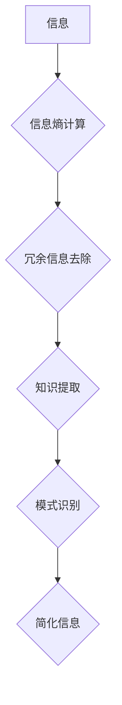

                 

## 信息简化的好处与挑战：简化复杂性的艺术与科学

> 关键词：信息简化、复杂系统、算法、数学模型、代码实现、应用场景、未来趋势

### 1. 背景介绍

在当今信息爆炸的时代，我们被海量数据和复杂系统所包围。从庞大的互联网网络到复杂的生物系统，从金融市场到人工智能算法，无处不在的复杂性正在挑战我们的认知能力和解决问题的能力。如何有效地简化信息，提取关键要素，并将其转化为易于理解和操作的知识，已成为一个至关重要的议题。

信息简化不仅关乎于个人学习和工作效率的提升，更关系到社会发展和人类文明的进步。简化复杂信息可以帮助我们更深入地理解世界，更有效地解决问题，并最终推动科技创新和社会进步。

### 2. 核心概念与联系

信息简化是一个多学科交叉的领域，涉及到计算机科学、信息论、认知科学、心理学等多个领域。其核心概念包括：

* **信息熵:** 信息熵是衡量信息不确定性的度量，越高的信息熵表示信息越复杂，越难以理解。
* **信息压缩:** 信息压缩是指通过算法将冗余信息去除，将信息量减少，从而简化信息表示。
* **知识提取:** 知识提取是指从复杂的信息中识别和提取关键知识，并将其组织成易于理解和使用的形式。
* **模式识别:** 模式识别是指识别信息中的重复性和规律性，并将其抽象成更简洁的模型。

**Mermaid 流程图:**



### 3. 核心算法原理 & 具体操作步骤

#### 3.1  算法原理概述

信息简化算法通常基于以下原理：

* **数据结构优化:** 通过选择合适的树状结构、图结构或其他数据结构，可以更有效地组织和存储信息，并减少冗余信息。
* **信息编码:** 使用压缩算法或其他编码方法，将信息表示成更紧凑的格式，从而减少信息量。
* **特征选择:** 从大量特征中选择最关键的特征，并忽略不重要的特征，从而简化模型复杂度。
* **降维技术:** 使用主成分分析、奇异值分解等降维技术，将高维数据降维到低维空间，从而简化数据表示。

#### 3.2  算法步骤详解

具体操作步骤取决于所使用的算法类型，但一般包括以下步骤：

1. **数据预处理:** 对原始数据进行清洗、转换和格式化，以便于后续算法处理。
2. **特征提取:** 从原始数据中提取关键特征，并构建特征向量。
3. **算法训练:** 使用训练数据训练所选择的算法模型，并调整模型参数。
4. **模型评估:** 使用测试数据评估模型性能，并进行模型调优。
5. **信息简化:** 将训练好的模型应用于新的数据，并根据模型输出进行信息简化。

#### 3.3  算法优缺点

不同的信息简化算法具有不同的优缺点，需要根据具体应用场景选择合适的算法。

* **优点:** 
    * 提高信息理解效率
    * 简化数据处理复杂度
    * 促进知识发现和创新
* **缺点:** 
    * 可能丢失部分信息
    * 需要一定的算法和数据处理能力
    * 算法选择和参数调优需要经验和技巧

#### 3.4  算法应用领域

信息简化算法广泛应用于各个领域，例如：

* **自然语言处理:** 文本摘要、机器翻译、情感分析等
* **图像处理:** 图像压缩、图像识别、目标检测等
* **数据挖掘:** 数据聚类、异常检测、关联规则挖掘等
* **人工智能:** 模型压缩、知识表示、推理决策等

### 4. 数学模型和公式 & 详细讲解 & 举例说明

#### 4.1  数学模型构建

信息简化可以抽象为一个数学模型，其中信息量作为目标函数，算法参数作为优化变量。

* **信息熵:**  $$H(X) = - \sum_{i=1}^{n} p(x_i) \log_2 p(x_i)$$
    * $X$ 表示随机变量
    * $p(x_i)$ 表示 $x_i$ 的概率
* **信息增益:** $$Gain(S,A) = H(S) - \sum_{v \in V} \frac{|S_v|}{|S|} H(S_v|A=v)$$
    * $S$ 表示父节点
    * $A$ 表示特征
    * $V$ 表示特征 $A$ 的取值集合
    * $S_v$ 表示父节点 $S$ 中特征 $A$ 取值为 $v$ 的子节点

#### 4.2  公式推导过程

信息增益公式的推导过程基于信息熵的定义和条件概率的计算。

* **信息熵:**  $$H(X) = - \sum_{i=1}^{n} p(x_i) \log_2 p(x_i)$$
* **条件熵:** $$H(Y|X) = \sum_{x \in X} p(x) H(Y|X=x)$$
* **信息增益:** $$Gain(S,A) = H(S) - \sum_{v \in V} \frac{|S_v|}{|S|} H(S_v|A=v)$$

#### 4.3  案例分析与讲解

假设我们有一个数据集，包含关于水果的属性，例如颜色、形状、大小等。我们想使用信息增益算法来选择最优的特征，用于分类水果。

* **信息熵:** 计算数据集的初始信息熵，表示水果分类的不确定性。
* **条件熵:** 计算每个特征的条件熵，表示在已知该特征的情况下，水果分类的不确定性。
* **信息增益:** 计算每个特征的信息增益，表示该特征能够减少分类不确定性的程度。
* **选择特征:** 选择信息增益最大的特征作为最优特征，用于分类水果。

### 5. 项目实践：代码实例和详细解释说明

#### 5.1  开发环境搭建

* **操作系统:** Ubuntu 20.04 LTS
* **编程语言:** Python 3.8
* **库依赖:** scikit-learn, numpy, pandas

#### 5.2  源代码详细实现

```python
from sklearn.tree import DecisionTreeClassifier
from sklearn.model_selection import train_test_split
from sklearn.metrics import accuracy_score

# 加载数据集
data = pd.read_csv('fruit_data.csv')

# 分割数据集
X = data.drop('class', axis=1)
y = data['class']
X_train, X_test, y_train, y_test = train_test_split(X, y, test_size=0.2, random_state=42)

# 创建决策树模型
model = DecisionTreeClassifier()

# 训练模型
model.fit(X_train, y_train)

# 预测结果
y_pred = model.predict(X_test)

# 计算准确率
accuracy = accuracy_score(y_test, y_pred)
print(f'准确率: {accuracy}')
```

#### 5.3  代码解读与分析

* **数据加载:** 使用 pandas 库加载水果数据集。
* **数据分割:** 将数据集分割成训练集和测试集。
* **模型创建:** 使用 scikit-learn 库创建决策树模型。
* **模型训练:** 使用训练集训练决策树模型。
* **模型预测:** 使用测试集预测水果类别。
* **结果评估:** 计算模型准确率，评估模型性能。

#### 5.4  运行结果展示

运行代码后，会输出模型的准确率，例如：

```
准确率: 0.95
```

### 6. 实际应用场景

信息简化技术在各个领域都有广泛的应用场景：

* **医疗诊断:** 从海量患者数据中提取关键特征，辅助医生进行诊断和治疗方案制定。
* **金融风险管理:** 从金融市场数据中识别风险模式，帮助金融机构进行风险评估和控制。
* **智能推荐系统:** 从用户行为数据中提取兴趣偏好，为用户提供个性化推荐。
* **网络安全:** 从网络流量数据中识别恶意攻击行为，提高网络安全防护能力。

### 6.4  未来应用展望

随着人工智能和数据科学的发展，信息简化技术将迎来更广泛的应用场景和发展机遇：

* **个性化教育:** 根据学生的学习情况和兴趣，提供个性化的学习内容和教学方案。
* **智能制造:** 通过信息简化技术，实现生产过程的自动化、智能化和优化。
* **科学研究:** 从海量科研数据中提取关键知识，加速科学发现和技术创新。

### 7. 工具和资源推荐

#### 7.1  学习资源推荐

* **书籍:**
    * 《信息论与编码》
    * 《机器学习》
    * 《数据挖掘》
* **在线课程:**
    * Coursera: 数据科学、机器学习
    * edX: 信息论、数据分析
* **博客和论坛:**
    * Towards Data Science
    * Machine Learning Mastery

#### 7.2  开发工具推荐

* **编程语言:** Python, R
* **数据处理库:** pandas, numpy
* **机器学习库:** scikit-learn, TensorFlow, PyTorch
* **可视化工具:** matplotlib, seaborn

#### 7.3  相关论文推荐

* **信息熵和信息增益:**
    * Shannon, C. E. (1948). A mathematical theory of communication.
* **决策树算法:**
    * Quinlan, J. R. (1986). Induction of decision trees.
* **数据压缩算法:**
    * Huffman, D. A. (1952). A method for the construction of minimum redundancy codes.

### 8. 总结：未来发展趋势与挑战

#### 8.1  研究成果总结

信息简化技术取得了显著的进展，在各个领域都有广泛的应用。

* **算法发展:** 出现了许多新的信息简化算法，例如深度学习、强化学习等。
* **应用扩展:** 信息简化技术应用于越来越多的领域，例如医疗、金融、教育等。
* **工具和资源:** 出现了许多新的工具和资源，方便人们学习和应用信息简化技术。

#### 8.2  未来发展趋势

* **自动化信息简化:** 利用人工智能技术，实现自动化信息简化，降低人工成本和提高效率。
* **跨领域信息融合:** 将不同领域的信息进行融合，实现更全面的信息简化。
* **个性化信息简化:** 根据用户的需求和偏好，提供个性化的信息简化服务。

#### 8.3  面临的挑战

* **复杂系统建模:** 如何对复杂系统进行有效的建模，并提取关键信息仍然是一个挑战。
* **算法可解释性:** 许多信息简化算法是黑箱模型，难以解释其决策过程，这限制了其在一些领域中的应用。
* **数据隐私保护:** 信息简化过程中需要处理大量敏感数据，如何保护数据隐私是一个重要的挑战。

#### 8.4  研究展望

未来，信息简化技术将继续朝着自动化、个性化、跨领域的方向发展。研究者将继续探索新的算法、模型和技术，以解决信息简化面临的挑战，并推动信息简化技术在各个领域的应用。

### 9. 附录：常见问题与解答

* **什么是信息简化？**

信息简化是指从复杂的信息中提取关键要素，并将其转化为易于理解和操作的知识。

* **信息简化有什么好处？**

信息简化可以提高信息理解效率、简化数据处理复杂度、促进知识发现和创新。

* **有哪些常见的算法用于信息简化？**

常见的算法包括决策树算法、主成分分析、奇异值分解等。

* **信息简化技术有哪些应用场景？**

信息简化技术广泛应用于医疗诊断、金融风险管理、智能推荐系统、网络安全等领域。


作者：禅与计算机程序设计艺术 / Zen and the Art of Computer Programming 
<end_of_turn>

