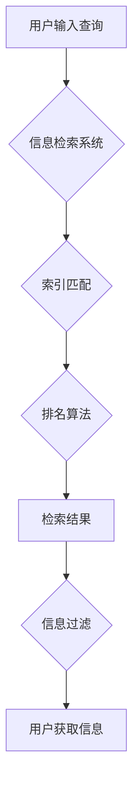

                 

## 信息过载与信息搜索策略：在庞大的信息海洋中找到有价值的信息

> 关键词：信息过载、信息搜索、信息检索、算法、机器学习、自然语言处理、知识图谱、信息过滤

### 1. 背景介绍

在当今信息爆炸的时代，我们每天接触的海量信息呈指数级增长。从新闻、社交媒体到学术论文、技术文档，信息无处不在，却并非全部都是有价值的。如何有效地从庞大的信息海洋中筛选出有价值的信息，成为了当今社会面临的重大挑战。

信息过载现象给个人和组织都带来了诸多负面影响：

* **效率低下:**  过多的信息会分散注意力，降低工作效率，难以专注于重要任务。
* **决策困难:**  难以从海量信息中抽取关键信息，导致决策迟缓，甚至出现错误决策。
* **知识沉淀不足:**  大量信息缺乏有效整理和归纳，难以形成知识体系，不利于知识积累和创新。
* **认知疲劳:**  持续处理大量信息会造成认知疲劳，影响身心健康。

### 2. 核心概念与联系

信息搜索的核心在于理解信息的本质，并构建有效的搜索策略。

**2.1 信息的本质**

信息本质上是一种能够改变认知状态的符号系统。它包含了意义、关联性和价值等方面。

* **意义:** 信息必须具有可理解的意义，才能被人类或机器有效地处理。
* **关联性:** 信息之间存在着复杂的关联关系，理解这些关系可以帮助我们发现隐藏的知识和模式。
* **价值:** 信息的价值取决于其对我们个人或组织的帮助程度。

**2.2 信息搜索策略**

信息搜索策略是指在获取信息时，根据特定目标和需求，采取的一系列步骤和方法。

**2.3 信息检索系统**

信息检索系统是帮助我们进行信息搜索的工具。它通常包含以下几个关键组件：

* **索引:** 将信息存储在结构化的数据库中，以便快速检索。
* **查询引擎:** 理解用户的搜索请求，并返回相关的信息。
* **排名算法:** 根据信息的 relevance 和用户需求，对检索结果进行排序。
* **用户界面:** 提供用户友好的界面，方便用户进行信息搜索和浏览。

**2.4  信息过滤**

信息过滤是指在信息流中筛选出有价值的信息，并过滤掉无关或低价值的信息。

**Mermaid 流程图**



### 3. 核心算法原理 & 具体操作步骤

**3.1 算法原理概述**

信息搜索的核心算法通常基于信息检索理论和机器学习技术。

* **信息检索理论:**  主要关注如何将信息表示为向量，并使用相似性度量来计算信息之间的相关性。
* **机器学习技术:**  可以根据用户的搜索历史和行为数据，学习用户的兴趣和需求，从而提供更精准的搜索结果。

**3.2 算法步骤详解**

1. **信息预处理:** 将原始信息转换为机器可理解的格式，例如文本分词、词干提取、词向量化等。
2. **索引构建:** 将预处理后的信息存储在索引数据库中，以便快速检索。
3. **查询处理:** 将用户的搜索请求转换为机器可理解的查询语句。
4. **信息检索:** 根据查询语句，从索引数据库中检索出相关的信息。
5. **结果排序:** 使用排名算法对检索结果进行排序，并将最相关的结果显示在用户面前。
6. **信息过滤:** 根据用户的偏好和需求，过滤掉无关或低价值的信息。

**3.3 算法优缺点**

* **优点:** 能够快速高效地检索大量信息，并根据用户的需求提供个性化的搜索结果。
* **缺点:**  

    * 算法的准确性依赖于信息的质量和索引的构建方式。
    * 算法可能会受到信息过载和噪声的影响，导致检索结果不准确。

**3.4 算法应用领域**

信息搜索算法广泛应用于各种领域，例如：

* **搜索引擎:**  例如 Google、百度等，帮助用户查找网页、图片、视频等信息。
* **电商平台:**  例如 Amazon、淘宝等，帮助用户查找商品信息。
* **学术数据库:**  例如 PubMed、IEEE Xplore等，帮助用户查找学术论文和文献。
* **社交媒体:**  例如 Facebook、Twitter等，帮助用户查找朋友、话题和内容。

### 4. 数学模型和公式 & 详细讲解 & 举例说明

**4.1 数学模型构建**

信息检索的核心数学模型是 TF-IDF 模型。

* **TF (Term Frequency):**  词频，表示某个词在文档中出现的频率。
* **IDF (Inverse Document Frequency):**  逆向文件频率，表示某个词在整个语料库中出现的频率。

**4.2 公式推导过程**

TF-IDF 值 = TF * IDF

* TF(t, d) =  (Number of times term t appears in document d) / (Total number of terms in document d)
* IDF(t) = log_e (Total number of documents / Number of documents containing term t)

**4.3 案例分析与讲解**

假设我们有一个语料库包含 1000 篇文档，其中 100 篇文档包含了词语 "人工智能"。

* TF("人工智能", d) = 2 (假设文档 d 中出现了 2 次 "人工智能")
* IDF("人工智能") = log_e (1000 / 100) = log_e (10) ≈ 2.303

因此，TF-IDF("人工智能", d) ≈ 2 * 2.303 ≈ 4.606

**4.4 举例说明**

TF-IDF 模型可以用来衡量某个词语在某个文档中的重要性。

* TF-IDF 值越高，表示该词语在该文档中越重要。
* TF-IDF 值越低，表示该词语在该文档中越不重要。

### 5. 项目实践：代码实例和详细解释说明

**5.1 开发环境搭建**

* Python 3.x
* scikit-learn
* NLTK

**5.2 源代码详细实现**

```python
from sklearn.feature_extraction.text import TfidfVectorizer

# 文档集合
documents = [
    "人工智能是未来发展的重要方向",
    "机器学习是人工智能的重要组成部分",
    "深度学习是机器学习的一种重要算法",
]

# 创建 TF-IDF 向量化器
vectorizer = TfidfVectorizer()

# 将文档集合转换为 TF-IDF 向量
tfidf_matrix = vectorizer.fit_transform(documents)

# 打印 TF-IDF 向量
print(tfidf_matrix.toarray())
```

**5.3 代码解读与分析**

* `TfidfVectorizer()` 创建 TF-IDF 向量化器对象。
* `fit_transform()` 方法将文档集合转换为 TF-IDF 向量。
* `toarray()` 方法将 TF-IDF 向量转换为 NumPy 数组。

**5.4 运行结果展示**

运行上述代码，将输出一个 TF-IDF 向量矩阵，其中每一行代表一个文档，每一列代表一个词语。每个元素的值表示该词语在该文档中的 TF-IDF 值。

### 6. 实际应用场景

**6.1 搜索引擎优化 (SEO)**

TF-IDF 模型可以用来分析网页内容，并确定哪些关键词对网页排名最具影响力。

**6.2 文本分类**

TF-IDF 模型可以用来将文本分类到不同的类别，例如新闻分类、邮件分类等。

**6.3 文本相似度计算**

TF-IDF 模型可以用来计算两个文本之间的相似度，例如文档相似度、文本摘要等。

**6.4 未来应用展望**

随着人工智能技术的不断发展，信息搜索算法将更加智能化和个性化。

* **自然语言理解 (NLU):**  能够更准确地理解用户的搜索意图。
* **知识图谱:**  能够利用知识图谱中的关系信息，提供更深入和全面的搜索结果。
* **个性化推荐:**  能够根据用户的搜索历史和行为数据，提供个性化的搜索结果和推荐。

### 7. 工具和资源推荐

**7.1 学习资源推荐**

* **书籍:**
    * 信息检索导论 (Introduction to Information Retrieval)
    * 自然语言处理 (Natural Language Processing)
* **在线课程:**
    * Coursera: 自然语言处理
    * edX: 信息检索

**7.2 开发工具推荐**

* **Elasticsearch:**  开源的搜索和分析引擎。
* **Solr:**  开源的搜索平台。
* **Lucene:**  开源的全文搜索库。

**7.3 相关论文推荐**

* **TF-IDF:**  Salton, G., & McGill, M. (1983). Introduction to modern information retrieval. McGraw-Hill.
* **BERT:**  Devlin, J., Chang, M. W., Lee, K., & Toutanova, K. (2018). BERT: Pre-training of deep bidirectional transformers for language understanding. arXiv preprint arXiv:1810.04805.

### 8. 总结：未来发展趋势与挑战

**8.1 研究成果总结**

信息搜索算法取得了显著的进展，能够有效地处理海量信息，并提供精准的搜索结果。

**8.2 未来发展趋势**

* **更智能的搜索引擎:**  能够理解用户的复杂搜索意图，并提供更个性化的搜索结果。
* **跨模态信息搜索:**  能够搜索文本、图像、音频等多种类型的媒体信息。
* **联邦学习:**  能够在保护用户隐私的前提下，进行信息搜索和分析。

**8.3 面临的挑战**

* **信息质量问题:**  海量信息中存在着大量噪声和低质量信息，需要开发更有效的算法来过滤和处理这些信息。
* **信息安全问题:**  信息搜索过程中可能会泄露用户隐私，需要开发更安全的搜索算法和系统。
* **可解释性问题:**  许多信息搜索算法是黑箱模型，难以解释其决策过程，需要开发更可解释的算法。

**8.4 研究展望**

未来，信息搜索领域将继续朝着更智能、更安全、更可解释的方向发展。


### 9. 附录：常见问题与解答

**9.1 如何提高信息搜索的准确性？**

* 使用更精确的关键词。
* 使用更复杂的搜索语法。
* 使用过滤条件来缩小搜索范围。
* 使用反馈机制来改进搜索结果。

**9.2 如何避免信息过载？**

* 定期清理不必要的邮件和文件。
* 使用信息过滤工具来筛选重要信息。
* 设置时间限制来避免过度使用互联网。
* 培养专注力和抗干扰能力。


作者：禅与计算机程序设计艺术 / Zen and the Art of Computer Programming 
<end_of_turn>

