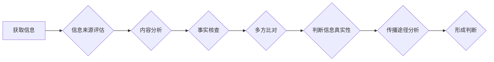

                 

## 信息验证和媒体素养能力培养：为假新闻和媒体操纵做好准备

> 关键词：信息验证、媒体素养、假新闻、深度学习、自然语言处理、网络安全、算法、数据分析

### 1. 背景介绍

在信息爆炸的时代，我们每天都被海量的信息淹没。从社交媒体到新闻网站，从搜索引擎到电子邮件，信息无处不在。然而，这些信息并非都真实可靠。假新闻、网络谣言、恶意宣传等信息污染现象日益严重，对个人、社会甚至国家安全构成重大威胁。

面对这种信息环境，培养公众的**信息验证能力**和**媒体素养**至关重要。信息验证是指人们能够识别、评估和判断信息的真实性、准确性和可靠性。媒体素养是指人们能够理解、分析和评价媒体信息的能力，并能够做出明智的判断和选择。

### 2. 核心概念与联系

**信息验证**和**媒体素养**是相互关联、相互促进的两个概念。

* **信息验证**是媒体素养的基础，它为人们理解和评价媒体信息提供了必要的工具和方法。
* **媒体素养**则指导人们如何运用信息验证能力，识别和应对信息污染的威胁。

**信息验证流程**



### 3. 核心算法原理 & 具体操作步骤

#### 3.1  算法原理概述

信息验证算法通常基于**自然语言处理 (NLP)**、**机器学习 (ML)** 和 **深度学习 (DL)** 等技术。这些算法可以用于识别假新闻、谣言、恶意宣传等信息，并提供相应的警示和建议。

#### 3.2  算法步骤详解

1. **数据收集和预处理:** 收集大量文本数据，包括真实新闻、假新闻、谣言等，并进行清洗、标注和格式化处理。
2. **特征提取:** 利用 NLP 技术提取文本中的关键特征，例如关键词、语法结构、情感倾向等。
3. **模型训练:** 使用 ML 或 DL 算法训练模型，让模型能够识别不同类型的信息。
4. **信息验证:** 将待验证的信息输入模型，模型会根据训练数据和提取的特征进行分析，并输出验证结果。

#### 3.3  算法优缺点

**优点:**

* 自动化信息验证，提高效率。
* 能够识别复杂的伪造信息。
* 帮助用户识别潜在的风险。

**缺点:**

* 模型训练需要大量数据，且数据质量会影响模型性能。
* 算法可能会出现误判，无法完全保证信息验证的准确性。
* 算法可能会被恶意利用，生成更加复杂的假新闻。

#### 3.4  算法应用领域

* **新闻媒体:** 验证新闻真实性，识别假新闻和谣言。
* **社交媒体平台:** 识别和过滤恶意信息，维护平台安全。
* **政府机构:** 监测网络舆情，应对网络安全威胁。
* **个人用户:** 提高信息辨别能力，避免被假信息误导。

### 4. 数学模型和公式 & 详细讲解 & 举例说明

#### 4.1  数学模型构建

信息验证算法通常使用**贝叶斯分类器**或**支持向量机 (SVM)** 等机器学习模型。

**贝叶斯分类器**基于贝叶斯定理，通过计算不同类别信息出现的概率来判断信息所属类别。

**支持向量机 (SVM)** 通过寻找最佳的分隔超平面来将不同类别信息分开。

#### 4.2  公式推导过程

**贝叶斯分类器**的公式如下：

$$
P(C|X) = \frac{P(X|C)P(C)}{P(X)}
$$

其中：

* $P(C|X)$ 是给定特征 $X$ 时类别 $C$ 的后验概率。
* $P(X|C)$ 是给定类别 $C$ 时特征 $X$ 的似然概率。
* $P(C)$ 是类别 $C$ 的先验概率。
* $P(X)$ 是特征 $X$ 的边缘概率。

**SVM** 的目标是找到一个最大间隔的超平面，将不同类别的数据点分开。

#### 4.3  案例分析与讲解

假设我们想要构建一个识别假新闻的模型。我们可以收集大量真实新闻和假新闻数据，并提取文本特征，例如关键词、语法结构、情感倾向等。然后，我们可以使用贝叶斯分类器或 SVM 算法训练模型，让模型能够根据这些特征判断信息是否为假新闻。

### 5. 项目实践：代码实例和详细解释说明

#### 5.1  开发环境搭建

* Python 3.x
* TensorFlow 或 PyTorch
* NLTK 或 spaCy

#### 5.2  源代码详细实现

```python
# 使用 TensorFlow 构建一个简单的贝叶斯分类器

import tensorflow as tf

# 定义模型
model = tf.keras.models.Sequential([
  tf.keras.layers.Dense(128, activation='relu', input_shape=(num_features,)),
  tf.keras.layers.Dense(1, activation='sigmoid')
])

# 编译模型
model.compile(optimizer='adam',
              loss='binary_crossentropy',
              metrics=['accuracy'])

# 训练模型
model.fit(X_train, y_train, epochs=10)

# 评估模型
loss, accuracy = model.evaluate(X_test, y_test)
print('Accuracy:', accuracy)
```

#### 5.3  代码解读与分析

* 该代码使用 TensorFlow 库构建了一个简单的贝叶斯分类器。
* 模型包含两层全连接神经网络层，第一层有 128 个神经元，激活函数为 ReLU，输入特征维度为 `num_features`。
* 第二层只有一个神经元，激活函数为 sigmoid，用于输出信息是否为假新闻的概率。
* 模型使用 Adam 优化器，损失函数为二元交叉熵，评估指标为准确率。
* 模型在训练数据上训练 10 个 epochs。
* 最后，模型在测试数据上进行评估，输出准确率。

#### 5.4  运行结果展示

运行结果会显示模型在测试数据上的准确率。

### 6. 实际应用场景

#### 6.1  新闻媒体

* 验证新闻真实性，识别假新闻和谣言。
* 帮助记者进行调查和核实信息。
* 提高新闻报道的准确性和可靠性。

#### 6.2  社交媒体平台

* 识别和过滤恶意信息，维护平台安全。
* 减少假新闻和谣言的传播。
* 提升用户体验和信任度。

#### 6.3  政府机构

* 监测网络舆情，应对网络安全威胁。
* 识别和打击网络谣言和恶意宣传。
* 维护社会稳定和公共秩序。

#### 6.4  未来应用展望

* **更精准的信息验证:** 利用更先进的 NLP 和 DL 技术，识别更加复杂的伪造信息。
* **个性化信息验证:** 根据用户的兴趣和偏好，提供更精准的信息验证服务。
* **跨语言信息验证:** 实现跨语言的信息验证，帮助用户理解来自不同语言的信息。

### 7. 工具和资源推荐

#### 7.1  学习资源推荐

* **书籍:**
    * "Natural Language Processing with Python" by Steven Bird, Ewan Klein, and Edward Loper
    * "Deep Learning" by Ian Goodfellow, Yoshua Bengio, and Aaron Courville
* **在线课程:**
    * Coursera: Natural Language Processing Specialization
    * edX: Deep Learning

#### 7.2  开发工具推荐

* **TensorFlow:** https://www.tensorflow.org/
* **PyTorch:** https://pytorch.org/
* **NLTK:** https://www.nltk.org/
* **spaCy:** https://spacy.io/

#### 7.3  相关论文推荐

* "BERT: Pre-training of Deep Bidirectional Transformers for Language Understanding"
* "Attention Is All You Need"
* "Fake News Detection: A Survey"

### 8. 总结：未来发展趋势与挑战

#### 8.1  研究成果总结

信息验证和媒体素养能力培养的研究取得了显著进展，涌现出许多有效的算法和工具。这些成果为识别和应对信息污染提供了重要的技术支撑。

#### 8.2  未来发展趋势

* **更智能的信息验证:** 利用人工智能技术，实现更智能、更精准的信息验证。
* **更人性化的信息验证:** 考虑用户需求，提供更人性化的信息验证服务。
* **更协同的信息验证:** 构建信息验证的生态系统，促进信息验证的协同发展。

#### 8.3  面临的挑战

* **数据质量问题:** 信息验证算法依赖于高质量的数据，而真实可靠的数据往往难以获取。
* **算法可解释性问题:** 一些深度学习算法难以解释其决策过程，这使得信息验证结果难以被用户理解和信任。
* **恶意攻击问题:** 攻击者可能会利用信息验证算法的漏洞，生成更加复杂的假新闻和恶意信息。

#### 8.4  研究展望

未来，信息验证和媒体素养能力培养的研究将继续深入，探索更智能、更可靠、更人性化的信息验证方法，为构建一个更加健康、透明、可信的网络环境做出贡献。

### 9. 附录：常见问题与解答

* **如何判断信息真实性？**

可以使用多种方法判断信息真实性，例如：

* 来源评估：查看信息来源的可靠性。
* 内容分析：仔细阅读信息内容，寻找可疑之处。
* 事实核查：通过其他可靠来源进行核实。
* 多方比对：从多个角度获取信息，进行比对分析。

* **如何提高媒体素养？**

可以通过以下方式提高媒体素养：

* 关注新闻来源的可靠性。
* 了解新闻报道的制作过程。
* 培养批判性思维，学会分析和评价信息。
* 多方获取信息，形成独立判断。

* **如何应对网络谣言？**

* 不要轻易相信网络信息，要进行核实。
* 不要转发未经核实的信息。
* 遇到谣言，要及时举报。
* 提高自身媒体素养，增强辨别能力。


作者：禅与计算机程序设计艺术 / Zen and the Art of Computer Programming 
<end_of_turn>

