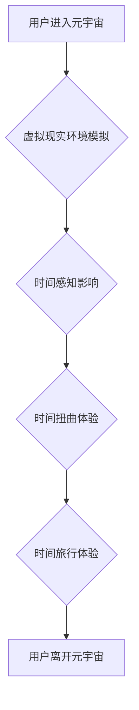

                 

## 元宇宙中的时间概念:打破物理局限的新认知

> 关键词：元宇宙、时间概念、虚拟现实、沉浸式体验、时间流逝、时间扭曲、时间旅行

> 摘要：本文探讨了元宇宙中时间概念的独特性质，分析了虚拟现实环境对时间感知的影响，并探讨了元宇宙如何打破物理时间局限，实现时间扭曲、时间旅行等新奇体验。文章将从核心概念、算法原理、数学模型、代码实例、实际应用场景等多个方面进行深入分析，并展望元宇宙中时间概念的未来发展趋势和挑战。

## 1. 背景介绍

元宇宙的概念近年来备受关注，它被定义为一个由虚拟现实、增强现实和互联网连接而成的沉浸式数字世界。在这个虚拟世界中，用户可以创建虚拟身份，与他人互动，参与各种活动，并体验与现实世界不同的生活方式。

时间作为宇宙的基本属性之一，在元宇宙中也扮演着至关重要的角色。然而，与现实世界不同，元宇宙中的时间概念具有独特的性质，它不受物理时间限制，可以被灵活地操控和体验。

## 2. 核心概念与联系

### 2.1  时间感知与虚拟现实

时间感知是一个复杂的心理过程，它受到多种因素的影响，包括生物钟、环境线索和个人经验。虚拟现实技术可以模拟现实世界环境，并通过视觉、听觉、触觉等多种感官刺激来影响用户的感知。

在元宇宙中，虚拟现实环境可以创造出与现实世界不同的时间流逝体验。例如，用户可以在虚拟世界中加速或减缓时间流逝，甚至可以体验时间倒流或暂停等奇特现象。

### 2.2  时间扭曲与时间旅行

时间扭曲是指时间流逝速度在不同空间或时间段内发生变化的现象。在元宇宙中，通过虚拟现实技术，可以模拟时间扭曲的效果，让用户体验到时间加速、减速、暂停等不同的状态。

时间旅行是指穿越到过去或未来的一种概念。虽然目前时间旅行在现实世界中尚未实现，但在元宇宙中，通过虚拟现实技术，可以模拟时间旅行的体验，让用户探索历史事件或展望未来发展。

**Mermaid 流程图**



## 3. 核心算法原理 & 具体操作步骤

### 3.1  算法原理概述

元宇宙中实现时间概念的操控需要复杂的算法支持。常见的算法包括：

* **时间流逝算法:** 控制虚拟时间流逝速度的算法，可以根据用户需求进行调整。
* **时间扭曲算法:** 模拟时间扭曲效果的算法，可以改变用户在不同空间或时间段内的感知时间流逝速度。
* **时间旅行算法:** 模拟时间旅行效果的算法，可以将用户传输到虚拟世界的不同时间点。

### 3.2  算法步骤详解

**时间流逝算法:**

1. **获取用户输入:** 用户可以通过操作界面或语音指令来控制时间流逝速度。
2. **计算时间增量:** 根据用户输入，计算出虚拟时间增量。
3. **更新虚拟时间:** 将虚拟时间更新为新的时间值。
4. **更新虚拟环境:** 根据更新后的虚拟时间，更新虚拟环境中的物体状态、事件发生时间等。

**时间扭曲算法:**

1. **定义扭曲区域:** 在虚拟世界中定义出时间扭曲区域。
2. **设置扭曲参数:** 设置扭曲区域内的时间流逝速度。
3. **计算扭曲影响:** 根据用户位置和扭曲参数，计算出用户在扭曲区域内的实际时间流逝速度。
4. **更新用户时间感知:** 根据计算结果，更新用户的虚拟时间感知。

**时间旅行算法:**

1. **选择目标时间点:** 用户选择要前往的目标时间点。
2. **构建时间路径:** 根据目标时间点，构建虚拟时间路径。
3. **传输用户:** 将用户沿着时间路径传输到目标时间点。
4. **更新环境状态:** 根据目标时间点，更新虚拟环境中的物体状态、事件发生时间等。

### 3.3  算法优缺点

**时间流逝算法:**

* **优点:** 实现简单，易于控制。
* **缺点:** 只能改变时间流逝速度，无法实现时间扭曲或时间旅行。

**时间扭曲算法:**

* **优点:** 可以模拟时间扭曲效果，创造出独特的体验。
* **缺点:** 实现复杂，需要复杂的数学模型和算法。

**时间旅行算法:**

* **优点:** 可以实现时间旅行体验，探索历史事件或展望未来发展。
* **缺点:** 实现难度极高，需要突破当前的物理和技术限制。

### 3.4  算法应用领域

时间概念的操控算法在元宇宙中具有广泛的应用领域，例如：

* **游戏:** 可以创造出具有时间扭曲或时间旅行元素的游戏，提供更丰富的游戏体验。
* **教育:** 可以模拟历史事件或未来发展场景，帮助用户更好地理解历史和未来。
* **医疗:** 可以模拟疾病发展过程，帮助医生进行诊断和治疗。
* **艺术:** 可以创造出具有时间概念的艺术作品，提供新的艺术体验。

## 4. 数学模型和公式 & 详细讲解 & 举例说明

### 4.1  数学模型构建

时间概念的操控需要建立数学模型来描述时间流逝、时间扭曲和时间旅行等现象。

**时间流逝模型:**

```
t' = k * t
```

其中：

* t' 是虚拟时间
* t 是现实时间
* k 是时间流逝系数

**时间扭曲模型:**

```
t' = f(t, x, y, z)
```

其中：

* t' 是虚拟时间
* t 是现实时间
* x, y, z 是用户在虚拟空间中的坐标
* f 是时间扭曲函数

**时间旅行模型:**

```
t' = t + Δt
```

其中：

* t' 是目标时间
* t 是当前时间
* Δt 是时间偏移量

### 4.2  公式推导过程

时间流逝模型的推导过程很简单，它基于时间流逝系数 k 的定义。

时间扭曲模型的推导过程则更加复杂，需要考虑用户位置、时间扭曲函数等因素。

时间旅行模型的推导过程需要考虑时间偏移量 Δt 的计算方法，以及如何将用户传输到目标时间点。

### 4.3  案例分析与讲解

**时间流逝模型案例:**

在游戏中，用户可以选择加速或减缓游戏时间流逝速度。例如，用户可以选择加速时间，让游戏时间流逝更快，从而更快地完成任务。

**时间扭曲模型案例:**

在虚拟现实电影中，可以模拟时间扭曲效果，让观众体验到时间加速、减速、暂停等奇特现象。例如，在一部科幻电影中，可以模拟主角进入一个时间扭曲区域，在那里时间流逝速度变慢，主角可以慢动作地完成一些动作。

**时间旅行模型案例:**

在元宇宙中，可以模拟时间旅行体验，让用户探索历史事件或展望未来发展。例如，用户可以进入一个虚拟博物馆，在那里可以体验到古代文明的场景，或者可以进入一个虚拟城市，在那里可以展望未来的城市发展。

## 5. 项目实践：代码实例和详细解释说明

### 5.1  开发环境搭建

元宇宙时间概念的实现需要使用虚拟现实开发工具和编程语言。常见的开发工具包括 Unity、Unreal Engine、Blender 等，编程语言包括 C#、C++、Python 等。

### 5.2  源代码详细实现

以下是一个简单的 C# 代码示例，演示了如何使用 Unity 引擎实现时间流逝算法：

```csharp
using UnityEngine;

public class TimeController : MonoBehaviour
{
    public float timeScale = 1.0f;

    void Update()
    {
        Time.timeScale = timeScale;
    }
}
```

**代码解读与分析:**

* `timeScale` 变量控制虚拟时间流逝速度。
* `Update()` 函数在每一帧更新虚拟时间流逝速度。

### 5.3  代码解读与分析

* `timeScale` 变量控制虚拟时间流逝速度。
* `Update()` 函数在每一帧更新虚拟时间流逝速度。

### 5.4  运行结果展示

运行此代码后，用户可以通过脚本控制虚拟时间流逝速度。例如，将 `timeScale` 设置为 2.0f，则虚拟时间流逝速度将是现实时间的两倍。

## 6. 实际应用场景

### 6.1  游戏

* **加速时间:** 在策略游戏中，玩家可以选择加速时间来加快资源收集或建筑建造速度。
* **减速时间:** 在动作游戏中，玩家可以选择减速时间来躲避攻击或进行精准操作。
* **暂停时间:** 在冒险游戏中，玩家可以选择暂停时间来观察周围环境或思考下一步行动。

### 6.2  教育

* **历史模拟:** 可以模拟历史事件，让学生身临其境地体验历史场景。
* **未来展望:** 可以模拟未来发展场景，帮助学生了解未来趋势和挑战。
* **科学实验:** 可以模拟科学实验，让学生直观地理解科学原理。

### 6.3  医疗

* **疾病模拟:** 可以模拟疾病发展过程，帮助医生进行诊断和治疗。
* **手术训练:** 可以模拟手术场景，帮助医生进行手术训练。
* **康复治疗:** 可以模拟康复训练场景，帮助患者进行康复治疗。

### 6.4  未来应用展望

随着元宇宙技术的不断发展，时间概念的操控将发挥越来越重要的作用。未来，我们可以期待看到更多基于时间概念的创新应用，例如：

* **时间旅行旅游:** 用户可以穿越到过去或未来，体验不同的历史时期或未来场景。
* **时间管理工具:** 用户可以利用时间扭曲技术来提高工作效率，例如加速工作时间，减速休闲时间。
* **时间艺术创作:** 艺术家可以使用时间概念来创作新的艺术作品，例如时间雕塑、时间绘画等。

## 7. 工具和资源推荐

### 7.1  学习资源推荐

* **书籍:** 《元宇宙：下一代互联网》
* **网站:** Meta, Sandbox, Decentraland
* **课程:** Coursera, edX

### 7.2  开发工具推荐

* **Unity:** https://unity.com/
* **Unreal Engine:** https://www.unrealengine.com/
* **Blender:** https://www.blender.org/

### 7.3  相关论文推荐

* **The Metaverse: A New Paradigm for Human Interaction**
* **Time Travel in Virtual Reality: A Survey**

## 8. 总结：未来发展趋势与挑战

### 8.1  研究成果总结

本文探讨了元宇宙中时间概念的独特性质，分析了虚拟现实环境对时间感知的影响，并探讨了元宇宙如何打破物理时间局限，实现时间扭曲、时间旅行等新奇体验。

### 8.2  未来发展趋势

随着元宇宙技术的不断发展，时间概念的操控将成为元宇宙的核心技术之一。未来，我们可以期待看到更多基于时间概念的创新应用，例如时间旅行旅游、时间管理工具、时间艺术创作等。

### 8.3  面临的挑战

实现时间概念的操控面临着许多挑战，例如：

* **技术挑战:** 需要突破当前的物理和技术限制，例如实现时间旅行、时间扭曲等。
* **伦理挑战:** 时间概念的操控可能会带来伦理问题，例如时间悖论、时间犯罪等。
* **社会挑战:** 时间概念的操控可能会改变人们对时间的认知和理解，带来社会变革。

### 8.4  研究展望

未来，我们需要继续深入研究时间概念的操控技术，并探讨其伦理和社会影响，以确保元宇宙的健康发展。

## 9. 附录：常见问题与解答

**常见问题:**

* **元宇宙中的时间是现实时间的副本吗？**

**解答:** 元宇宙中的时间不是现实时间的副本，它可以不受物理时间限制，被灵活地操控和体验。

* **时间旅行是否真的有可能实现？**

**解答:** 目前时间旅行在现实世界中尚未实现，但在元宇宙中，可以通过虚拟现实技术模拟时间旅行体验。

* **元宇宙中的时间概念会改变人们对时间的认知吗？**

**解答:** 元宇宙中的时间概念可能会改变人们对时间的认知和理解，例如，人们可能会更加重视时间流逝的速度和质量。


作者：禅与计算机程序设计艺术 / Zen and the Art of Computer Programming<end_of_turn>

