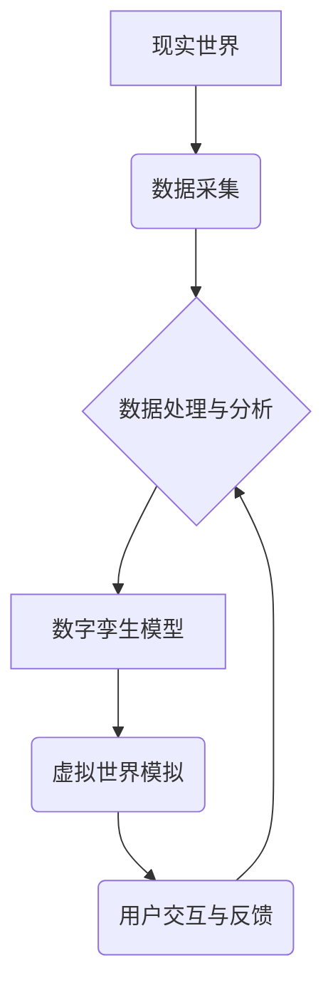

                 

## 元宇宙数字孪生伦理:现实映射的道德边界探讨

> 关键词：元宇宙、数字孪生、伦理、道德边界、数据隐私、算法偏见、责任与问责

## 1. 背景介绍

元宇宙概念的兴起，为人类社会带来了前所未有的虚拟体验和交互方式。数字孪生技术作为元宇宙的重要组成部分，以其对现实世界进行数字化映射和模拟的能力，为元宇宙的构建提供了坚实的基础。然而，数字孪生技术的应用也引发了诸多伦理和道德问题，这些问题需要我们认真思考和探讨。

数字孪生技术本质上是对现实世界进行数字化复制，并通过数据分析和模型模拟，实现对现实世界的实时反映和预测。它在各个领域都具有广泛的应用前景，例如：

* **工业制造:** 数字孪生可以用于模拟和优化生产流程，提高生产效率和产品质量。
* **城市规划:** 数字孪生可以用于模拟城市发展趋势，帮助城市规划者做出更科学的决策。
* **医疗保健:** 数字孪生可以用于模拟人体器官和疾病，帮助医生进行更精准的诊断和治疗。

然而，数字孪生技术的应用也带来了新的伦理挑战：

* **数据隐私:** 数字孪生技术需要收集和处理大量的现实世界数据，这可能会侵犯个人隐私。
* **算法偏见:** 数字孪生模型的训练数据可能存在偏见，导致模型输出结果存在偏差，从而加剧社会不公平。
* **责任与问责:** 当数字孪生模型导致错误决策或负面后果时，谁应该承担责任？

## 2. 核心概念与联系

### 2.1 元宇宙

元宇宙是一个由虚拟现实、增强现实和互联网技术融合而成的沉浸式虚拟世界。它是一个开放、共享、互联的虚拟空间，用户可以在其中进行社交、娱乐、工作等各种活动。

### 2.2 数字孪生

数字孪生是指对现实世界实体或系统进行数字化复制，并通过数据分析和模型模拟，实现对现实世界进行实时反映和预测的技术。数字孪生可以用于模拟和优化现实世界中的各种过程和系统，例如生产流程、城市交通、人体健康等。

### 2.3 关系

元宇宙和数字孪生是相互关联的两个概念。数字孪生技术是构建元宇宙的重要基础，它为元宇宙提供了虚拟世界的基础设施和运行机制。

**Mermaid 流程图**



## 3. 核心算法原理 & 具体操作步骤

### 3.1 算法原理概述

数字孪生技术的核心算法包括数据采集、数据处理、模型构建、模型预测和模型更新等环节。

* **数据采集:** 从现实世界中收集相关数据，例如传感器数据、图像数据、文本数据等。
* **数据处理:** 对采集到的数据进行清洗、转换、整合等处理，使其能够被模型用于训练和预测。
* **模型构建:** 根据处理后的数据，构建数字孪生模型，例如物理模型、统计模型、机器学习模型等。
* **模型预测:** 利用构建好的模型，对现实世界进行预测，例如预测设备故障、预测交通流量、预测疾病发展等。
* **模型更新:** 根据预测结果和现实世界反馈，对数字孪生模型进行更新和优化，使其能够更加准确地反映现实世界。

### 3.2 算法步骤详解

1. **数据采集:** 使用各种传感器、摄像头、数据库等设备收集现实世界的数据。
2. **数据预处理:** 对采集到的数据进行清洗、转换、整合等处理，例如去除噪声、转换数据格式、填充缺失值等。
3. **特征提取:** 从预处理后的数据中提取关键特征，例如设备运行状态、交通流量变化趋势、患者症状等。
4. **模型选择:** 根据应用场景选择合适的模型，例如线性回归模型、神经网络模型、支持向量机模型等。
5. **模型训练:** 使用训练数据对模型进行训练，使其能够学习到现实世界之间的关系。
6. **模型评估:** 使用测试数据对模型进行评估，例如计算模型的准确率、召回率、F1值等指标。
7. **模型部署:** 将训练好的模型部署到实际应用场景中，例如部署到工业设备、城市交通系统、医疗诊断系统等。
8. **模型监控:** 对部署后的模型进行监控，及时发现模型性能下降或出现异常情况，并进行模型更新和优化。

### 3.3 算法优缺点

**优点:**

* **实时性:** 数字孪生模型可以实时反映现实世界的变化，并进行预测。
* **可视化:** 数字孪生模型可以将复杂的数据和信息以直观的方式呈现出来，方便用户理解和分析。
* **优化:** 数字孪生模型可以用于模拟和优化现实世界中的各种过程和系统，提高效率和效益。

**缺点:**

* **数据依赖:** 数字孪生模型的准确性依赖于数据的质量和数量。
* **模型复杂性:** 数字孪生模型的构建和训练需要复杂的算法和技术。
* **伦理风险:** 数字孪生模型的应用可能带来数据隐私、算法偏见、责任与问责等伦理风险。

### 3.4 算法应用领域

数字孪生技术在各个领域都具有广泛的应用前景，例如：

* **工业制造:** 模拟生产流程、优化生产效率、预测设备故障。
* **城市规划:** 模拟城市发展趋势、优化交通规划、预测环境变化。
* **医疗保健:** 模拟人体器官和疾病、辅助医生诊断和治疗。
* **教育培训:** 创建沉浸式虚拟学习环境、提高学习效果。
* **娱乐休闲:** 创建虚拟游戏世界、提供更逼真的游戏体验。

## 4. 数学模型和公式 & 详细讲解 & 举例说明

### 4.1 数学模型构建

数字孪生模型的构建通常基于以下数学模型：

* **物理模型:** 描述现实世界实体或系统的物理特性和行为规律，例如牛顿运动定律、热传导方程等。
* **统计模型:** 描述现实世界数据之间的统计关系，例如线性回归模型、时间序列模型等。
* **机器学习模型:** 利用算法学习现实世界数据之间的模式和规律，例如神经网络模型、支持向量机模型等。

### 4.2 公式推导过程

例如，对于一个简单的线性回归模型，其目标是找到一条直线，使得该直线与现实世界数据之间的误差最小。

**公式:**

$$y = mx + c$$

其中：

* $y$ 是预测值
* $x$ 是输入特征
* $m$ 是斜率
* $c$ 是截距

**推导过程:**

1. 计算数据点之间的误差，例如使用均方误差 (MSE) 作为误差函数。
2. 对误差函数求导，得到关于 $m$ 和 $c$ 的偏导数。
3. 将偏导数设置为零，求解 $m$ 和 $c$ 的值，得到最佳拟合直线。

### 4.3 案例分析与讲解

例如，可以使用线性回归模型预测房屋价格。

**数据:**

* 房屋面积 (x)
* 房屋价格 (y)

**模型训练:**

使用房屋面积和价格数据训练线性回归模型，得到最佳拟合直线。

**预测:**

输入一个新的房屋面积，模型可以预测该房屋的价格。

## 5. 项目实践：代码实例和详细解释说明

### 5.1 开发环境搭建

* **操作系统:** Windows/macOS/Linux
* **编程语言:** Python
* **库:** NumPy, Pandas, Scikit-learn

### 5.2 源代码详细实现

```python
import numpy as np
from sklearn.linear_model import LinearRegression

# 数据加载
data = np.loadtxt('house_data.csv', delimiter=',')
X = data[:, 0].reshape(-1, 1)  # 房屋面积
y = data[:, 1]  # 房屋价格

# 模型训练
model = LinearRegression()
model.fit(X, y)

# 模型预测
new_area = 150  # 新房屋面积
predicted_price = model.predict([[new_area]])

# 结果输出
print(f'新房屋面积为{new_area}平方米，预测价格为{predicted_price[0]:.2f}万元')
```

### 5.3 代码解读与分析

1. **数据加载:** 使用 `np.loadtxt()` 函数加载房屋面积和价格数据。
2. **模型训练:** 使用 `LinearRegression()` 类创建线性回归模型，并使用 `fit()` 方法训练模型。
3. **模型预测:** 使用 `predict()` 方法预测新房屋的价格。
4. **结果输出:** 打印预测结果。

### 5.4 运行结果展示

运行代码后，会输出预测结果，例如：

```
新房屋面积为150平方米，预测价格为1200.00万元
```

## 6. 实际应用场景

### 6.1 工业制造

数字孪生技术可以用于模拟和优化生产流程，提高生产效率和产品质量。例如，可以创建汽车制造厂的数字孪生模型，模拟汽车生产过程，并根据模型预测，优化生产流程，减少生产时间和成本。

### 6.2 城市规划

数字孪生技术可以用于模拟城市发展趋势，帮助城市规划者做出更科学的决策。例如，可以创建城市的数字孪生模型，模拟城市交通流量、人口分布、环境变化等，并根据模型预测，优化城市规划，缓解交通拥堵、改善环境质量。

### 6.3 医疗保健

数字孪生技术可以用于模拟人体器官和疾病，帮助医生进行更精准的诊断和治疗。例如，可以创建患者的数字孪生模型，模拟患者的病情发展，并根据模型预测，制定个性化的治疗方案。

### 6.4 未来应用展望

数字孪生技术在未来将有更广泛的应用场景，例如：

* **虚拟现实培训:** 创建沉浸式虚拟现实培训环境，提高培训效果。
* **个性化定制:** 根据用户的需求，创建个性化的数字孪生模型，提供定制化的产品和服务。
* **灾害预警:** 模拟灾害场景，进行灾害预警和应急演练。

## 7. 工具和资源推荐

### 7.1 学习资源推荐

* **书籍:**
    * 《数字孪生: 构建未来》
    * 《元宇宙：虚拟世界与现实的融合》
* **在线课程:**
    * Coursera: 数字孪生与工业互联网
    * edX: 元宇宙与虚拟现实

### 7.2 开发工具推荐

* **Unity:** 游戏引擎，可用于构建虚拟现实和增强现实应用。
* **Unreal Engine:** 游戏引擎，可用于构建高 fidelity 的虚拟世界。
* **AWS IoT TwinMaker:** 云平台，提供数字孪生开发和管理工具。

### 7.3 相关论文推荐

* **Digital Twins: Concepts and Opportunities**
* **The Promise and Challenges of Digital Twins**
* **Digital Twins for Smart Cities**

## 8. 总结：未来发展趋势与挑战

### 8.1 研究成果总结

数字孪生技术在各个领域都取得了显著的成果，例如提高了生产效率、优化了城市规划、辅助了医疗诊断等。

### 8.2 未来发展趋势

* **人工智能融合:** 将人工智能技术与数字孪生技术融合，实现更智能的预测和决策。
* **边缘计算:** 将数字孪生模型部署到边缘设备，实现更实时和高效的计算。
* **跨领域应用:** 将数字孪生技术应用到更多领域，例如教育、娱乐、金融等。

### 8.3 面临的挑战

* **数据安全:** 数字孪生模型需要处理大量敏感数据，需要加强数据安全保护。
* **算法偏见:** 数字孪生模型的训练数据可能存在偏见，需要开发更公平的算法。
* **伦理风险:** 数字孪生技术的应用可能带来数据隐私、算法偏见、责任与问责等伦理风险，需要制定相应的伦理规范和法律法规。

### 8.4 研究展望

未来，数字孪生技术将继续发展和完善，并应用到更多领域，为人类社会带来更多福祉。我们需要加强对数字孪生技术的伦理研究，制定相应的规范和法律法规，确保数字孪生技术的健康发展。

## 9. 附录：常见问题与解答

### 9.1 什么是数字孪生？

数字孪生是指对现实世界实体或系统进行数字化复制，并通过数据分析和模型模拟，实现对现实世界进行实时反映和预测的技术。

### 9.2 数字孪生技术有哪些应用场景？

数字孪生技术在各个领域都具有广泛的应用场景，例如工业制造、城市规划、医疗保健、教育培训、娱乐休闲等。

### 9.3 数字孪生技术有哪些伦理风险？

数字孪生技术的应用可能带来数据隐私、算法偏见、责任与问责等伦理风险。

### 9.4 如何解决数字孪生技术的伦理风险？

需要加强对数字孪生技术的伦理研究，制定相应的规范和法律法规，确保数字孪生技术的健康发展。

作者：禅与计算机程序设计艺术 / Zen and the Art of Computer Programming


<end_of_turn>

