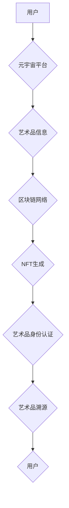

                 

## 元宇宙艺术身份认证:区块链技术在艺术品溯源中的应用

> 关键词：元宇宙、艺术品溯源、区块链、NFT、身份认证、去中心化

## 1. 背景介绍

艺术品市场近年来呈现出蓬勃发展的态势，但其价值的真实性和来源的可靠性一直是困扰业界的重要问题。传统艺术品交易模式存在着诸多弊端，例如艺术品真伪难辨、交易链条复杂、信息透明度低等，这导致艺术品市场存在着大量的造假和欺诈行为，损害了艺术品交易的公信力。

元宇宙概念的兴起为艺术品交易带来了新的机遇。元宇宙是一个虚拟世界，它将现实世界与数字世界融合，为艺术品交易提供了全新的平台和模式。在元宇宙中，艺术品可以以数字形式存在，并通过区块链技术实现身份认证和溯源，从而解决传统艺术品交易中的痛点。

## 2. 核心概念与联系

**2.1  元宇宙**

元宇宙是一个由虚拟现实、增强现实、区块链等技术构建的沉浸式虚拟世界，它具有以下特点：

* **沉浸式体验:** 用户可以通过虚拟现实设备或增强现实设备沉浸式地体验元宇宙世界。
* **持久性:** 元宇宙世界是持续存在的，即使用户离开，世界也会继续运行。
* **去中心化:** 元宇宙世界由多个参与者共同构建和维护，而不是由单一实体控制。
* **互操作性:** 不同元宇宙世界之间可以相互连接和交互。

**2.2  区块链**

区块链是一种分布式账本技术，它可以记录和验证交易信息，并确保信息的不可篡改性。区块链的特点包括：

* **去中心化:** 区块链没有中心服务器，数据分布在多个节点上。
* **透明性:** 所有交易信息都记录在区块链上，任何人都可以查看。
* **安全性:** 区块链使用加密算法来保护数据安全。
* **不可篡改性:** 一旦交易信息被记录在区块链上，就无法修改。

**2.3  NFT**

NFT（非同质化代币）是一种基于区块链技术的数字资产，它代表着独一无二的数字物品，例如艺术品、音乐、游戏道具等。NFT的特点包括：

* **唯一性:** 每个NFT都是独一无二的，无法复制。
* **可验证性:** NFT的唯一性可以通过区块链技术进行验证。
* **可交易性:** NFT可以像其他数字资产一样进行交易。

**2.4  核心概念联系**

元宇宙、区块链和NFT相互关联，共同构成了艺术品溯源的新模式。

* 元宇宙为艺术品交易提供了新的平台和模式。
* 区块链技术为艺术品身份认证和溯源提供了技术保障。
* NFT将艺术品数字化，并赋予其唯一性和可交易性。

**2.5  架构流程图**



## 3. 核心算法原理 & 具体操作步骤

**3.1  算法原理概述**

艺术品溯源的核心算法原理是利用区块链技术的不可篡改性、透明性和安全性来记录和验证艺术品的交易信息和 provenance（来源记录）。

**3.2  算法步骤详解**

1. **艺术品信息录入:** 艺术家或艺术品交易平台将艺术品的详细信息，例如名称、创作时间、材质、尺寸、艺术家信息等，录入到区块链网络中。
2. **NFT生成:** 艺术品信息被加密并打包成一个NFT，并存储在区块链网络中。NFT代表着艺术品的唯一身份，并记录了艺术品的 provenance 信息。
3. **交易记录:** 当艺术品交易时，交易信息，例如买家、卖家、交易价格、交易时间等，也会被记录在区块链网络中。
4. **溯源查询:** 任何人都可以通过区块链网络查询艺术品的 provenance 信息，包括艺术品的创作历史、所有者信息、交易记录等。

**3.3  算法优缺点**

**优点:**

* **不可篡改性:** 艺术品的 provenance 信息被永久记录在区块链网络中，无法被篡改。
* **透明性:** 任何人都可以查看艺术品的 provenance 信息，提高交易的透明度。
* **安全性:** 区块链技术的加密算法可以保护艺术品的 provenance 信息安全。

**缺点:**

* **技术门槛:** 区块链技术相对复杂，需要一定的技术知识才能理解和应用。
* **成本:** 使用区块链技术进行艺术品溯源需要支付一定的费用，例如交易费用和存储费用。
* **可扩展性:** 区块链网络的处理能力有限，需要不断升级和改进才能满足艺术品溯源的大规模应用需求。

**3.4  算法应用领域**

* **艺术品交易:** 提高艺术品交易的透明度和安全性，防止艺术品造假和欺诈行为。
* **版权保护:** 记录艺术品的创作信息和所有权，保护艺术家的版权。
* **文物保护:** 记录文物的 provenance 信息，防止文物盗窃和文物流失。
* **收藏品管理:** 记录收藏品的 provenance 信息，方便收藏家进行管理和交易。

## 4. 数学模型和公式 & 详细讲解 & 举例说明

**4.1  数学模型构建**

艺术品溯源的数学模型可以基于图论和密码学原理构建。

* **图论:** 艺术品的 provenance 信息可以表示为一个图，其中节点代表艺术品、艺术家、交易者等实体，边代表艺术品之间的交易关系、创作关系等。
* **密码学:** 区块链技术使用密码学算法来加密和验证艺术品的 provenance 信息，确保信息的安全性。

**4.2  公式推导过程**

区块链技术中常用的哈希函数可以用于生成艺术品的唯一标识符（hash）。

$$H(x) = y$$

其中，$H$ 代表哈希函数，$x$ 代表艺术品的 provenance 信息，$y$ 代表艺术品的唯一标识符。

**4.3  案例分析与讲解**

假设有一幅名为“星空”的油画，其 provenance 信息包括艺术家、创作时间、交易记录等。

1. 将“星空”的 provenance 信息输入哈希函数，得到其唯一标识符。
2. 将唯一标识符存储在区块链网络中，并记录艺术品的交易信息。
3. 当“星空”被交易时，新的交易信息也会被记录在区块链网络中，并与之前的交易信息链接在一起。
4. 任何人都可以通过区块链网络查询“星空”的 provenance 信息，包括其创作历史、所有者信息、交易记录等。

## 5. 项目实践：代码实例和详细解释说明

**5.1  开发环境搭建**

* **编程语言:** Solidity
* **区块链平台:** Ethereum

**5.2  源代码详细实现**

```solidity
pragma solidity ^0.8.0;

contract ArtNFT {

    // 事件
    event ArtworkCreated(uint256 tokenId, string name, string description, address owner);
    event ArtworkTransferred(uint256 tokenId, address from, address to);

    // 结构体
    struct Artwork {
        string name;
        string description;
        address owner;
    }

    // 艺术品映射
    mapping(uint256 => Artwork) public artworks;

    // 计数器
    uint256 public tokenIdCounter;

    // 创建艺术品
    function createArtwork(string memory _name, string memory _description) public {
        tokenIdCounter++;
        artworks[tokenIdCounter] = Artwork(_name, _description, msg.sender);
        emit ArtworkCreated(tokenIdCounter, _name, _description, msg.sender);
    }

    // 转移艺术品
    function transferArtwork(uint256 _tokenId, address _to) public {
        require(msg.sender == artworks[_tokenId].owner, "Not the owner");
        artworks[_tokenId].owner = _to;
        emit ArtworkTransferred(_tokenId, msg.sender, _to);
    }
}
```

**5.3  代码解读与分析**

* 该代码定义了一个名为`ArtNFT`的智能合约，用于管理艺术品的创建和转移。
* `Artwork`结构体定义了艺术品的属性，包括名称、描述和所有者地址。
* `artworks`映射将艺术品的唯一标识符（`tokenId`）映射到其对应的`Artwork`结构体。
* `createArtwork`函数用于创建新的艺术品，并将其存储在`artworks`映射中。
* `transferArtwork`函数用于转移艺术品的拥有权，并更新`artworks`映射中的所有者地址。

**5.4  运行结果展示**

部署该智能合约后，用户可以通过交互式区块链平台或工具来创建艺术品、转移艺术品和查询艺术品的 provenance 信息。

## 6. 实际应用场景

**6.1  艺术品交易平台**

艺术品交易平台可以利用区块链技术来记录艺术品的 provenance 信息，提高交易的透明度和安全性。例如，艺术品交易平台可以为每件艺术品生成一个唯一的NFT，并将其存储在区块链网络中。当艺术品被交易时，交易信息也会被记录在区块链网络中，从而形成完整的艺术品溯源链。

**6.2  博物馆和艺术馆**

博物馆和艺术馆可以利用区块链技术来管理和保护其藏品。例如，博物馆可以为每件藏品生成一个唯一的NFT，并将其存储在区块链网络中。当藏品被借出或转让时，相关信息也会被记录在区块链网络中，从而确保藏品的完整性和安全性。

**6.3  艺术品保险**

艺术品保险公司可以利用区块链技术来评估艺术品的价值和风险。例如，保险公司可以根据艺术品的 provenance 信息和市场行情来确定艺术品的保值率和保险费用。

**6.4  未来应用展望**

随着元宇宙的发展和区块链技术的成熟，艺术品溯源的应用场景将会更加广泛。例如，未来可能出现以下应用场景：

* **虚拟艺术品交易:** 元宇宙平台将成为虚拟艺术品交易的新中心，区块链技术将确保虚拟艺术品的唯一性和可交易性。
* **艺术品数字收藏:** 用户可以将艺术品的 provenance 信息存储在区块链网络中，并将其作为数字收藏品进行交易和展示。
* **艺术品知识共享:** 艺术品溯源平台可以将艺术品的 provenance 信息与相关知识和信息进行关联，形成一个完整的艺术品知识库。

## 7. 工具和资源推荐

**7.1  学习资源推荐**

* **区块链技术入门书籍:** 《区块链技术入门》、《区块链：从原理到实践》
* **NFT相关书籍:** 《NFT：数字资产的未来》、《NFT：创造和交易数字资产》
* **元宇宙相关书籍:** 《元宇宙：下一代互联网》、《元宇宙：构建虚拟世界的指南》

**7.2  开发工具推荐**

* **Remix IDE:** 在线 Solidity 智能合约开发环境
* **Truffle Suite:** 区块链开发工具套件
* **MetaMask:** 区块链钱包

**7.3  相关论文推荐**

* **Towards a Blockchain-Based System for Art Provenance Tracking:** https://arxiv.org/abs/1809.04633
* **Non-Fungible Tokens: A Comprehensive Overview:** https://arxiv.org/abs/2104.06926

## 8. 总结：未来发展趋势与挑战

**8.1  研究成果总结**

本文介绍了元宇宙艺术身份认证技术，并探讨了区块链技术在艺术品溯源中的应用。通过案例分析和代码实例，展示了区块链技术如何实现艺术品的 provenance 记录和验证，提高艺术品交易的透明度和安全性。

**8.2  未来发展趋势**

* **元宇宙与区块链深度融合:** 元宇宙平台将更加注重区块链技术的应用，实现艺术品交易、收藏、知识共享等功能的去中心化和安全化。
* **NFT标准化和应用场景拓展:** NFT标准将更加完善，应用场景将更加广泛，包括虚拟艺术品、数字音乐、游戏道具等。
* **艺术品溯源技术创新:** 

新的技术和算法将不断涌现，例如人工智能、机器学习等，为艺术品溯源提供更智能、更精准的解决方案。

**8.3  面临的挑战**

* **技术复杂性:** 区块链技术相对复杂，需要不断提升技术水平才能更好地应用于艺术品溯源。
* **可扩展性:** 区块链网络的处理能力有限，需要不断升级和改进才能满足艺术品溯源的大规模应用需求。
* **监管政策:** 相关监管政策尚不完善，需要政府和行业共同努力，制定更加完善的监管框架。

**8.4  研究展望**

未来，我们将继续关注元宇宙艺术身份认证技术的发展，并深入研究区块链技术在艺术品溯源中的应用，为艺术品交易和收藏提供更加安全、透明、便捷的解决方案。

## 9. 附录：常见问题与解答

**9.1  什么是NFT？**

NFT（非同质化代币）是一种基于区块链技术的数字资产，它代表着独一无二的数字物品，例如艺术品、音乐、游戏道具等。

**9.2  区块链技术如何保证艺术品的 provenance 信息的真实性和不可篡改性？**

区块链技术的不可篡改性来自于其加密算法和分布式账本的特点。每个区块都包含了前一个区块的哈希值，形成一个不可分割的链条。一旦信息被记录在区块链网络中，就无法被修改，从而保证了艺术品的 provenance 信息的真实性和不可篡改性。

**9.3  元宇宙与艺术品溯源有什么关系？**

元宇宙为艺术品交易提供了新的平台和模式，区块链技术可以为元宇宙中的艺术品交易提供安全、透明的保障。

**9.4  艺术品溯源的应用场景有哪些？**

艺术品溯源的应用场景包括艺术品交易平台、博物馆和艺术馆、艺术品保险等。

**9.5  未来艺术品溯源的发展趋势是什么？**

未来艺术品溯源将更加智能化、便捷化，并与元宇宙、人工智能等技术深度融合。


作者：禅与计算机程序设计艺术 / Zen and the Art of Computer Programming<end_of_turn>

