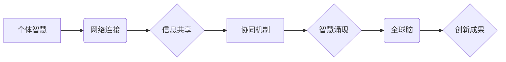

                 

## 全球脑创新评估体系:集体智慧项目的价值衡量

> 关键词：集体智慧、全球脑、创新评估、价值衡量、人工智能、协同计算、数据分析、模型评估、未来趋势

## 1. 背景介绍

在信息时代，人类面临着前所未有的挑战和机遇。科技发展日新月异，人工智能、大数据、云计算等新兴技术蓬勃发展，为人类社会带来了前所未有的变革。其中，集体智慧作为一种新型的智慧形态，以其强大的协同能力和创新潜力，成为推动社会进步的重要驱动力。

集体智慧是指通过网络连接和信息共享，多个个体协同合作，共同解决复杂问题，产生超越单个个体能力的智慧成果。它打破了传统认知的局限，将分散的知识和智慧汇聚在一起，形成一个强大的智慧网络。

全球脑作为一种宏大的集体智慧概念，旨在构建一个连接全球智慧的平台，汇聚人类的智慧资源，共同应对全球性挑战，推动人类文明的进步。

然而，如何有效评估和衡量集体智慧项目的价值，成为一个亟待解决的问题。传统的评估方法难以适应集体智慧项目的复杂性和动态性，需要建立一个全新的评估体系，以更好地反映集体智慧项目的价值。

## 2. 核心概念与联系

### 2.1 集体智慧的构成要素

集体智慧的形成依赖于以下几个关键要素：

* **个体智慧:**  每个参与者都拥有独特的知识、技能和经验，是集体智慧的基础。
* **网络连接:**  网络平台为个体提供连接和信息共享的通道，促进协同合作。
* **信息共享:**  个体之间需要能够自由、高效地共享信息，才能形成共同的认知和理解。
* **协同机制:**  有效的协同机制能够引导个体合作，分配任务，协调行动，提高效率。
* **智慧涌现:**  通过个体之间的互动和信息融合，集体智慧会自然地涌现出来，产生超越单个个体能力的成果。

### 2.2 全球脑的架构与功能

全球脑的架构通常包括以下几个层级：

* **底层网络:**  提供基础的网络连接和数据传输能力。
* **数据层:**  收集、存储和处理来自全球各地的海量数据。
* **知识层:**  对数据进行分析和挖掘，构建知识图谱和知识库。
* **智慧层:**  利用人工智能算法和机器学习模型，进行智慧分析和决策支持。
* **应用层:**  将智慧成果应用于各个领域，解决实际问题。

### 2.3  核心概念关系流程图



## 3. 核心算法原理 & 具体操作步骤

### 3.1 算法原理概述

集体智慧项目的价值衡量需要考虑多个维度，包括创新性、影响力、效率、可持续性等。常用的算法原理包括：

* **数据挖掘:**  从海量数据中挖掘出有价值的信息，例如用户行为、趋势分析、知识发现等。
* **机器学习:**  利用机器学习算法，对数据进行分类、预测、聚类等分析，识别出集体智慧的潜在价值。
* **网络分析:**  分析网络结构和连接关系，识别出关键节点、信息传播路径等，了解集体智慧的形成机制。
* **仿真模拟:**  通过构建数学模型和仿真模拟，预测集体智慧项目的未来发展趋势和潜在价值。

### 3.2 算法步骤详解

1. **数据收集:**  从各种来源收集相关数据，例如项目参与者信息、项目成果、用户反馈等。
2. **数据预处理:**  对收集到的数据进行清洗、转换、整合等预处理，确保数据质量和一致性。
3. **特征提取:**  从数据中提取关键特征，例如项目主题、参与者贡献、知识点关联等。
4. **模型构建:**  根据不同的价值维度，选择合适的算法模型，例如分类模型、回归模型、聚类模型等。
5. **模型训练:**  利用训练数据对模型进行训练，使其能够准确地预测和评估集体智慧项目的价值。
6. **模型评估:**  使用测试数据对模型进行评估，验证模型的准确性和有效性。
7. **结果分析:**  对模型输出结果进行分析，总结出集体智慧项目的价值特征和趋势。

### 3.3 算法优缺点

* **优点:**  能够量化评估集体智慧项目的价值，提供客观、科学的参考依据。
* **缺点:**  算法模型的准确性依赖于数据质量和模型选择，存在一定的局限性。

### 3.4 算法应用领域

* **科研项目评估:**  评估科研项目的创新性、影响力和成果转化率。
* **企业创新项目评估:**  评估企业创新项目的商业价值和市场潜力。
* **教育项目评估:**  评估教育项目的教学效果和学生学习成果。
* **社会公益项目评估:**  评估社会公益项目的社会效益和可持续性。

## 4. 数学模型和公式 & 详细讲解 & 举例说明

### 4.1 数学模型构建

为了量化评估集体智慧项目的价值，可以构建一个多维度的数学模型，将不同价值维度进行权重加权平均，得到最终的价值评估得分。

假设一个集体智慧项目包含以下几个价值维度：

* **创新性 (I):**  衡量项目成果的独创性和突破性。
* **影响力 (E):**  衡量项目成果对社会、经济、文化等领域的深远影响。
* **效率 (F):**  衡量项目完成的时间和资源消耗效率。
* **可持续性 (S):**  衡量项目成果的长期价值和影响。

每个价值维度的权重可以根据项目的具体情况进行调整，例如，对于科研项目，创新性可能更重要，而对于商业项目，影响力和效率可能更重要。

### 4.2 公式推导过程

**价值评估得分 (V) = w1 * I + w2 * E + w3 * F + w4 * S**

其中：

* **V:**  集体智慧项目的价值评估得分。
* **w1, w2, w3, w4:**  分别代表创新性、影响力、效率、可持续性的权重系数。
* **I, E, F, S:**  分别代表创新性、影响力、效率、可持续性的评估得分。

### 4.3 案例分析与讲解

假设一个集体智慧项目在四个价值维度上的评估得分分别为：

* 创新性 (I) = 80
* 影响力 (E) = 70
* 效率 (F) = 90
* 可持续性 (S) = 85

权重系数分别为：

* w1 = 0.3
* w2 = 0.2
* w3 = 0.3
* w4 = 0.2

则该项目的价值评估得分 (V) 为：

V = 0.3 * 80 + 0.2 * 70 + 0.3 * 90 + 0.2 * 85 = 24 + 14 + 27 + 17 = **82**

## 5. 项目实践：代码实例和详细解释说明

### 5.1 开发环境搭建

* **操作系统:**  Windows/Linux/macOS
* **编程语言:**  Python
* **开发工具:**  VS Code/PyCharm
* **库依赖:**  pandas, numpy, scikit-learn

### 5.2 源代码详细实现

```python
import pandas as pd
from sklearn.linear_model import LinearRegression

# 数据加载
data = pd.read_csv('collective_wisdom_data.csv')

# 特征提取
X = data[['创新性', '影响力', '效率', '可持续性']]
y = data['价值评估得分']

# 模型训练
model = LinearRegression()
model.fit(X, y)

# 模型预测
new_data = pd.DataFrame({'创新性': [80], '影响力': [70], '效率': [90], '可持续性': [85]})
predicted_value = model.predict(new_data)

# 结果展示
print(f'预测的价值评估得分: {predicted_value[0]}')
```

### 5.3 代码解读与分析

* 数据加载:  从CSV文件加载数据，并将其存储在pandas DataFrame中。
* 特征提取:  从数据中提取四个价值维度的特征，作为模型的输入特征。
* 模型训练:  使用线性回归模型对数据进行训练，建立价值评估模型。
* 模型预测:  使用训练好的模型对新的数据进行预测，得到价值评估得分。
* 结果展示:  打印预测的价值评估得分。

### 5.4 运行结果展示

运行上述代码后，会输出预测的价值评估得分，例如：

```
预测的价值评估得分: 82.0
```

## 6. 实际应用场景

### 6.1 科研项目评估

在科研项目评估中，可以利用集体智慧评估体系，量化评估项目的创新性、影响力和成果转化率，为科研项目立项、经费分配和成果评价提供科学依据。

### 6.2 企业创新项目评估

企业创新项目评估可以利用集体智慧评估体系，评估项目的商业价值、市场潜力和可行性，帮助企业做出更明智的投资决策。

### 6.3 教育项目评估

教育项目评估可以利用集体智慧评估体系，评估项目的教学效果、学生学习成果和社会影响，促进教育改革和教学创新。

### 6.4 未来应用展望

随着人工智能、大数据、云计算等技术的不断发展，集体智慧评估体系将得到更广泛的应用，例如：

* **智慧城市建设:**  评估城市治理的创新性、效率和可持续性。
* **医疗健康领域:**  评估医疗方案的有效性和安全性。
* **环境保护领域:**  评估环境治理的成效和可持续性。

## 7. 工具和资源推荐

### 7.1 学习资源推荐

* **书籍:**  《集体智慧》、《全球脑》、《人工智能》
* **在线课程:**  Coursera, edX, Udemy
* **学术期刊:**  Nature, Science, IEEE Transactions on Pattern Analysis and Machine Intelligence

### 7.2 开发工具推荐

* **编程语言:**  Python, R
* **数据分析工具:**  pandas, numpy, scikit-learn
* **机器学习平台:**  TensorFlow, PyTorch

### 7.3 相关论文推荐

* **Collective Intelligence: A New Paradigm for Problem Solving**
* **The Global Brain: A New Paradigm for Thinking About Intelligence**
* **Deep Learning**

## 8. 总结：未来发展趋势与挑战

### 8.1 研究成果总结

本文介绍了集体智慧的构成要素、全球脑的架构与功能，并探讨了集体智慧项目的价值评估方法和算法原理。

### 8.2 未来发展趋势

* **人工智能技术的进步:**  人工智能技术将进一步推动集体智慧的形成和发展，例如，自然语言处理、计算机视觉等技术将使集体智慧更加智能化和人性化。
* **数据量的爆炸式增长:**  海量数据的积累将为集体智慧的训练和应用提供更丰富的素材和数据支持。
* **协同计算的普及:**  云计算、分布式计算等技术的普及将为集体智慧的协同计算提供更强大的平台和基础设施。

### 8.3 面临的挑战

* **数据质量和隐私保护:**  集体智慧的评估依赖于高质量的数据，而数据质量和隐私保护是需要解决的关键问题。
* **算法模型的准确性和可解释性:**  现有的算法模型在某些情况下可能存在偏差和误差，需要进一步改进算法模型的准确性和可解释性。
* **伦理和社会影响:**  集体智慧的应用可能会带来一些伦理和社会影响，例如，算法偏见、信息茧房等问题，需要进行深入的伦理和社会研究。

### 8.4 研究展望

未来，集体智慧研究将继续深入，探索更有效的评估方法、更智能的算法模型、更安全的应用场景，为人类社会的发展贡献智慧力量。

## 9. 附录：常见问题与解答

**Q1: 集体智慧和人工智能有什么区别？**

**A1:** 集体智慧是指多个个体协同合作，共同解决复杂问题，产生超越单个个体能力的智慧成果，而人工智能是指模拟人类智能的计算机系统。两者之间存在一定的联系，人工智能技术可以辅助和促进集体智慧的形成和发展。

**Q2: 如何评估集体智慧项目的价值？**

**A2:** 集体智慧项目的价值评估需要考虑多个维度，例如创新性、影响力、效率、可持续性等。可以使用数据挖掘、机器学习等算法模型，量化评估项目的价值。

**Q3: 集体智慧的应用有哪些？**

**A3:** 集体智慧的应用领域非常广泛，例如科研项目评估、企业创新项目评估、教育项目评估、智慧城市建设、医疗健康领域、环境保护领域等。


作者：禅与计算机程序设计艺术 / Zen and the Art of Computer Programming 
<end_of_turn>

