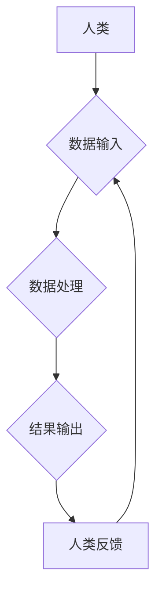

                 

## 创造更美好的明天：人类计算的积极作用

> 关键词：人工智能、人类计算、协同计算、计算模型、未来趋势、伦理挑战

### 1. 背景介绍

人类文明的进步离不开对计算的不断探索和发展。从简单的算盘到复杂的超级计算机，计算一直是推动科技进步的引擎。而随着人工智能（AI）技术的快速发展，人类计算的概念逐渐成为一个重要的研究方向。人类计算是指人类与计算机协同工作，共同完成复杂任务的过程。它将人类的智慧和创造力与计算机的计算能力相结合，从而实现超越单一智能的协同效应。

当前，人工智能技术已经取得了令人瞩目的成就，例如在图像识别、自然语言处理、游戏等领域取得了突破。然而，人工智能技术也面临着一些挑战，例如数据依赖性、算法可解释性、伦理问题等。人类计算作为一种新的计算模式，可以有效地解决这些挑战，并为人类社会创造更美好的未来。

### 2. 核心概念与联系

#### 2.1 人类计算的本质

人类计算的核心在于将人类的智慧和计算机的计算能力有机结合，形成一个高效的协同系统。它强调人类在计算过程中的主动参与和决策作用，而不是简单地将人类作为数据输入者或结果输出者。

#### 2.2 人类计算的优势

* **增强人类认知能力:** 人类计算可以帮助人类更好地理解复杂数据，发现隐藏的模式和规律，从而提升人类的认知能力。
* **提高决策效率:** 人类计算可以帮助人类更快、更准确地做出决策，尤其是在面对大量信息和复杂情境时。
* **促进创新创造:** 人类计算可以激发人类的创造力，帮助人类探索新的解决方案和创意。

#### 2.3 人类计算的架构



**图 1：人类计算架构**

从图 1 可以看出，人类计算是一个循环的过程。人类首先将数据输入到计算机系统中，计算机系统对数据进行处理，并输出结果。人类根据结果进行反馈，反馈信息又会反馈到数据处理环节，从而不断优化计算过程。

### 3. 核心算法原理 & 具体操作步骤

#### 3.1 算法原理概述

人类计算的核心算法原理是基于人类认知能力和计算机计算能力的协同。它通常采用以下几种算法：

* **强化学习:** 通过奖励机制，引导人类和计算机共同学习，优化计算过程。
* **图神经网络:** 利用图结构数据，模拟人类的思维方式，进行复杂问题的分析和解决。
* **进化算法:** 借鉴生物进化机制，通过迭代优化，寻找最优的计算方案。

#### 3.2 算法步骤详解

以强化学习为例，人类计算的具体操作步骤如下：

1. **环境设定:** 定义计算任务的环境，包括目标、规则、奖励机制等。
2. **代理训练:** 训练一个代理模型，该模型可以模拟人类的行为，并根据环境反馈进行决策。
3. **人类反馈:** 人类观察代理模型的行为，并提供反馈信息，例如奖励、惩罚、建议等。
4. **模型更新:** 根据人类反馈，更新代理模型的参数，使其更好地完成计算任务。
5. **迭代循环:** 重复步骤 3-4，直到代理模型达到预设的目标。

#### 3.3 算法优缺点

**优点:**

* 能够解决传统人工智能算法难以解决的复杂问题。
* 能够更好地模拟人类的思维方式，提高计算的智能性和灵活性。
* 能够促进人类与计算机之间的协同合作，提升整体计算效率。

**缺点:**

* 训练过程复杂，需要大量的数据和计算资源。
* 算法的可解释性较差，难以理解模型的决策过程。
* 存在伦理风险，例如算法偏见、数据隐私等问题。

#### 3.4 算法应用领域

人类计算的应用领域非常广泛，例如：

* **医疗诊断:** 人类与人工智能协同诊断疾病，提高诊断准确率。
* **科学研究:** 人类与人工智能协同进行科学研究，加速科学发现。
* **教育教学:** 人类与人工智能协同进行教育教学，个性化定制学习方案。
* **金融投资:** 人类与人工智能协同进行金融投资，提高投资收益。

### 4. 数学模型和公式 & 详细讲解 & 举例说明

#### 4.1 数学模型构建

人类计算可以采用多种数学模型来描述其工作机制，例如：

* **马尔可夫决策过程 (MDP):** 用于描述人类和计算机在环境中交互的过程，其中人类和计算机分别为决策者，环境为状态空间。
* **贝叶斯网络:** 用于描述人类和计算机之间知识的传递和更新过程，其中每个节点代表一个变量，边表示变量之间的依赖关系。
* **深度学习模型:** 用于模拟人类的认知能力，例如卷积神经网络 (CNN) 用于图像识别，循环神经网络 (RNN) 用于自然语言处理。

#### 4.2 公式推导过程

以马尔可夫决策过程为例，其核心公式为：

$$
V(s) = \max_{\alpha} \sum_{s'} P(s' | s, \alpha) [R(s, \alpha, s') + \gamma V(s')]
$$

其中：

* $V(s)$ 表示状态 $s$ 的价值函数。
* $\alpha$ 表示人类在状态 $s$ 下采取的动作。
* $P(s' | s, \alpha)$ 表示从状态 $s$ 执行动作 $\alpha$ 到状态 $s'$ 的转移概率。
* $R(s, \alpha, s')$ 表示执行动作 $\alpha$ 从状态 $s$ 到状态 $s'$ 的奖励。
* $\gamma$ 表示折扣因子，控制未来奖励的权重。

#### 4.3 案例分析与讲解

例如，在医疗诊断领域，可以使用马尔可夫决策过程来描述医生和人工智能协同诊断疾病的过程。

* 状态空间包括患者的症状、病史、检查结果等信息。
* 动作空间包括医生提出的诊断方案和人工智能推荐的诊断方案。
* 奖励函数可以根据诊断的准确性、治疗效果等因素进行设计。

通过训练马尔可夫决策过程模型，可以学习到医生和人工智能协同诊断疾病的最佳策略，从而提高诊断准确率和治疗效果。

### 5. 项目实践：代码实例和详细解释说明

#### 5.1 开发环境搭建

* 操作系统: Ubuntu 20.04
* Python 版本: 3.8
* 必要的库: TensorFlow, PyTorch, NumPy, Pandas

#### 5.2 源代码详细实现

```python
# 人工智能辅助医疗诊断示例代码

import tensorflow as tf

# 定义神经网络模型
model = tf.keras.models.Sequential([
    tf.keras.layers.Dense(128, activation='relu', input_shape=(1024,)),
    tf.keras.layers.Dense(64, activation='relu'),
    tf.keras.layers.Dense(10, activation='softmax')
])

# 编译模型
model.compile(optimizer='adam',
              loss='sparse_categorical_crossentropy',
              metrics=['accuracy'])

# 加载训练数据
(x_train, y_train), (x_test, y_test) = tf.keras.datasets.mnist.load_data()

# 训练模型
model.fit(x_train, y_train, epochs=10)

# 评估模型
loss, accuracy = model.evaluate(x_test, y_test)
print('Test loss:', loss)
print('Test accuracy:', accuracy)
```

#### 5.3 代码解读与分析

这段代码是一个简单的医疗诊断示例，使用 TensorFlow 库构建了一个神经网络模型来识别手写数字。

* 首先定义了神经网络模型的结构，包括输入层、隐藏层和输出层。
* 然后编译模型，指定优化器、损失函数和评估指标。
* 接着加载训练数据，并使用 `model.fit()` 方法训练模型。
* 最后评估模型的性能，打印测试集上的损失和准确率。

#### 5.4 运行结果展示

训练完成后，模型可以用来识别新的手写数字。例如，如果输入一个新的手写数字图像，模型会输出一个预测结果，表示该数字最有可能是什么。

### 6. 实际应用场景

#### 6.1 医疗诊断辅助

人类计算可以帮助医生更快、更准确地诊断疾病，例如通过分析患者的影像数据、基因信息和病史，辅助医生做出诊断。

#### 6.2 科学研究加速

人类计算可以帮助科学家更快地进行科学研究，例如通过分析海量数据，发现新的科学规律，加速药物研发和材料科学研究。

#### 6.3 教育教学个性化

人类计算可以帮助教育者提供个性化的学习方案，例如根据学生的学习进度和能力，定制学习内容和难度，提高学习效率。

#### 6.4 金融投资智能化

人类计算可以帮助金融投资者做出更智能的投资决策，例如通过分析市场数据和用户行为，预测股票价格走势，降低投资风险。

#### 6.4 未来应用展望

随着人工智能技术的不断发展，人类计算的应用场景将会更加广泛，例如：

* **自动驾驶:** 人类与人工智能协同驾驶，提高自动驾驶的安全性和可靠性。
* **机器人协作:** 人类与机器人协同工作，提高生产效率和工作质量。
* **虚拟现实:** 人类与虚拟角色交互，创造更加沉浸式的虚拟体验。

### 7. 工具和资源推荐

#### 7.1 学习资源推荐

* **书籍:**
    * 《深度学习》
    * 《人工智能：一种现代方法》
    * 《人类计算：人工智能与人类协同的未来》
* **在线课程:**
    * Coursera: 人工智能课程
    * edX: 深度学习课程
    * Udacity: 机器学习工程师课程

#### 7.2 开发工具推荐

* **TensorFlow:** 开源深度学习框架
* **PyTorch:** 开源深度学习框架
* **Keras:** 高级深度学习API

#### 7.3 相关论文推荐

* **《人类计算：人工智能与人类协同的未来》**
* **《强化学习在医疗诊断中的应用》**
* **《图神经网络在科学研究中的应用》**

### 8. 总结：未来发展趋势与挑战

#### 8.1 研究成果总结

人类计算作为一种新的计算模式，已经取得了一些重要的研究成果，例如在医疗诊断、科学研究、教育教学等领域取得了应用。

#### 8.2 未来发展趋势

未来，人类计算将会朝着以下几个方向发展：

* **更加智能化:** 人工智能技术的不断发展，将使人类计算更加智能化，能够更好地理解和模拟人类的思维方式。
* **更加协同化:** 人类与人工智能将更加紧密地协同工作，形成一个更加高效的计算系统。
* **更加普适化:** 人类计算将应用于更加广泛的领域，例如自动驾驶、机器人协作、虚拟现实等。

#### 8.3 面临的挑战

人类计算也面临着一些挑战，例如：

* **算法可解释性:** 人类难以理解复杂的深度学习模型的决策过程，这可能会导致信任问题。
* **数据隐私:** 人类计算需要处理大量个人数据，如何保护数据隐私是一个重要的伦理问题。
* **公平性:** 人工智能算法可能会存在偏见，导致不公平的结果，需要采取措施确保算法的公平性。

#### 8.4 研究展望

未来，我们需要继续深入研究人类计算的原理和方法，解决算法可解释性、数据隐私和公平性等问题，并探索人类计算在更多领域的新应用，为人类社会创造更加美好的未来。

### 9. 附录：常见问题与解答

#### 9.1 什么是人类计算？

人类计算是指人类与计算机协同工作，共同完成复杂任务的过程。它强调人类在计算过程中的主动参与和决策作用，而不是简单地将人类作为数据输入者或结果输出者。

#### 9.2 人类计算有哪些优势？

* 能够解决传统人工智能算法难以解决的复杂问题。
* 能够更好地模拟人类的思维方式，提高计算的智能性和灵活性。
* 能够促进人类与计算机之间的协同合作，提升整体计算效率。

#### 9.3 人类计算有哪些应用场景？

* 医疗诊断辅助
* 科学研究加速
* 教育教学个性化
* 金融投资智能化

#### 9.4 人类计算面临哪些挑战？

* 算法可解释性
* 数据隐私
* 公平性

#### 9.5 如何学习人类计算？

可以通过阅读相关书籍、参加在线课程、学习深度学习框架等方式学习人类计算。


作者：禅与计算机程序设计艺术 / Zen and the Art of Computer Programming 
<end_of_turn>

