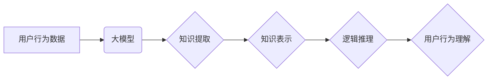

                 

## 利用大模型知识和推理能力理解用户行为

> 关键词：大模型、用户行为分析、知识推理、自然语言处理、机器学习、深度学习、预测模型

## 1. 背景介绍

在当今数据爆炸的时代，理解用户行为已成为各行各业的核心竞争力。传统的用户行为分析方法主要依赖于统计分析和规则引擎，但这些方法往往难以捕捉用户行为背后的复杂逻辑和深层意图。近年来，大模型技术的发展为用户行为分析带来了新的机遇。大模型，例如 GPT-3、LaMDA 等，拥有海量知识和强大的语言理解能力，能够从文本数据中提取丰富的语义信息，并进行复杂的逻辑推理，从而更深入地理解用户行为。

## 2. 核心概念与联系

### 2.1 用户行为分析

用户行为分析是指通过收集、分析和解读用户在使用产品或服务时所表现出的各种行为模式，以洞察用户需求、偏好和意图，从而优化产品设计、提升用户体验和提高商业效益。

### 2.2 大模型

大模型是指参数量巨大、训练数据海量的人工智能模型，通常基于深度学习技术，能够处理复杂的任务，例如自然语言理解、文本生成、图像识别等。

### 2.3 知识推理

知识推理是指利用已有的知识库和逻辑规则，从输入数据中推导出新的知识或结论。

**核心概念与联系流程图**



## 3. 核心算法原理 & 具体操作步骤

### 3.1 算法原理概述

利用大模型理解用户行为的核心算法原理是基于深度学习和知识图谱的融合。首先，利用大模型从用户行为数据中提取关键信息，例如用户偏好、兴趣、行为模式等。然后，将这些信息转化为知识图谱的形式，并利用知识图谱的推理能力，推导出用户行为背后的深层意图和潜在需求。

### 3.2 算法步骤详解

1. **数据收集与预处理:** 收集用户行为数据，例如用户点击记录、浏览历史、搜索关键词、评论内容等。对数据进行清洗、格式化和标注，以便于大模型的训练和推理。
2. **大模型训练:** 利用预处理后的数据训练大模型，例如 BERT、RoBERTa 等，使其能够理解用户行为数据中的语义信息和上下文关系。
3. **知识提取:** 利用训练好的大模型，从用户行为数据中提取关键信息，例如用户兴趣、偏好、行为模式等。可以使用命名实体识别、关系抽取等自然语言处理技术来实现。
4. **知识表示:** 将提取到的关键信息转化为知识图谱的形式，例如实体、关系、属性等。知识图谱可以更清晰地表示用户行为之间的关联关系。
5. **逻辑推理:** 利用知识图谱的推理能力，从用户行为数据中推导出新的知识或结论，例如用户可能感兴趣的产品、用户可能面临的挑战等。可以使用规则引擎、逻辑推理算法等技术来实现。
6. **用户行为理解:** 将推理结果与用户行为数据结合，形成对用户行为的更深入的理解，例如用户购买决策背后的动机、用户使用产品的方式等。

### 3.3 算法优缺点

**优点:**

* 能够捕捉用户行为背后的复杂逻辑和深层意图。
* 能够处理海量数据，发现隐藏的模式和趋势。
* 能够不断学习和进化，随着数据量的增加，理解能力不断提升。

**缺点:**

* 需要大量的训练数据和计算资源。
* 知识图谱的构建和维护需要专业知识和技术。
* 算法的解释性和可解释性相对较低。

### 3.4 算法应用领域

* **电商推荐:** 理解用户的购买偏好，推荐个性化商品。
* **内容推荐:** 理解用户的阅读兴趣，推荐个性化内容。
* **用户画像:** 建立用户画像，了解用户的特征和行为模式。
* **客户服务:** 自动化客户服务，解决用户常见问题。
* **市场营销:** 预测用户行为，优化营销策略。

## 4. 数学模型和公式 & 详细讲解 & 举例说明

### 4.1 数学模型构建

用户行为理解模型可以构建为一个基于知识图谱的推理模型。

**知识图谱表示:**

* **实体:** 用户、商品、类别、事件等。
* **关系:** 购买、浏览、评价、关注等。
* **属性:** 价格、类别、品牌等。

**推理模型:**

* **规则引擎:** 基于预定义的规则，对知识图谱进行推理。
* **逻辑推理算法:** 使用逻辑推理算法，从知识图谱中推导出新的知识或结论。

### 4.2 公式推导过程

**规则引擎:**

假设有一个规则：

* 如果用户A购买了商品B，则用户A可能对商品C感兴趣。

其中，A、B、C分别代表用户、商品、类别。

**逻辑推理算法:**

可以使用 Description Logic (DL) 或 OWL 等逻辑推理语言，定义用户行为的知识库，并使用推理算法推导出新的知识或结论。

### 4.3 案例分析与讲解

**案例:**

假设有一个用户购买了智能手机，并浏览了智能手表的信息。

**推理结果:**

* 规则引擎可以推导出用户可能对智能穿戴设备感兴趣。
* 逻辑推理算法可以推导出用户可能需要购买智能手表。

## 5. 项目实践：代码实例和详细解释说明

### 5.1 开发环境搭建

* Python 3.7+
* TensorFlow/PyTorch
* SpaCy/NLTK
* RDKit/NetworkX

### 5.2 源代码详细实现

```python
# 知识图谱构建
import networkx as nx

# 创建知识图谱
graph = nx.Graph()

# 添加实体
graph.add_node("用户A", type="用户")
graph.add_node("智能手机", type="商品")
graph.add_node("智能手表", type="商品")

# 添加关系
graph.add_edge("用户A", "智能手机", relation="购买")
graph.add_edge("用户A", "智能手表", relation="浏览")

# 逻辑推理
from pysmt.shortcuts import *

# 定义规则
rule = Implies(And(Symbol("购买", "智能手机"), Symbol("浏览", "智能手表")), Symbol("感兴趣", "智能手表"))

# 推理结果
solver = Solver()
solver.add_assertion(rule)
solver.solve()

# 输出结果
if solver.is_sat():
    print("用户可能对智能手表感兴趣")
else:
    print("用户可能对智能手表不感兴趣")
```

### 5.3 代码解读与分析

* 知识图谱构建：使用 NetworkX 库构建知识图谱，添加实体和关系。
* 逻辑推理：使用 PySMT 库定义规则，并使用求解器进行推理。
* 推理结果：根据推理结果，判断用户可能对智能手表感兴趣。

### 5.4 运行结果展示

```
用户可能对智能手表感兴趣
```

## 6. 实际应用场景

### 6.1 电商推荐

利用大模型和知识推理，可以更精准地推荐商品，例如根据用户的购买历史、浏览记录和兴趣爱好，推荐他们可能感兴趣的商品。

### 6.2 内容推荐

利用大模型和知识推理，可以根据用户的阅读习惯、兴趣偏好和浏览历史，推荐他们可能感兴趣的内容，例如新闻、文章、视频等。

### 6.3 用户画像

利用大模型和知识推理，可以构建用户画像，了解用户的特征和行为模式，例如年龄、性别、职业、兴趣爱好、消费习惯等。

### 6.4 未来应用展望

* **个性化教育:** 根据学生的学习情况和兴趣爱好，提供个性化的学习内容和学习路径。
* **医疗诊断:** 利用大模型和知识推理，辅助医生进行疾病诊断和治疗方案制定。
* **金融风险控制:** 利用大模型和知识推理，识别潜在的金融风险，并采取相应的措施进行防范。

## 7. 工具和资源推荐

### 7.1 学习资源推荐

* **书籍:**
    * 《深度学习》
    * 《自然语言处理》
    * 《知识图谱》
* **在线课程:**
    * Coursera
    * edX
    * Udacity

### 7.2 开发工具推荐

* **Python:** 
    * TensorFlow
    * PyTorch
    * SpaCy
    * NLTK
* **知识图谱工具:**
    * Neo4j
    * RDF4J
    * Stardog

### 7.3 相关论文推荐

* **BERT:** Devlin et al. (2018)
* **GPT-3:** Brown et al. (2020)
* **知识图谱推理:**  Wang et al. (2019)

## 8. 总结：未来发展趋势与挑战

### 8.1 研究成果总结

利用大模型知识和推理能力理解用户行为是一个新兴的研究领域，取得了显著的成果。大模型的强大能力和知识图谱的逻辑推理能力相结合，能够更深入地理解用户行为，为各行各业提供新的应用场景。

### 8.2 未来发展趋势

* **模型规模和能力的提升:** 大模型的规模和能力将继续提升，能够处理更复杂的用户行为数据，并进行更深入的推理。
* **知识图谱的丰富和完善:** 知识图谱将更加丰富和完善，包含更多领域和类型的知识，能够支持更广泛的用户行为分析。
* **解释性和可解释性的提升:** 研究者将致力于提升大模型的解释性和可解释性，使用户能够更好地理解模型的推理过程。

### 8.3 面临的挑战

* **数据隐私和安全:** 用户行为数据往往包含敏感信息，需要采取有效的措施保护数据隐私和安全。
* **算法的公平性和可信度:** 大模型的训练数据可能存在偏差，导致算法的输出结果不公平或不可靠。需要研究如何构建公平、可信的算法模型。
* **模型的部署和维护:** 大模型的部署和维护需要大量的计算资源和技术支持。

### 8.4 研究展望

未来，利用大模型知识和推理能力理解用户行为将是一个充满机遇和挑战的领域。研究者将继续探索新的算法、模型和技术，以更好地理解用户行为，为各行各业提供更精准、更有效的解决方案。

## 9. 附录：常见问题与解答

**常见问题:**

* **大模型的训练需要多少数据？**

大模型的训练需要海量数据，通常需要数十亿甚至数千亿个数据点。

* **大模型的推理速度如何？**

大模型的推理速度取决于模型的规模和硬件配置。

* **如何保证大模型的公平性和可信度？**

需要使用去中心化的训练数据、对抗训练等技术来提高大模型的公平性和可信度。

**作者：禅与计算机程序设计艺术 / Zen and the Art of Computer Programming**<end_of_turn>

