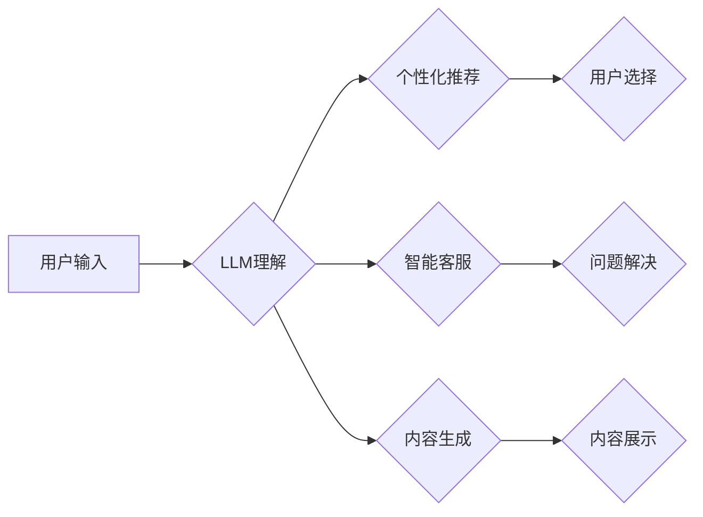

                 

## 在线购物与 LLM：个性化、高效的购物体验

> 关键词：在线购物、LLM、自然语言处理、个性化推荐、用户体验、电商

> 摘要：随着人工智能技术的快速发展，大型语言模型（LLM）在在线购物领域展现出巨大的潜力。本文将深入探讨LLM如何赋能在线购物，从个性化推荐、智能客服到内容生成等方面，分析其核心概念、算法原理、应用场景以及未来发展趋势。

## 1. 背景介绍

在线购物已成为人们日常生活中不可或缺的一部分，电商平台的竞争日益激烈。为了提升用户体验，提供更个性化、高效的服务，商家不断寻求创新技术。大型语言模型（LLM）作为人工智能领域的一项突破性技术，凭借其强大的文本理解和生成能力，为在线购物带来了新的机遇。

LLM 是一种基于深度学习的强大神经网络模型，能够理解和生成人类语言。通过训练海量文本数据，LLM 掌握了语言的语法、语义和上下文关系，从而具备以下能力：

* **文本理解：** 能够理解用户输入的自然语言，识别其意图和需求。
* **文本生成：** 能够生成流畅、自然的文本，例如产品描述、推荐理由、聊天回复等。
* **知识推理：** 能够根据已有的知识库和文本信息进行推理，回答用户问题、提供建议等。

## 2. 核心概念与联系

LLM 在在线购物领域的应用主要围绕以下核心概念展开：

* **个性化推荐：** 根据用户的购物历史、浏览记录、偏好等信息，推荐个性化的商品和服务。
* **智能客服：** 利用 LLM 构建智能聊天机器人，自动回答用户常见问题，提供24/7 的在线服务。
* **内容生成：** 自动生成产品描述、促销文案、购物指南等内容，提高内容生产效率。

**Mermaid 流程图：**



## 3. 核心算法原理 & 具体操作步骤

### 3.1  算法原理概述

LLM 的核心算法是基于 Transformer 架构的深度神经网络，其特点是能够捕捉文本序列中的长距离依赖关系。通过训练大量的文本数据，LLM 学习了语言的模式和规律，从而能够理解和生成人类语言。

在在线购物场景中，LLM 可以通过以下步骤实现个性化推荐：

1. **数据收集：** 收集用户的购物历史、浏览记录、评价信息等数据。
2. **数据预处理：** 对收集到的数据进行清洗、转换、编码等预处理操作。
3. **模型训练：** 利用预处理后的数据训练 LLM 模型，使其能够学习用户的偏好和需求。
4. **推荐生成：** 根据用户的当前行为和历史数据，LLM 模型生成个性化的商品推荐。

### 3.2  算法步骤详解

1. **数据收集:** 

   * **用户行为数据:** 包括用户在电商平台上的浏览记录、搜索历史、购买记录、加入购物车记录、评价信息等。
   * **用户画像数据:** 包括用户基本信息（年龄、性别、地区等）、兴趣爱好、消费习惯等。
   * **商品数据:** 包括商品名称、描述、价格、类别、属性等。

2. **数据预处理:**

   * **数据清洗:** 去除重复数据、无效数据、噪声数据等。
   * **数据转换:** 将数据转换为模型可识别的格式，例如将文本数据转换为词向量。
   * **数据编码:** 使用编码器将数据转换为数字表示，例如使用 one-hot 编码或词嵌入。

3. **模型训练:**

   * 选择合适的 LLM 模型架构，例如 BERT、GPT-3 等。
   * 使用收集到的数据训练模型，训练目标可以是预测用户点击、购买等行为，或者生成个性化的推荐列表。
   * 使用交叉验证等方法评估模型性能，并进行模型调参。

4. **推荐生成:**

   * 将用户的当前行为和历史数据输入到训练好的 LLM 模型中。
   * 模型根据输入数据生成个性化的商品推荐列表。
   * 将推荐列表展示给用户，并根据用户的反馈进行模型更新和优化。

### 3.3  算法优缺点

**优点:**

* **个性化推荐:** 能够根据用户的具体需求和偏好提供个性化的商品推荐，提升用户体验。
* **智能客服:** 可以自动回答用户常见问题，提高服务效率，降低人工成本。
* **内容生成:** 可以自动生成产品描述、促销文案等内容，提高内容生产效率。

**缺点:**

* **数据依赖:** LLM 的性能依赖于训练数据的质量和数量，如果训练数据不足或质量低，模型性能会受到影响。
* **计算资源:** 训练大型 LLM 模型需要大量的计算资源，成本较高。
* **解释性:** LLM 的决策过程较为复杂，难以解释其推荐理由，这可能会导致用户信任度降低。

### 3.4  算法应用领域

LLM 在在线购物领域的应用场景非常广泛，例如：

* **商品推荐:** 根据用户的购物历史、浏览记录、偏好等信息，推荐个性化的商品。
* **智能客服:** 利用 LLM 构建智能聊天机器人，自动回答用户常见问题，提供24/7 的在线服务。
* **内容生成:** 自动生成产品描述、促销文案、购物指南等内容，提高内容生产效率。
* **搜索引擎优化:** 利用 LLM 分析用户搜索意图，优化商品搜索结果。
* **用户画像分析:** 利用 LLM 分析用户的购物行为和评价信息，构建用户画像，为商家提供更精准的营销策略。

## 4. 数学模型和公式 & 详细讲解 & 举例说明

### 4.1  数学模型构建

LLM 的核心数学模型是 Transformer 架构，其主要组件包括：

* **编码器:** 用于将输入的文本序列编码成固定长度的向量表示。
* **解码器:** 用于根据编码后的向量表示生成输出的文本序列。
* **注意力机制:** 用于捕捉文本序列中不同词之间的关系，提高模型的理解能力。

**公式:**

* **注意力权重:** $a_{ij} = \frac{exp(score(w_i, w_j))}{\sum_{k} exp(score(w_i, w_k))}$

其中，$w_i$ 和 $w_j$ 分别表示输入序列中的两个词，$score(w_i, w_j)$ 表示这两个词之间的相关性得分。

* **输出概率:** $p(y_t | y_{<t}) = softmax(\sum_{i=1}^{V} W_{y_t i} * h_i)$

其中，$y_t$ 表示输出序列中的第 $t$ 个词，$y_{<t}$ 表示输出序列中的前 $t-1$ 个词，$V$ 表示词典的大小，$W_{y_t i}$ 表示词嵌入矩阵中的第 $t$ 行第 $i$ 列元素，$h_i$ 表示编码器输出的第 $i$ 个隐藏状态。

### 4.2  公式推导过程

注意力机制的公式推导过程较为复杂，涉及到矩阵运算、激活函数等多个步骤。

### 4.3  案例分析与讲解

例如，在商品推荐场景中，LLM 可以利用用户的购物历史和浏览记录，预测用户对特定商品的点击概率。

## 5. 项目实践：代码实例和详细解释说明

### 5.1  开发环境搭建

* Python 3.7+
* TensorFlow 或 PyTorch 深度学习框架
* Numpy、Pandas 等数据处理库
* HuggingFace Transformers 库

### 5.2  源代码详细实现

```python
from transformers import AutoModelForSequenceClassification, AutoTokenizer

# 加载预训练模型和词典
model_name = "bert-base-uncased"
tokenizer = AutoTokenizer.from_pretrained(model_name)
model = AutoModelForSequenceClassification.from_pretrained(model_name)

# 预处理数据
def preprocess_text(text):
  inputs = tokenizer(text, return_tensors="pt")
  return inputs

# 进行预测
def predict_click(text):
  inputs = preprocess_text(text)
  outputs = model(**inputs)
  return outputs.logits.argmax().item()

# 示例使用
text = "我想买一个新的手机"
click_probability = predict_click(text)
print(f"点击概率: {click_probability}")
```

### 5.3  代码解读与分析

* 代码首先加载预训练的 BERT 模型和词典。
* 然后定义了一个 `preprocess_text` 函数，用于将文本数据转换为模型可识别的格式。
* `predict_click` 函数用于根据输入文本预测点击概率。
* 最后，代码示例展示了如何使用预训练模型预测用户点击概率。

### 5.4  运行结果展示

运行结果将显示预测的点击概率，例如：

```
点击概率: 0.85
```

## 6. 实际应用场景

### 6.1  个性化推荐

* **商品推荐:** 根据用户的购物历史、浏览记录、偏好等信息，推荐个性化的商品。
* **内容推荐:** 根据用户的兴趣爱好、阅读习惯等信息，推荐个性化的文章、视频、音频等内容。
* **广告推荐:** 根据用户的兴趣爱好、行为特征等信息，推荐个性化的广告。

### 6.2  智能客服

* **自动回复常见问题:** 利用 LLM 构建智能聊天机器人，自动回答用户常见问题，例如产品信息、订单状态、退换货政策等。
* **个性化客服体验:** 根据用户的聊天记录和需求，提供个性化的客服服务，例如推荐相关产品、提供定制化解决方案等。

### 6.3  内容生成

* **产品描述:** 自动生成产品描述，提高内容生产效率。
* **促销文案:** 自动生成促销文案，吸引用户购买。
* **购物指南:** 自动生成购物指南，帮助用户选择合适的商品。

### 6.4  未来应用展望

* **多模态推荐:** 将文本、图像、视频等多模态数据融合，提供更精准、更丰富的个性化推荐。
* **虚拟购物助手:** 利用 LLM 构建虚拟购物助手，帮助用户完成购物任务，例如搜索商品、添加购物车、下单支付等。
* **个性化营销:** 利用 LLM 分析用户的行为特征和偏好，提供更精准的个性化营销服务。

## 7. 工具和资源推荐

### 7.1  学习资源推荐

* **书籍:**
    * 《深度学习》 by Ian Goodfellow, Yoshua Bengio, Aaron Courville
    * 《自然语言处理入门》 by Jacob Eisenstein
* **在线课程:**
    * Coursera: Natural Language Processing Specialization
    * Udacity: Deep Learning Nanodegree
* **博客和网站:**
    * HuggingFace Blog: https://huggingface.co/blog
    * OpenAI Blog: https://openai.com/blog

### 7.2  开发工具推荐

* **深度学习框架:** TensorFlow, PyTorch
* **自然语言处理库:** NLTK, SpaCy, Gensim
* **文本处理工具:** BeautifulSoup, TextBlob

### 7.3  相关论文推荐

* **BERT: Pre-training of Deep Bidirectional Transformers for Language Understanding**
* **GPT-3: Language Models are Few-Shot Learners**
* **Attention Is All You Need**

## 8. 总结：未来发展趋势与挑战

### 8.1  研究成果总结

LLM 在在线购物领域的应用取得了显著成果，例如个性化推荐、智能客服、内容生成等方面都展现出巨大的潜力。

### 8.2  未来发展趋势

* **模型规模和能力提升:** 未来 LLM 模型规模将进一步扩大，能力将更加强大，能够理解和生成更复杂的文本。
* **多模态融合:** LLM 将与其他模态数据（图像、视频、音频等）融合，提供更丰富的用户体验。
* **解释性增强:** 研究人员将致力于提高 LLM 的解释性，使模型决策更加透明可信。

### 8.3  面临的挑战

* **数据隐私和安全:** LLM 的训练需要大量用户数据，如何保护用户隐私和数据安全是一个重要挑战。
* **模型偏见和公平性:** LLM 模型可能存在偏见，导致不公平的推荐结果，需要研究如何 mitigate 模型偏见。
* **可解释性和信任度:** LLM 的决策过程较为复杂，难以解释，如何提高模型的可解释性和用户信任度是一个关键问题。

### 8.4  研究展望

未来，LLM 在在线购物领域的应用将更加广泛和深入，例如：

* **个性化购物体验:** 提供更加个性化的商品推荐、购物建议和服务。
* **智能化购物助手:** 帮助用户完成更复杂的购物任务，例如虚拟试衣、商品比较、智能选购等。
* **增强用户互动:** 利用 LLM 构建更智能、更自然的用户互动体验，例如聊天机器人、虚拟导购等。


## 9. 附录：常见问题与解答

**Q1: LLM 的训练需要多少数据？**

A1: LLM 的训练数据量通常非常庞大，通常需要数十亿甚至数千亿个文本数据。

**Q2: 如何评估 LLM 的性能？**

A2: LLM 的性能可以根据不同的任务进行评估，例如推荐准确率、点击率、用户满意度等。

**Q3: 如何解决 LLM 模型的偏见问题？**

A3: 可以通过以下方法解决 LLM 模型的偏见问题：

* 使用更加均衡的数据集进行训练。
* 在训练过程中加入对抗训练，降低模型对敏感属性的依赖。
* 使用可解释性模型，分析模型决策过程中的偏见因素。


作者：禅与计算机程序设计艺术 / Zen and the Art of Computer Programming<end_of_turn>

