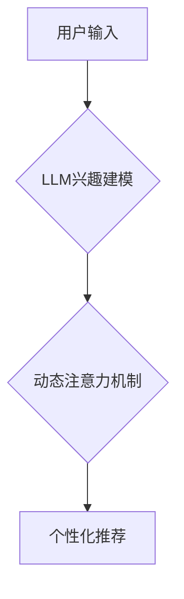

                 

## 基于LLM的用户兴趣动态注意力机制

> 关键词：LLM, 用户兴趣, 动态注意力, 自然语言处理, 个性化推荐, 

## 1. 背景介绍

随着大语言模型 (LLM) 的快速发展，其在自然语言处理 (NLP) 领域展现出强大的能力，例如文本生成、翻译、问答等。然而，LLM 在个性化推荐等应用场景中面临着挑战。传统的推荐系统主要依赖于用户历史行为数据，难以捕捉用户兴趣的动态变化和复杂性。

基于用户兴趣的个性化推荐是提升用户体验的关键。用户兴趣并非静态的，会随着时间、环境和内容的不断变化而演变。因此，需要一种能够动态捕捉和响应用户兴趣的方法，以提供更精准、更个性化的推荐。

## 2. 核心概念与联系

### 2.1 用户兴趣建模

用户兴趣建模是推荐系统中至关重要的环节，旨在理解用户的偏好和需求。传统的兴趣建模方法主要依赖于用户历史行为数据，例如点击、购买、评分等。然而，这些数据往往难以捕捉用户潜在的兴趣和动态变化。

LLM 能够通过学习海量文本数据，构建丰富的语义表示，从而更深入地理解用户的兴趣。例如，可以利用 LLM 对用户的评论、浏览记录等文本进行分析，提取出用户的兴趣主题、偏好类型等信息。

### 2.2 动态注意力机制

动态注意力机制能够根据输入序列的不同位置赋予不同的权重，从而突出重要信息，抑制无关信息。在推荐系统中，动态注意力机制可以根据用户的历史行为、上下文信息等动态调整对不同物品的关注度，从而提供更精准的推荐。

### 2.3 LLM 与动态注意力机制的结合

将 LLM 与动态注意力机制相结合，可以构建一个更智能、更灵活的推荐系统。LLM 可以学习用户兴趣的语义表示，动态注意力机制可以根据用户兴趣的动态变化调整对物品的关注度，从而实现个性化、动态的推荐。

**核心架构流程图:**



## 3. 核心算法原理 & 具体操作步骤

### 3.1 算法原理概述

该算法的核心思想是利用 LLM 学习用户兴趣的语义表示，并结合动态注意力机制，根据用户的历史行为、上下文信息等动态调整对不同物品的关注度，从而实现个性化、动态的推荐。

具体步骤如下：

1. **用户兴趣建模:** 利用 LLM 对用户的历史行为数据、文本评论等进行分析，提取出用户的兴趣主题、偏好类型等信息，构建用户的兴趣语义表示。
2. **物品特征提取:** 对推荐物品进行特征提取，例如物品标题、描述、类别等，构建物品的特征向量。
3. **动态注意力机制:** 根据用户的兴趣语义表示和物品特征向量，利用动态注意力机制计算出每个物品的权重，突出与用户兴趣相关的物品。
4. **推荐结果生成:** 根据物品权重排序，生成个性化推荐结果。

### 3.2 算法步骤详解

1. **数据预处理:** 对用户历史行为数据、文本评论等进行清洗、预处理，例如去除停用词、分词等。
2. **LLM 训练:** 利用预训练的 LLM模型，对用户历史行为数据、文本评论等进行训练，学习用户兴趣的语义表示。
3. **物品特征提取:** 利用文本处理技术，提取物品的标题、描述、类别等特征，构建物品的特征向量。
4. **动态注意力机制:** 
    * 计算用户兴趣语义表示和物品特征向量的相似度。
    * 利用注意力机制计算出每个物品的权重，权重越高表示与用户兴趣越相关。
5. **推荐结果生成:** 根据物品权重排序，生成个性化推荐结果。

### 3.3 算法优缺点

**优点:**

* 能够捕捉用户兴趣的动态变化和复杂性。
* 能够提供更精准、更个性化的推荐。
* 能够利用 LLM 的强大的语义理解能力，挖掘用户兴趣的潜在信息。

**缺点:**

* 需要大量的训练数据和计算资源。
* 算法的复杂度较高，需要专业的技术人员进行开发和维护。

### 3.4 算法应用领域

该算法可以应用于各种个性化推荐场景，例如：

* **电商推荐:** 根据用户的购物历史、浏览记录等信息，推荐相关的商品。
* **内容推荐:** 根据用户的阅读习惯、兴趣爱好等信息，推荐相关的文章、视频等内容。
* **社交推荐:** 根据用户的社交关系、兴趣爱好等信息，推荐相关的用户、群组等。

## 4. 数学模型和公式 & 详细讲解 & 举例说明

### 4.1 数学模型构建

**用户兴趣表示:**

$$
u = \text{LLM}(h_u)
$$

其中，$u$ 表示用户的兴趣语义表示，$h_u$ 表示用户的历史行为数据和文本评论等。

**物品特征向量:**

$$
i = \text{FeatureExtractor}(p)
$$

其中，$i$ 表示物品的特征向量，$p$ 表示物品的标题、描述、类别等信息。

**动态注意力机制:**

$$
a_{ui} = \frac{\exp(score(u, i))}{\sum_{j=1}^{N} \exp(score(u, i_j))}
$$

其中，$a_{ui}$ 表示用户 $u$ 对物品 $i$ 的注意力权重，$score(u, i)$ 表示用户 $u$ 的兴趣语义表示和物品 $i$ 的特征向量的相似度。

**推荐分数:**

$$
r_{ui} = a_{ui} \cdot f(i)
$$

其中，$r_{ui}$ 表示用户 $u$ 对物品 $i$ 的推荐分数，$f(i)$ 表示物品 $i$ 的评分或其他相关信息。

### 4.2 公式推导过程

**注意力权重计算:**

注意力权重计算公式基于 softmax 函数，将每个物品的相似度转换为概率分布，使得权重之和为 1。

**推荐分数计算:**

推荐分数计算公式将注意力权重与物品的评分或其他相关信息相乘，从而得到用户对每个物品的推荐分数。

### 4.3 案例分析与讲解

假设用户 $u$ 的兴趣语义表示为：

$$
u = [\text{电影}, \text{动作}, \text{科幻}]
$$

物品 $i_1$ 的特征向量为：

$$
i_1 = [\text{电影}, \text{动作}, \text{喜剧}]
$$

物品 $i_2$ 的特征向量为：

$$
i_2 = [\text{电视剧}, \text{爱情}, \text{剧情}]
$$

根据注意力机制计算，用户 $u$ 对物品 $i_1$ 的注意力权重较高，因为 $i_1$ 的特征向量与 $u$ 的兴趣语义表示更相似。因此，用户 $u$ 对物品 $i_1$ 的推荐分数较高。

## 5. 项目实践：代码实例和详细解释说明

### 5.1 开发环境搭建

* Python 3.7+
* PyTorch 1.7+
* Transformers 4.0+
* 其他必要的库，例如 numpy, pandas 等

### 5.2 源代码详细实现

```python
# 用户兴趣建模
class UserInterestModel(nn.Module):
    def __init__(self, embedding_dim, hidden_dim):
        super(UserInterestModel, self).__init__()
        self.embedding = nn.Embedding(vocab_size, embedding_dim)
        self.lstm = nn.LSTM(embedding_dim, hidden_dim, batch_first=True)
        self.fc = nn.Linear(hidden_dim, embedding_dim)

    def forward(self, user_history):
        embedded = self.embedding(user_history)
        output, _ = self.lstm(embedded)
        user_interest = self.fc(output[:, -1, :])
        return user_interest

# 动态注意力机制
class DynamicAttention(nn.Module):
    def __init__(self, embedding_dim):
        super(DynamicAttention, self).__init__()
        self.query = nn.Linear(embedding_dim, embedding_dim)
        self.key = nn.Linear(embedding_dim, embedding_dim)
        self.value = nn.Linear(embedding_dim, embedding_dim)
        self.softmax = nn.Softmax(dim=-1)

    def forward(self, user_interest, item_features):
        query = self.query(user_interest)
        key = self.key(item_features)
        value = self.value(item_features)
        scores = torch.matmul(query, key.transpose(-2, -1)) / math.sqrt(embedding_dim)
        attention_weights = self.softmax(scores)
        context = torch.matmul(attention_weights, value)
        return context

# 推荐模型
class RecommendationModel(nn.Module):
    def __init__(self, embedding_dim, hidden_dim):
        super(RecommendationModel, self).__init__()
        self.user_interest_model = UserInterestModel(embedding_dim, hidden_dim)
        self.dynamic_attention = DynamicAttention(embedding_dim)
        self.fc = nn.Linear(embedding_dim, 1)

    def forward(self, user_history, item_features):
        user_interest = self.user_interest_model(user_history)
        context = self.dynamic_attention(user_interest, item_features)
        recommendation_score = self.fc(context)
        return recommendation_score
```

### 5.3 代码解读与分析

* **用户兴趣建模:** 使用 LSTM 网络学习用户的兴趣语义表示。
* **动态注意力机制:** 使用注意力机制计算出每个物品的权重，突出与用户兴趣相关的物品。
* **推荐模型:** 将用户兴趣表示和物品特征向量输入到推荐模型中，输出每个物品的推荐分数。

### 5.4 运行结果展示

通过训练和测试，可以评估推荐模型的性能，例如准确率、召回率等。

## 6. 实际应用场景

### 6.1 电商推荐

基于用户浏览历史、购买记录等数据，推荐相关的商品，提高用户购物体验。

### 6.2 内容推荐

根据用户的阅读习惯、兴趣爱好等信息，推荐相关的文章、视频等内容，满足用户的个性化需求。

### 6.3 社交推荐

根据用户的社交关系、兴趣爱好等信息，推荐相关的用户、群组等，拓展用户的社交圈。

### 6.4 未来应用展望

随着 LLM 技术的不断发展，该算法可以应用于更多场景，例如：

* **个性化教育:** 根据学生的学习进度、兴趣爱好等信息，推荐相关的学习资源。
* **医疗诊断:** 根据患者的症状、病史等信息，推荐相关的诊断方案。
* **金融投资:** 根据用户的风险偏好、投资目标等信息，推荐相关的投资产品。

## 7. 工具和资源推荐

### 7.1 学习资源推荐

* **书籍:**
    * 《深度学习》
    * 《自然语言处理》
    * 《transformers》
* **在线课程:**
    * Coursera: 深度学习
    * Udacity: 自然语言处理
    * fast.ai: transformers

### 7.2 开发工具推荐

* **Python:** 强大的编程语言，广泛应用于机器学习和深度学习领域。
* **PyTorch:** 深度学习框架，提供丰富的工具和功能。
* **Transformers:** 基于 Hugging Face 的自然语言处理库，提供预训练的 LLM 模型和工具。

### 7.3 相关论文推荐

* **BERT: Pre-training of Deep Bidirectional Transformers for Language Understanding**
* **GPT-3: Language Models are Few-Shot Learners**
* **Attention Is All You Need**

## 8. 总结：未来发展趋势与挑战

### 8.1 研究成果总结

该算法结合了 LLM 的强大的语义理解能力和动态注意力机制的精准推荐能力，能够有效地捕捉用户兴趣的动态变化，提供更个性化、更精准的推荐。

### 8.2 未来发展趋势

* **更强大的 LLM 模型:** 随着 LLM 模型的不断发展，可以利用更强大的模型进行用户兴趣建模，获得更丰富的语义表示。
* **更灵活的注意力机制:** 可以探索更灵活的注意力机制，例如自注意力机制、多头注意力机制等，提高推荐的精准度。
* **多模态推荐:** 可以结合文本、图像、音频等多模态数据，构建更全面的用户兴趣模型，提供更丰富的推荐结果。

### 8.3 面临的挑战

* **数据隐私:** 用户兴趣数据往往是敏感信息，需要采取有效的措施保护用户隐私。
* **计算资源:** 训练和部署 LLM 模型需要大量的计算资源，成本较高。
* **算法解释性:** LLM 模型的决策过程往往难以解释，需要提高算法的透明度和可解释性。

### 8.4 研究展望

未来将继续研究 LLM 在推荐系统中的应用，探索更有效的算法和模型，提高推荐的精准度和个性化程度，为用户提供更优质的体验。

## 9. 附录：常见问题与解答

**Q1: 该算法需要多少数据才能训练？**

A1: 训练效果与数据量密切相关，一般需要大量的用户行为数据和文本评论数据才能达到较好的效果。

**Q2: 该算法的计算复杂度如何？**

A2: 该算法的计算复杂度较高，需要强大的计算资源才能进行训练和部署。

**Q3: 该算法如何保证用户隐私？**

A3: 可以采用数据脱敏、联邦学习等技术来保护用户隐私。


作者：禅与计算机程序设计艺术 / Zen and the Art of Computer Programming<end_of_turn>

