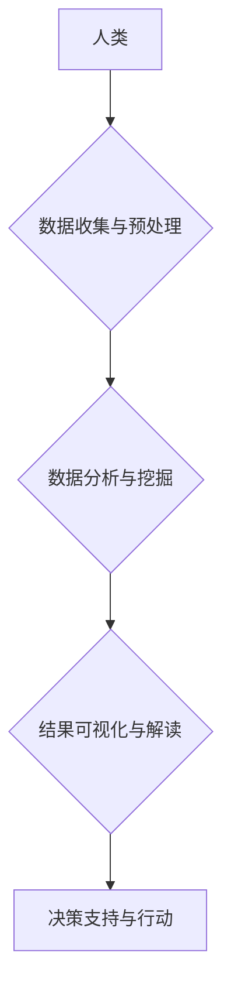

                 

## 大数据时代：人类计算的机遇与挑战

> 关键词：大数据、人类计算、人工智能、机器学习、数据挖掘、数据分析、云计算、数据可视化

> 摘要：本文探讨了大数据时代背景下人类计算的机遇与挑战。首先，介绍了大数据概念及其产生的背景，并分析了大数据对人类计算的影响。其次，阐述了人类计算的核心概念和原理，并通过流程图展示了其架构。接着，深入分析了关键算法原理和操作步骤，并结合数学模型和公式进行详细讲解。最后，通过代码实例和实际应用场景，展示了人类计算的实践应用，并展望了未来发展趋势和面临的挑战。

## 1. 背景介绍

随着互联网、移动互联网、物联网等技术的快速发展，海量数据正在以指数级增长。这些数据蕴藏着丰富的价值，但同时也带来了巨大的挑战。如何有效地收集、存储、处理和分析这些数据，成为了当今社会面临的重大课题。

1.1 大数据概念

大数据是指规模庞大、结构复杂、更新速度快、类型多样化的数据。其特点通常被概括为“五V”：

* **Volume (体积)**：数据量巨大，难以用传统方法处理。
* **Velocity (速度)**：数据生成和更新速度快，需要实时处理。
* **Variety (多样性)**：数据类型多样，包括结构化数据、非结构化数据和半结构化数据。
* **Veracity (真实性)**：数据质量参差不齐，需要进行清洗和验证。
* **Value (价值)**：数据蕴藏着巨大的价值，需要进行挖掘和分析。

1.2 大数据时代背景

大数据时代背景下，人类面临着前所未有的机遇和挑战。一方面，大数据为人类提供了 unprecedented 的洞察力和决策支持能力。通过对大数据的分析，我们可以更好地了解社会、经济、文化等各个方面，并做出更明智的决策。另一方面，大数据也带来了新的伦理、安全和隐私问题。如何保护个人隐私，防止数据滥用，成为了我们需要认真思考的问题。

## 2. 核心概念与联系

人类计算是指利用人类的智慧和能力，结合计算机技术，共同完成复杂的任务。它是一种全新的计算模式，打破了传统计算机的局限性，将人类的创造力和计算机的计算能力相结合。

2.1 人类计算的优势

* **解决复杂问题的能力:** 人类拥有强大的认知能力和创造力，能够解决传统计算机难以处理的复杂问题。
* **适应性强:** 人类能够根据实际情况灵活调整策略，适应不断变化的环境。
* **洞察力和理解力:** 人类能够从数据中发现隐藏的模式和关系，并进行深入的理解。

2.2 人类计算的架构



## 3. 核心算法原理 & 具体操作步骤

3.1 算法原理概述

人类计算的核心算法通常基于机器学习和深度学习技术。这些算法能够从海量数据中学习模式和规律，并根据学习到的知识进行预测和决策。

3.2 算法步骤详解

1. 数据收集和预处理：收集相关数据，并进行清洗、转换和格式化等预处理操作。
2. 特征提取：从原始数据中提取有用的特征，用于训练机器学习模型。
3. 模型训练：使用机器学习算法对提取的特征进行训练，学习数据中的模式和规律。
4. 模型评估：评估模型的性能，并进行调整和优化。
5. 模型部署：将训练好的模型部署到实际应用场景中，用于预测和决策。

3.3 算法优缺点

* **优点:** 能够处理复杂的数据，并发现隐藏的模式和规律。
* **缺点:** 需要大量的训练数据，训练时间较长，模型解释性较差。

3.4 算法应用领域

* **医疗诊断:** 基于患者的病史、检查结果等数据，预测疾病风险和辅助诊断。
* **金融风险管理:** 基于市场数据、客户行为等数据，预测金融风险和进行风险控制。
* **个性化推荐:** 基于用户的兴趣爱好、购买历史等数据，推荐个性化的商品和服务。

## 4. 数学模型和公式 & 详细讲解 & 举例说明

4.1 数学模型构建

人类计算的数学模型通常基于概率论、统计学和机器学习算法。例如，在机器学习中，常用的模型包括线性回归、逻辑回归、决策树、支持向量机等。

4.2 公式推导过程

例如，线性回归模型的目标是找到一条直线，使得预测值与实际值之间的误差最小。其数学公式如下：

$$
y = \beta_0 + \beta_1 x + \epsilon
$$

其中：

* $y$ 是预测值
* $x$ 是输入特征
* $\beta_0$ 和 $\beta_1$ 是模型参数
* $\epsilon$ 是误差项

通过最小二乘法，可以求解出 $\beta_0$ 和 $\beta_1$ 的最佳值。

4.3 案例分析与讲解

例如，假设我们想要预测房价，输入特征包括房屋面积、房间数量等。我们可以使用线性回归模型，根据历史房价数据训练模型，并预测新房的房价。

## 5. 项目实践：代码实例和详细解释说明

5.1 开发环境搭建

可以使用 Python 语言和相关库进行人类计算项目开发。常用的库包括 NumPy、Pandas、Scikit-learn 等。

5.2 源代码详细实现

```python
import pandas as pd
from sklearn.linear_model import LinearRegression

# 加载数据
data = pd.read_csv('house_price_data.csv')

# 提取特征和目标变量
X = data[['area', 'rooms']]
y = data['price']

# 创建线性回归模型
model = LinearRegression()

# 训练模型
model.fit(X, y)

# 预测新房的房价
new_house = pd.DataFrame({'area': [120], 'rooms': [3]})
predicted_price = model.predict(new_house)

# 打印预测结果
print(predicted_price)
```

5.3 代码解读与分析

这段代码首先加载房价数据，然后提取特征和目标变量。接着，创建线性回归模型并进行训练。最后，使用训练好的模型预测新房的房价。

5.4 运行结果展示

运行代码后，会输出新房的预测房价。

## 6. 实际应用场景

6.1 医疗诊断辅助

人类计算可以帮助医生更快、更准确地诊断疾病。例如，通过分析患者的影像数据、病史和基因信息，可以预测疾病风险和辅助诊断。

6.2 金融风险管理

人类计算可以帮助金融机构更好地管理风险。例如，通过分析市场数据、客户行为和交易记录，可以预测金融风险和进行风险控制。

6.3 个性化教育

人类计算可以帮助提供个性化的教育服务。例如，通过分析学生的学习进度、兴趣爱好和学习风格，可以定制个性化的学习计划和教学内容。

6.4 未来应用展望

随着大数据技术的不断发展，人类计算将在更多领域得到应用，例如智能制造、智慧城市、自动驾驶等。

## 7. 工具和资源推荐

7.1 学习资源推荐

* **在线课程:** Coursera、edX、Udacity 等平台提供丰富的机器学习和深度学习课程。
* **书籍:** 《深度学习》、《机器学习实战》等书籍是学习人类计算的经典教材。
* **开源项目:** TensorFlow、PyTorch 等开源项目提供了丰富的代码示例和工具。

7.2 开发工具推荐

* **Python:** 人类计算开发的常用语言。
* **Jupyter Notebook:** 用于编写和运行 Python 代码的交互式环境。
* **Scikit-learn:** Python 机器学习库。
* **TensorFlow/PyTorch:** 深度学习框架。

7.3 相关论文推荐

* **《ImageNet Classification with Deep Convolutional Neural Networks》**
* **《Attention Is All You Need》**
* **《BERT: Pre-training of Deep Bidirectional Transformers for Language Understanding》**

## 8. 总结：未来发展趋势与挑战

8.1 研究成果总结

人类计算在过去几年取得了显著进展，在医疗诊断、金融风险管理、个性化推荐等领域取得了成功应用。

8.2 未来发展趋势

* **模型更加复杂和强大:** 未来的人类计算模型将更加复杂和强大，能够处理更加复杂的数据和问题。
* **算法更加高效和智能:** 未来的人类计算算法将更加高效和智能，能够更快、更准确地完成任务。
* **应用场景更加广泛:** 未来的人类计算将应用于更多领域，例如智能制造、智慧城市、自动驾驶等。

8.3 面临的挑战

* **数据质量问题:** 大数据时代，数据质量参差不齐，需要进行有效的数据清洗和预处理。
* **模型解释性问题:** 许多机器学习模型的内部机制难以理解，需要进行更深入的研究，提高模型的解释性。
* **伦理和安全问题:** 人类计算的应用需要考虑伦理和安全问题，例如数据隐私保护、算法偏见等。

8.4 研究展望

未来，人类计算的研究将更加注重模型的解释性、鲁棒性和安全性。同时，也将更加注重人类与机器的协同工作，探索更加高效、智能的人机交互模式。

## 9. 附录：常见问题与解答

* **什么是人类计算？**

人类计算是指利用人类的智慧和能力，结合计算机技术，共同完成复杂任务的一种计算模式。

* **人类计算有哪些优势？**

人类计算能够解决传统计算机难以处理的复杂问题，具有适应性强、洞察力和理解力强等优势。

* **人类计算有哪些应用场景？**

人类计算应用于医疗诊断、金融风险管理、个性化教育等领域。


作者：禅与计算机程序设计艺术 / Zen and the Art of Computer Programming<end_of_turn>

