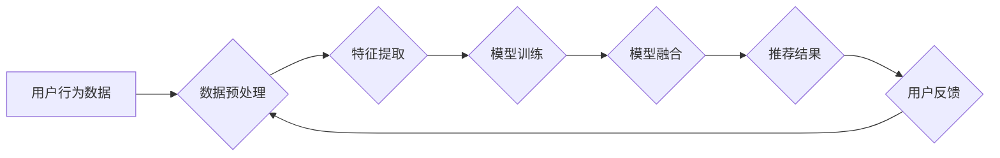

                 

## 大数据驱动的电商搜索推荐系统：AI 模型融合是核心，用户体验是重点

> 关键词：电商搜索推荐系统，大数据，AI 模型融合，用户体验，推荐算法，个性化推荐，协同过滤，内容基余，深度学习

> 摘要：随着电商平台的蓬勃发展，搜索推荐系统已成为用户获取商品信息和完成购买的重要途径。本文深入探讨了大数据驱动的电商搜索推荐系统，重点阐述了AI模型融合在提升推荐精准度和用户体验方面的关键作用。从核心概念、算法原理、数学模型、代码实例、实际应用场景等多个方面进行分析，并展望了未来发展趋势和挑战。

## 1. 背景介绍

1.1 电商平台发展现状

电子商务平台的快速发展，为消费者提供了便捷的购物体验，同时也为商家带来了巨大的商机。然而，面对海量商品和用户需求，传统的搜索方式已难以满足用户对个性化商品推荐的需求。

1.2 搜索推荐系统的核心价值

搜索推荐系统旨在通过分析用户行为、商品属性等数据，为用户提供个性化、精准的商品推荐，从而提升用户购物体验，提高转化率，促进商家销售。

1.3 AI 模型融合的趋势

随着人工智能技术的快速发展，AI模型融合已成为提升搜索推荐系统精准度的关键技术。通过结合不同的AI模型，例如协同过滤、内容基余、深度学习等，可以更好地理解用户需求，挖掘商品之间的关联性，从而提供更精准的推荐结果。

## 2. 核心概念与联系

2.1 大数据

大数据是指海量、高速度、高多样性的数据。电商平台每天产生大量的用户行为数据、商品信息数据、市场趋势数据等，这些数据蕴含着丰富的商业价值。

2.2 AI 模型

AI模型是指利用机器学习算法训练出来的模型，能够自动学习数据中的规律，并进行预测或分类。常见的AI模型包括协同过滤、内容基余、深度学习等。

2.3 模型融合

模型融合是指将多个AI模型组合在一起，利用各自的优势，共同完成推荐任务。通过模型融合，可以提高推荐系统的准确率、覆盖率和多样性。

**Mermaid 流程图**



## 3. 核心算法原理 & 具体操作步骤

3.1 算法原理概述

协同过滤、内容基余和深度学习是三种常用的电商搜索推荐算法。

* **协同过滤:** 基于用户对商品的评分或购买行为，预测用户对其他商品的兴趣。
* **内容基余:** 基于商品的属性和描述，推荐与用户兴趣相符的商品。
* **深度学习:** 利用神经网络模型，学习用户和商品之间的复杂关系，进行更精准的推荐。

3.2 算法步骤详解

**协同过滤:**

1. 收集用户对商品的评分或购买行为数据。
2. 计算用户之间的相似度，以及商品之间的相似度。
3. 基于用户相似度，推荐与相似用户喜欢的商品。
4. 基于商品相似度，推荐与相似商品相关的商品。

**内容基余:**

1. 提取商品的属性和描述信息。
2. 将商品属性和描述信息转换为向量表示。
3. 计算用户兴趣向量和商品向量之间的相似度。
4. 推荐与用户兴趣向量相似度高的商品。

**深度学习:**

1. 构建深度神经网络模型，例如用户-商品交互网络、协同嵌入网络等。
2. 利用用户行为数据和商品信息数据训练模型。
3. 利用训练好的模型，预测用户对商品的兴趣。

3.3 算法优缺点

| 算法 | 优点 | 缺点 |
|---|---|---|
| 协同过滤 | 能够发现用户隐性需求，推荐个性化商品 | 需要大量用户行为数据，容易陷入冷启动问题 |
| 内容基余 | 不需要用户行为数据，能够推荐与用户兴趣相符的商品 | 难以捕捉用户隐性需求，推荐结果可能过于单一 |
| 深度学习 | 能够学习用户和商品之间的复杂关系，推荐精准度高 | 需要大量数据和计算资源，模型训练复杂 |

3.4 算法应用领域

协同过滤、内容基余和深度学习在电商搜索推荐系统中广泛应用，例如：

* **商品推荐:** 根据用户的浏览历史、购买记录等数据，推荐用户可能感兴趣的商品。
* **个性化搜索:** 根据用户的搜索历史、偏好设置等数据，优化搜索结果，提供更精准的商品信息。
* **新品推荐:** 根据新品的属性和描述信息，推荐给潜在用户。
* **促销活动推荐:** 根据用户的消费习惯和促销活动信息，推荐相关的促销活动。

## 4. 数学模型和公式 & 详细讲解 & 举例说明

4.1 数学模型构建

协同过滤算法通常使用矩阵分解模型，将用户-商品交互矩阵分解成两个低维矩阵，分别表示用户特征和商品特征。

**用户-商品交互矩阵:**

$$
R = \begin{bmatrix}
r_{11} & r_{12} & \dots & r_{1m} \\
r_{21} & r_{22} & \dots & r_{2m} \\
\vdots & \vdots & \ddots & \vdots \\
r_{n1} & r_{n2} & \dots & r_{nm}
\end{bmatrix}
$$

其中，$r_{ij}$表示用户$i$对商品$j$的评分或购买行为。

**用户特征矩阵:**

$$
P = \begin{bmatrix}
p_{11} & p_{12} & \dots & p_{1k} \\
p_{21} & p_{22} & \dots & p_{2k} \\
\vdots & \vdots & \ddots & \vdots \\
p_{n1} & p_{n2} & \dots & p_{nk}
\end{bmatrix}
$$

**商品特征矩阵:**

$$
Q = \begin{bmatrix}
q_{11} & q_{12} & \dots & q_{1k} \\
q_{21} & q_{22} & \dots & q_{2k} \\
\vdots & \vdots & \ddots & \vdots \\
q_{m1} & q_{m2} & \dots & q_{mk}
\end{bmatrix}
$$

其中，$p_{ij}$表示用户$i$的第$j$个特征，$q_{ij}$表示商品$j$的第$i$个特征。

4.2 公式推导过程

目标是找到最优的用户特征矩阵$P$和商品特征矩阵$Q$，使得预测的评分与实际评分之间的误差最小。

常用的损失函数是均方误差：

$$
Loss = \frac{1}{2} \sum_{i=1}^{n} \sum_{j=1}^{m} (r_{ij} - \hat{r}_{ij})^2
$$

其中，$\hat{r}_{ij}$是预测的评分，$r_{ij}$是实际评分。

通过梯度下降算法，可以迭代更新$P$和$Q$，使得损失函数最小化。

4.3 案例分析与讲解

假设有一个用户-商品交互矩阵，其中$r_{ij}$表示用户$i$对商品$j$的评分。

可以使用矩阵分解模型将这个矩阵分解成用户特征矩阵$P$和商品特征矩阵$Q$。

然后，可以利用训练好的模型，预测用户对新商品的评分。

## 5. 项目实践：代码实例和详细解释说明

5.1 开发环境搭建

* Python 3.x
* TensorFlow/PyTorch
* Scikit-learn

5.2 源代码详细实现

```python
import tensorflow as tf

# 定义模型
class RecommenderModel(tf.keras.Model):
    def __init__(self, num_users, num_items, embedding_dim):
        super(RecommenderModel, self).__init__()
        self.user_embedding = tf.keras.layers.Embedding(num_users, embedding_dim)
        self.item_embedding = tf.keras.layers.Embedding(num_items, embedding_dim)

    def call(self, user_ids, item_ids):
        user_embeddings = self.user_embedding(user_ids)
        item_embeddings = self.item_embedding(item_ids)
        return tf.reduce_sum(user_embeddings * item_embeddings, axis=1)

# 训练模型
model = RecommenderModel(num_users=1000, num_items=10000, embedding_dim=64)
model.compile(optimizer='adam', loss='mse')
model.fit(user_ids, item_ids, epochs=10)

# 预测评分
predictions = model.predict(user_ids, item_ids)
```

5.3 代码解读与分析

* 定义了一个推荐模型类`RecommenderModel`，包含用户嵌入层和商品嵌入层。
* 使用`Embedding`层将用户ID和商品ID映射到低维向量空间。
* 使用`tf.reduce_sum`计算用户嵌入向量和商品嵌入向量的点积，得到预测评分。
* 使用`adam`优化器和均方误差损失函数训练模型。
* 使用训练好的模型预测用户对商品的评分。

5.4 运行结果展示

训练完成后，可以使用预测评分来推荐商品。

## 6. 实际应用场景

6.1 电商平台商品推荐

* 基于用户的浏览历史、购买记录等数据，推荐用户可能感兴趣的商品。
* 根据用户的兴趣偏好，推荐个性化的商品组合。
* 推广新品和限时促销商品。

6.2 搜索引擎结果优化

* 根据用户的搜索关键词和历史搜索记录，优化搜索结果排名。
* 推荐与用户搜索意图相关的商品和信息。
* 提供个性化的搜索建议。

6.3 内容平台推荐

* 基于用户的阅读历史、点赞记录等数据，推荐用户可能感兴趣的文章、视频等内容。
* 根据用户的兴趣偏好，推荐个性化的内容订阅。
* 推广优质内容和新兴话题。

6.4 未来应用展望

* 结合多模态数据，例如文本、图像、视频等，进行更精准的推荐。
* 利用强化学习算法，优化推荐策略，提高用户体验。
* 开发更个性化、更智能的推荐系统，满足用户多样化的需求。

## 7. 工具和资源推荐

7.1 学习资源推荐

* **书籍:**
    * 《推荐系统实践》
    * 《深度学习》
* **在线课程:**
    * Coursera: Recommender Systems
    * Udacity: Deep Learning Nanodegree
* **博客和论坛:**
    * Recommender Systems Blog
    * Stack Overflow

7.2 开发工具推荐

* **Python:** 
    * TensorFlow
    * PyTorch
    * Scikit-learn
* **数据库:**
    * MySQL
    * MongoDB

7.3 相关论文推荐

* **协同过滤:**
    * "Collaborative Filtering: A User-Based Approach"
* **内容基余:**
    * "Content-Based Recommendation Systems"
* **深度学习:**
    * "Neural Collaborative Filtering"

## 8. 总结：未来发展趋势与挑战

8.1 研究成果总结

大数据驱动的电商搜索推荐系统已取得了显著成果，AI模型融合技术在提升推荐精准度和用户体验方面发挥了重要作用。

8.2 未来发展趋势

* **多模态推荐:** 结合文本、图像、视频等多模态数据，进行更精准的推荐。
* **个性化推荐:** 利用用户行为数据和偏好设置，提供更个性化的推荐服务。
* **解释性推荐:** 解释推荐结果背后的逻辑，提高用户信任度。
* **联邦学习:** 保护用户隐私，实现安全可靠的推荐系统。

8.3 面临的挑战

* **数据质量:** 大数据中的噪声和不完整性会影响推荐结果的准确性。
* **冷启动问题:** 新用户和新商品缺乏历史数据，难以进行有效推荐。
* **用户隐私:** 如何保护用户隐私，是推荐系统面临的重要挑战。
* **算法可解释性:** 提升推荐算法的可解释性，帮助用户理解推荐结果背后的逻辑。

8.4 研究展望

未来，大数据驱动的电商搜索推荐系统将朝着更智能、更个性化、更安全的方向发展。

## 9. 附录：常见问题与解答

* **Q1: 如何解决冷启动问题？**

* **A1:** 可以利用用户提供的基本信息，例如年龄、性别、兴趣爱好等，进行初始推荐。也可以利用商品的属性和描述信息，进行基于内容的推荐。

* **Q2: 如何评估推荐系统的性能？**

* **A2:** 常用的评估指标包括准确率、召回率、覆盖率、多样性等。

* **Q3: 如何保护用户隐私？**

* **A3:** 可以采用数据脱敏、联邦学习等技术，保护用户隐私。


作者：禅与计算机程序设计艺术 / Zen and the Art of Computer Programming<end_of_turn>

