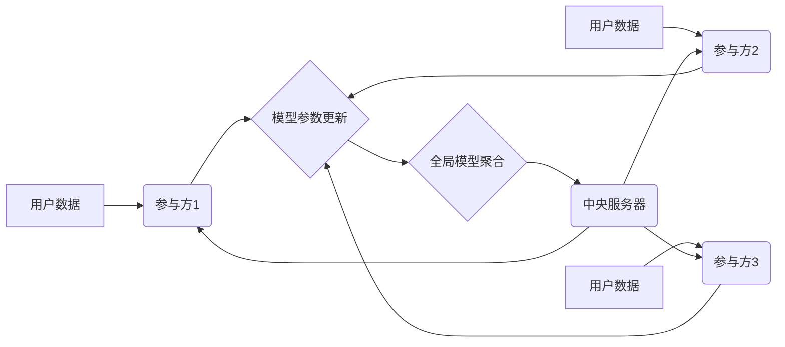

                 

## 大模型在推荐系统中的联邦学习应用

> 关键词：联邦学习、大模型、推荐系统、数据隐私、模型训练

## 1. 背景介绍

推荐系统作为互联网时代的重要组成部分，在电商、社交媒体、视频平台等领域发挥着至关重要的作用。其核心目标是根据用户的历史行为、偏好等信息，预测用户对特定商品、内容或服务感兴趣，并提供个性化的推荐。传统推荐系统通常依赖于集中式的数据存储和模型训练，这带来了数据隐私泄露、数据安全和数据垄断等问题。

近年来，随着大模型的兴起，其强大的学习能力和泛化能力为推荐系统带来了新的机遇。然而，大模型的训练需要海量数据，而用户数据往往分散在不同的机构或平台，难以集中起来进行训练。联邦学习作为一种分布式机器学习方法，能够在不共享原始数据的情况下，通过模型参数的迭代更新，实现模型的联合训练，从而有效解决数据隐私问题。

## 2. 核心概念与联系

### 2.1 联邦学习概述

联邦学习是一种分布式机器学习方法，它允许多个参与方在不共享原始数据的情况下，共同训练一个全局模型。其工作原理是：

1. **模型初始化:**  一个初始模型由中央服务器初始化，并分发给各个参与方。
2. **本地训练:** 每个参与方在本地数据上训练模型，并根据训练结果更新模型参数。
3. **模型参数聚合:** 每个参与方将更新后的模型参数发送回中央服务器，服务器将这些参数进行聚合，得到一个新的全局模型。
4. **模型更新:** 新的全局模型被分发给各个参与方，重复上述步骤，直到模型收敛。

### 2.2 推荐系统与联邦学习的结合

将联邦学习应用于推荐系统，可以有效解决数据隐私问题，同时利用各个参与方的本地数据，提升模型的训练效果。

**推荐系统联邦学习架构:**



## 3. 核心算法原理 & 具体操作步骤

### 3.1 算法原理概述

联邦学习在推荐系统中常用的算法包括：

* **梯度下降法:** 这是最常用的优化算法，通过迭代更新模型参数，最小化损失函数。
* **随机梯度下降法:**  为了加速训练速度，随机梯度下降法只使用一小部分数据进行梯度计算。
* **小批量梯度下降法:**  介于梯度下降法和随机梯度下降法之间，使用一部分数据进行梯度计算，可以平衡训练速度和精度。

### 3.2 算法步骤详解

1. **数据预处理:**  每个参与方对本地数据进行预处理，例如特征工程、数据清洗等。
2. **模型初始化:**  中央服务器初始化一个全局模型，并将其分发给各个参与方。
3. **本地训练:**  每个参与方在本地数据上训练模型，并根据训练结果更新模型参数。
4. **模型参数聚合:**  每个参与方将更新后的模型参数发送回中央服务器，服务器将这些参数进行聚合，得到一个新的全局模型。
5. **模型更新:**  新的全局模型被分发给各个参与方，重复上述步骤，直到模型收敛。

### 3.3 算法优缺点

**优点:**

* **数据隐私保护:**  用户数据在本地进行训练，不会被共享，有效保护用户隐私。
* **数据安全:**  数据不会集中存储，降低了数据泄露的风险。
* **模型性能提升:**  利用各个参与方的本地数据，可以训练出更准确的模型。

**缺点:**

* **通信成本:**  模型参数的传输需要消耗网络带宽和计算资源。
* **模型不一致性:**  由于各个参与方的本地数据分布不同，模型参数更新可能存在不一致性。
* **训练效率:**  联邦学习的训练速度通常比集中式训练慢。

### 3.4 算法应用领域

联邦学习在推荐系统领域具有广泛的应用前景，例如：

* **个性化推荐:**  根据用户的兴趣和行为，提供个性化的商品、内容或服务推荐。
* **精准营销:**  根据用户的特征和行为，进行精准的广告投放。
* **内容推荐:**  根据用户的阅读历史和偏好，推荐相关的文章、视频或音频内容。

## 4. 数学模型和公式 & 详细讲解 & 举例说明

### 4.1 数学模型构建

在联邦学习中，推荐系统的目标是学习一个映射函数 $f(x, \theta)$，其中 $x$ 是用户的特征向量，$\theta$ 是模型参数。该函数将用户的特征映射到推荐列表中，每个元素代表一个候选项的推荐分数。

损失函数 $L(\theta, D)$ 用于衡量模型的预测结果与真实标签之间的差异，其中 $D$ 是训练数据。

### 4.2 公式推导过程

联邦学习的目标是通过迭代更新模型参数 $\theta$，最小化损失函数 $L(\theta, D)$。

1. **梯度下降法:**

$$
\theta_{t+1} = \theta_t - \eta \nabla_{\theta} L(\theta_t, D_t)
$$

其中：

* $\theta_t$ 是第 $t$ 次迭代的模型参数。
* $\eta$ 是学习率。
* $\nabla_{\theta} L(\theta_t, D_t)$ 是损失函数 $L(\theta_t, D_t)$ 对模型参数 $\theta_t$ 的梯度。

2. **模型参数聚合:**

$$
\theta_{t+1} = \frac{1}{N} \sum_{i=1}^{N} \theta_{i,t+1}
$$

其中：

* $N$ 是参与方的数量。
* $\theta_{i,t+1}$ 是第 $i$ 个参与方在第 $t+1$ 次迭代的模型参数。

### 4.3 案例分析与讲解

假设有两个参与方，分别拥有用户数据 $D_1$ 和 $D_2$。

1. 中央服务器初始化一个全局模型 $\theta_0$，并将其分发给两个参与方。
2. 每个参与方在本地数据上训练模型，并更新模型参数 $\theta_{1,1}$ 和 $\theta_{2,1}$。
3. 两个参与方将更新后的模型参数发送回中央服务器。
4. 中央服务器将两个参与方的模型参数进行聚合，得到新的全局模型 $\theta_1$。
5. 新的全局模型 $\theta_1$ 被分发给两个参与方，重复上述步骤，直到模型收敛。

## 5. 项目实践：代码实例和详细解释说明

### 5.1 开发环境搭建

* Python 3.7+
* TensorFlow 2.0+
* PyTorch 1.0+
* Kubernetes 或 Docker

### 5.2 源代码详细实现

```python
# 参与方代码示例
import tensorflow as tf

# 模型定义
model = tf.keras.Sequential([
    tf.keras.layers.Dense(64, activation='relu'),
    tf.keras.layers.Dense(10, activation='softmax')
])

# 训练模型
def train_model(model, data):
    # ... 训练模型代码 ...

# 更新模型参数
def update_model_parameters(model, data):
    # ... 更新模型参数代码 ...

# 发送模型参数
def send_model_parameters(parameters):
    # ... 发送模型参数代码 ...

# 接收模型参数
def receive_model_parameters(parameters):
    # ... 接收模型参数代码 ...

# 中央服务器代码示例
import tensorflow as tf

# 模型定义
model = tf.keras.Sequential([
    tf.keras.layers.Dense(64, activation='relu'),
    tf.keras.layers.Dense(10, activation='softmax')
])

# 聚合模型参数
def aggregate_model_parameters(parameters):
    # ... 聚合模型参数代码 ...

# 分发模型参数
def distribute_model_parameters(parameters):
    # ... 分发模型参数代码 ...
```

### 5.3 代码解读与分析

* 参与方代码负责在本地数据上训练模型，更新模型参数，并发送和接收模型参数。
* 中央服务器代码负责聚合模型参数，并将其分发给各个参与方。

### 5.4 运行结果展示

运行结果展示包括模型的训练精度、收敛速度、通信成本等指标。

## 6. 实际应用场景

### 6.1 电商推荐

* 利用用户购买历史、浏览记录、购物车内容等数据，推荐个性化的商品。
* 针对不同用户群体，提供精准的商品推荐，提高转化率。

### 6.2 内容推荐

* 根据用户的阅读历史、点赞记录、评论内容等数据，推荐相关的文章、视频、音频等内容。
* 提升用户粘性，增加内容消费时长。

### 6.3 广告推荐

* 根据用户的兴趣爱好、行为特征等数据，精准投放广告，提高广告点击率和转化率。
* 降低广告成本，提升广告效果。

### 6.4 未来应用展望

* **跨机构联邦学习:**  将多个机构的数据进行联合训练，提升模型的泛化能力。
* **联邦迁移学习:**  利用预训练模型，在数据有限的场景下进行模型训练。
* **联邦强化学习:**  利用强化学习算法，训练更智能的推荐系统。

## 7. 工具和资源推荐

### 7.1 学习资源推荐

* **论文:**  
    * "Federated Learning: Strategies for Improving Communication Efficiency"
    * "Communication-Efficient Learning of Deep Networks from Decentralized Data"
* **书籍:**  
    * "Deep Learning with Python"
    * "Hands-On Machine Learning with Scikit-Learn, Keras & TensorFlow"
* **在线课程:**  
    * Coursera: "Machine Learning"
    * edX: "Deep Learning"

### 7.2 开发工具推荐

* **TensorFlow Federated:**  Google 开发的联邦学习框架。
* **PySyft:**  OpenMined 开发的联邦学习框架。
* **Flower:**  Hugging Face 开发的联邦学习框架。

### 7.3 相关论文推荐

* "Federated Learning: Collaborative Machine Learning Without Centralized Training Data"
* "Federated Learning for Mobile Devices"
* "Privacy-Preserving Machine Learning with Federated Learning"

## 8. 总结：未来发展趋势与挑战

### 8.1 研究成果总结

联邦学习在推荐系统领域取得了显著的成果，有效解决了数据隐私问题，提升了模型的训练效果。

### 8.2 未来发展趋势

* **模型效率提升:**  研究更有效的联邦学习算法，降低通信成本和训练时间。
* **隐私保护增强:**  探索更强大的隐私保护机制，确保用户数据的安全。
* **应用场景拓展:**  将联邦学习应用到更多推荐系统场景，例如个性化教育、医疗保健等。

### 8.3 面临的挑战

* **数据异构性:**  不同参与方的本地数据分布可能存在差异，导致模型训练效果不佳。
* **模型不一致性:**  由于模型参数的聚合过程，模型可能存在不一致性问题。
* **安全性和可靠性:**  联邦学习系统需要保证安全性和可靠性，防止恶意攻击和数据泄露。

### 8.4 研究展望

未来研究将重点关注以下几个方面:

* **解决数据异构性问题:**  研究数据预处理和模型训练方法，有效应对数据异构性问题。
* **提升模型一致性:**  研究模型参数聚合算法，提高模型的一致性。
* **增强隐私保护:**  探索更强大的隐私保护机制，确保用户数据的安全。


## 9. 附录：常见问题与解答

**Q1: 联邦学习与集中式训练相比，有哪些优势和劣势？**

**A1:** 

* **优势:**  
    * 数据隐私保护
    * 数据安全
    * 模型性能提升
* **劣势:**  
    * 通信成本
    * 模型不一致性
    * 训练效率

**Q2: 联邦学习的应用场景有哪些？**

**A2:**  

* 电商推荐
* 内容推荐
* 广告推荐
* 个性化教育
* 医疗保健

**Q3: 如何选择合适的联邦学习框架？**

**A3:**  

* TensorFlow Federated
* PySyft
* Flower

选择框架时需要考虑项目需求、团队经验、生态系统等因素。


作者：禅与计算机程序设计艺术 / Zen and the Art of Computer Programming 
<end_of_turn>

