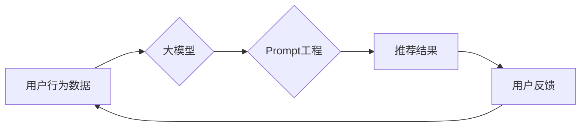

                 

## 大模型推荐中的Prompt工程与效果评估

> 关键词：大模型、Prompt工程、推荐系统、效果评估、自然语言处理、机器学习

## 1. 背景介绍

近年来，大模型在自然语言处理 (NLP) 领域取得了显著进展，展现出强大的文本生成、理解和推理能力。这些模型的涌现为推荐系统带来了新的机遇，可以提升推荐的精准度、个性化程度和用户体验。然而，大模型的强大能力也带来了新的挑战，其中之一就是如何有效地与大模型进行交互，即Prompt工程。

传统的推荐系统主要依赖于用户行为数据和商品特征进行建模，而大模型则可以利用文本语义信息，更深入地理解用户的需求和偏好。例如，用户在搜索框中输入的关键词不仅包含商品信息，也蕴含着用户的意图和情感，大模型可以捕捉这些细微的语义信息，为用户提供更精准的推荐。

然而，大模型的输入必须是精心设计的Prompt，Prompt的质量直接影响着推荐效果。一个好的Prompt能够引导大模型准确理解用户的需求，并生成高质量的推荐结果。反之，一个糟糕的Prompt会导致大模型产生错误的理解，从而导致推荐结果不准确甚至有害。

## 2. 核心概念与联系

### 2.1 Prompt工程

Prompt工程是指设计、优化和评估与大模型交互的文本输入，以引导模型生成期望的输出。它是一个跨学科领域，涉及自然语言处理、机器学习、用户体验等多个方面。

### 2.2 推荐系统

推荐系统旨在根据用户的历史行为、偏好和上下文信息，预测用户对特定商品或内容的兴趣，并提供个性化的推荐。

### 2.3 核心概念关系

大模型、Prompt工程和推荐系统之间存在着密切的联系。大模型为推荐系统提供了强大的文本理解和生成能力，而Prompt工程则是连接两者之间的关键桥梁。

**Mermaid 流程图**



## 3. 核心算法原理 & 具体操作步骤

### 3.1 算法原理概述

大模型推荐系统通常采用以下核心算法原理：

* **文本嵌入:** 将用户输入的文本信息转化为向量表示，以便大模型理解。常用的文本嵌入方法包括Word2Vec、GloVe和BERT等。
* **注意力机制:** 允许大模型关注输入文本中与推荐任务相关的关键信息，提高推荐的精准度。
* **序列到序列模型:** 用于生成推荐列表，将用户输入的文本信息映射到一系列推荐商品或内容。常见的序列到序列模型包括RNN、LSTM和Transformer等。

### 3.2 算法步骤详解

1. **数据预处理:** 收集用户行为数据、商品信息和文本评论等数据，并进行清洗、格式化和文本嵌入。
2. **Prompt设计:** 根据推荐任务和用户输入，设计合适的Prompt，引导大模型理解用户的需求。
3. **模型训练:** 使用训练数据训练大模型，优化模型参数，使其能够准确生成推荐结果。
4. **推荐生成:** 将用户输入的文本信息作为Prompt输入到训练好的大模型中，模型根据Prompt生成推荐列表。
5. **效果评估:** 使用评估指标，例如点击率 (CTR)、转化率 (CVR) 和用户满意度等，评估推荐系统的性能。

### 3.3 算法优缺点

**优点:**

* 能够利用文本语义信息，提升推荐的精准度和个性化程度。
* 可以处理更复杂的推荐任务，例如个性化内容推荐和情感分析驱动的推荐。

**缺点:**

* 需要设计高质量的Prompt，否则会导致推荐结果不准确。
* 大模型训练成本高，需要大量的计算资源和数据。

### 3.4 算法应用领域

* **电商推荐:** 为用户推荐个性化的商品。
* **内容推荐:** 为用户推荐个性化的文章、视频和音乐等内容。
* **社交推荐:** 为用户推荐新的朋友和兴趣小组。
* **广告推荐:** 为用户推荐相关的广告。

## 4. 数学模型和公式 & 详细讲解 & 举例说明

### 4.1 数学模型构建

大模型推荐系统通常采用基于Transformer的序列到序列模型，其数学模型可以表示为：

$$
\mathbf{y} = f_{\theta}(\mathbf{x}, \mathbf{p})
$$

其中：

* $\mathbf{y}$ 是推荐列表。
* $\mathbf{x}$ 是用户输入的文本信息。
* $\mathbf{p}$ 是Prompt向量。
* $f_{\theta}$ 是由参数 $\theta$ 决定的Transformer模型。

### 4.2 公式推导过程

Transformer模型的核心是注意力机制，其计算公式如下：

$$
\mathbf{Attention}(\mathbf{Q}, \mathbf{K}, \mathbf{V}) = \frac{\exp(\mathbf{Q} \mathbf{K}^T / \sqrt{d_k})}{\sum_j \exp(\mathbf{Q} \mathbf{K}^T / \sqrt{d_k})} \mathbf{V}
$$

其中：

* $\mathbf{Q}$, $\mathbf{K}$ 和 $\mathbf{V}$ 分别是查询矩阵、键矩阵和值矩阵。
* $d_k$ 是键向量的维度。

注意力机制可以帮助模型关注输入文本中与推荐任务相关的关键信息，从而提高推荐的精准度。

### 4.3 案例分析与讲解

假设用户输入的文本信息是“我想买一件舒适的T恤”，Prompt向量是“舒适T恤”。

Transformer模型会首先将用户输入的文本信息和Prompt向量进行嵌入，然后使用注意力机制计算每个词与Prompt向量的相关性。

模型会关注“舒适”和“T恤”这两个关键词，并根据这些关键词的语义信息，从商品数据库中检索出符合用户需求的T恤商品，并生成推荐列表。

## 5. 项目实践：代码实例和详细解释说明

### 5.1 开发环境搭建

推荐系统开发环境通常包括以下软件：

* Python 3.x
* TensorFlow 或 PyTorch
* NLTK 或 spaCy 等自然语言处理库
* Scikit-learn 或 XGBoost 等机器学习库

### 5.2 源代码详细实现

以下是一个使用TensorFlow构建简单大模型推荐系统的代码示例：

```python
import tensorflow as tf

# 定义Transformer模型
class Transformer(tf.keras.Model):
    def __init__(self, vocab_size, embedding_dim, num_heads, num_layers):
        super(Transformer, self).__init__()
        self.embedding = tf.keras.layers.Embedding(vocab_size, embedding_dim)
        self.transformer_layers = tf.keras.layers.StackedRNNCells([tf.keras.layers.MultiHeadAttention(num_heads=num_heads) for _ in range(num_layers)])

    def call(self, inputs):
        embedded = self.embedding(inputs)
        output = self.transformer_layers(embedded)
        return output

# 构建模型实例
vocab_size = 10000
embedding_dim = 128
num_heads = 8
num_layers = 6
model = Transformer(vocab_size, embedding_dim, num_heads, num_layers)

# 训练模型
# ...

# 生成推荐列表
user_input = tf.constant(["我想买一件舒适的T恤"])
recommendations = model(user_input)
```

### 5.3 代码解读与分析

* 代码首先定义了一个Transformer模型，包含嵌入层和多头注意力机制层。
* 然后构建模型实例，并进行训练。
* 最后，使用用户输入的文本信息作为输入，生成推荐列表。

### 5.4 运行结果展示

运行结果将是一个包含推荐商品的列表，例如：

```
[“舒适T恤1”， “舒适T恤2”， “舒适T恤3”]
```

## 6. 实际应用场景

### 6.1 电商推荐

大模型推荐系统可以为电商平台用户提供个性化的商品推荐，例如根据用户的浏览历史、购买记录和搜索关键词，推荐相关的商品。

### 6.2 内容推荐

大模型推荐系统可以为新闻网站、视频平台和音乐平台用户提供个性化的内容推荐，例如根据用户的阅读习惯、观看历史和听歌偏好，推荐相关的文章、视频和音乐。

### 6.3 社交推荐

大模型推荐系统可以为社交平台用户提供个性化的朋友和兴趣小组推荐，例如根据用户的社交关系、兴趣爱好和行为模式，推荐新的朋友和兴趣小组。

### 6.4 未来应用展望

大模型推荐系统在未来将有更广泛的应用场景，例如：

* **医疗推荐:** 为患者推荐合适的医生、医院和治疗方案。
* **教育推荐:** 为学生推荐合适的课程、学习资源和导师。
* **金融推荐:** 为用户推荐合适的投资产品和理财方案。

## 7. 工具和资源推荐

### 7.1 学习资源推荐

* **书籍:**
    * 《深度学习》
    * 《自然语言处理》
    * 《Transformer模型》
* **在线课程:**
    * Coursera: 深度学习
    * edX: 自然语言处理
    * fast.ai: 深度学习

### 7.2 开发工具推荐

* **TensorFlow:** 开源深度学习框架
* **PyTorch:** 开源深度学习框架
* **HuggingFace:** 提供预训练大模型和工具

### 7.3 相关论文推荐

* 《Attention Is All You Need》
* 《BERT: Pre-training of Deep Bidirectional Transformers for Language Understanding》
* 《GPT-3: Language Models are Few-Shot Learners》

## 8. 总结：未来发展趋势与挑战

### 8.1 研究成果总结

大模型推荐系统在提升推荐精准度和个性化程度方面取得了显著进展，为用户提供更优质的推荐体验。

### 8.2 未来发展趋势

* **模型规模和能力的提升:** 大模型将继续朝着更大的规模和更强的能力发展，能够处理更复杂的任务和更丰富的文本信息。
* **多模态推荐:** 将文本信息与其他模态信息，例如图像、音频和视频，进行融合，实现更全面的用户理解和推荐。
* **可解释性增强:** 研究如何提高大模型推荐系统的可解释性，帮助用户理解推荐结果背后的逻辑。

### 8.3 面临的挑战

* **数据隐私和安全:** 大模型训练需要大量用户数据，如何保护用户隐私和数据安全是一个重要的挑战。
* **模型偏见和公平性:** 大模型可能会学习到数据中的偏见，导致推荐结果不公平。如何 mitigating 模型偏见是一个重要的研究方向。
* **计算资源和成本:** 大模型训练需要大量的计算资源和时间，成本较高。如何降低训练成本是一个重要的技术挑战。

### 8.4 研究展望

未来，大模型推荐系统将继续朝着更智能、更个性化、更可解释的方向发展，为用户提供更精准、更丰富的推荐体验。


## 9. 附录：常见问题与解答

### 9.1 如何设计高质量的Prompt？

* 明确推荐任务和用户需求。
* 使用简洁、准确的语言描述用户需求。
* 提供足够的上下文信息，帮助大模型理解用户意图。
* 尝试不同的Prompt结构和参数，进行A/B测试，选择效果最好的Prompt。

### 9.2 如何评估大模型推荐系统的性能？

常用的评估指标包括：

* 点击率 (CTR): 用户点击推荐结果的比例。
* 转化率 (CVR): 用户完成目标操作 (例如购买商品) 的比例。
* 用户满意度: 用户对推荐结果的满意程度。

### 9.3 大模型推荐系统有哪些伦理问题？

* 数据隐私和安全: 大模型训练需要大量用户数据，如何保护用户隐私和数据安全是一个重要的伦理问题。
* 模型偏见和公平性: 大模型可能会学习到数据中的偏见，导致推荐结果不公平。如何 mitigating 模型偏见是一个重要的伦理问题。
* 透明度和可解释性: 大模型的决策过程往往是复杂的，难以理解。如何提高大模型推荐系统的透明度和可解释性是一个重要的伦理问题。

作者：禅与计算机程序设计艺术 / Zen and the Art of Computer Programming 


<end_of_turn>

