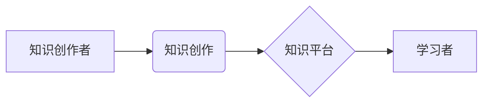

                 

## 如何利用知识付费实现被动收入

> 关键词：知识付费,被动收入,在线教育,数字产品,内容创作,技术博客

> 摘要：本文将深入探讨知识付费模式，分析其在技术领域实现被动收入的潜力。我们将从核心概念、算法原理、项目实践、应用场景等多个角度进行阐述，并结合实际案例，为技术人员提供构建知识付费体系的实用指南。

## 1. 背景介绍

随着互联网的普及和信息时代的到来，知识已成为最宝贵的资源之一。传统教育模式的局限性逐渐显现，人们对个性化、碎片化、高效的学习方式需求日益增长。知识付费模式应运而生，它以知识为核心，通过线上平台提供付费学习内容，为知识创作者和学习者创造双赢局面。

技术领域作为知识密集型行业，拥有丰富的知识资源和专业人才。技术人员可以通过知识付费模式将自身的技术经验、技能和洞察力转化为可持续的收入来源，实现被动收入的目标。

## 2. 核心概念与联系

知识付费模式的核心在于将知识商品化，通过线上平台进行交易。其主要环节包括：

* **知识创作者:** 拥有专业知识和技能的技术人员，负责创作和提供付费学习内容。
* **知识平台:** 提供知识交易的线上平台，例如在线课程平台、技术博客、知识库等。
* **学习者:** 寻求知识提升和技能学习的用户，通过付费获取知识内容。

**知识付费模式架构图**



## 3. 核心算法原理 & 具体操作步骤

知识付费模式的核心算法原理在于内容推荐和用户匹配。通过分析用户学习行为、兴趣偏好和知识需求，推荐合适的学习内容，提高用户学习体验和付费意愿。

### 3.1  算法原理概述

常用的算法包括：

* **协同过滤:** 基于用户历史行为和相似用户推荐内容。
* **内容过滤:** 基于内容标签、关键词和主题推荐相关内容。
* **深度学习:** 利用神经网络模型分析用户行为和内容特征，进行精准推荐。

### 3.2  算法步骤详解

1. **数据收集:** 收集用户学习行为、兴趣偏好、知识需求等数据。
2. **数据预处理:** 对数据进行清洗、转换和特征提取。
3. **模型训练:** 利用机器学习算法训练推荐模型。
4. **内容推荐:** 根据用户特征和模型预测，推荐合适的学习内容。
5. **效果评估:** 评估推荐效果，不断优化模型参数和算法策略。

### 3.3  算法优缺点

**优点:**

* **精准推荐:** 提高用户学习体验和付费意愿。
* **个性化学习:** 满足不同用户个性化学习需求。
* **内容发现:** 帮助用户发现新知识和学习资源。

**缺点:**

* **数据依赖:** 需要大量用户数据进行训练和优化。
* **冷启动问题:** 新用户和新内容难以进行精准推荐。
* **算法偏差:** 模型可能存在偏见，导致推荐结果不公平。

### 3.4  算法应用领域

* **在线教育平台:** 推荐课程、学习资源和学习路径。
* **技术博客:** 推荐相关文章、技术文档和学习资料。
* **知识库:** 推荐相关知识点、案例和解决方案。

## 4. 数学模型和公式 & 详细讲解 & 举例说明

知识推荐算法通常基于概率模型，例如贝叶斯网络和马尔可夫链。

### 4.1  数学模型构建

**贝叶斯网络:**

贝叶斯网络是一种概率图模型，用于表示随机变量之间的依赖关系。在知识推荐中，可以构建一个贝叶斯网络，其中节点代表用户、内容、标签等实体，边代表实体之间的依赖关系。

**马尔可夫链:**

马尔可夫链是一种统计模型，用于描述时间序列数据。在知识推荐中，可以构建一个马尔可夫链，其中状态代表用户当前学习的内容，转移概率代表用户从一个内容跳转到另一个内容的概率。

### 4.2  公式推导过程

**贝叶斯公式:**

$$P(A|B) = \frac{P(B|A)P(A)}{P(B)}$$

其中:

* $P(A|B)$ 是在已知事件 B 发生的情况下，事件 A 发生的概率。
* $P(B|A)$ 是在已知事件 A 发生的情况下，事件 B 发生的概率。
* $P(A)$ 是事件 A 发生的概率。
* $P(B)$ 是事件 B 发生的概率。

**马尔可夫链转移概率:**

$$P(X_t = j | X_{t-1} = i) = \alpha_{ij}$$

其中:

* $X_t$ 是时间 t 的状态。
* $X_{t-1}$ 是时间 t-1 的状态。
* $\alpha_{ij}$ 是从状态 i 转移到状态 j 的转移概率。

### 4.3  案例分析与讲解

**案例:** 假设有一个在线教育平台，用户 A 学习了 Python 课程，平台根据贝叶斯网络模型预测，用户 A 可能对机器学习课程感兴趣。

**分析:**

* 用户 A 学习 Python 课程，表明用户 A 对编程语言感兴趣。
* 机器学习课程依赖于 Python 编程基础，因此用户 A 对机器学习课程感兴趣的概率较高。

## 5. 项目实践：代码实例和详细解释说明

以下是一个简单的 Python 代码实例，演示如何使用协同过滤算法进行知识推荐。

### 5.1  开发环境搭建

* Python 3.x
* Pandas
* Scikit-learn

### 5.2  源代码详细实现

```python
import pandas as pd
from sklearn.metrics.pairwise import cosine_similarity

# 加载用户-物品交互数据
data = pd.read_csv('user_item_interactions.csv')

# 计算用户-用户相似度矩阵
user_similarity = cosine_similarity(data.T)

# 获取用户 ID
user_id = 'user1'

# 获取用户相似用户
similar_users = user_similarity[data.index.get_loc(user_id)].argsort()[:-6:-1]

# 推荐给用户类似用户的学习内容
recommended_items = data.iloc[similar_users].mean().sort_values(ascending=False)

# 打印推荐结果
print(f'推荐给用户 {user_id} 的学习内容:')
print(recommended_items)
```

### 5.3  代码解读与分析

* 代码首先加载用户-物品交互数据，例如用户对哪些课程进行了学习或购买。
* 然后使用 cosine_similarity 函数计算用户之间的相似度矩阵。
* 通过获取用户 ID，找到与该用户相似度最高的几个用户。
* 最后，根据相似用户的学习行为，推荐给该用户相应的学习内容。

### 5.4  运行结果展示

运行结果将显示出推荐给用户 `user1` 的学习内容，以及每个内容的推荐分数。

## 6. 实际应用场景

知识付费模式在技术领域有着广泛的应用场景：

### 6.1  在线课程平台

技术人员可以创建并销售在线课程，教授编程语言、软件开发、数据科学等技术知识。

### 6.2  技术博客

技术博客可以提供付费订阅服务，提供独家技术文章、代码示例、学习资源和社区支持。

### 6.3  知识库

技术人员可以构建知识库，收集和整理技术文档、案例分析和解决方案，并通过付费订阅的方式提供访问权限。

### 6.4  未来应用展望

随着人工智能、虚拟现实等技术的不断发展，知识付费模式将更加智能化、个性化和沉浸式。

## 7. 工具和资源推荐

### 7.1  学习资源推荐

* **Coursera:** https://www.coursera.org/
* **edX:** https://www.edx.org/
* **Udacity:** https://www.udacity.com/

### 7.2  开发工具推荐

* **Python:** https://www.python.org/
* **Pandas:** https://pandas.pydata.org/
* **Scikit-learn:** https://scikit-learn.org/stable/

### 7.3  相关论文推荐

* **Collaborative Filtering for Implicit Feedback Datasets**
* **Matrix Factorization Techniques for Recommender Systems**

## 8. 总结：未来发展趋势与挑战

### 8.1  研究成果总结

知识付费模式在技术领域具有巨大的潜力，可以帮助技术人员实现被动收入，并推动技术知识的传播和普及。

### 8.2  未来发展趋势

* **智能化推荐:** 利用人工智能技术，实现更加精准和个性化的知识推荐。
* **沉浸式学习:** 利用虚拟现实、增强现实等技术，打造更加沉浸式的学习体验。
* **社区化学习:** 构建知识付费社区，促进用户之间的互动和交流。

### 8.3  面临的挑战

* **内容质量:** 确保知识付费内容的质量和价值，避免低质量内容的泛滥。
* **用户信任:** 建立用户对知识付费平台的信任，保证知识付费交易的安全和公平。
* **商业模式:** 探索更加可持续的知识付费商业模式，实现平台和创作者的共同利益。

### 8.4  研究展望

未来研究将重点关注以下几个方面:

* **个性化学习路径推荐:** 根据用户的学习目标和进度，推荐个性化的学习路径。
* **知识图谱构建:** 建立技术领域的知识图谱，实现知识的更深入和全面的理解。
* **跨平台知识共享:** 打破平台壁垒，实现知识的跨平台共享和流通。

## 9. 附录：常见问题与解答

**常见问题:**

* 如何创建高质量的知识付费内容？
* 如何推广我的知识付费产品？
* 如何应对知识付费平台的竞争？

**解答:**

* 创建高质量的知识付费内容需要深入了解用户的需求，并提供有价值、实用和原创的内容。
* 推广知识付费产品可以通过多种方式，例如社交媒体营销、内容合作、付费广告等。
* 应对知识付费平台的竞争需要不断提升内容质量、优化用户体验和探索新的商业模式。


作者：禅与计算机程序设计艺术 / Zen and the Art of Computer Programming 
<end_of_turn>

